# Curso de Avanzado de Java SE
Índice
-
- [Módulo 2 - Clases avanzadas](#módulo-2---clases-avanzadas)
    - [Clase 2 - Clases Abstractas](#clase-2---clases-abstractas)
    - [Clase 3 - Implementando clases abstractas al proyecto](#clase-3---implementando-clases-abstractas-al-proyecto)
    - [Clase 4 - Ejercicio. Clases Abstractas](#clase-4---ejercicio-clases-abstractas)
    - [Clase 5 - Implementando métodos abstractos en Java](#clase-5---implementando-métodos-abstractos-en-java)
- [Módulo 3 - JavaDocs](#módulo-3---javadocs)
    - [Clase 6 - Qué es JavaDocs](#clase-6---qué-es-javadocs)
    - [Clase 7 - Implementando JavaDocs al proyecto](#clase-7---implementando-javadocs-al-proyecto)
    - [Clase 8 - Reto](#clase-8---reto)
    - [Clase 9 - JavaDocs tags para herencia e interfaces](#clase-9---javadocs-tags-para-herencia-e-interfaces)
    - [Clase 10 - Generado Java Docs](#clase-10---generado-java-docs)
- [Módulo 4 - Clases Anidadas](#módulo-4---clases-anidadas)
    - [Clase 11 - Clases anidadas y tipos](#clase-11---clases-anidadas-y-tipos)
    - [Clase 12 - Ejercicio. Clases Anidadas](#clase-12---ejercicio-clases-anidadas)
    - [Clase 13 - Implementando una clase anidada al proyecto](#clase-13---implementando-una-clase-anidada-al-proyecto)
    - [Clase 14 - Instanciando clases estáticas anidadas](#clase-14---instanciando-clases-estáticas-anidadas)
    - [Clase 15 - Enumerations](#clase-15---enumerations)
- [Módulo 5 - Interfaces Avanzadas](#módulo-5---interfaces-avanzadas)
    - [Clase 16 - Métodos con implementación métodos default y private](#clase-16---métodos-con-implementación-métodos-default-y-private)
    - [Clase 17 - Creando Interfaz DAO con métodos default y private](#clase-17---creando-interfaz-dao-con-métodos-default-y-private)
    - [Clase 18 - Ejercicio. Interfaz DAO](#clase-18---ejercicio-interfaz-dao)
    - [Clase 19 - Diferencia Interfaces y Clases Abstractas](#clase-19---diferencia-interfaces-y-clases-abstractas)
    - [Clase 20 - Herencia en Interfaces](#clase-20---herencia-en-interfaces)
- [Módulo 6 - Colecciones Avanzadas](#módulo-6---colecciones-avanzadas)
    - [Clase 21 - Map, HashMap, TreeMap y LinkedHashMap](#clase-21---map-hashmap-treemap-y-linkedhashmap)
- [Módulo 7 - Excepciones](#módulo-7---excepciones)
    - [Clase 22 - Manejo de errores](#clase-22---manejo-de-errores)
    - [Clase 23 - Try-catch-finally / Try-with-resources](#clase-23---try-catch-finally--try-with-resources)
- [Módulo 8 - JDBC](#módulo-8---jdbc)
    - [Clase 24 - Definición y composición del API](#clase-24---definición-y-composición-del-api)
    - [Clase 25 - Ejercicio. JDBC API](#clase-25---ejercicio-jdbc-api)
    - [Clase 26 - Creando la base de datos y conectando el proyecto con MySQL](#clase-26---creando-la-base-de-datos-y-conectando-el-proyecto-con-mysql)
    - [Clase 27 - Generando conexión a la base de datos y creando clase de constantes](#clase-27---generando-conexión-a-la-base-de-datos-y-creando-clase-de-constantes)
    - [Clase 28 - Sentencia SELECT en Java](#clase-28---sentencia-select-en-java)
    - [Clase 29 - Sentencia SELECT con Parámetros](#clase-29---sentencia-select-con-parámetros)
    - [Clase 30 - Sentencia INSERT en Java](#clase-30---sentencia-insert-en-java)
    - [Clase 31 - Reto: Reporte por fecha](#clase-31---reto-reporte-por-fecha)
- [Módulo 9 - Lambdas](#módulo-9---lambdas)
    - [Clase 32 - Interfaces funcionales](#clase-32---interfaces-funcionales)
    - [Clase 33 - Programación Funcional](#clase-33---programación-funcional)
    - [Clase 34 - Lambdas](#clase-34---lambdas)
    - [Clase 35 - Ejercicio. Lambdas](#clase-35---ejercicio-lambdas)
    - [Clase 36 - Lambdas como variables y Recursividad](#clase-36---lambdas-como-variables-y-recursividad)
    - [Clase 37 - Stream y Filter](#clase-37---stream-y-filter)
    - [Clase 38 - Predicate y Consumer](#clase-38---predicate-y-consumer)

---

# Módulo 2 - Clases avanzadas
## Clase 2 - Clases Abstractas
Las `clases abstractas` nos ayuda a hacer mantenibles, robustos y pensarlos para nuevas implementaciones dentro del proyecto para que crezca sin necesidad de muchos ajustes.

- **Polimorfismo a nivel de herencia:** En herencia se da cuando en los `métodos` se sobreescribe, decimos que ese objeto puede comportarse de una forma distinta. Pero a veces no necesitamos heredar la implementación de un `método`, cuando heredamos de una `clase` a otra automáticamente obtenia todo el comportamiento, los `métodos` heredados de la `clase` padre, también a veces no necesitamos crear la instancia de la `clase` padre porque es muy genérica y capas queremos restringirla porque no se usará.
- **Polimorfismo en `interfaces`:** Es similar a la herencia pero acá si podemos implementar todos los `métodos`. Pero a veces NO es necesario implementarlos todos.

Quien soluciona estos problemas es la `clase abstracta`.

Las `clases abstractas` es como una fusión entre las cosas que le faltan a la `interfaz` implementar y a la herencia por cubrir.

Puedo definir en una `clase abstracta` que `métodos` son obligatorios de implementar y también como restricción es que de esa `clase abstracta` no se podrá crear instancias.

Ejemplo
~~~
public abstract class Figura {
    ... abstract void dibujate();
}
~~~

Un `método` que es obligatorio implementar tiene que tener la palabra `abstract` y esto hace que automáticamente la `clase` sea `abstracta`, el `método` tampoco tendrá implementado su función, como vemos tiene parte de `interfaz` y herencia.  
Cuando se hereda puedo implementar la función de ese `método` o si quiero seguir manteniendolo abstracto, debo continuar diciendo que ese `método` es abstract y no tiene cuerpo como su padre, si no tiene `abstract` es obligatorio la implementación.

---

## Clase 3 - Implementando clases abstractas al proyecto
Importamos el proyecto desde [Github](https://github.com/anncode1/JavaSEBasico/tree/31.MakeReportAllEntities), yo lo tomé desde [acá](https://github.com/wpbreak/AmazonViewer.git) que ya esta para Intellij.

Se analizó un poco como está compuesto el proyecto y se escribió en la `clase Film` un `método abstracto`, hace a la `clase film` `abstracto`, llamado `view` que lo implementarán las `clases` `Movie`, `Serie` y `Book`.

---

## Clase 4 - Ejercicio. Clases Abstractas
Tengo un programa que dibuja figuras automáticamente.

He creado una `clase abstracta` llamada `Figura`, esta tiene un `método` llamado `dibujate()`.  
¿Qué tendría que hacer para que la `clase Triangulo` pueda sobreescribir este `método` y poner el código que haga que dibuje la forma indicada?

~~~
public abstract class Figura {
    public abstract void dibujate();
}
------------------------------------------------
public class Triangulo extends Figura{

    @Override
    public void dibujate() {
        System.out.println("Dibujar Triangulo");
    }
}
~~~

---

## Clase 5 - Implementando métodos abstractos en Java
Polimorfismo a nivel de `clases`, ya no se puede instanciar la `clase` `Film` porque ahora es abstracta.  
Pero si necesito un objeto, puedo instanciar uno que herede de `Film`.

Entonces estamos viendo el polimorfismo en su máxima expresión, el mismo objeto `Film` tiene 2 comportamientos diferentes, puede ser un `Movie` o un `Chapter`.

Se hizo las modificaciones en el código, llevando el `método view` a cada `clase` implementandola, y en el main, a través de un objeto se lo invoca.

---

# Módulo 3 - JavaDocs
## Clase 6 - Qué es JavaDocs
`JavaDocs` es la [documentación](https://www.tutorialspoint.com/java/java_documentation.htm) de `Java`, aprenderemos a generarla.

Ejemplo de documentación de **Spring**

Básicamente es para informar como funciona el sistema, los `métodos`, los `parámetros` que recibe, y toda explicación que se crea necesaria para que un usuario pueda utilizar nuestro código de manera eficiente.

`JavaDocs` funciona a base de comentarios.

La documentación que se genera también se puede incluir `html`, además de los tags, estos nos sirve mucho para dar un buen formato a la documentación.

Algunos tags de `Javadoc`:
~~~
@author
{@docRoot}
@deprecated
@exception
{@inheritDoc}
{@link}
{@linkplain}
@param
@return
@see
@serial
@serialData
@serialField
@since
@throws
{@value}
@version
~~~

Ejemplo de documentación de la `clase String`
~~~
/**
 * The {@code String} class represents character strings. All
 * string literals in Java programs, such as {@code "abc"}, are
 * implemented as instances of this class.
 * 

 * Strings are constant; their values cannot be changed after they
 * are created. String buffers support mutable strings.
 * Because String objects are immutable they can be shared. For example:
 * <blockquote><pre>
 *     String str = "abc";
 * </pre></blockquote>

 * is equivalent to:
 * <blockquote><pre>
 *     char data[] = {'a', 'b', 'c'};
 *     String str = new String(data);
 * </pre></blockquote>

 * Here are some more examples of how strings can be used:
 * <blockquote><pre>
 *     System.out.println("abc");
 *     String cde = "cde";
 *     System.out.println("abc" + cde);
 *     String c = "abc".substring(2,3);
 *     String d = cde.substring(1, 2);
 * </pre></blockquote>
 * 

 * The class {@code String} includes methods for examining
 * individual characters of the sequence, for comparing strings, for
 * searching strings, for extracting substrings, and for creating a
 * copy of a string with all characters translated to uppercase or to
 * lowercase. Case mapping is based on the Unicode Standard version
 * specified by the {@link java.lang.Character Character} class.
 * 

 * The Java language provides special support for the string
 * concatenation operator (&nbsp;+&nbsp;), and for conversion of
 * other objects to strings. String concatenation is implemented
 * through the {@code StringBuilder}(or {@code StringBuffer})
 * class and its {@code append} method.
 * String conversions are implemented through the method
 * {@code toString}, defined by {@code Object} and
 * inherited by all classes in Java. For additional information on
 * string concatenation and conversion, see Gosling, Joy, and Steele,
 * <i>The Java Language Specification</i>.
 *
 * 
 Unless otherwise noted, passing a <tt>null</tt> argument to a constructor
 * or method in this class will cause a {@link NullPointerException} to be
 * thrown.
 *
 * 
A {@code String} represents a string in the UTF-16 format
 * in which <em>supplementary characters</em> are represented by <em>surrogate
 * pairs</em> (see the section <a href="Character.html#unicode">Unicode
 * Character Representations</a> in the {@code Character} class for
 * more information).
 * Index values refer to {@code char} code units, so a supplementary
 * character uses two positions in a {@code String}.
 * 
The {@code String} class provides methods for dealing with
 * Unicode code points (i.e., characters), in addition to those for
 * dealing with Unicode code units (i.e., {@code char} values).
 *
 * @author  Lee Boynton
 * @author  Arthur van Hoff
 * @author  Martin Buchholz
 * @author  Ulf Zibis
 * @see     java.lang.Object#toString()
 * @see     java.lang.StringBuffer
 * @see     java.lang.StringBuilder
 * @see     java.nio.charset.Charset
 * @since   JDK1.0
 */
 ~~~

---

## Clase 7 - Implementando JavaDocs al proyecto
Ejemplo de documentación de clase

Ejemplo de documentación de métodos

---

## Clase 8 - Reto
Ahora que ya conoces las `tags` y su uso para documentar, te pongo el siguiente reto que consiste en general la documentación para librería `Report`, que creamos en el Curso Básico de Java SE el proyecto lo encuentras [aquí](https://github.com/anncode1/JavaSEBasico/tree/26.EscribirArchivos).

Genera la librería documentada e implementala en el proyecto.

---

## Clase 9 - JavaDocs tags para herencia e interfaces

Muestra de como se ven las documentaciones y un nuevo tag.

`{@inheritDoc}` Trae toda la ascendencia de `view()` en este caso, se ve reflejado en donde dice **Specified by**.

Sin `{@inheritDoc}`

---

## Clase 10 - Generado Java Docs
En `Chapter` tenemos una doble herencia, es decir, `Chapter` -> `Movie` -> `Film`, entonces lo que podemos hacer es usar la etiqueta `@see` que lo que hace es recomendarte ver `Film` en este caso ya que es la `clase` más alta.

Generamos el JavaDocs, en Intellij está en `Tools` -> `Generate JavaDocs...`, le indicamos donde lo guardamos y `Generate`.

Abriendo en el navegador podremos ver algo como esto:

Descripción `método view` de `Film`

`IVisualizable`

---

# Módulo 4 - Clases Anidadas
## Clase 11 - Clases anidadas y tipos

Generalmente se hace esto cuando una `clase` está usando otra, esto depende mucho del modelo de negocio, y la `claseAnidada` no es usada por otras `clases`, nos muestra legiblemente la dependencia de una `clase` con la otra.  
La `claseAnidada` es de poco tamaño, menor magnitud.

Acá podemos ver como de las `clases anidadas` (`Nested Classes`) se despligan 2 tipos:
- `Inner Classes`: Clases interiores/internas y se dividen en 3.
    - `Inner Classes`: Clase normal como aparece en `ClaseAnidada`.
    - `Method local Inner classes`: una clase dentro de un método.
    - `Anonymous Inner classes`: clases abstractas.
- `Static Nested Classes`: Clases estáticas.

Clase estática e interna  

Las `clases estáticas` no necesitan crear instancias para llamarlas y solo pueden llamar a métodos estáticos.

Clases anidadas  

Clases locales a método  

Clases anónimas  

---

## Clase 12 - Ejercicio. Clases Anidadas
Spotify tiene una relación Album - Song en donde Song será una clase que solo es utilizada en Album pues la definición de este es una colección de Song’s.  
¿Cuál sería la forma más adecuada de tratar la clase Song si esta solamente se utilizará en Album?

~~~
public class Album {
    public class Song {
        ...
    }
}
~~~

---

## Clase 13 - Implementando una clase anidada al proyecto
Se agregará una `clase anidada` llamada `Page` a `Book` para corregir su manera de ser consumida por el `view`.  
Recordemos que usaríamos una `clase Inner` cuando quiero tener acceso a algún `método` de la `clase Outer`, `Book` en este caso y una `clase estática` cuando no necesito esos `métodos`.

---

## Clase 14 - Instanciando clases estáticas anidadas
Aplicamos `clases anidadas` al proyecto, usamos la `clase Page` y modificamos el código de `view` y `makeBookList` para que recorra el `Libro`.

---

## Clase 15 - Enumerations
Los [enumerations](https://jarroba.com/enum-enumerados-en-java-con-ejemplos/) son tipos de datos muy especiales pues es el único tipo de dato que posee una `colección de constantes`, al ser constantes estaremos obligados a escribirlos con mayúsculas.

Usaremos `enum` cada vez que necesitemos representar un conjunto fijo de constantes. Por ejemplo los días de la semana.

Así podemos declarar un enumeration usando la palabra reservada `enum`.
~~~
public enum Day {
    SUNDAY, MONDAY, TUESDAY, WEDNESDAY, THURSDAY, FRIDAY, SATURDAY
}
~~~

Puedo crear referencias de `enumerations` de la siguiente forma:
~~~
Day day;
switch(day) {
    case MONDAY:
        System.out.println("Mondays are bad.");
        break;

    case FRIDAY:
        System.out.println("Fridays are better.");
        break;

    case SATURDAY: case SUNDAY:
        System.out.println("Weekends are best.");
        break;

    case default:
        System.out.println("Midweek days are so-so.");
        break;
}
~~~

Y puedo llamar un valor del enumeration así:
~~~
Day.MONDAY
Day.FRIDAY
Day.SATURDAY
~~~

Los `enumerations` pueden tener `atributos`, `métodos` y `constructores`, como se muestra:
~~~
public enum Day {
    SUNDAY("Domingo"),
    MONDAY("Lunes"),
    TUESDAY("Martes"),
    WEDNESDAY("Miercoles"),
    THURSDAY("Jueves"),
    FRIDAY("Viernes"),
    SATURDAY("Sabado")

    private String spanish;

    private Day(String s) {
        spanish = s;
    }

    public String getSpanish() {
        return spanish;
    }
}
~~~

Y para utilizarlo lo podemos hacer así:
~~~
System.out.println(Day.MONDAY);// MONDAY
System.out.println(Day.MONDAY.getSpanish());// Lunes
~~~

---

# Módulo 5 - Interfaces Avanzadas
## Clase 16 - Métodos con implementación métodos default y private
Hasta ahora lo que sabiamos de interfaces avanzadas era que una `interfaz` se va a componer de `métodos abstractos`, sin implementación, y que puede tener campos constantes, no variables, que se declaran con la palabra reservada `final`.

Además podemos crear tipos de referencia, que se parece a cuando trabajamos con `clases abstractas`, puedo definir un objeto del tipo de la `interfaz`, instanciarlo con una `clase` que implemente la `interfaz`.

A partír de Java 8 dentro de los `métodos` de una `interfaz` podemos tener el modificador `default`, cuando lo definimos explicitamente podemos implementarle comportamiento, código, dentro de la `interfaz`. En Java 9 podemos colocar `private`.

Entonces ahora podemos tener implementación en `métodos`.

Ahora con estos tipos de `interfaces` podemos crear una capa `DAO` (Data Access Object), que lo que hace es generar una cantidad de `métodos` especificos que atacarán al modelo u objeto en si.

Hasta ahora la forma de ver películas en el proyecta esta hardcodeado, porque no implementamos una DB todavía, cuando la tengamos nos vamos a comunicar con ella a través de las `interfaz` que tenga los `métodos` que consulten, creen, modifiquen y eliminen registros.

---

## Clase 17 - Creando Interfaz DAO con métodos default y private
Creamos un `paquete dao` en el que tendrá, no todos pero la mayoria de las entidades que hay en el proyecto, empezamos creando la `interfaz` `MovieDAO`, en el que se concentrarán los `métodos CRUD`, que son los `métodos` especificos para tratar la DB, pero solo en este caso se podrá consumir una `Movie` y modificar como visto, no se puede crear ni eliminar.

---

## Clase 18 - Ejercicio. Interfaz DAO
Tengo un proyecto en el que he creado un `API` de `métodos` que manipulan el comportamiento de un Robot.

El código que genera la conexión es de más bajo nivel y está encapsulado en una `interfaz`. Este está solo disponible para ser llamado dentro de la `interfaz`.

Existen también `métodos` de más alto nivel que definen el comportamiento del robot y están disponibles para ser llamados desde dónde se esté generando una instancia/objeto de ella.

¿Cuál es el concepto que estamos aplicando al tener capas disponibles y otras no disponibles en mi proyecto?

- `Encapsulamiento` -> ya que la `interfaz` esta pre definiendo una parte del comportamiento de las `clases` que la implementen, al contar ya con código de bajo nivel.
- `Polimorfismo` -> ya que la `interfaz` si bien tiene una parte del comportamiento definida, puede ser implementada por varias clases que terminen de definir el comportamiento como tal del robot.
- `Modularidad` -> ya que permite definir comportamientos por capas que definen `métodos` de alto nivel y `métodos` de bajo nivel.

---

## Clase 19 - Diferencia Interfaces y Clases Abstractas

- Tenemos las `clases abstractas` (Una clase abstracta no es más que una clase común la cual posee atributos, métodos, constructores y por lo menos un método abstracto, que no puede ser instanciada, solo heredada.) que tiene `métodos abstractos`, y otros que no, para ser definidos por quienes implementan dicha `clase`.
- Las `interfaces` por otro lado conocimos los nuevos modificadores de accesos `default` y `private`, que ya con estos estamos pudiendo definir comportamiento del `método` de la `interfaz`, entonces una `interfaz` ahora puede tener `métodos` con y sin implementación como las `clases abstractas`.

**Las diferencias**

- `Clase abstracta` se usara para definir sus `clases`, es decir, esta siempre deberá ser heredada para poder utilizar y sobreescribir los `métodos`, una restriccion que tiene esta `clase` es que no podré crear instancias u objetos a partir de ella, unicamente siempre podré heredarla, por lo tanto, la herencia de `métodos` será de forma lineal, de padre a hijo sucesivamente.  
Podemos ir heredando `métodos abstractos` y no abstractos, por lo tanto este tipo de `clase` solo me sirve para definir nuevas `clases` sin necesidad de crear nuevos objetos.

- En `interfaces` tenemos una estructura similar de `métodos abstractos` y no abstractos, pero la vista principal será en los `métodos` que pueden implementarse en muchas familias de `clases`, la implementación de los `métodos` dejará de ser lineal.

**¿Cuando usar cada una?**  
Usaremos `interfaces` para implementar `métodos` que se comparten entre familias, es decir, la relación va más allá de la herencia entre dos `clases`.

- Otra diferencia es en como nombramos una `clase abstracta` y una `interfaz`.
    - En la abstracta pensaremos más en objetos.
    - En la `interfaz` pensaremos más en las acciones que puede tener en común muchos objetos.

Es común encontrar nombres como `Drawable`, `Runnable`, `Callable`, `Visualizable` (este último cuestionado por Spanglish, otros piensan `Viewable`) para `interfaces`.  
En las `clases abstractas` es común encontrar con el nombre de la `clase` como `Film`, `Publication`, `Figure` que esta última será heredad en otros tipos de figuras como cuadrados, triangulos, circulos, etc.

La palabra clave en ambos elementos es `abstract`, una buena práctica es que en el diseño de las apps siempre esté orientado a `interfaces` y no a la implementación.
- Concentrarse en crear buenas abstracciones.
- Intenta encontrar el comportamiento en común.
- Enfocarse en la declaración de los `métodos`.

***Si tratas de manera homogenea y con independencia tus módulos, tus programas serán mucho más escalables y eficientes.***

---

En la implementacion de una `clase abstracta`, un `método abstracto` es opcional, a diferencia de una `interfaz` en la cual si no es un `método privado`, obligatoriamente se tiene que implementar el `método abstracto` en la `clase` que la implementa.

Las `clases abstractas`, como cualquier otra `clase`, usan la herencia para transferir sus `atributos`, pero las `interfaces` con sobre el **comportamiento**.  
Ejemplo: Puedes usar una `clase abstracta` `Animal` de la cual heredan las clases `Insecto`, `Mamifero`, `Ave`. Una vez hecha la herencia, te vez tentado crear en `Ave` el `método volar();` sin embargo te das cuenta que no todas las aves vuelan (ejm: pingüinos) y que además hay mamiíferos que sí vuelan.  
Yo creo que **comportamiento** es la palabra clave. Un comportamiento similar aparece indistintamente de la relación entre dos `clases`.

---

## Clase 20 - Herencia en Interfaces
Las `interfaces` pueden heredar de otras `interfaces` utilizando la palabra clave `extends`, el concepto de herencia se aplicará como naturalmente se practica en `clases`, es decir, la `interfaz` heredará y adquirirá los `métodos` de la `interfaz` padre.

Una cosa interesante que sucede en caso de herencia con `interfaces` es que, aquí sí es permitido la herencia múltiple como ves a continuación:
~~~
public interface IReadable {
    public void read();
}

public interface Visualizable extends IReadable, Serializable {
    public void setViewed();
    public Boolean isViewed();
    public String timeViewed();
}
~~~

Además siguiendo las nuevas implementaciones de `métodos default` y `private` de las versiones Java 8 y 9 respectivamente podemos sobreescribir `métodos` y añadirles comportamiento, si es el caso.
~~~
public interface Visualizable extends IReadable, Serializable {
    public void setViewed();
    public Boolean isViewed();
    public String timeViewed();

    @Override
    default void read() {
        ...
    }
}
~~~

---

Un ejemplo de esto es en `Spring 5`, cuando creas un repositorio llamado por ejemplo `MovieRepository(interfaz)` y esta extiende de `JpaRepository`. Inmediatamente donde implementes `MovieRepository` puedes usar los `métodos default` de la `interfaz jpa`.  
Lo interesante es que la `interfaz JpaRepository` extiende de `CrudRepository` y de `PagingAndSortingRepository` y estos extienden de `Repository` dejando ver la utilidad inmediata de este feature de Java.

Las `variables` de `interface` por defecto siempre son `static` y `final`.

---

# Módulo 6 - Colecciones Avanzadas
## Clase 21 - Map, HashMap, TreeMap y LinkedHashMap
En el Curso Básico de Java vimos esta estructura de Colecciones interfaces.

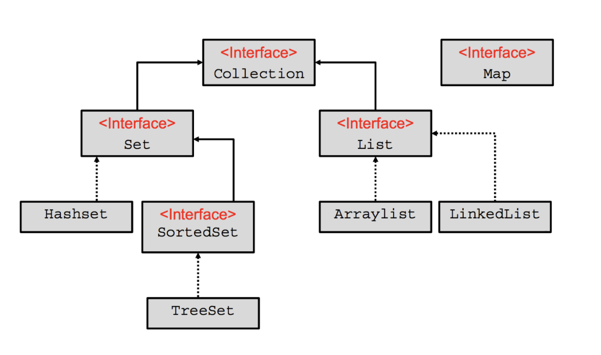

Te las expliqué todas menos la interfaz `Map` la cual te la dejé como reto (Si quieres repasarlo [aquí](https://platzi.com/clases/1222-java-basico-2018/10032-mas-colecciones/) está el material). Existe otra que no aparece en ese árbol se llama `Deque`.

Lo primero que debes saber sobre `Map` es que tiene tres implementaciones:
- HashTable
- LinkedHashMap
- HashMap
- SortedMap -> TreeMap

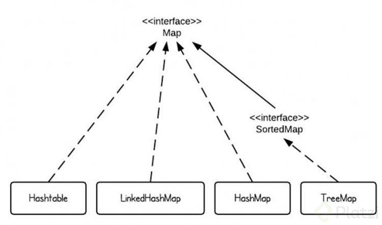

La interfaz `Map` no hereda de la interfaz `Collection` porque representa una estructura de datos de `Mapeo` y no de `colección` simple de objetos. Esta estructura es más compleja, pues cada elemento deberá venir en pareja con otro dato que funcionará como la llave del elemento.

`Map<K,V>`
- Donde K es el `key` o clave
- Donde V es el `value` o valor

Podemos declarar un `map` de la siguiente forma:
~~~
Map<Integer, String> map = new HashMap<Integer, String>();
Map<Integer, String> treeMap = new TreeMap<Integer, String>();
Map<Integer, String> linkedHashMap = new LinkedHashMap<Integer, String>();
~~~

Como observas solo se puede construir el objeto con tres elementos que implementan de ella: `HashMap`, `TreeMap` y `LinkedHashMap` dejando fuera `HashTable` y `SortedMap`. `SortedMap` estará fuera pues es una interfaz y `HashTable` ha quedado deprecada pues tiene métodos redundantes en otras clases. Mira la funcionalidad de cada uno.

Como te conté hace un momento `Map` tiene implementaciones:

- `HashMap`: Los elementos no se ordenan. No aceptan claves duplicadas ni valores nulos.
- `LinkedHashMap`: Ordena los elementos conforme se van insertando; provocando que las búsquedas sean más lentas que las demás clases.
- `TreeMap`: El Mapa lo ordena de forma “natural”. Por ejemplo, si la clave son valores enteros (como luego veremos), los ordena de menor a mayor.

Para iterar alguno de estos será necesario utilizar la interface Iterator y para recorrerlo lo haremos un bucle while así como se muestra:

Para **HashMap**
~~~
// Imprimimos el Map con un Iterador
Iterator it = map.keySet().iterator();
while(it.hasNext()){
  Integer key = it.next();
  System.out.println("Clave: " + key + " -> Valor: " + map.get(key));
}
~~~

Para **LinkedHashMap**
~~~
// Imprimimos el Map con un Iterador
Iterator it = linkedHashMap.keySet().iterator();
while(it.hasNext()){
  Integer key = it.next();
  System.out.println("Clave: " + key + " -> Valor: " + linkedHashMap.get(key));
}
~~~

Para **TreeMap**
~~~
// Imprimimos el Map con un Iterador
Iterator it = treeMap.keySet().iterator();
while(it.hasNext()){
  Integer key = it.next();
  System.out.println("Clave: " + key + " -> Valor: " + treeMap.get(key));
}
~~~

Ahora lee [esta](https://docs.oracle.com/javase/tutorial/collections/interfaces/deque.html) lectura y en la sección de tutoriales cuentanos en tus palabras cómo funciona `Deque`.

---

`Deque` es un arreglo de elementos similar a un `hashMap` (Que inserta los elementos, sin un orden particular, uno después del otro) pero con la particularidad de que se puede insertar, remover y hacer otra operaciónes sobre los elementos en ambos extremos del arreglo usando métodos como:
~~~
addLast(); removeLast();
addFirst(); removeFirst();
~~~

Se pronuncia como deck, un `deque` es una cola de doble extremo (double-ended-queue). Un double-ended-queue es una colección lineal de elementos que soportan la inserción y eliminación de elementos en ambos finales (extremos).
La interfaz `Deque` es un tipo de dato abstracto más enriquecido que `Stack` y `Queue` porque implementa ambos al mismo tiempo (stacks y queues).
La interfaz `Deque`, define métodos para acceder a los elementos de ambos finales o extremos de una instancia `Deque`.
Se proporcionan métodos para insertar, quitar y examinar los elementos.
Las clases predefinidas como `ArrayDeque` y `LinkedList` impelementan la interfaz `Deque`.

**Insert**  
Los métodos `addfirst` y `offerFirst` agregan elementos al principio de una instancia Deque. Los métodos `addLast` y `offerLast` agregan elementos al final de una instancia. Cuando la capacidad de la instancia es restringida, los métodos preferidos son: `offerFirst` y `OfferLast` porque `addFirst` puede no arrojar una excepción si esta lleno.

**Remove**  
Los métodos `removeFirst` y `pollFirst` eliminan elementos al principio de la instancia y, `removeLast` y `pollLast`, eliminan elementos al final. Los métodos `pollFirst` y `pollLast` retornan null si la instancia esta vacia (empty) mientras que, los métodos `removeFirst` y `removeLast`, arrojan una excepción si la instancia esta vacia (empty).

**Retrieve**  
Los métodos `getFirst` y `peekFirst` recuperan los primeros elementos de una instancia `Deque`. Estos métodos no eliminan el valor de una instancia `Deque`.
Los métodos `getLast` y `peekLast` recuperan los últimos elementos.
Los métodos `getFirst` y `getLast` arrojan una excepción si la instancia esta vacia (empty) mientras que, los métodos `peekFirst` y `peekLast` retornan NULL.

Los 12 métodos de inserción, eliminación y recuperación de elementos de un `Deque`, se resumen en la siguiente tabla:

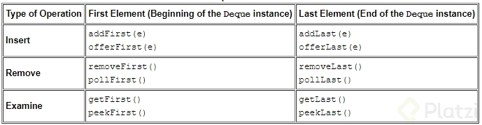

La interfaz `Deque` es una colección lineal de elementos cuyo funcionamiento permite de manera eficiente la inserción y remoción elementos del principio y final de la colección, esto favorece el uso eficiente de pilas y colas.

---

# Módulo 7 - Excepciones
## Clase 22 - Manejo de errores
Siempre que ocurre una Exception lanzará un objetos `Throwable` y en Java podemos tener 2 tipos de errores sustancialmente:
- Clase Error: Son errores causados por la propia maquina virtual de Java (JVM).
- Clase Exception: De los que si somos responsables y pueden ser causados de dos modos:
    - **Unchecked**: Son situaciones excepcionales, que de repente no sabemos que sucedió, como un error aritmético al dividir un número entre 0, estos generalmente te avisa el IDE, pero no si usas un editor de texto, estos son errores de programación, de lógica que no controlamos o también cuando queremos acceder al indice de un arreglo que no existe y lanza un:
        - `RuntimeException`: Es decir en el momento en que la app se está ejecutando.

    - **Checked**: Errores más esperados, especificos y que podemos verificar como por ejemplo si espero encontrar un archivo y por razones ajenas a mi, este archivo no existe en ese momento, yo debo preparar mi código para poder `cachar` con este tipo de excepciones y que no se cierre inesperadamente el programa o si hay un error en una sentencia SQL, que la tabla o registro no exista, todas estas cosas lanzan diferentes tipos de exceptions:
        - `SQLException`: Error en la sintaxis SQL.
        - `IOException`: Al momento de tratar de leer un archivo, una entrada y salida de datos.
        - `FileNotFoundException`: Si un archivo no fue encontrado.

---

Errores que se pueden presentar:
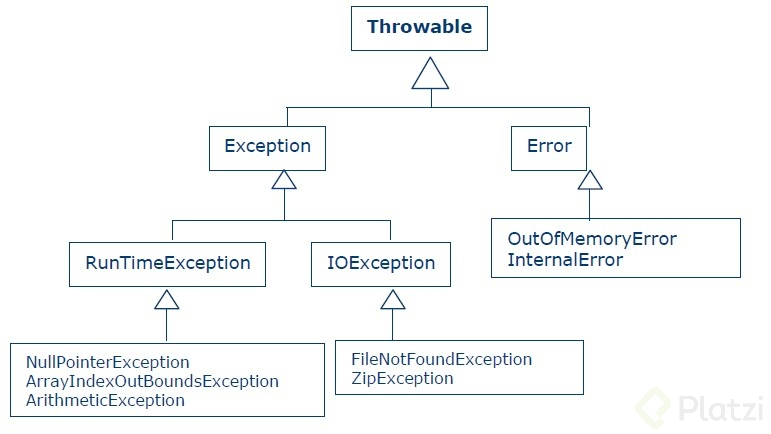

En programación existen 3 grandes tipos de errores:
- **Errores de Compilación:** Suceden por una mala implementación de la sintaxis del lenguaje de programación, es decir algo se ha escrito mal.
- **Errores de Ejecución:** Son errores que suceden en el momento de la ejecución de un programa, por ejemplo, dividir por cero, acceder a un elemento que no existe en un array, intentar abrir un archivo inexistente, entre otros.
- **Errores Lógicos:** Son errores que surgen cuando el programa no hace lo que el programador quiere que haga, estos errores se deben a que el programador dejó algún hueco en la lógica que programó.

---

## Clase 23 - Try-catch-finally / Try-with-resources
Manejar exceptions significa que añadirás un bloque de código para manejar un error.

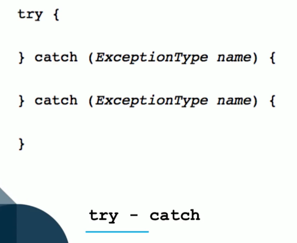

- En el `try` va el código que es vulnerable a una excepcion.
- Si sucede algo entrará al bloque `catch`, y dependiendo del error es al bloque que ingrese, es decir que nosotros podemos manejar diferentes tipos de errores especificos en un mismo `try-catch`, o hacer un `catch` con `Exception e` que atrapará cualquier error que suceda.
- El `finally` es opcional pero es una buena práctica para darle un cierre al proceso ya que siempre se ejecutará si está declarada, por ejemplo si se abrió un archivo en el `try` lo correcto es cerrarlo en el `finally`.

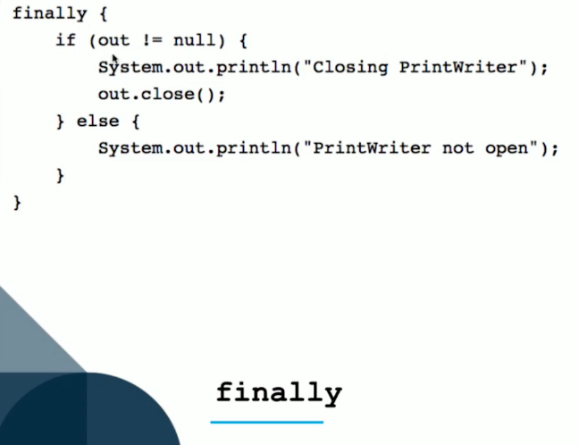

Pero que pasa cuando queremos cerrar un recurso, esto no obligaria a volver a implementar un `try-catch` y la legibilidad de mi código empeoraria.

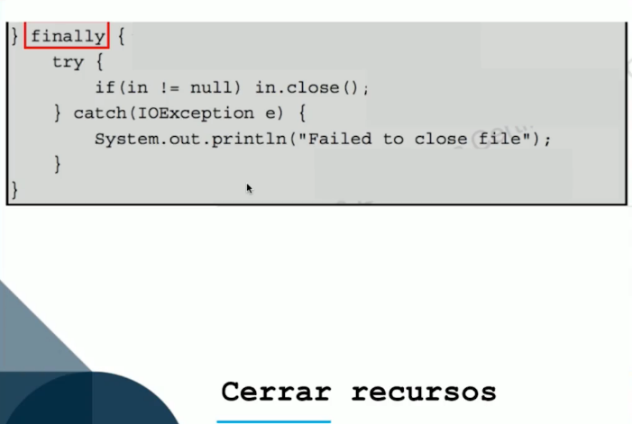

Para solucionar esto usamos `try-with-resources`, cabe mencionar que tiene una versión mejorada a partir de Java 9.

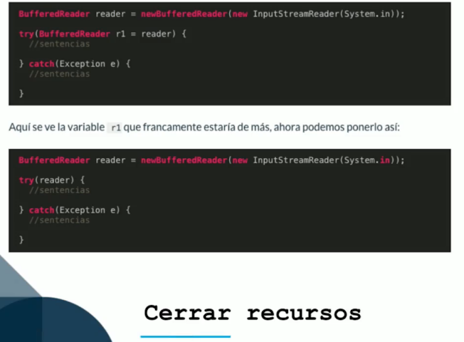

Entonces declaramos un elemento de entrada y salida de datos, lo colocamos en un `try-with-resources`, no tiene `finally`, y este automáticamente cuando se termine de ejecutar las sentencias se encarga de cerrar el flujo de datos, los recursos abiertos.

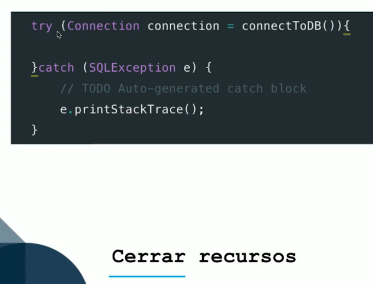

---

Cuando un método es susceptible a un error, se usa el `try-catch` o incluso para cualquier linea de código es buena practica que siempre esté dentro de un `try-catch`, estos errores o exceptions se verán reflejados en el cliente, por ende se deben imprimir o entregar como información HTTP, y para esto hay una asignación `throw exception` que se debe insertar en los métodos que sean llamados por otras clases o por la clase principal que ejecuta, así siendo apto el método para lanzar las errores y la clase que ejecuta pueda capturarlos.

---

# Módulo 8 - JDBC
## Clase 24 - Definición y composición del API
Es momento de darle persistencia a los datos que tenemos en el proyecto y lo que suceda con ellos. El motor que usaremos acá es MySQL.

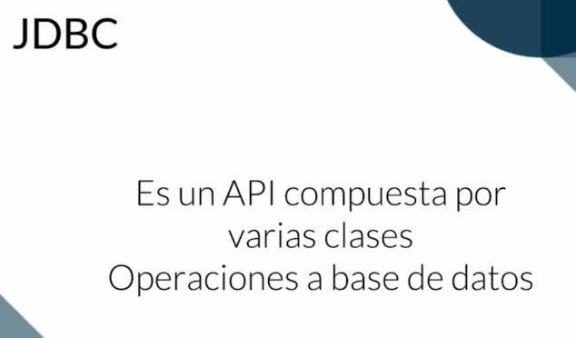

Lo que usaremos también es **JDBC** (Java Data Base Connectivity) que es un conjunto de APIs o clases que nos ayudan a generar una conectividad con una DB.

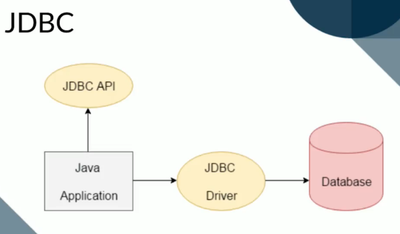

Entonces vamos a tener:
- Nuestra `app de Java` gracias al `API de JDBC`.
- Tendremos otro componente que será el `JDBC Driver`, que es un conector de la libería JAR (archivo de Java), que dependiendo del motor que se usará es el que necesitas especificar (Oracle, MySQL, postgreSQL, etc.), que nos permite enlazarnos a la DB.
- `API de JDBC` contiene todas esas clases que nos permiten conectarnos a la DB y hacer las operaciones que necesitemos.

Lo que compone nuestro `API de JDBC` son:

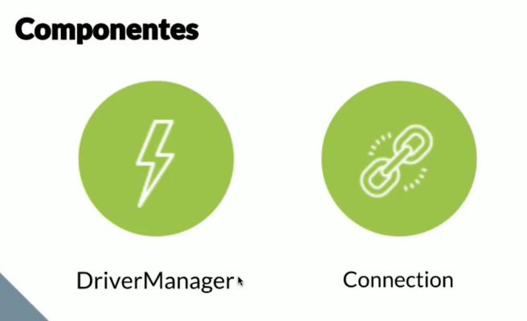

- `DriverManager`: Nos permite crear una instancia de la conexión, básicamente toma el JAR y genera un objeto que podamos usar.
- `Connection`: Maneja todo el ciclo de vida de la sesión. La sesión se produce cuando nos conectamos a la DB, este almacena esa sesión, su ciclo de vida mientras estemos conectados.

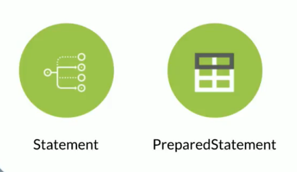

Estos dos son la clave cuando queremos consultar datos
- `Statement`: Nos ayuda a traer datos de una tabla especifica.
- `PreparedStatement`: Algo similar con la diferencia que puede recibir parámetros dentro de la clausula WHERE.

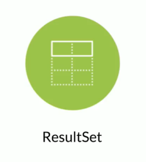

- `ResultSet`: Es una interfaz y nos ayuda a manejar los datos que obtenemos. Si obtenemos un conjunto de datos de una tabla, `ResultSet` nos ayuda a manejar y extraer esos datos para finalmente pasarlos a nuestro objeto.

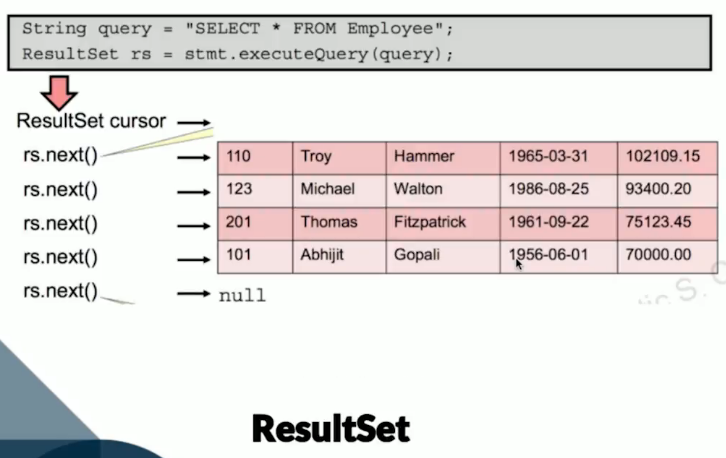

Con el método `next()` lo que hace es ir iterando todos los resultados que trajimos con la consulta.

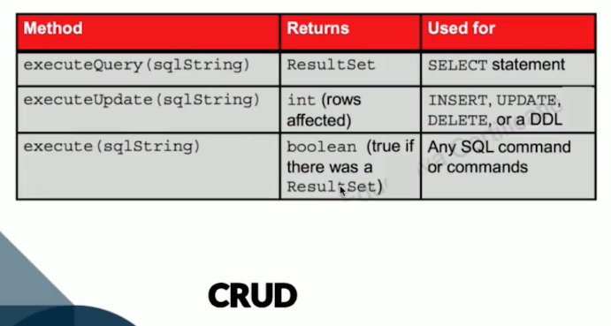

Para generar un CRUD, porque no solo ejecutamos queries tipo SELECT, si no que también necesitaremos usar INSERT, UPDATE, DELETE, etc., estos tienen sus propios métodos que son provistos por `Statement` y `PreparedStatement`.

---

En este caso tambien hay otro concepto que se maneja en programacion que es `datasources` que es una forma de conectarse a una base de datos atraves del servidor

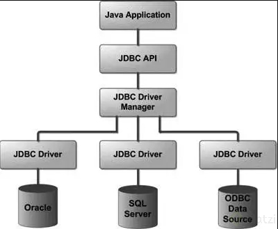

---

## Clase 25 - Ejercicio. JDBC API
Estás trabajando en un programa que es catálogo de guitarras.  
Dependiendo de la membresía del usuario debemos mostrar ciertas guitarras.  
Para usuarios premium mostrar guitarras premium.  
Las guitarras tienen un identificador en la base de datos que les hace pertenecer al tipo premium.

Planeando realizar una consulta en la que generes un filtro de usuarios y guitarras premium. ¿Qué elemento de JDBC deberás usar para ejecutar una consulta con filtros?

---

Los elementos JDBC que debemos usar en orden para ejecutar esta sentencia son:
- DriverManager: Para manejar la base de datos.
- Conecction: Para conectarnos a la base de datos.

- PreparedStatement: Para crear una sentencia de tipo “Select * From” con filtros de tipo "Where"
- ExecuteQuery: Para ejecutar sentencias de tipo select.
- Resultset: Para capturar los datos devueltos por la BBDD debido al select ejecutado.

---

## Clase 26 - Creando la base de datos y conectando el proyecto con MySQL
Para montar la base de datos y enfocarme en el proyecto utilizaré lo más simple y sencillo de manejar, este es phpmyadmin.

Para tener un servidor de phpmyadmin deberás instalar XAMPP que encontrarás disponible la versión de tu Sistema Operativo en el siguiente [enlace](https://www.apachefriends.org/es/index.html)

Una vez instalado abrelo e inicia el servidor MySQL y Apache como se muestra a continuación:

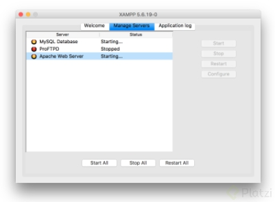
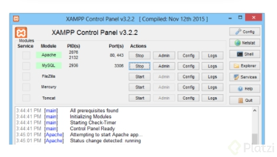

Una vez iniciados los servicios abriremos el navegador e iremos al [enlace](http://localhost/phpmyadmin/)

Mirarás algo así:

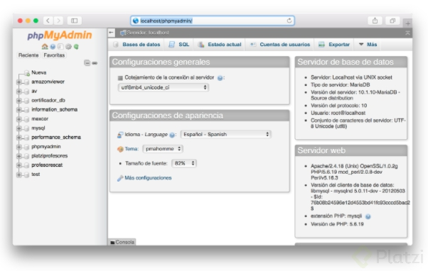

Este es el panel donde crearemos nuestra base de datos así que lo primero que harás será crear un usuario llamado amazonviewer para ello iremos a Cuentas de usuario:

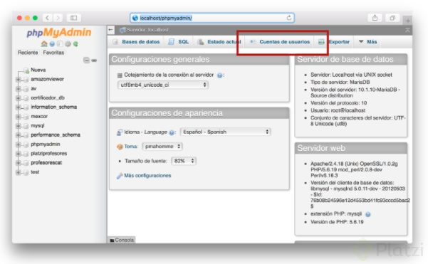

Buscaremos la opción de Agregar Cuenta de Usuario:

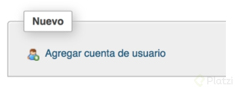

Capturaremos el nombre de usuario y password, en ambos pondremos amazonviewer en Host seleccionaremos Local y finalmente haremos Check en la opción: Crear base de datos con el mismo nombre y otorgar todos los privilegios. Para después dar click en Continuar.

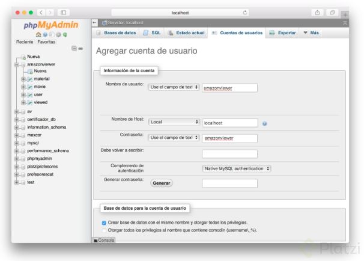

Verás que ahora del lado izquierdo estará la base de datos creada, selecciónala y da click en importar. Descarga la base de datos de [aquí](https://drive.google.com/file/d/1uneLZrRZ0y1ASOUkVzzw7qRQwrS0Ui-d/view?usp=sharing)

Ahora da click en Seleccionar archivo y pon el archivo sql de la base de datos.

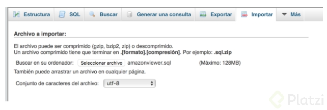

En seguida verás la base de datos creada:

Lo único que nos faltará será descargar la librería que será el conector entre nuestra base de datos MySQL y nuestro proyecto, este lo puedes descargar del sitio oficial [aquí mismo](https://dev.mysql.com/downloads/connector/j/5.1.html).

Pasa a la siguiente clase para usar todo lo que hoy creamos.

---

Descargar dependencias desde Intellij

Recomiendan mucho usar **Docker**.

---

## Clase 27 - Generando conexión a la base de datos y creando clase de constantes
Creamos un paquete `bd` en `src`, donde crearemos la interfaz, `IDBConnection`, para conectarnos a la DB.

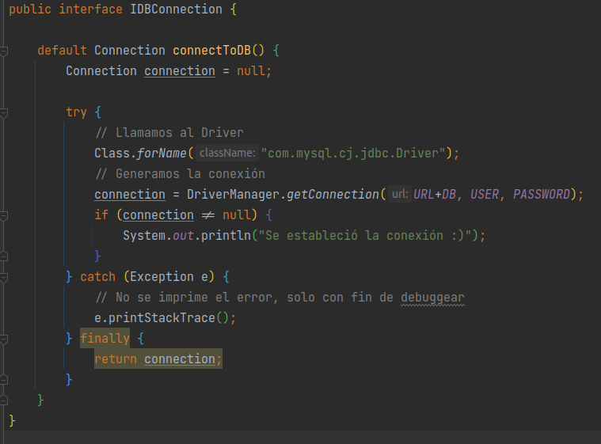

- El primer objeto que usaremos será `Connection` ya que al crear la conexión lo que haremos es devolver la instancia de la sesión.
- El segundo es `Driver Manager` que nos ayuda a obtener la conexión a partir de una URL ("jdbc:subprotocol:subname"). Que es la dirección a la conexión a la DB.

Creamos una clase en el mismo paquete llamada `DataBase`, que contiene constantes de nuestra DB, para que siempre coincidan con lo que queremos consultar y haya menos margen de error en sintaxis, estas constantes serán los nombres de las tablas y campos de la DB.

Mappeamos la tablas tablas que tenemos

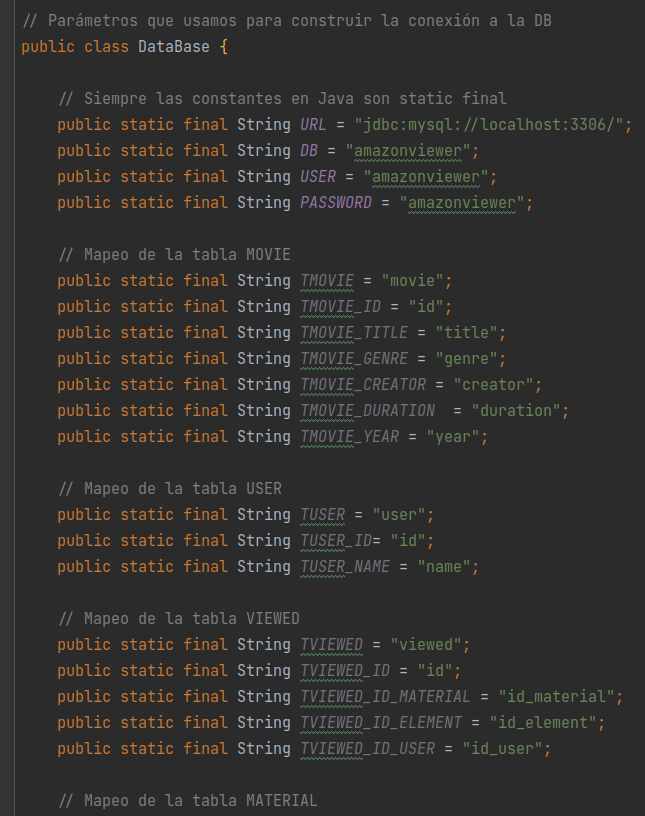

---

## Clase 28 - Sentencia SELECT en Java
Continuamos con la interfaz `MovieDAO` extendiendo de `IDBConnection` para obtener la conexión a la DB con un `try-with-resources` para que se cierren automáticamente los recursos.  
Empezamos a usar `PreparedStatement` y seteamos los valores que se traigan desde la DB al objeto que usaremos.

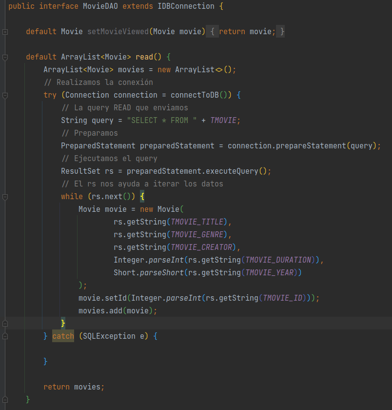

En `Movie` implementamos `MovieDAO` así podremos llamar a `read` y en `makeMovieList` modificamos el código para que ejecute este método.  
Para poder usar el `read` es importante crear un objeto del tipo de la clase donde se está implementando.

---

## Clase 29 - Sentencia SELECT con Parámetros
No estamos guardando en la DB cuando vimos la película o leemos un libro, entendemos entonces que en la tabla de la DB `viewed` vamos a tener el `material` que identifica si es una película, libro, serie, etc. que recibé también el `id` de ese `material/elemento` y el usuario que la vió.  
Todo esto en el método `getMovieViewed` al cual lo llamamos únicamente del método `read`, por eso tiene un modificador de acceso `private`.

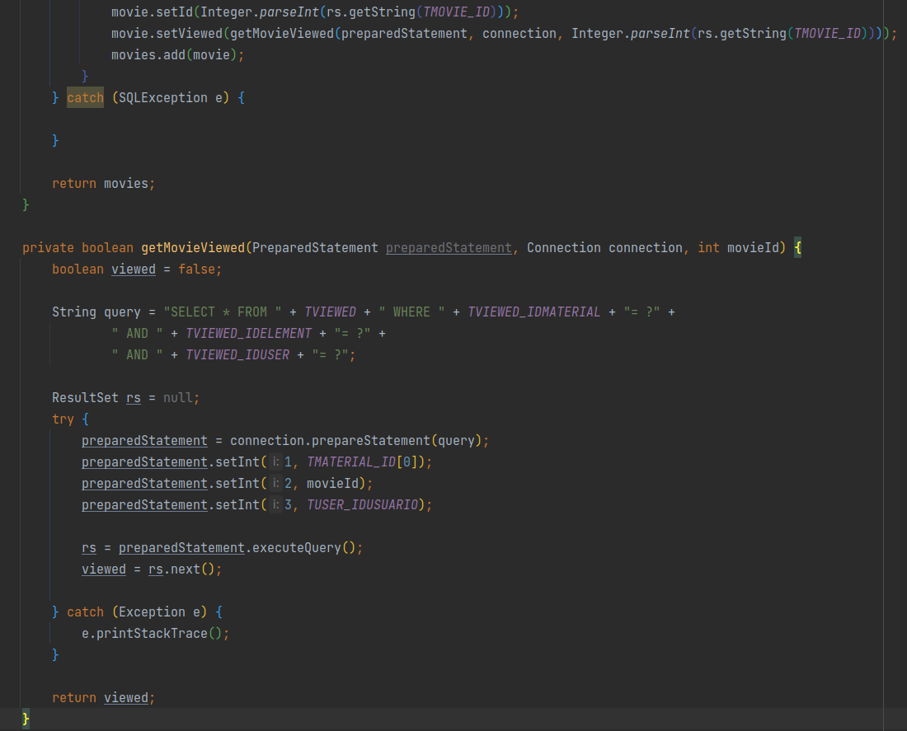

---

## Clase 30 - Sentencia INSERT en Java
Anteriormente insertamos una película como visto manualmente, desde phpmyadmin, ahora haremos que lo haga el método `setMovieViewed` de nuestra app.

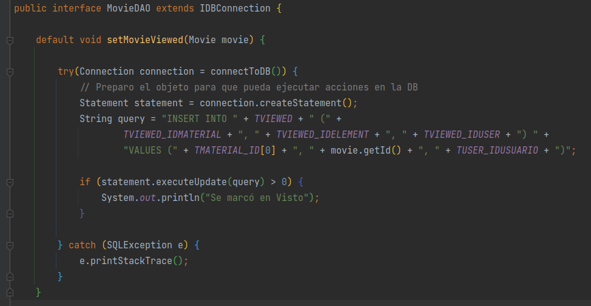

Cuando trabajamos con el Statement tenemos el método `execute`, que devuelve un booleano, se usa generalmente con el método `DELETE` más que con el de `INSERT` o `UPDATE` que tiene su función `executeUpdate`, que nos devuelve la cantidad de raws afectadas.

Llamamos desde `view` al nuevo método para que lo marque en visto.

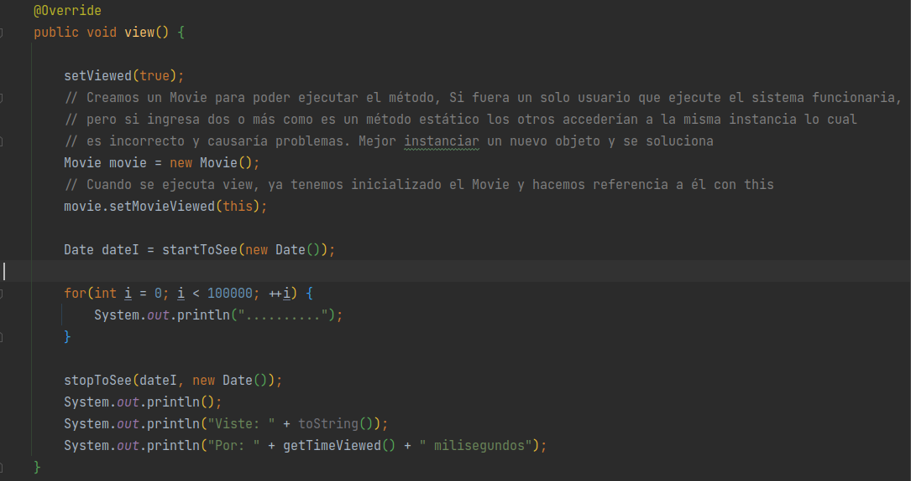

---

## Clase 31 - Reto: Reporte por fecha

**Tuve inconvenientes con los servidores y no pude comprobar este reto.**

Primero creamos la nueva columna en la tabla viewed en phpmyadmin:

`ALTER TABLE AmazonViewer.viewed ADD viewed_date DATETIME;`

Modificamos la clase utilitaria `AmazonUtil` y agregamos un método nuevo que nos formatee la fecha actual:
~~~
public static String getCurrentDate() {
    Date date = new Date();
    SimpleDateFormat format = new SimpleDateFormat("yyyy-MM-dd hh:mm:ss");

    return format.format(date);
}
~~~

Modificamos en el metodo `setMoviedViewed` el query para agregar la fecha:
~~~
String query = "INSERT INTO " + TVIEWED + " (" +
        TVIEWED_IDMATERIAL + ", " + TVIEWED_IDELEMENT + ", " + TVIEWED_IDUSER + ", " + TVIEWED_DATE + ")" +
        " VALUES(" + TMATERIAL_ID[0] + ", " + movie.getId() + ", " + TUSER_IDUSUARIO + ","+ AmazonUtil.getCurrentDate() + ")";
~~~

Agrego dos métodos nuevos a la interfaz `MovieDAO` para buscar por fecha actual
~~~
private boolean getMovieViewedByDay(PreparedStatement preparedStatement, Connection connection, int id_movie) {
    boolean viewed = false;
    String query = "SELECT * FROM " + TVIEWED + " WHERE " + TVIEWED_IDMATERIAL + " = ? " + "AND "
            + TVIEWED_IDELEMENT + " = ? " + "AND " + TVIEWED_IDUSER + " = ? " + "AND " + TVIEWED_DATE + " = " + AmazonUtil.getCurrentDate();
    ResultSet rs = null;
    try {
        preparedStatement = connection.prepareStatement(query);
        preparedStatement.setInt(1, TMATERIAL_ID[0]);
        preparedStatement.setInt(2, id_movie);
        preparedStatement.setInt(3, TUSER_IDUSUARIO);
        System.out.println(query);
        rs = preparedStatement.executeQuery();
        viewed = rs.next();
    } catch (Exception e) {
        e.printStackTrace();
    }

    return viewed;
}
~~~

~~~
default ArrayList<Movie> readByDay() {
    ArrayList<Movie> movies = new ArrayList<>();
    try (Connection connection = connectToDB()) {
        String query = "SELECT * FROM " + TMOVIE;
        PreparedStatement preparedStatement = connection.prepareStatement(query);
        ResultSet rs = preparedStatement.executeQuery();
        while (rs.next()) {
            Movie movie = new Movie(rs.getString(TMOVIE_TITLE), rs.getString(TMOVIE_GENRE),
                    rs.getString(TMOVIE_CREATOR), Integer.parseInt(rs.getString(TMOVIE_DURATION)),
                    Short.parseShort(rs.getString(TMOVIE_YEAR)));
            movie.setId(Integer.parseInt(rs.getString(TMOVIE_ID)));
            movie.setViewed(
                    getMovieViewedByDay(preparedStatement, connection, Integer.parseInt(rs.getString(TMOVIE_ID))));
            movies.add(movie);
        }
    } catch (SQLException e) {
        e.printStackTrace();
    }
    return movies;
}
~~~

Agregamos método a la clase `Movie` para listar las películas vistas solo del día
~~~
public static ArrayList<Movie> makeMoviesListByDay() {
    Movie movie = new Movie();
    return movie.readByDay();
}
~~~

Modifico el método `MakeReport(Date date)` en la clase `Main` para pintar solo las diarias
~~~
ArrayList<Movie> moviesDay = Movie.makeMoviesListByDay();
for (Movie movie : moviesDay) {
    if (movie.getIsViewed()) {
        contentReport += movie.toString() + "\n";
    }
}
~~~

---

# Módulo 9 - Lambdas
## Clase 32 - Interfaces funcionales

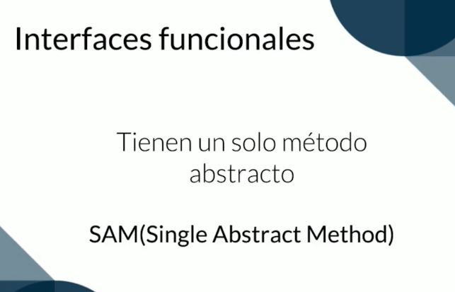

Las interfaces funcionales tienen un solo método el cual debe ser abstracto, estas tienen una anotación, `@FunctionalInterface`.

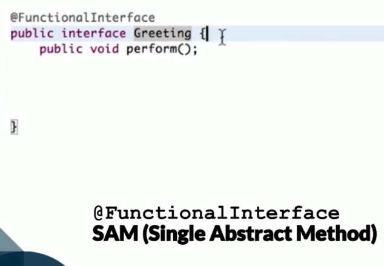

Estas interfaces se parecen mucho a las clases anónimas que usaremos.

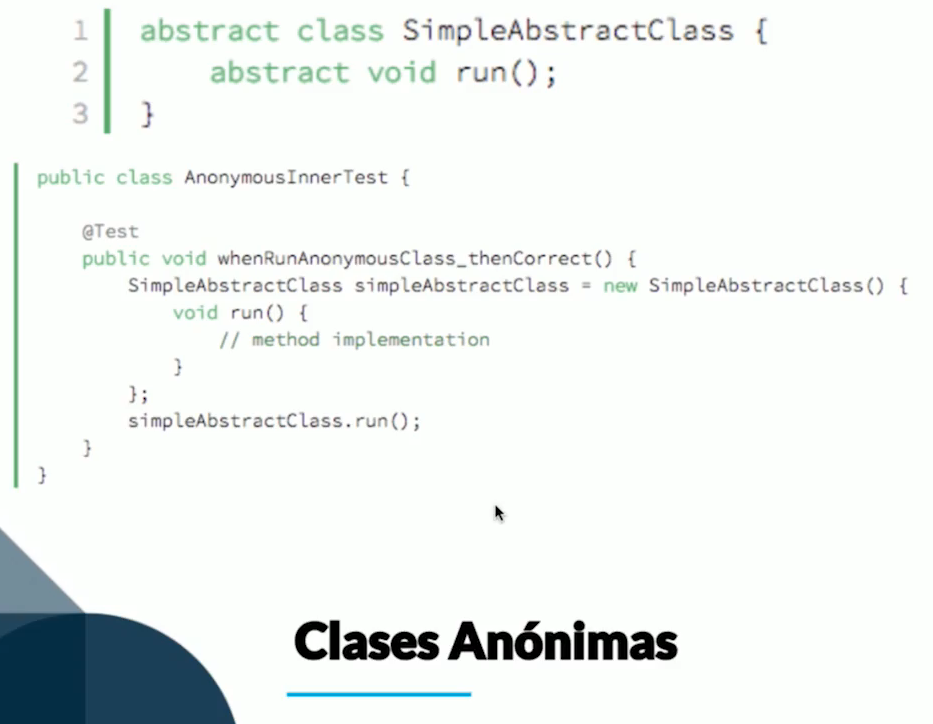

---

**Interfaces funcionales**  
Concepto nuevo en Java SE 8 y que es la base para que podamos escribir expresiones lambda.  
Una interface funcional se define como una interface que tiene uno y solo un método abstracto y que éste sea diferente a los métodos definidos en java.lang.Object (a saber: equals, hashcode, clone, etc.). La interface puede tener métodos por defecto y estáticos sin que esto afecte su condición de ser interface funcional.

Existe una nueva anotación denominada `@FunctionalInterface` que permite al compilador realizar la validación de que la interface tenga solamente un método abstracto

---

## Clase 33 - Programación Funcional
Las lambdas provienen especificamente de la programación funcional, que es un paradigma de programación más.  
El paradigma que aprendimos antes fue el de orientado a objetos, este es otro ya que la programación tiene diversos paradigmas y el paradigma es la forma o serie de normas en las que un lenguaje tiene que ajustarse para resolver un problema.

Existen diferentes paradigmas y vemos cuales usan algunos lenguajes

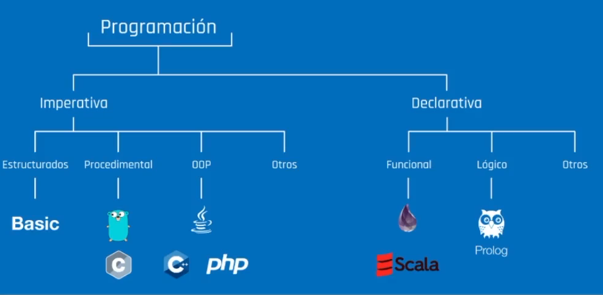

- Paradigma imperativo (Cómo hacer las cosas): Lenguajes estructurados, procedimentales y POO.
- Paradigma declarativo (Qué cosas hacer): Lenguajes funcionales, lógica, etc.

Entonces la programación funcional se va a centrar en QUE se necesita hacer y su caracteristica principal es que las funciones van a estar siendo entradas y salidas de otras funciones, estas se conocen como funciones de orden superior.

Funciones de orden superior: Es aquella que recibe como parametro una función y tiene de salida otra función.

---

## Clase 34 - Lambdas
Las lambdas es una forma de escribir código.

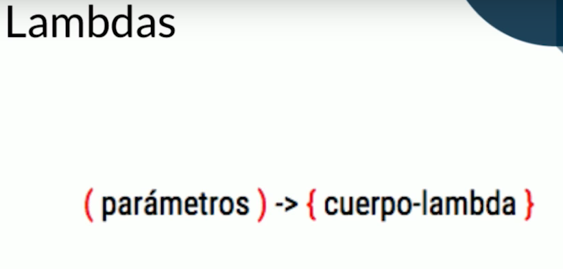

Cuando usamos lambdas es cuando tenemos que trabajar con código que su ciclo de vide dentro de la app es demasiado corto.  
Usar expresiones lambdas nos ayuda a encapsular código especifico que se ejecute unicamente en ese momento del proceso.

Comparaciones de clases abstractas y con lambdas

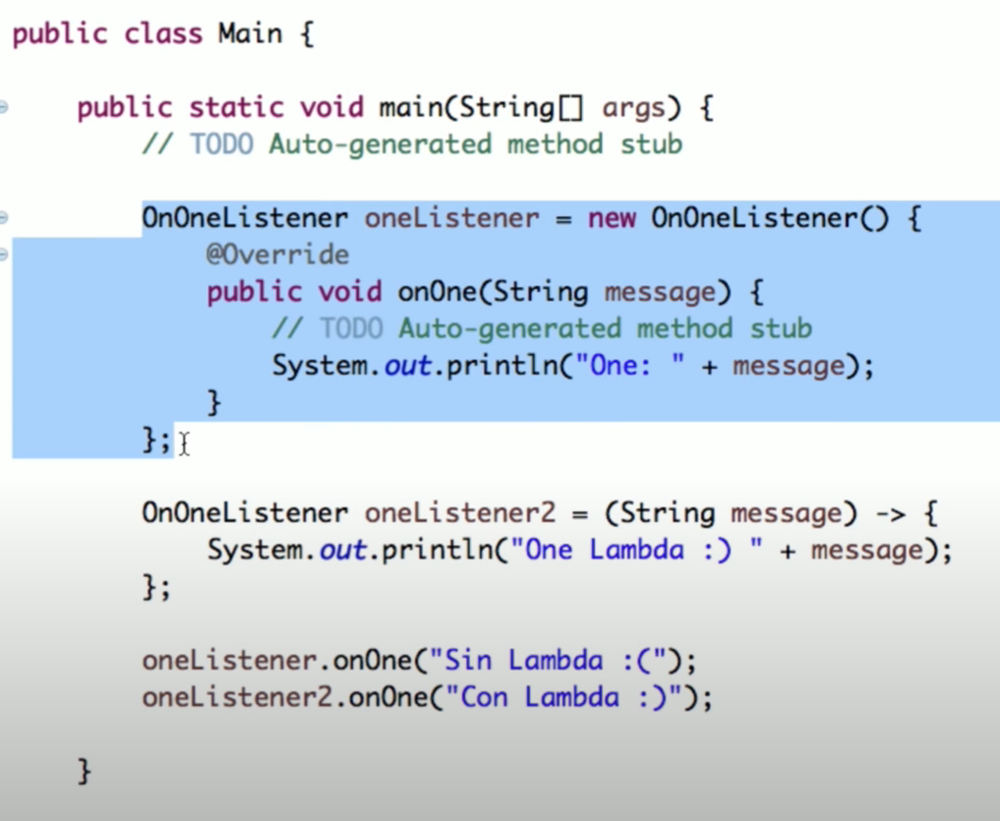

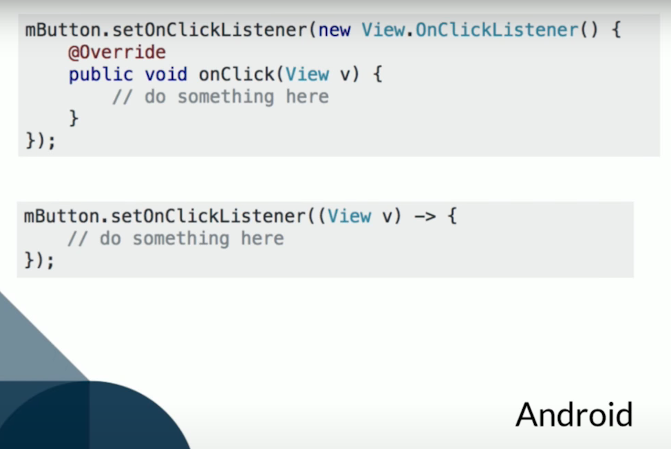

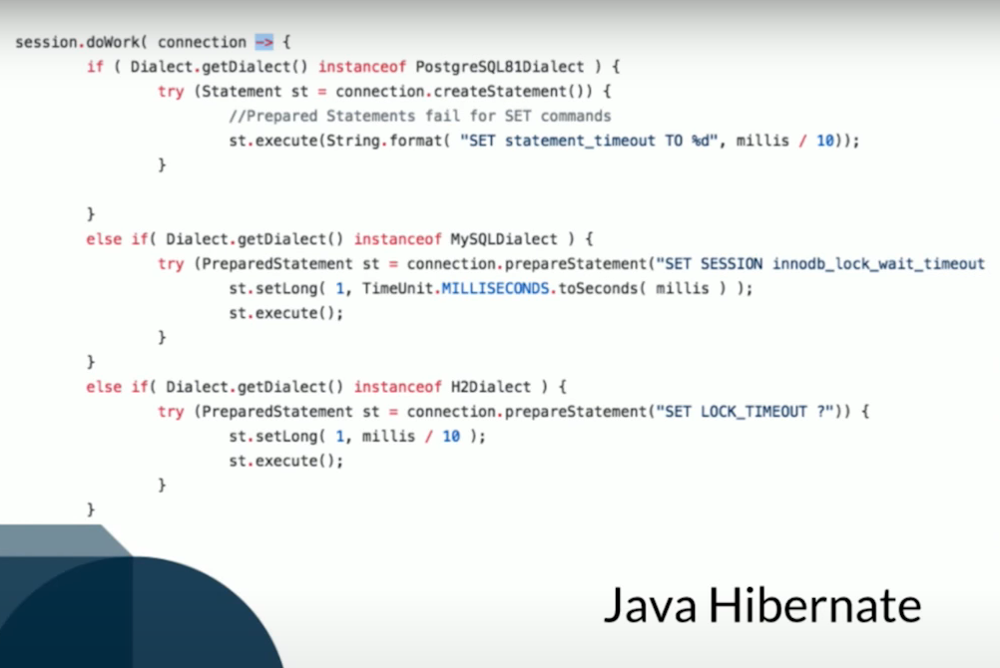

---

## Clase 35 - Ejercicio. Lambdas
Estoy construyendo una interfaz gráfica que puede contener botones, etiquetas de texto, imágenes etc., cada elemento representa una clase.

¿Cómo resolvería que un elemento pueda ser clickeable en determinado momento?

Interfaz
~~~
@FunctionalInterface
public interface IClickable {
    public void OnClickListener(Element element);
}
~~~

Comportamiento
~~~
IClickable clickable = (Element element) -> {
    System.out.println("Se clickeó " + element.getName());
};

clickable.OnClickListener(element);
~~~

---

## Clase 36 - Lambdas como variables y Recursividad
Las lambdas pueden ser utilizadas como variables.

Ejemplos

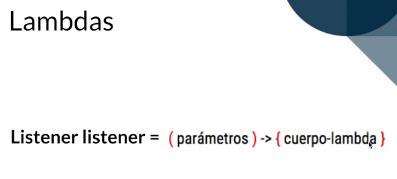

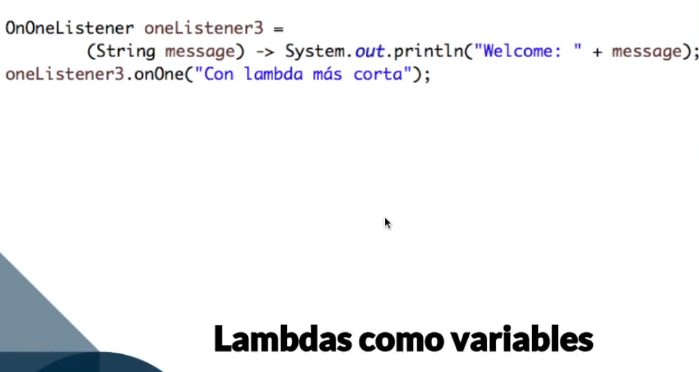

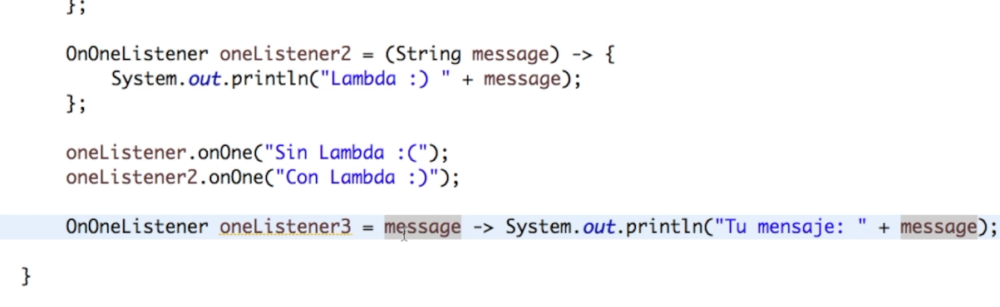

La programación funcional aplicado a lambdas no utiliza iteración, usa recursividad, que nos ayuda a dejar mejor expresados nuestros problemas.

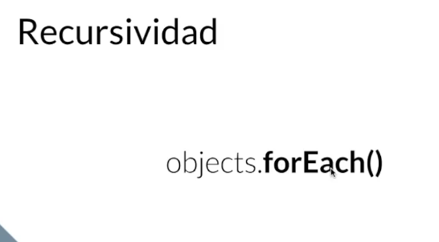

Atomic integer genera un numero entero, único, integro y lo usamos en este caso para representar el número que debe apretar el cliente por cada película ya que los ids no corresponden y esto es vital para el proyecto.

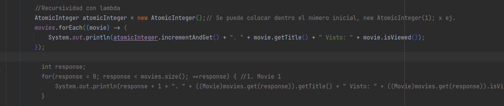

Una de las cosas de la programación funcional es que es sumamente declarativo, no puedo hacer ninguna operación dentro, cambiar el valor de una variable explicitamente, lo puedo hacer a través de una función como en este ejemplo.

---

La notacion Dos puntos Dobles ( :: ) permite acceder a un método referenciandolo directamente desde la clase a la que pertenece, ejemplo:
~~~
class GFG {

    // static function to be called
    static void someFunction(String s)
    {
        System.out.println(s);
    }

    public static void main(String[] args)
    {

        List<String> list = new ArrayList<String>();
        list.add("Geeks");
        list.add("For");
        list.add("GEEKS");

        // call the static method
        // using double colon operator
        list.forEach(GFG::someFunction);
    }
}
~~~

En el ejemplo vemos que para llamar a la función someFunction hace uso de la clase GFG y la notación Dos puntos Dobles ( :: ) para referenciar directamente el método:
~~~
GFG::someFunction
~~~

Esto en realidad difiere de las Lambas debido a que se vale del llamado por referencia al método previamente definido; mientras que la Lambda lo que hace es definir directamente en la sentencia lo que va a hacer el método.

La recursividad es la forma que tiene la programación funcional para crear estructuras de repetición (que casi siempre son necesarias a la hora de resolver problemas), y cuenta con la enorme ventaja de facilitar la lectura y comprensión del código; por ejemplo una función para calcular una sumatoria usando recursividad es tan simple y fácil de entender como esto:
~~~
    public static int sumaN_recursivo(int n){
	return (n<=0) ? 0 : n + sumaN_recursivo(n-1);
}
~~~

Que en cambio se torna un poco más compleja de entender cuando en vez de usar la recursividad usamos estructuras de bucle o iteraciones (while, for). El ejemplo anterior usando iteración queda así:
~~~
public static int sumaN_iterativo(int n){
	int result= 0;
	for(int i=1; i<=n; i++){
		result +=i;
	}
	return result;
}
~~~

Como se darán cuenta tratar de hacer seguimiento de lo que hace el ciclo for y por tanto entenderlo resulta más complejo (o al menos les tomará más tiempo) que el código del ejemplo de la recursividad.  
Sin embargo existe una razón muy poderosa por la que casí nunca se prefiere el uso de la recursividad por sobre la interación y es el error de tipo StackOverflowError, que se debe al enorme gasto de tiempo y espacio en memoria que normalmente implica que una función se llame a sí misma (recursividad).  
Concretamente en los casos en que los datos a procesar son significativamente grandes (o se requieren muchas repeticiones del código) los códigos recursivos tienden a “reventar” la aplicación debido a que la “Pila de datos a trabajar Desborda la capacidad de la máquina” o lo que es lo mismo StackOverflowError.

Las referencias a los métodos nos permiten reutilizar un método como expresión lambda. Para hacer uso de las referencias a métodos basta con utilizar la siguiente sintáxis: `referenciaObjetivo::nombreDelMetodo`.
~~~
(String info) -> System.out.println(info) // Expresión lambda sin referencias.
System.out::println // Expresión lambda con referencia a método estático.
~~~

---

## Clase 37 - Stream y Filter

`Stream` es un método que se agregó en Java 8 para darle el superpoder de poder manejar lambdas en las colecciones, son wrappers, envuelven la colección y la habilitan para poder trabajar con lambdas.
Se opera `objects.stream()`.

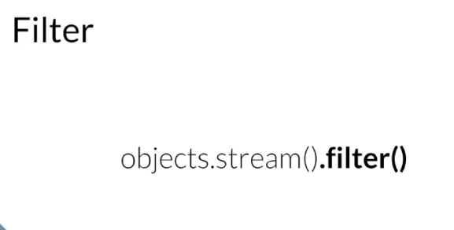

Las lambdas las trabajaremos dentro del método `filter` que equivale a un `if` de programación estructurada y recibe como parámetro una lambda para filtrar la coleccion. Se pueden usar varios `filter`, es decir concatenar varias condiciones para una función.

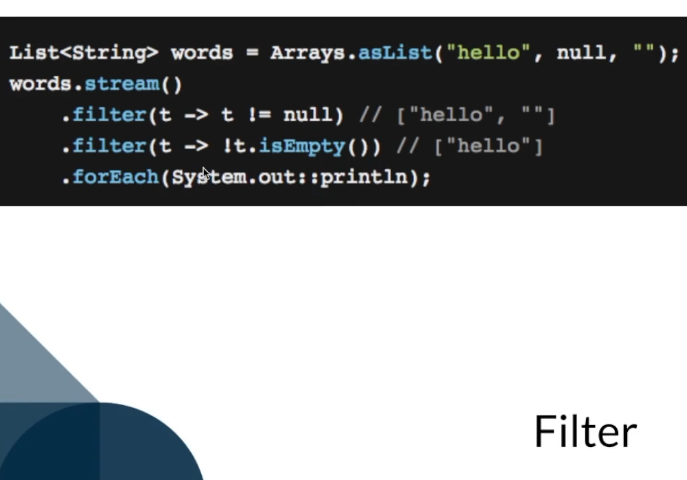

En la programación funcional no existen asignaciones porque lo que tenemos es la inmutabilidad, que nos dice que una varibale no puede cambiar o hacerle alguna operación, lo que tenemos que hacer es usar algún método para trabajarlo.  
En este caso `contentReport` era un String y lo cambiamos por un `StringBuilder` ya que nos permite trabajar con métodos para concatenar Strings.

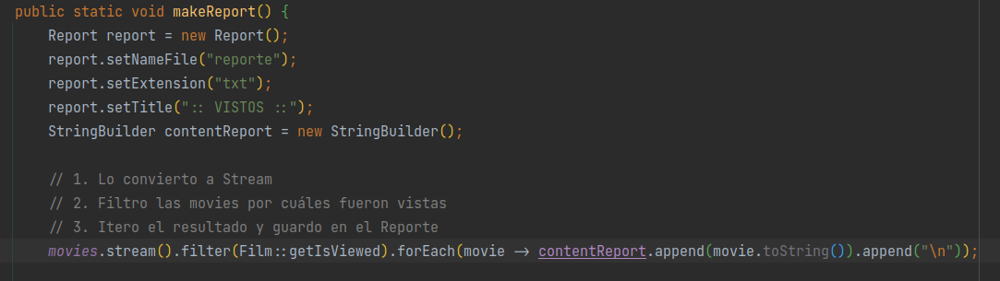

---

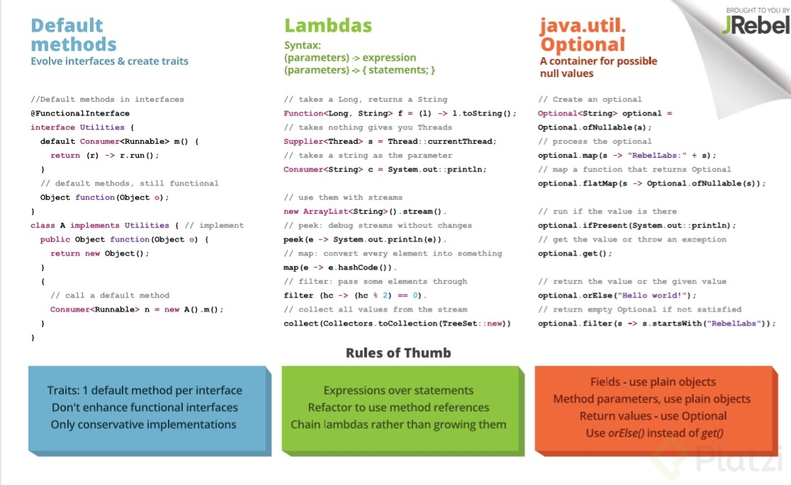

**La clase `StringBuilder` crea cadenas que permiten mutación.**  
El encadenado es distinto a String, con String el resultado es una nueva cadena.  
`StringBuilder` realiza los cambios en la misma cadena, y devuelve una referencia a la misma.
~~~
StringBuilder sb = new StringBuilder(“uno”);
sb.append("+dos");
StringBuilder otro = sb.append("+tres");
~~~
[.append](https://www.geeksforgeeks.org/stringbuilder-append-method-in-java-with-examples/)
[.insert](https://www.geeksforgeeks.org/stringbuffer-insert-java/)

---

## Clase 38 - Predicate y Consumer
Un `Predicate` es una interfaz que se usa para pasar a un `filter` por ejemplo, en el que podemos declarar condiciones, acciones. Se le coloca el tipo de dato, en este caso `Series`, el nombre del objeto y la lambda que quiero asignarle a ese predicado.  
Es conveniente declarar un predicado cuando la lamda es muy extensa, asi directamente le pasamos el nombre del objeto.

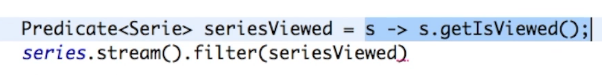

Otro tipo de dato que podemos usar son los `Consumer`, que son todas las acciones de iteración que queremos manejar, igualmente es una interfaz y le podemos asignar una lambda.

`Consumer` va a tener toda la lógica, entonces la forma más agíl de hacer esto es asignarlo a un objeto de tipo interfaz y pasarlo a una función.

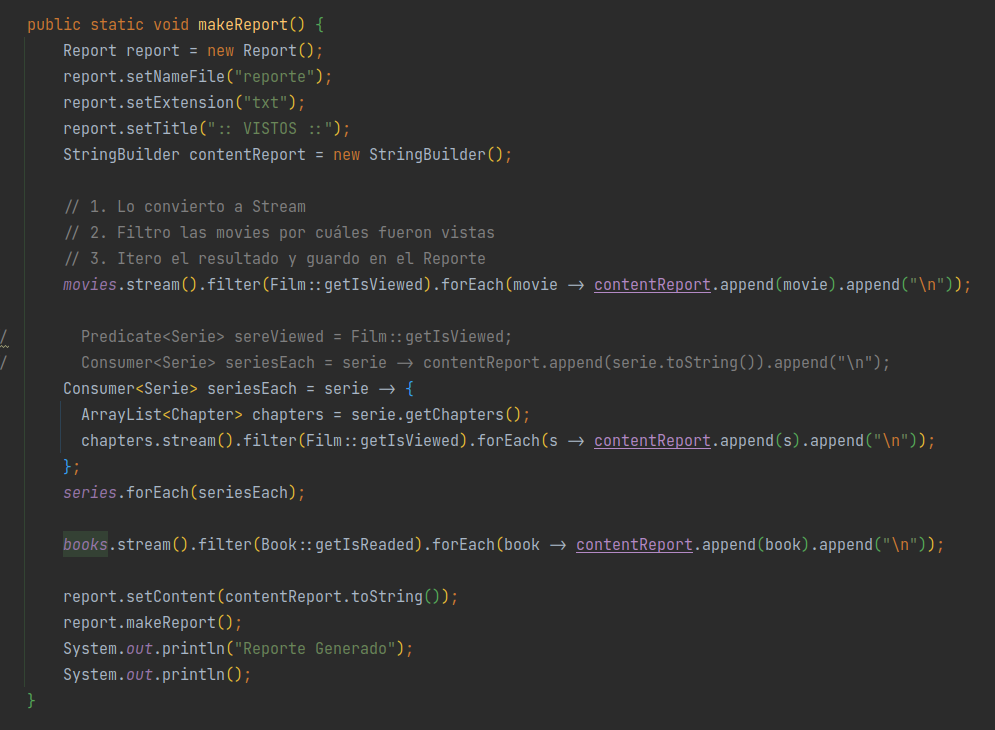

---

Existen 4 tipos de expresiones Lambda:

**Funciones (Function):** Recibe como argumento dos parámetros de los cuales el primero `<T>` corresponde al tipo (objeto) de entrada y el segundo `<R>` como el tipo de salida de aquella operación.
~~~
Function<String, Integer> function = s -> s.length() + s.indexOf(" "); // 10 + 4?

Integer result = function.apply("Hola mundo"); // Tiene 10 caracteres y el " " se ubica en la posición 4.
~~~

**Consumidores (Consumer):** Un consumidor es aquella expresión que recibe un parámetro de entrada `<T>` pero que no retorna o genera ningún valor de salida. Son funciones terminales.
~~~
Consumer<String> consumer = s -> System.out.println(s.toLowerCase());
consumer.accept("Hola Mundo");
~~~

**Proveedores (Supplier):** Un proveedor es una expresión que no recibe parámetros de entrada pero que retornan o generan un tipo de salida `<T>`
~~~
Supplier<String> supplier = () -> "Hola mundo";
supplier.get();

Salida: "Hola mundo"
~~~

**Predicados (Predicate):** Los predicados son expresiones que aceptan expresiones booleanas, es decir, condiciones lógicas.
~~~
Predicate<String> predicate = (str) -> str.length() > 6;
predicate.test("Hola mundo");
Salida: true
~~~

---