# Curso de Avanzado de Java SE
Índice
-
- [Módulo 2 - Clases avanzadas](#módulo-2---clases-avanzadas)
    - [Clase 2 - Clases Abstractas](#clase-2---clases-abstractas)
    - [Clase 3 - Implementando clases abstractas al proyecto](#clase-3---implementando-clases-abstractas-al-proyecto)
    - [Clase 4 - Ejercicio. Clases Abstractas](#clase-4---ejercicio-clases-abstractas)
    - [Clase 5 - Implementando métodos abstractos en Java](#clase-5---implementando-métodos-abstractos-en-java)
- [Módulo 3 - JavaDocs](#módulo-3---javadocs)
    - [Clase 6 - Qué es JavaDocs](#clase-6---qué-es-javadocs)
    - [Clase 7 - Implementando JavaDocs al proyecto](#clase-7---implementando-javadocs-al-proyecto)
    - [Clase 8 - Reto](#clase-8---reto)
    - [Clase 9 - JavaDocs tags para herencia e interfaces](#clase-9---javadocs-tags-para-herencia-e-interfaces)
    - [Clase 10 - Generado Java Docs](#clase-10---generado-java-docs)
- [Módulo 4 - Clases Anidadas](#módulo-4---clases-anidadas)
    - [Clase 11 - Clases anidadas y tipos](#clase-11---clases-anidadas-y-tipos)
    - [Clase 12 - Ejercicio. Clases Anidadas](#clase-12---ejercicio-clases-anidadas)
    - [Clase 13 - Implementando una clase anidada al proyecto](#clase-13---implementando-una-clase-anidada-al-proyecto)
    - [Clase 14 - Instanciando clases estáticas anidadas](#clase-14---instanciando-clases-estáticas-anidadas)
    - [Clase 15 - Enumerations](#clase-15---enumerations)
- [Módulo 5 - Interfaces Avanzadas](#módulo-5---interfaces-avanzadas)
    - [Clase 16 - Métodos con implementación métodos default y private](#clase-16---métodos-con-implementación-métodos-default-y-private)
    - [Clase 17 - Creando Interfaz DAO con métodos default y private](#clase-17---creando-interfaz-dao-con-métodos-default-y-private)
    - [Clase 18 - Ejercicio. Interfaz DAO](#clase-18---ejercicio-interfaz-dao)
    - [Clase 19 - Diferencia Interfaces y Clases Abstractas](#clase-19---diferencia-interfaces-y-clases-abstractas)
    - [Clase 20 - Herencia en Interfaces](#clase-20---herencia-en-interfaces)
- [Módulo 6 - Colecciones Avanzadas](#módulo-6---colecciones-avanzadas)
    - [Clase 21 - Map, HashMap, TreeMap y LinkedHashMap](#clase-21---map-hashmap-treemap-y-linkedhashmap)
- [Módulo 7 - Excepciones](#módulo-7---excepciones)
    - [Clase 22 - Manejo de errores](#clase-22---manejo-de-errores)
    - [Clase 23 - Try-catch-finally / Try-with-resources](#clase-23---try-catch-finally--try-with-resources)
- [Módulo 8 - JDBC](#módulo-8---jdbc)
    - [Clase 24 - Definición y composición del API](#clase-24---definición-y-composición-del-api)
    - [Clase 25 - Ejercicio. JDBC API](#clase-25---ejercicio-jdbc-api)
    - [Clase 26 - Creando la base de datos y conectando el proyecto con MySQL](#clase-26---creando-la-base-de-datos-y-conectando-el-proyecto-con-mysql)
    - [Clase 27 - Generando conexión a la base de datos y creando clase de constantes](#clase-27---generando-conexión-a-la-base-de-datos-y-creando-clase-de-constantes)
    - [Clase 28 - Sentencia SELECT en Java](#clase-28---sentencia-select-en-java)
    - [Clase 29 - Sentencia SELECT con Parámetros](#clase-29---sentencia-select-con-parámetros)
    - [Clase 30 - Sentencia INSERT en Java](#clase-30---sentencia-insert-en-java)
    - [Clase 31 - Reto: Reporte por fecha](#clase-31---reto-reporte-por-fecha)
- [Módulo 9 - Lambdas](#módulo-9---lambdas)
    - [Clase 32 - Interfaces funcionales](#clase-32---interfaces-funcionales)
    - [Clase 33 - Programación Funcional](#clase-33---programación-funcional)
    - [Clase 34 - Lambdas](#clase-34---lambdas)
    - [Clase 35 - Ejercicio. Lambdas](#clase-35---ejercicio-lambdas)
    - [Clase 36 - Lambdas como variables y Recursividad](#clase-36---lambdas-como-variables-y-recursividad)
    - [Clase 37 - Stream y Filter](#clase-37---stream-y-filter)
    - [Clase 38 - Predicate y Consumer](#clase-38---predicate-y-consumer)

---

# Módulo 2 - Clases avanzadas
## Clase 2 - Clases Abstractas
Las `clases abstractas` nos ayuda a hacer mantenibles, robustos y pensarlos para nuevas implementaciones dentro del proyecto para que crezca sin necesidad de muchos ajustes.

- **Polimorfismo a nivel de herencia:** En herencia se da cuando en los `métodos` se sobreescribe, decimos que ese objeto puede comportarse de una forma distinta. Pero a veces no necesitamos heredar la implementación de un `método`, cuando heredamos de una `clase` a otra automáticamente obtenia todo el comportamiento, los `métodos` heredados de la `clase` padre, también a veces no necesitamos crear la instancia de la `clase` padre porque es muy genérica y capas queremos restringirla porque no se usará.
- **Polimorfismo en `interfaces`:** Es similar a la herencia pero acá si podemos implementar todos los `métodos`. Pero a veces NO es necesario implementarlos todos.

Quien soluciona estos problemas es la `clase abstracta`.

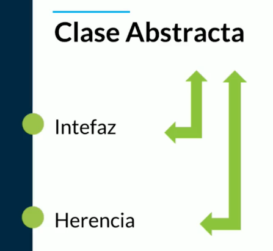

Las `clases abstractas` es como una fusión entre las cosas que le faltan a la `interfaz` implementar y a la herencia por cubrir.

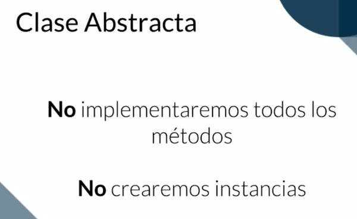

Puedo definir en una `clase abstracta` que `métodos` son obligatorios de implementar y también como restricción es que de esa `clase abstracta` no se podrá crear instancias.

Ejemplo
~~~
public abstract class Figura {
    ... abstract void dibujate();
}
~~~

Un `método` que es obligatorio implementar tiene que tener la palabra `abstract` y esto hace que automáticamente la `clase` sea `abstracta`, el `método` tampoco tendrá implementado su función, como vemos tiene parte de `interfaz` y herencia.  
Cuando se hereda puedo implementar la función de ese `método` o si quiero seguir manteniendolo abstracto, debo continuar diciendo que ese `método` es abstract y no tiene cuerpo como su padre, si no tiene `abstract` es obligatorio la implementación.

---

## Clase 3 - Implementando clases abstractas al proyecto
Importamos el proyecto desde [Github](https://github.com/anncode1/JavaSEBasico/tree/31.MakeReportAllEntities), yo lo tomé desde [acá](https://github.com/wpbreak/AmazonViewer.git) que ya esta para Intellij.

Se analizó un poco como está compuesto el proyecto y se escribió en la `clase Film` un `método abstracto`, hace a la `clase film` `abstracto`, llamado `view` que lo implementarán las `clases` `Movie`, `Serie` y `Book`.

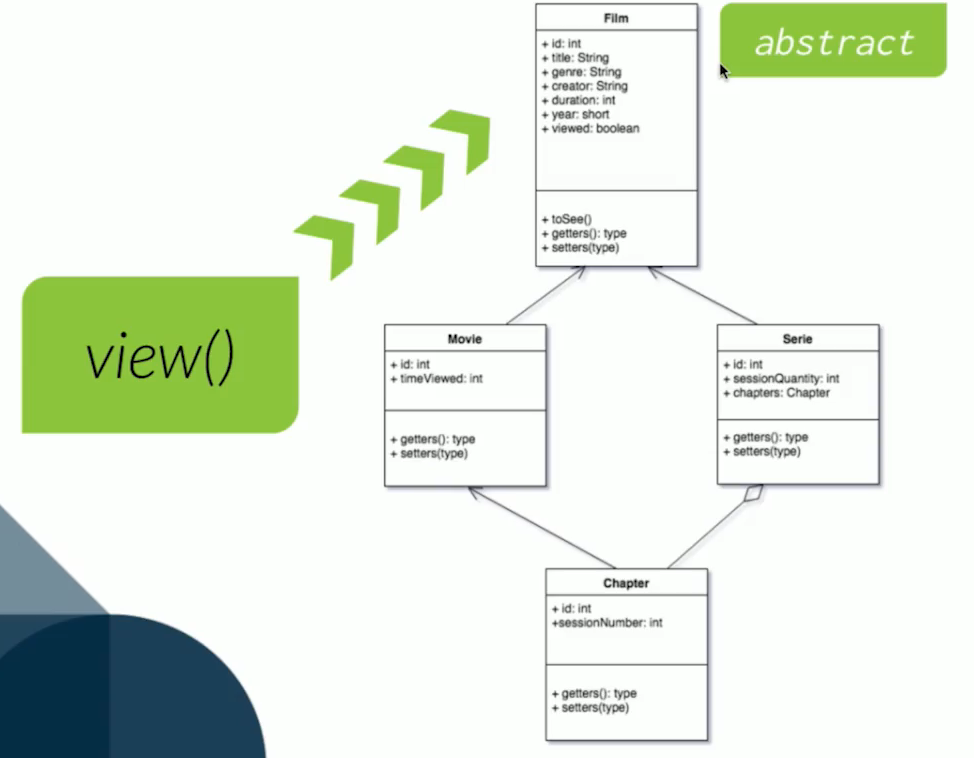

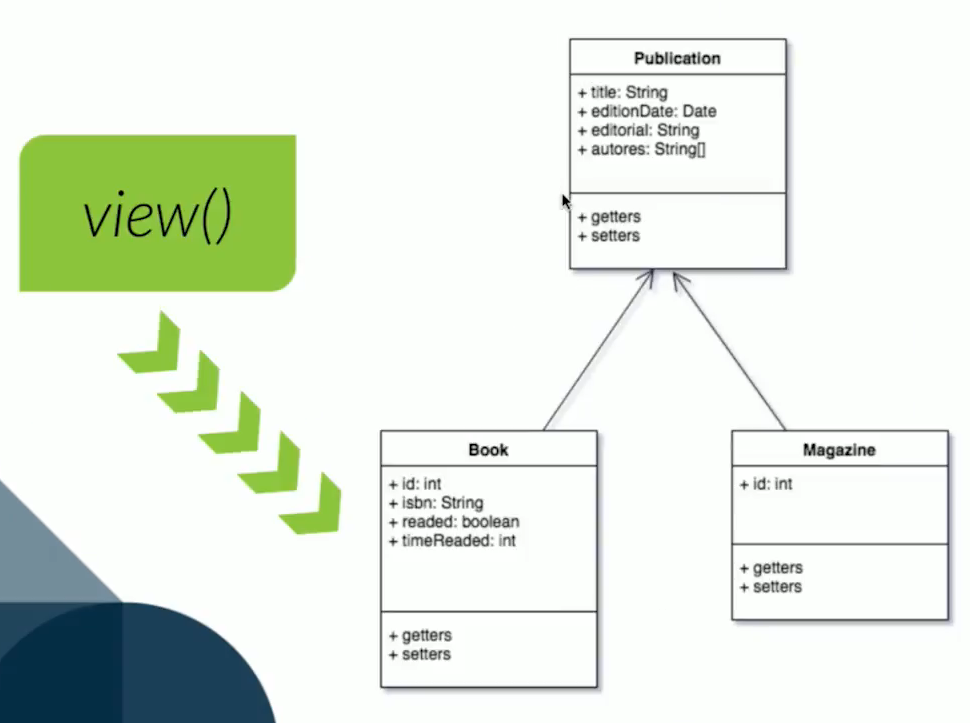

---

## Clase 4 - Ejercicio. Clases Abstractas
Tengo un programa que dibuja figuras automáticamente.

He creado una `clase abstracta` llamada `Figura`, esta tiene un `método` llamado `dibujate()`.  
¿Qué tendría que hacer para que la `clase Triangulo` pueda sobreescribir este `método` y poner el código que haga que dibuje la forma indicada?

~~~
public abstract class Figura {
    public abstract void dibujate();
}
------------------------------------------------
public class Triangulo extends Figura{

    @Override
    public void dibujate() {
        System.out.println("Dibujar Triangulo");
    }
}
~~~

---

## Clase 5 - Implementando métodos abstractos en Java
Polimorfismo a nivel de `clases`, ya no se puede instanciar la `clase` `Film` porque ahora es abstracta.  
Pero si necesito un objeto, puedo instanciar uno que herede de `Film`.

Entonces estamos viendo el polimorfismo en su máxima expresión, el mismo objeto `Film` tiene 2 comportamientos diferentes, puede ser un `Movie` o un `Chapter`.

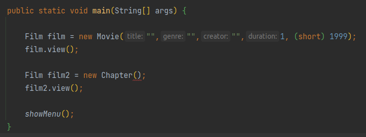

Se hizo las modificaciones en el código, llevando el `método view` a cada `clase` implementandola, y en el main, a través de un objeto se lo invoca.

---

# Módulo 3 - JavaDocs
## Clase 6 - Qué es JavaDocs
`JavaDocs` es la [documentación](https://www.tutorialspoint.com/java/java_documentation.htm) de `Java`, aprenderemos a generarla.

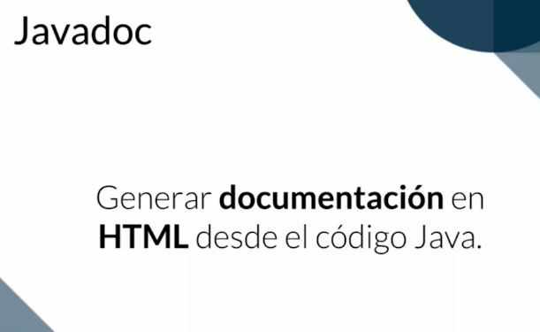

Ejemplo de documentación de **Spring**

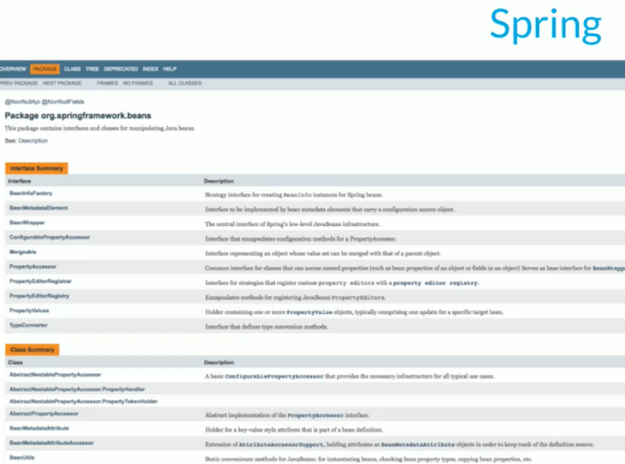

Básicamente es para informar como funciona el sistema, los `métodos`, los `parámetros` que recibe, y toda explicación que se crea necesaria para que un usuario pueda utilizar nuestro código de manera eficiente.

`JavaDocs` funciona a base de comentarios.

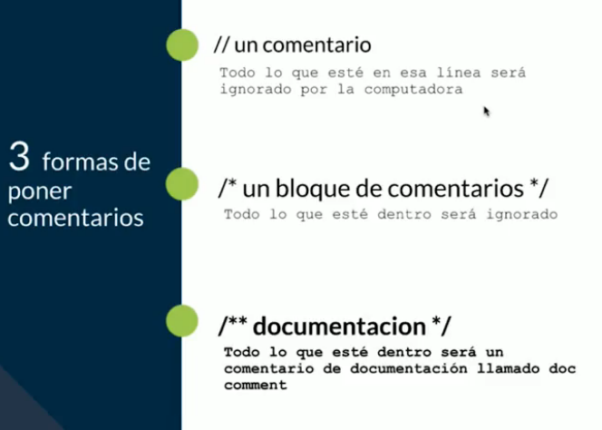

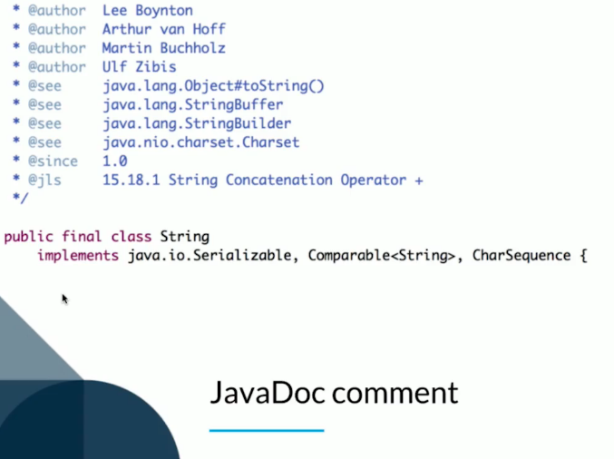

La documentación que se genera también se puede incluir `html`, además de los tags, estos nos sirve mucho para dar un buen formato a la documentación.

Algunos tags de `Javadoc`:
~~~
@author
{@docRoot}
@deprecated
@exception
{@inheritDoc}
{@link}
{@linkplain}
@param
@return
@see
@serial
@serialData
@serialField
@since
@throws
{@value}
@version
~~~

Ejemplo de documentación de la `clase String`
~~~
/**
 * The {@code String} class represents character strings. All
 * string literals in Java programs, such as {@code "abc"}, are
 * implemented as instances of this class.
 * 

 * Strings are constant; their values cannot be changed after they
 * are created. String buffers support mutable strings.
 * Because String objects are immutable they can be shared. For example:
 * <blockquote><pre>
 *     String str = "abc";
 * </pre></blockquote>

 * is equivalent to:
 * <blockquote><pre>
 *     char data[] = {'a', 'b', 'c'};
 *     String str = new String(data);
 * </pre></blockquote>

 * Here are some more examples of how strings can be used:
 * <blockquote><pre>
 *     System.out.println("abc");
 *     String cde = "cde";
 *     System.out.println("abc" + cde);
 *     String c = "abc".substring(2,3);
 *     String d = cde.substring(1, 2);
 * </pre></blockquote>
 * 

 * The class {@code String} includes methods for examining
 * individual characters of the sequence, for comparing strings, for
 * searching strings, for extracting substrings, and for creating a
 * copy of a string with all characters translated to uppercase or to
 * lowercase. Case mapping is based on the Unicode Standard version
 * specified by the {@link java.lang.Character Character} class.
 * 

 * The Java language provides special support for the string
 * concatenation operator (&nbsp;+&nbsp;), and for conversion of
 * other objects to strings. String concatenation is implemented
 * through the {@code StringBuilder}(or {@code StringBuffer})
 * class and its {@code append} method.
 * String conversions are implemented through the method
 * {@code toString}, defined by {@code Object} and
 * inherited by all classes in Java. For additional information on
 * string concatenation and conversion, see Gosling, Joy, and Steele,
 * <i>The Java Language Specification</i>.
 *
 * 
 Unless otherwise noted, passing a <tt>null</tt> argument to a constructor
 * or method in this class will cause a {@link NullPointerException} to be
 * thrown.
 *
 * 
A {@code String} represents a string in the UTF-16 format
 * in which <em>supplementary characters</em> are represented by <em>surrogate
 * pairs</em> (see the section <a href="Character.html#unicode">Unicode
 * Character Representations</a> in the {@code Character} class for
 * more information).
 * Index values refer to {@code char} code units, so a supplementary
 * character uses two positions in a {@code String}.
 * 
The {@code String} class provides methods for dealing with
 * Unicode code points (i.e., characters), in addition to those for
 * dealing with Unicode code units (i.e., {@code char} values).
 *
 * @author  Lee Boynton
 * @author  Arthur van Hoff
 * @author  Martin Buchholz
 * @author  Ulf Zibis
 * @see     java.lang.Object#toString()
 * @see     java.lang.StringBuffer
 * @see     java.lang.StringBuilder
 * @see     java.nio.charset.Charset
 * @since   JDK1.0
 */
 ~~~

---

## Clase 7 - Implementando JavaDocs al proyecto
Ejemplo de documentación de clase

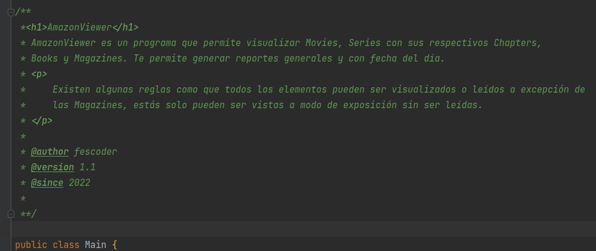

Ejemplo de documentación de métodos

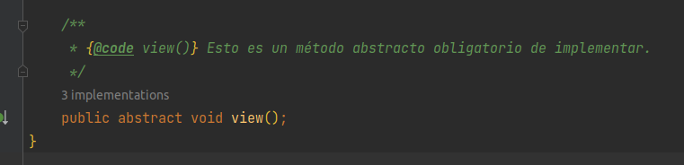

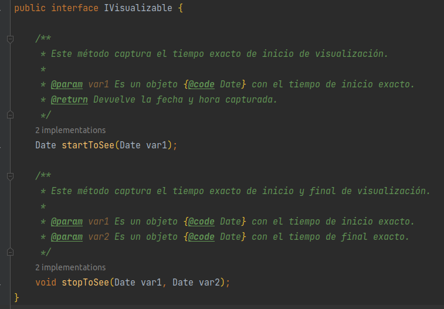

---

## Clase 8 - Reto
Ahora que ya conoces las `tags` y su uso para documentar, te pongo el siguiente reto que consiste en general la documentación para librería `Report`, que creamos en el Curso Básico de Java SE el proyecto lo encuentras [aquí](https://github.com/anncode1/JavaSEBasico/tree/26.EscribirArchivos).

Genera la librería documentada e implementala en el proyecto.

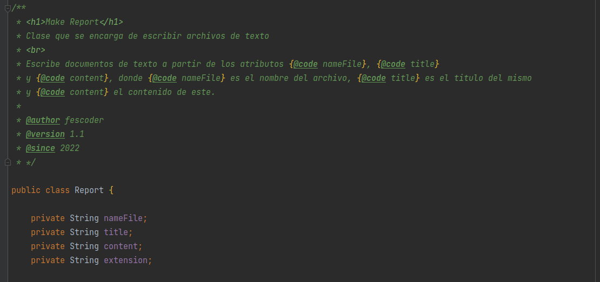
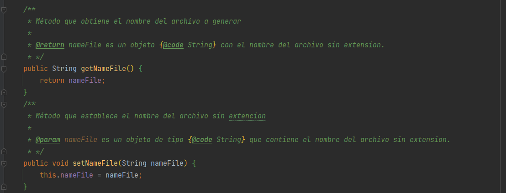
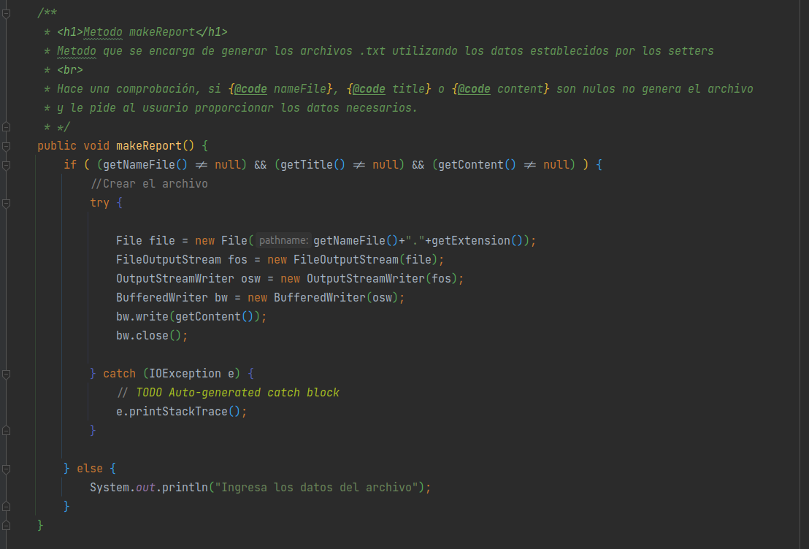
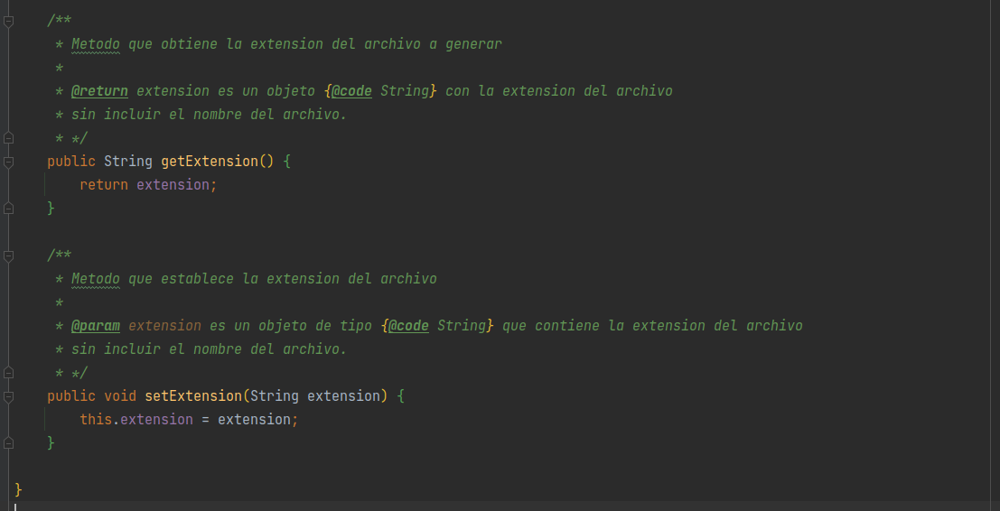

---

## Clase 9 - JavaDocs tags para herencia e interfaces

Muestra de como se ven las documentaciones y un nuevo tag.

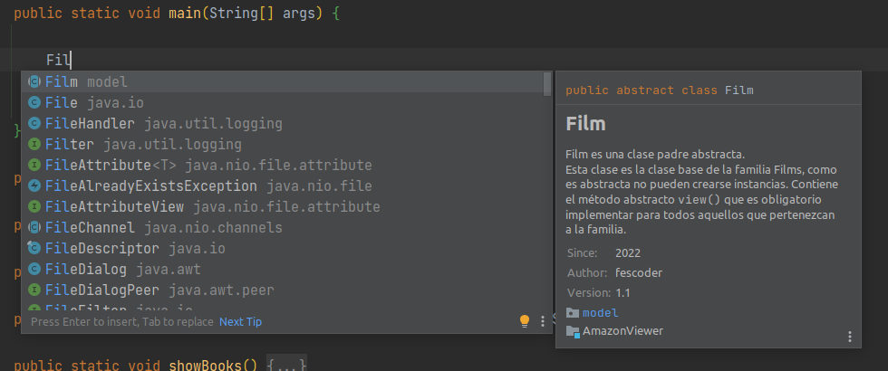

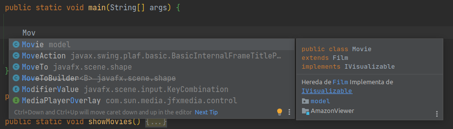

`{@inheritDoc}` Trae toda la ascendencia de `view()` en este caso, se ve reflejado en donde dice **Specified by**.

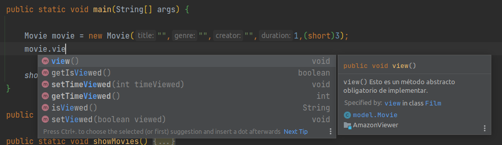

Sin `{@inheritDoc}`

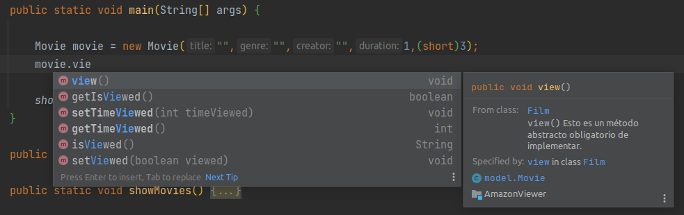

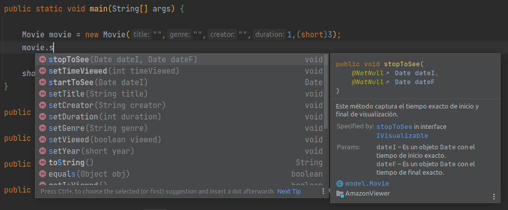

---

## Clase 10 - Generado Java Docs
En `Chapter` tenemos una doble herencia, es decir, `Chapter` -> `Movie` -> `Film`, entonces lo que podemos hacer es usar la etiqueta `@see` que lo que hace es recomendarte ver `Film` en este caso ya que es la `clase` más alta.

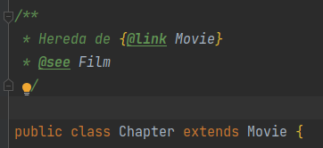

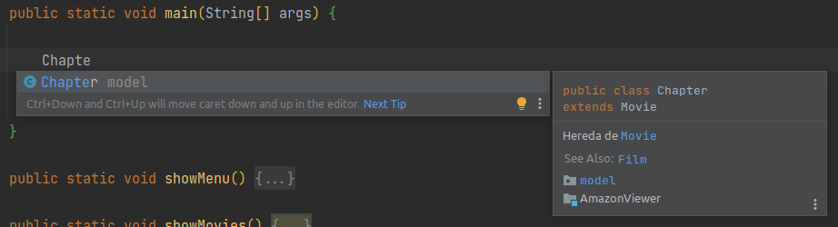

Generamos el JavaDocs, en Intellij está en `Tools` -> `Generate JavaDocs...`, le indicamos donde lo guardamos y `Generate`.

Abriendo en el navegador podremos ver algo como esto:

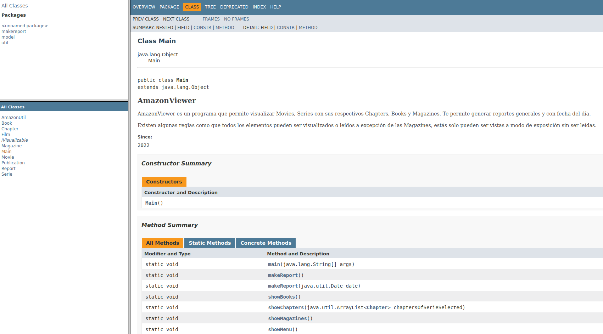

Descripción `método view` de `Film`

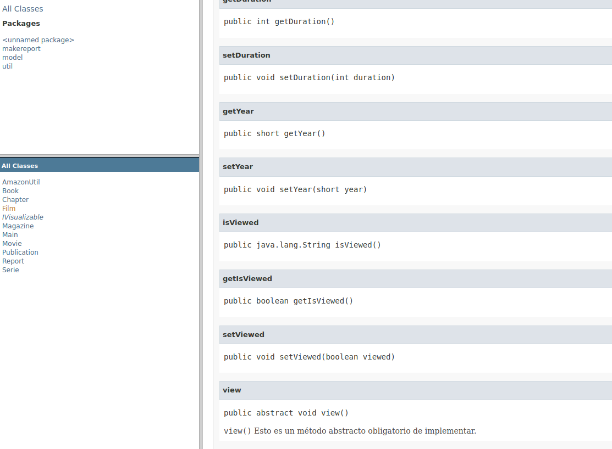

`IVisualizable`

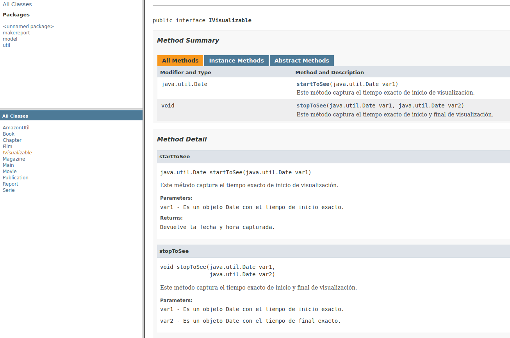

---

# Módulo 4 - Clases Anidadas
## Clase 11 - Clases anidadas y tipos
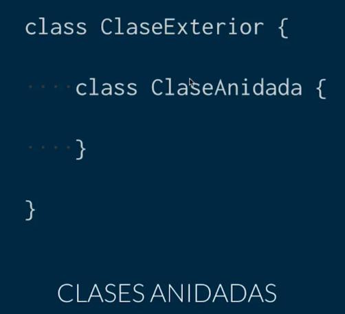

Generalmente se hace esto cuando una `clase` está usando otra, esto depende mucho del modelo de negocio, y la `claseAnidada` no es usada por otras `clases`, nos muestra legiblemente la dependencia de una `clase` con la otra.  
La `claseAnidada` es de poco tamaño, menor magnitud.

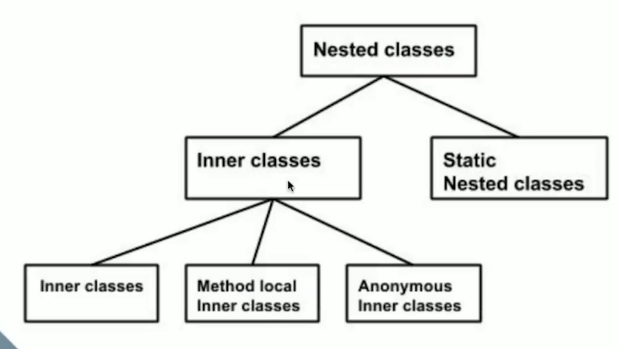

Acá podemos ver como de las `clases anidadas` (`Nested Classes`) se despligan 2 tipos:
- `Inner Classes`: Clases interiores/internas y se dividen en 3.
    - `Inner Classes`: Clase normal como aparece en `ClaseAnidada`.
    - `Method local Inner classes`: una clase dentro de un método.
    - `Anonymous Inner classes`: clases abstractas.
- `Static Nested Classes`: Clases estáticas.

Clase estática e interna  
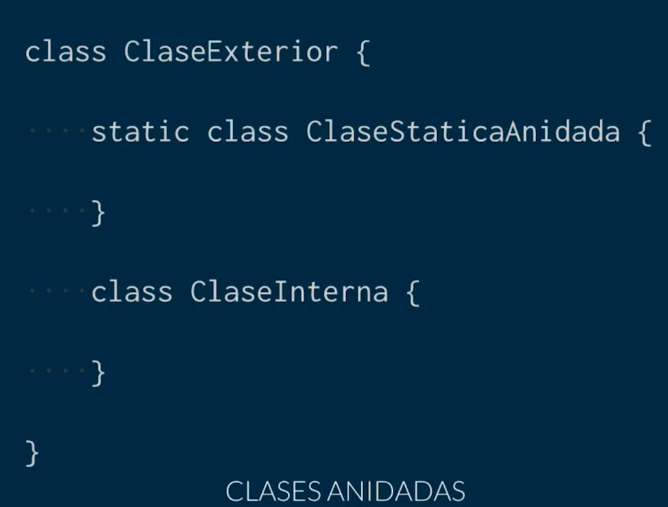

Las `clases estáticas` no necesitan crear instancias para llamarlas y solo pueden llamar a métodos estáticos.

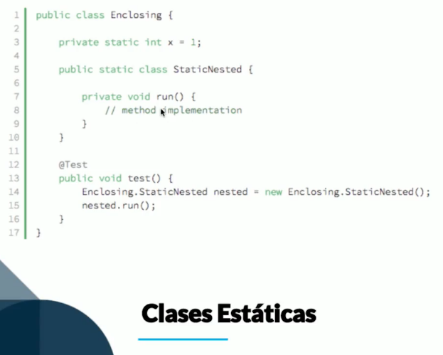

Clases anidadas  
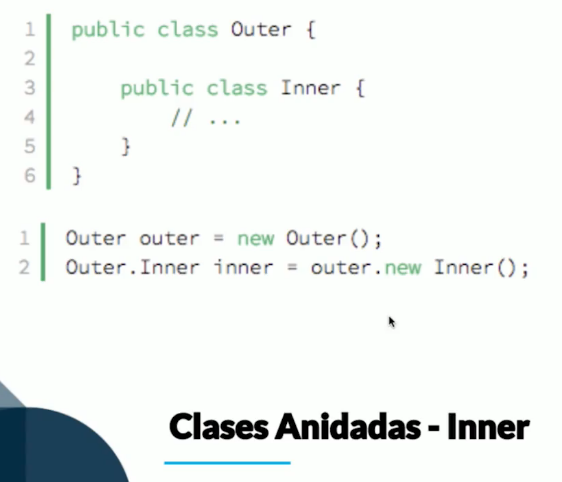

Clases locales a método  
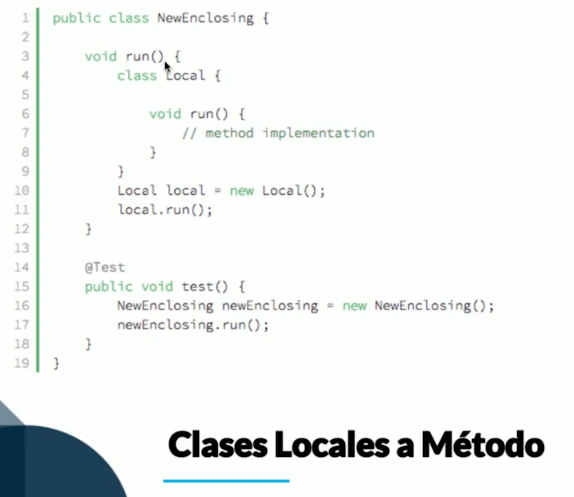

Clases anónimas  
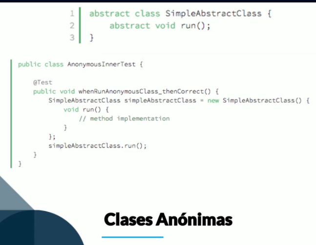

---

## Clase 12 - Ejercicio. Clases Anidadas
Spotify tiene una relación Album - Song en donde Song será una clase que solo es utilizada en Album pues la definición de este es una colección de Song’s.  
¿Cuál sería la forma más adecuada de tratar la clase Song si esta solamente se utilizará en Album?

~~~
public class Album {
    public class Song {
        ...
    }
}
~~~

---

## Clase 13 - Implementando una clase anidada al proyecto
Se agregará una `clase anidada` llamada `Page` a `Book` para corregir su manera de ser consumida por el `view`.  
Recordemos que usaríamos una `clase Inner` cuando quiero tener acceso a algún `método` de la `clase Outer`, `Book` en este caso y una `clase estática` cuando no necesito esos `métodos`.

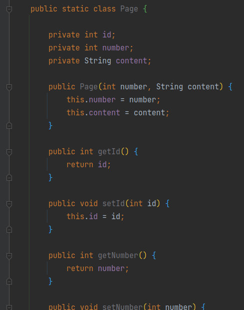

---

## Clase 14 - Instanciando clases estáticas anidadas
Aplicamos `clases anidadas` al proyecto, usamos la `clase Page` y modificamos el código de `view` y `makeBookList` para que recorra el `Libro`.

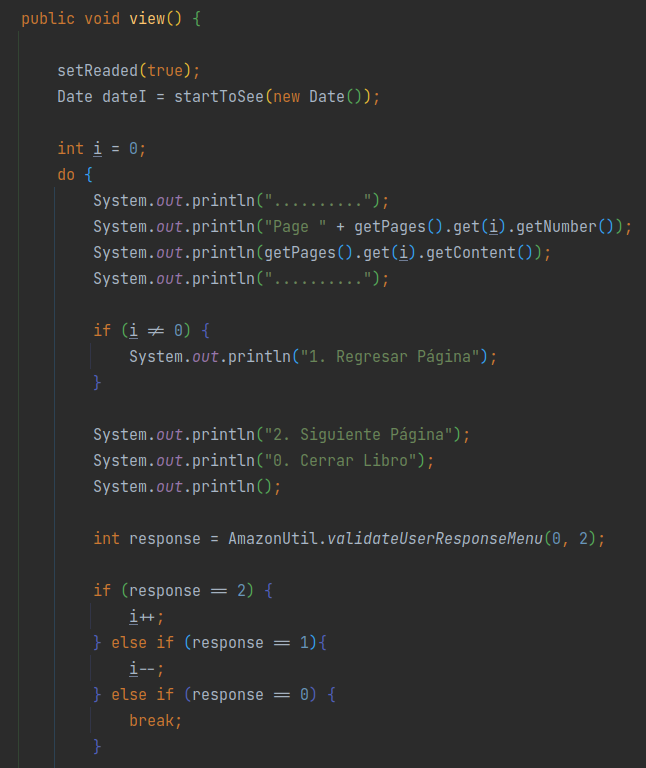

---

## Clase 15 - Enumerations
Los [enumerations](https://jarroba.com/enum-enumerados-en-java-con-ejemplos/) son tipos de datos muy especiales pues es el único tipo de dato que posee una `colección de constantes`, al ser constantes estaremos obligados a escribirlos con mayúsculas.

Usaremos `enum` cada vez que necesitemos representar un conjunto fijo de constantes. Por ejemplo los días de la semana.

Así podemos declarar un enumeration usando la palabra reservada `enum`.
~~~
public enum Day {
    SUNDAY, MONDAY, TUESDAY, WEDNESDAY, THURSDAY, FRIDAY, SATURDAY
}
~~~

Puedo crear referencias de `enumerations` de la siguiente forma:
~~~
Day day;
switch(day) {
    case MONDAY:
        System.out.println("Mondays are bad.");
        break;

    case FRIDAY:
        System.out.println("Fridays are better.");
        break;

    case SATURDAY: case SUNDAY:
        System.out.println("Weekends are best.");
        break;

    case default:
        System.out.println("Midweek days are so-so.");
        break;
}
~~~

Y puedo llamar un valor del enumeration así:
~~~
Day.MONDAY
Day.FRIDAY
Day.SATURDAY
~~~

Los `enumerations` pueden tener `atributos`, `métodos` y `constructores`, como se muestra:
~~~
public enum Day {
    SUNDAY("Domingo"),
    MONDAY("Lunes"),
    TUESDAY("Martes"),
    WEDNESDAY("Miercoles"),
    THURSDAY("Jueves"),
    FRIDAY("Viernes"),
    SATURDAY("Sabado")

    private String spanish;

    private Day(String s) {
        spanish = s;
    }

    public String getSpanish() {
        return spanish;
    }
}
~~~

Y para utilizarlo lo podemos hacer así:
~~~
System.out.println(Day.MONDAY);// MONDAY
System.out.println(Day.MONDAY.getSpanish());// Lunes
~~~

---

# Módulo 5 - Interfaces Avanzadas
## Clase 16 - Métodos con implementación métodos default y private
Hasta ahora lo que sabiamos de interfaces avanzadas era que una `interfaz` se va a componer de `métodos abstractos`, sin implementación, y que puede tener campos constantes, no variables, que se declaran con la palabra reservada `final`.

Además podemos crear tipos de referencia, que se parece a cuando trabajamos con `clases abstractas`, puedo definir un objeto del tipo de la `interfaz`, instanciarlo con una `clase` que implemente la `interfaz`.

A partír de Java 8 dentro de los `métodos` de una `interfaz` podemos tener el modificador `default`, cuando lo definimos explicitamente podemos implementarle comportamiento, código, dentro de la `interfaz`. En Java 9 podemos colocar `private`.

Entonces ahora podemos tener implementación en `métodos`.

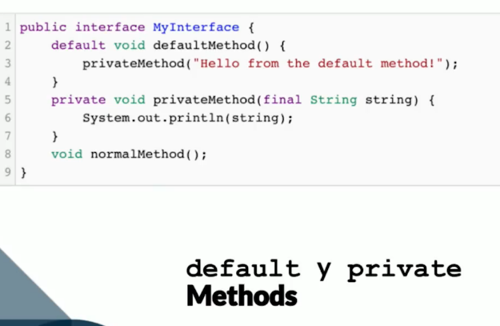

Ahora con estos tipos de `interfaces` podemos crear una capa `DAO` (Data Access Object), que lo que hace es generar una cantidad de `métodos` especificos que atacarán al modelo u objeto en si.

Hasta ahora la forma de ver películas en el proyecta esta hardcodeado, porque no implementamos una DB todavía, cuando la tengamos nos vamos a comunicar con ella a través de las `interfaz` que tenga los `métodos` que consulten, creen, modifiquen y eliminen registros.

---

## Clase 17 - Creando Interfaz DAO con métodos default y private
Creamos un `paquete dao` en el que tendrá, no todos pero la mayoria de las entidades que hay en el proyecto, empezamos creando la `interfaz` `MovieDAO`, en el que se concentrarán los `métodos CRUD`, que son los `métodos` especificos para tratar la DB, pero solo en este caso se podrá consumir una `Movie` y modificar como visto, no se puede crear ni eliminar.

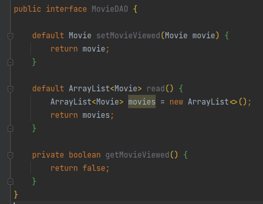

---

## Clase 18 - Ejercicio. Interfaz DAO
Tengo un proyecto en el que he creado un `API` de `métodos` que manipulan el comportamiento de un Robot.

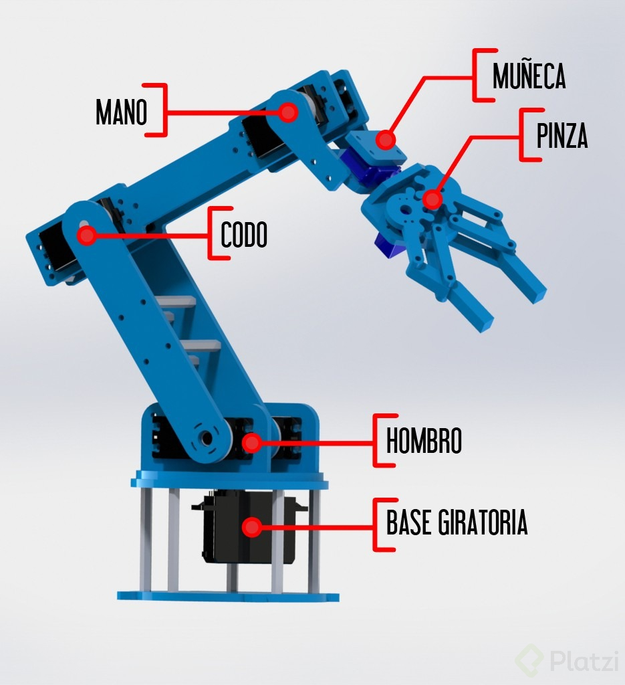

El código que genera la conexión es de más bajo nivel y está encapsulado en una `interfaz`. Este está solo disponible para ser llamado dentro de la `interfaz`.

Existen también `métodos` de más alto nivel que definen el comportamiento del robot y están disponibles para ser llamados desde dónde se esté generando una instancia/objeto de ella.

¿Cuál es el concepto que estamos aplicando al tener capas disponibles y otras no disponibles en mi proyecto?

- `Encapsulamiento` -> ya que la `interfaz` esta pre definiendo una parte del comportamiento de las `clases` que la implementen, al contar ya con código de bajo nivel.
- `Polimorfismo` -> ya que la `interfaz` si bien tiene una parte del comportamiento definida, puede ser implementada por varias clases que terminen de definir el comportamiento como tal del robot.
- `Modularidad` -> ya que permite definir comportamientos por capas que definen `métodos` de alto nivel y `métodos` de bajo nivel.

---

## Clase 19 - Diferencia Interfaces y Clases Abstractas
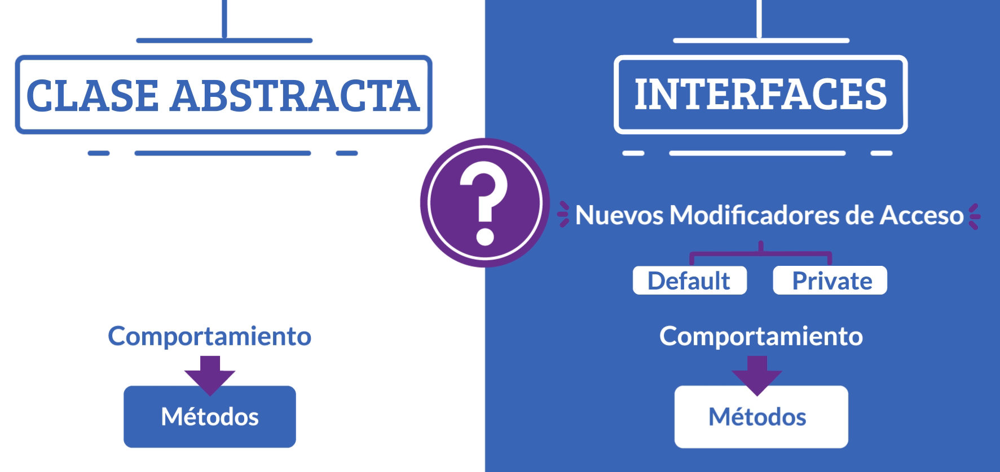

- Tenemos las `clases abstractas` (Una clase abstracta no es más que una clase común la cual posee atributos, métodos, constructores y por lo menos un método abstracto, que no puede ser instanciada, solo heredada.) que tiene `métodos abstractos`, y otros que no, para ser definidos por quienes implementan dicha `clase`.
- Las `interfaces` por otro lado conocimos los nuevos modificadores de accesos `default` y `private`, que ya con estos estamos pudiendo definir comportamiento del `método` de la `interfaz`, entonces una `interfaz` ahora puede tener `métodos` con y sin implementación como las `clases abstractas`.

**Las diferencias**

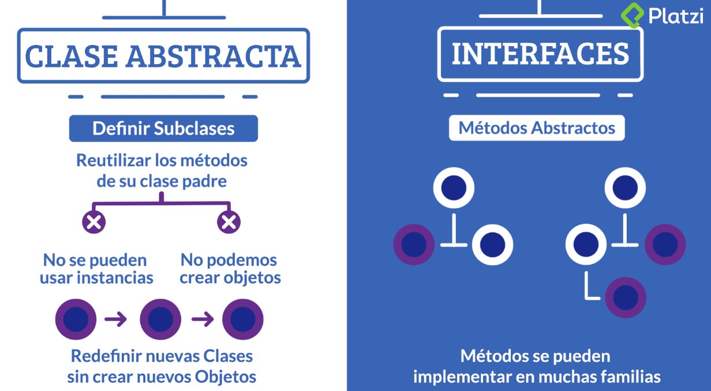

- `Clase abstracta` se usara para definir sus `clases`, es decir, esta siempre deberá ser heredada para poder utilizar y sobreescribir los `métodos`, una restriccion que tiene esta `clase` es que no podré crear instancias u objetos a partir de ella, unicamente siempre podré heredarla, por lo tanto, la herencia de `métodos` será de forma lineal, de padre a hijo sucesivamente.  
Podemos ir heredando `métodos abstractos` y no abstractos, por lo tanto este tipo de `clase` solo me sirve para definir nuevas `clases` sin necesidad de crear nuevos objetos.

- En `interfaces` tenemos una estructura similar de `métodos abstractos` y no abstractos, pero la vista principal será en los `métodos` que pueden implementarse en muchas familias de `clases`, la implementación de los `métodos` dejará de ser lineal.

**¿Cuando usar cada una?**  
Usaremos `interfaces` para implementar `métodos` que se comparten entre familias, es decir, la relación va más allá de la herencia entre dos `clases`.

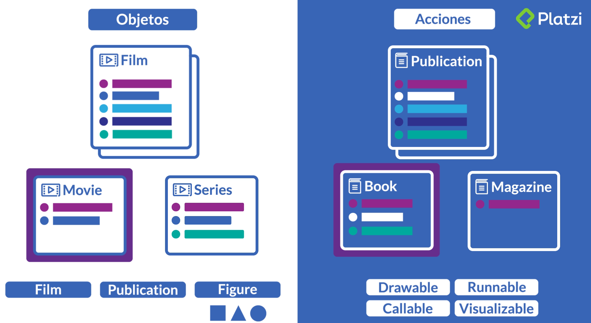

- Otra diferencia es en como nombramos una `clase abstracta` y una `interfaz`.
    - En la abstracta pensaremos más en objetos.
    - En la `interfaz` pensaremos más en las acciones que puede tener en común muchos objetos.

Es común encontrar nombres como `Drawable`, `Runnable`, `Callable`, `Visualizable` (este último cuestionado por Spanglish, otros piensan `Viewable`) para `interfaces`.  
En las `clases abstractas` es común encontrar con el nombre de la `clase` como `Film`, `Publication`, `Figure` que esta última será heredad en otros tipos de figuras como cuadrados, triangulos, circulos, etc.

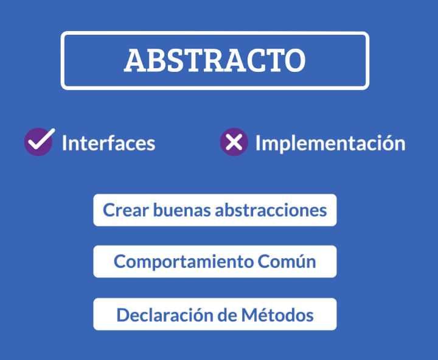

La palabra clave en ambos elementos es `abstract`, una buena práctica es que en el diseño de las apps siempre esté orientado a `interfaces` y no a la implementación.
- Concentrarse en crear buenas abstracciones.
- Intenta encontrar el comportamiento en común.
- Enfocarse en la declaración de los `métodos`.

***Si tratas de manera homogenea y con independencia tus módulos, tus programas serán mucho más escalables y eficientes.***

---

En la implementacion de una `clase abstracta`, un `método abstracto` es opcional, a diferencia de una `interfaz` en la cual si no es un `método privado`, obligatoriamente se tiene que implementar el `método abstracto` en la `clase` que la implementa.

Las `clases abstractas`, como cualquier otra `clase`, usan la herencia para transferir sus `atributos`, pero las `interfaces` con sobre el **comportamiento**.  
Ejemplo: Puedes usar una `clase abstracta` `Animal` de la cual heredan las clases `Insecto`, `Mamifero`, `Ave`. Una vez hecha la herencia, te vez tentado crear en `Ave` el `método volar();` sin embargo te das cuenta que no todas las aves vuelan (ejm: pingüinos) y que además hay mamiíferos que sí vuelan.  
Yo creo que **comportamiento** es la palabra clave. Un comportamiento similar aparece indistintamente de la relación entre dos `clases`.

---

## Clase 20 - Herencia en Interfaces
Las interfaces pueden heredar de otras interfaces utilizando la palabra clave extends, el concepto de herencia se aplicará como naturalmente se practica en clases, es decir, la interfaz heredará y adquirirá los métodos de la interfaz padre.

Una cosa interesante que sucede en caso de herencia con interfaces es que, aquí sí es permitido la herencia múltiple como ves a continuación:
~~~
public interface IReadable {
    public void read();
}

public interface Visualizable extends IReadable, Serializable {
    public void setViewed();
    public Boolean isViewed();
    public String timeViewed();
}
~~~

Además siguiendo las nuevas implementaciones de métodos default y private de las versiones Java 8 y 9 respectivamente podemos sobreescribir métodos y añadirles comportamiento, si es el caso.
~~~
public interface Visualizable extends IReadable, Serializable {
    public void setViewed();
    public Boolean isViewed();
    public String timeViewed();

    @Override
    default void read() {
        ...
    }
}
~~~

---

Un ejemplo de esto es en `Spring 5`, cuando creas un repositorio llamado por ejemplo `MovieRepository(interfaz)` y esta extiende de `JpaRepository`. Inmediatamente donde implementes `MovieRepository` puedes usar los `métodos default` de la `interfaz jpa`.  
Lo interesante es que la `interfaz JpaRepository` extiende de `CrudRepository` y de `PagingAndSortingRepository` y estos extienden de `Repository` dejando ver la utilidad inmediata de este feature de Java.

Las `variables` de `interface` por defecto siempre son `static` y `final`.

---

# Módulo 6 - Colecciones Avanzadas
## Clase 21 - Map, HashMap, TreeMap y LinkedHashMap

---

# Módulo 7 - Excepciones
## Clase 22 - Manejo de errores

---

## Clase 23 - Try-catch-finally / Try-with-resources

---

# Módulo 8 - JDBC
## Clase 24 - Definición y composición del API

---

## Clase 25 - Ejercicio. JDBC API

---

## Clase 26 - Creando la base de datos y conectando el proyecto con MySQL

---

## Clase 27 - Generando conexión a la base de datos y creando clase de constantes

---

## Clase 28 - Sentencia SELECT en Java

---

## Clase 29 - Sentencia SELECT con Parámetros

---

## Clase 30 - Sentencia INSERT en Java

---

## Clase 31 - Reto: Reporte por fecha

---

# Módulo 9 - Lambdas
## Clase 32 - Interfaces funcionales

---

## Clase 33 - Programación Funcional

---

## Clase 34 - Lambdas

---

## Clase 35 - Ejercicio. Lambdas

---

## Clase 36 - Lambdas como variables y Recursividad

---

## Clase 37 - Stream y Filter

---

## Clase 38 - Predicate y Consumer

---