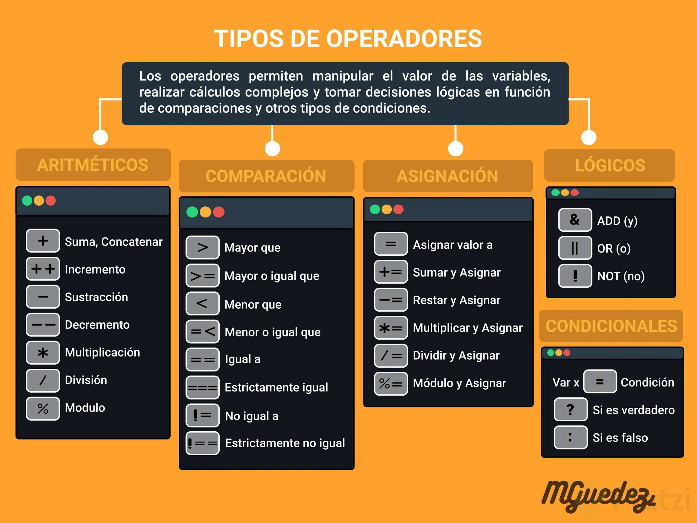
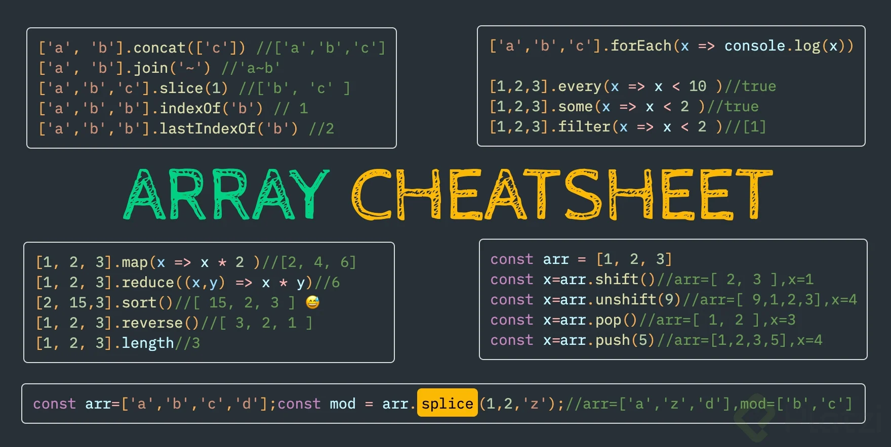

# Curso básico de JavaScript

EN JS usa este `${nombre}` para incluir variables en un String. Si no usar comillas simples ''
Podemos declarar una variable de tipo number y meterla en un if(number), y se comportara como boolean, valores falsos -> '', 0, null, undefined, NaN.
//Ejemplos en los que Boolean devuelve Falso:
Boolean(0); //false
Boolean(null); //false
Boolean(NaN); //false
Boolean(undefined); //false
Boolean(false); //false
Boolean(""); //false

//Ejemplos en los que Boolean devuelve verdadero:
Boolean(1); //true para 1 o cualquier número diferente de cero (0)
Boolean("a"); //true para cualquier caracter o espacio en blanco en el string
Boolean([]); //true aunque el array esté vacío
Boolean({}); //true aunque el objeto esté vacío
Boolean(function(){}); //Cualquier función es verdadera también

**¿Qué es Hoisting?**  
En JavaScript, las declaraciones (por ejemplo, de variables o funciones) se mueven al principio de su scope o ámbito. Este comportamiento se conoce como hoisting y es muy importante tenerlo en cuenta a la hora de programar para prevenir posibles errores.

Las funciones siempre se mueven arriba del scope. Por lo tanto, podemos elegir donde declararlas y usarlas.
La declaración de las variables se mueven arriba del scope, pero no la asignación. Antes de usar una variable, habrá que crearla y asignarla.

Coerción es la forma en la que podemos cambiar un tipo de valor a otro, existen dos tipos de coerción:
Coerción implícita = es cuando el lenguaje nos ayuda a cambiar el tipo de valor.
Coerción explicita = es cuando obligamos a que cambie el tipo de valor.

Cuando hablamos de funciones en JavaScript, tenemos dos tipos de funciones: Funciones Declarativas (function declaration / function statement) y Expresiones de función (function expression / funciones anónimas).

Funciones Declarativas:
En las funciones declarativas, utilizamos la palabra reservada function al inicio para poder declarar la función:
~~~
function saludar(nombre) {
	console.log(`Hola ${nombre}`);
}

saludar('Diego');
~~~

Expresión de función:
En la expresión de función, la declaración se inicia con la palabra reservada var, donde se generará una variable que guardará una función anónima.
~~~
var nombre = function(nombre){
    console.log(`Hola ${nombre}`)
}

nombre(‘Diego’);

~~~

En la expresión de función, la función podría o no llevar nombre, aunque es más común que se hagan anónimas.

Diferencias:
A las funciones declarativas se les aplica hoisting, y a la expresión de función, no. Ya que el hoisting solo se aplica en las palabras reservadas var y function.

Lo que quiere decir que con las funciones declarativas, podemos mandar llamar la función antes de que ésta sea declarada, y con la expresión de función, no, tendríamos que declararla primero, y después mandarla llamar.

Estos métodos se guardan en una variable nueva para capturar el nuevo array modificado.
- Para agregar un elemento al final del array se usa `.push("Manzana")`.
- Para elminar el último elemento es con `.pop("Manzana")`
- Agregar al inicio del array un elemento. `.unshift("Uva")`.
- Eliminar el primer elemento. `.shift("Uva")`
- Para saber el indice de un elemento del que sepamos el nombre. `.indexOf("Cereza")`

Los bucles pueden ejecutar un bloque de código varias veces. JavaScript admite diferentes tipos de bucles:
- for - recorre un bloque de código varias veces
- for/in - recorre las propiedades de un objeto
- for/of - recorre los valores de un objeto iterable
- while - recorre un bloque de código mientras se cumple una condición específica
- do/while - también recorre un bloque de código mientras se cumple una condición específica

Otros métodos:
- find() : Devuelve el primer elemento del array que cumpla con la condición dada
- foreach() : Ejecuta lo que le definamos una vez por cada elemento de nuestro array
- some() : Comprueba si al menos un elemento del array cumple con la condición que le damos
- filter() : Devuelve todos los elementos del array que cumplan con la condición dada

Por si a alguien le quedó alguna duda con respecto a la diferencia entre find y filter:
- El método find () devuelve el primer valor que coincide de la colección. Una vez que coincida con el valor en los resultados, no verificará los valores restantes en la colección de matriz.
- El método filter () devuelve los valores coincidentes en una matriz de la colección. Verificará todos los valores de la colección y devolverá los valores coincidentes en una matriz.

## Ayudas matemáticas

En js también se puede usar ** para calcular un exponente, ejm :
const areaCuadrado = ladoCuadrado ** 2;

Redondear un numero con muchos decimales -> Math.round(areaCirculo)

Otra excelente manera de elevar al cuadrado un numero es usando la funcion pow() de la biblioteca Math que trae por defecto JavaScript

Dato curioso de la clase: cuando declaramos la funcion los datos dentro de los parentesis se llaman PARAMETROS, cuando llamamos a ejecutarla se llaman ARGUMENTOS.

La función recibe parámetros.  
Nosotros enviamos los argumentos a la función.

[■,■,■,■].map(■→●) ⇒ [●,●,●,●]
[■,●,■,▲].filter(■→true) ⇒ [■,■]
[■,●,■,▲].find(●→true) ⇒ ●
[■,●,■,▲].findIndex(●→true) ⇒ 1
[■,●,■,▲].fill(●) ⇒ [●,●,●,●]
[■,●,■,▲].some(●→true) ⇒ true
[■,●,■,▲].every(●→true) ⇒ false

# es6

## Default Params y Concatenación
En ECMAScript 6 ES6 y ES2015 fueron publicadas varias características nuevas que dotaron de gran poder al lenguaje, dos de estas son: parámetros por defecto y plantillas literales.

En qué consisten los parámetros por defecto
Los parámetros por defecto (default params) consisten en establecer un valor por defecto a los parámetros de una función, para asegurar que el código se ejecute correctamente en el caso de que no se establezcan los argumentos correspondientes en la invocación de la función.

Tal como puedes ver en el siguiente código, la función sumar recibe dos parámetros y retorna el valor total. Sin embargo, si alguien no decide poner alguno o todos los parámetros necesarios, pues que el programa no funcionará correctamente.
~~~
function sumar(number1, number2){
  return number1 + number2
}

sumar(3,4)  // 7
sumar(3)    // NaN
sumar()     // NaN
~~~

Antes de ES6, se debía establecer una variable y utilizar el operador OR (||) con el valor por defecto necesario. El caracter guion bajo (_) lo utilizo para diferenciar el parámetro de la función de la variable declarada dentro.
~~~
function sumar(number1, number2){
  var _number1 = number1 || 0
  var _number2 = number2 || 0

  return _number1 + _number2
}

sumar(3,4)  // 7
sumar(3)    // 3
sumar()     // 0
~~~

Con los parámetros por defectos añadidos en ES6, eliminamos las declaraciones para mejorar la legibilidad y el mantenimiento del código de la siguiente manera:
~~~
function sumar(number1 = 0, number2 = 0){
  return number1 + number2
}

sumar(3,4) // 7
sumar(3)    // 3
sumar()      // 0
~~~

Puedes utilizar cualquier valor siempre que sea necesario.

Qué son las plantillas literales
Las plantillas literales (template literals) consisten en crear cadenas de caracteres que puedan contener variables.

Antes de ES6, si querías crear una cadena larga o un mensaje, debías utilizar la concatenación.
~~~
var nombre = "Andres"
var edad = 23
var mensaje = "Mi nombre es " + nombre + " y tengo " + edad + " años."

console.log(mensaje)
// 'Mi nombre es Andres y tengo 23 años.'
~~~

Esto trae varios problemas en la legibilidad y mantenibilidad del código. Se convierte cada vez más complejo en mensajes más extensos o el estar pendiente de agregar espacios antes o después de cada variable concatenada.

Con las plantillas literales añadidas en ES6, emplea el caracter ( ` ), que no es una comilla simple ( ’ ), para envolver el mensaje e incluir las variables con la sintaxis ${variable}.
~~~
var nombre = "Andres"
var edad = 23

var mensaje = `Mi nombre es ${nombre} y tengo ${edad} años.`

console.log(mensaje)
// 'Mi nombre es Andres y tengo 23 años.'
~~~

De esta manera el código es más legible y que pueda mantenerse.

## Valores por defecto
~~~
function myFunction(name = 'Fes', age = 32, country = 'AR') {
    console.log(name, age, country);
}
~~~

## LET y CONST, Multilínea, Spread Operator y Desestructuración
Las siguientes características de ES6 que aprenderás son: plantilla multilínea, let y const, operador de propagación y desestructuración.

Let y const, la nueva forma para declarar variables
Hasta ahora aprendiste a declarar variables con var, sin embargo, a partir de la especificación de ES6 se agregaron nuevas formas para la declaración de variables.

Let y const resuelven varios problemas con var como el hoisting, variables globales, re-declaración y re-asignación de variables.

Scope
En el tema del scope, se diferencian porque let y const tienen un scope de bloque y var no.
~~~
{
var nameVar = "soy var"
let nameLet = "soy let"
}

console.log(nameVar) // 'soy var'
console.log(nameLet) // ReferenceError: nameLet is not defined
~~~

Objeto global
En variables globales, let y constno guardan sus variables en el objeto global (window, global o globalThis), mientras que var si lo guarda.
~~~
var nameVar = "soy var"
let nameLet = "soy let"
const nameConst = "soy const"

globalThis.nameVar   // 'soy var'
globalThis.nameLet   // undefined
globalThis.nameConst  // undefined
~~~

Variables re-declaradas y re-asignadas
La re-declaración es volver a declarar una variable, y la re-asignación es volver a asignar un valor, entonces cada variable tiene una forma diferente de manejarlas:

Una variable declarada con var puede ser re-declarada y re-asignada.
Una variable declarada con let puede ser re-asignada, pero no re-declarada.
Una variable declarada con const no puede ser re-declarada, ni re-asignada. Su declaración y asignación debe ser en una línea, caso contrario habrá un error.
En conclusión, si intentas re-declarar una variable declarada con let y const habrá un error de “variable ya declarada”; y, si intentas re-asignar una variable declarada con const existirá un error de tipo.

En los demás casos, JavaScript lo aceptará como válidos, algo problemático con var, por eso deja de utilizarlo.
~~~
// Declarar y asignar con const
const pi  // SyntaxError: Missing initializer in const declaration.
pi = 3.14

// Declaración de variables
var nameVar = "soy var"
let nameLet = "soy let"
const nameConst = "soy const"

// Re-declaración de variables
var nameVar = "var soy"
console.log(nameVar) // 'var soy'

let nameLet = "let soy" // SyntaxError: Identifier 'nameLet' has already been declared.

const nameConst = "const soy" //SyntaxError: Identifier 'nameConst' has already been declared.

// Re-asignación de variables
nameVar = "otro var"
console.log(nameVar) // 'otro var'

nameLet = "otro let"
console.log(nameVar) // otro let'

nameConst = "otro const" //TypeError: Assignment to constant variable.
~~~

Ten en cuenta que los errores pararán la ejecución de tu programa.

Plantilla multilínea
La plantilla multilínea consiste en crear mensajes que contengan varias líneas separadas entre sí, utilizando las plantillas literales.

Antes de ES6, la forma de crear una plantilla multilínea era agregar \n al string.
~~~
var mensaje = "Línea 1 \n" + "línea 2"

console.log(mensaje)
// 'Línea 1
// línea 2'
~~~

Con ES6 solamente necesitas utilizar las plantillas literales.
~~~
const mensaje = `Línea 1
línea 2`

console.log(mensaje)
// 'Línea 1
// línea 2'
~~~

Desestructuración
La desestructuración (destructuring) consiste en extraer los valores de arrays o propiedades de objetos en distintas variables.

Desestructuración de objetos
La desestructuración de objetos consiste en extraer las propiedades de un objeto en variables, utilizando el mismo nombre de la propiedad en el objeto con la siguiente sintaxis:
~~~
const objeto = { prop1: "valor1", prop2: "valor2", ... } 

// Desestructuración
const { prop1, prop2 } = objeto
~~~

Antes de ES6, necesitabas acceder al objeto con la notación punto o corchetes por cada propiedad que se necesita y asignar ese valor a una variable diferente.
~~~
var usuario = { nombre: "Andres", edad: 23, plataforma: "Platzi" }

var nombre = usuario.nombre
var edad = usuario.edad
var plataforma = usuario["plataforma"]

console.log(nombre)  // 'Andres' 
console.log(edad)  // 23
console.log(plataforma)  // 'Platzi'
~~~

Con la desestructuración puedes realizar lo mismo, pero en una sola línea, provocando que el código seas más legible y mantenible.
~~~
const usuario = { nombre: "Andres", edad: 23, plataforma: "Platzi" }

const { nombre, edad, plataforma } = usuario

console.log(nombre)  // 'Andres' 
console.log(edad)  // 23
console.log(plataforma)  // 'Platzi'
~~~

Cambiar el nombre de las variables con desestructuración
Si no te agrada el nombre de la propiedad del objeto, puedes cambiarlo utilizando la siguiente sintaxis:
~~~
const objeto = { prop1: "valor1", prop2: "valor2", ... } 

// Desestructuración
const { prop1: newProp1, prop2: newProp2 } = objeto
~~~

Por ejemplo:
~~~
const usuario = { nombre: "Andres", edad: 23, plataforma: "Platzi" }

const { nombre: name, edad: age, plataforma: platform } = usuario

console.log(name)  // 'Andres' 
console.log(age)  // 23
console.log(platform)  // 'Platzi'

console.log(nombre)   // Uncaught ReferenceError: nombre is not defined
~~~

Desestructuración en parámetros de una función
Si envías un objeto como argumento en la invocación a la declaración de una función, puedes utilizar la desestructuración en los parámetros para obtener los valores directamente. Ten en cuenta que el nombre debe ser igual a la propiedad del objeto.
~~~
const usuario = { nombre: "Andres", edad: 23, plataforma: "Platzi" }

function mostrarDatos( { nombre, edad, plataforma } ){
    console.log(nombre, edad, plataforma) 
}

mostrarDatos(usuario) // 'Andres', 23, 'Platzi'
~~~

Desestructuración de arrays
La desestructuración de objetos consiste en extraer los valores de un objeto en variables, utilizando la misma posición del array con una sintaxis similar a la desestructuración de objetos.
~~~
const array = [ 1, 2, 3, 4, 5 ]

// Desestructuración
const [uno, dos, tres ] = array

console.log(uno) // 1
console.log(dos) // 2
console.log(tres) // 3
~~~

Desestructuración para valores retornados de una función
Cuando una función retorna un array, puedes guardarlo en una variable por medio de la invocación. Por ende, puedes utilizar la desestructuración para utilizar esos valores por separado de manera legible.

En el siguiente ejemplo, la función useState retorna un array con dos elementos: un valor y otra función actualizadora.
~~~
function useState(value){
    return [value, updateValue()]
}

//Sin desestructuración 
const estado = useState(3)
const valor = estado[0]
const actualizador = estado[1]

//Con desestructuración 
const [valor, actualizador] = useState(3)
~~~

Lo que puedes hacer con desestructuración, pero no es recomendable
Si necesitas un elemento en cierta posición, puedes utilizar la separación por comas para identificar la variable que necesitas.
~~~
const array = [ 1, 2, 3, 4, 5 ]

const [ ,,,,  cinco ] = array

console.log(cinco) // 5
~~~

Como los arrays son un tipo de objeto, puedes utilizar la desestructuración de objetos mediante el índice y utilizando un nombre para la variable.
~~~
const array = [ 1, 2, 3, 4, 5 ]

const {4: cinco} = array

console.log(cinco) // 5
~~~

Operador de propagación
El operador de propagación (spread operator), como su nombre lo dice, consiste en propagar los elementos de un iterable, ya sea un array o stringm utilizando tres puntos (...) dentro de un array.
~~~
// Para strings
const array = [ ..."Hola"]    // [ 'H', 'o', 'l', 'a' ]

// En arrays
const otherArray = [ ...array]   //[ 'H', 'o', 'l', 'a' ]
~~~

También se utiliza para objetos, pero esta característica fue añadida en versiones posteriores de ECMAScript y es denominada *Spread properties.

Copiar arrays utilizando el operador de propagación
Si quieres realizar una copia de una array, deberás tener cuidado de la referencia en memoria. Los arrays se guardan en una referencia en memoria, al crear una copia, la copia tendrá la misma referencia que el original, por lo que si cambias algo en la copia, también lo harás en el original.
~~~
const originalArray = [1,2,3,4,5]
const copyArray = originalArray
copyArray[0] = 0

originalArray // [0,2,3,4,5]
originalArray === copyArray  // true
~~~

Para evitar esto, utiliza el operador de propagación para crear una copia del array que utilice una refencia en memoria diferente al original.
~~~
const originalArray = [1,2,3,4,5]
const copyArray = [...originalArray]
copyArray[0] = 0

originalArray // [1,2,3,4,5]
copyArray // [0,2,3,4,5]
originalArray === copyArray  // false
~~~

Unir arrays y añadir elementos con el operador de propagación
Para unir dos arrays con el operador de propagación, simplemente debes separarlos por comas en un array.
~~~
const array1 = [1,2,3]
const number = 4
const array2 = [5,6,7]

const otherArray = [ ...array1, number, ...array2 ]

otherArray // [1,2,3,4,5,6,7]
~~~

Ten cuidado con la copia para diferentes niveles de profundidad
El operador de propagación sirve para crear una copia en un solo nivel de profundidad, esto quiere decir que si existen objetos o arrays dentro del array a copiar. Entonces los sub elementos en cada nivel, tendrán la misma refencia en la copia y en el original.
~~~
const originalArray = [1, [2,3] ,4,5]
const copyArray = [...originalArray]

originalArray[1] === copyArray[1] // true
~~~

La manera de solucionar es más compleja, tendrías que utilizar el operador de propagación para cada elemento en cada nivel de profundidad.

Sin embargo, recientemente salió una forma de crear una copia profunda con StructuredClone, aunque es una característica muy reciente, así que revisa que navegadores tienen soporte.
~~~
const originalArray = [1, [2,3] ,4,5]
const copyArray = structuredClone(originalArray)

originalArray === copyArray  // false
originalArray[1] === copyArray[1] // false
~~~

### Frases
~~~
let lorem = `Una frase épica.
Otra frase épica.`;

console.log(lorem);
~~~

## Arrow Functions, Promesas y Parámetros en objetos

Las siguientes características de ES6 que aprenderás son: parámetros en objetos, funciones flecha y promesas.

Qué son los parámetros en objetos
Los parámetros en objetos son una función que consiste en crear objetos a partir de variables sin repetir su nombre como propiedad.

Antes de ES6, para crear un objeto a partir de variables consistía de la siguiente manera:
~~~
const nombre = "Andres"
const edad = 23

const objeto = {
    nombre: nombre, 
    edad: edad
 }

objeto // { nombre: 'Andres', edad: 23 }
~~~

Con los parámetros en objetos puedes obviar la repetición de nombres, JavaScript creará la propiedad a partir del nombre de la variable con su respectivo valor.
~~~
const nombre = "Andres"
const edad = 23

const objeto = {nombre, edad}

objeto // { nombre: 'Andres', edad: 23 }
~~~

El resultado es el mismo, pero sin la necesidad de repetir palabras.

Funciones flecha
Las funciones flecha (arrow functions) consiste en una función anónima con la siguiente estructura:
~~~
//Función tradicional
function nombre (parámetros) {
    return (valorRetornado)
}

//Función flecha
const nombre = (parámetros) => {
    return (valorRetornado)
}
~~~

Se denominan función flecha por el elemento => en su sintaxis.

Si existe un solo parámetro, puedes omitir los paréntesis.
~~~
const porDos = num => num*2
~~~

Retorno implícito
Las funciones flecha tienen un retorno implícito, es decir, se puede omitir la palabra reservada return, y que el código sea escrito en una sola línea.
~~~
//Función tradicional
function suma (num1, num2) {
    return num1 + num2
}

//Función flecha
const suma = (num1, num2) => num1 + num2
~~~

Si el retorno requiere de más líneas y aún deseas utilizarlo de manera implícita, deberás envolver la instrucción entre paréntesis.
~~~
const suma = (num1, num2) => (
    num1 + num2
)
~~~

Promesas
Una promesa es una forma de manejar el asincronismo en JavaScript. Si aún no sabes en qué consiste el asincronismo, no te preocupes, existe un curso completo de este tema.

Solamente ten presente que la clase Promise y sus métodos then y catch fueron añadidos en ES6, por un problema del manejo del asincronismo con funciones desencadenantes, llamado Callback Hell{target="_blank"}.
~~~
const promesa = () => {
    return new Promise( (resolve, reject) => {
        if( something ) {
            resolve( "Se ha resuelto la promesa" )
        else {
            reject( "Se ha rechazado la promesa" )
        }
    }
}

promesa
    .then( respuesta => console.log(respuesta) ) //En caso que se ejecute resolve
    .catch( error => console.log(error) ) //En caso que se ejecute reject
~~~

## Clases, Módulos y Generadores
Las siguientes características de ES6 que aprenderás son: sintaxis de clases, módulos y generadores.

### Clases en JavaScript
La palabra reservada class es una forma para crear clases y manejar la herencia en JavaScript, permitiendo resolver problemas con el paradigma de programación orientada a objetos (POO).

La estructura de clases en JavaScript consiste en:

- Definir la clase con la palabra reservada class, seguido del nombre (por convención se empieza con mayúscula).
- La función constructora sirve para crear las variables necesarias en la instancia del objeto.
- Para definir atributos necesitas el contexto this, que representa la instancia del objeto.
- Métodos para definir las acciones de la clase.
- Para crear una instancia, deberás declarar una variable e invocar la clase con la palabra reservada new.
~~~
class Calculator {
    constructor() {
        this.valueA = 0
        this.valueB = 0
    }

    suma(num1, num2){
        this.valueA = num1
        this.valueB = num2
        return this.valueA + this.valueB
    }
}

// Instancia
const calculadora = new Calculator()

calculadora.suma(2,2) //4
~~~

### Módulos ECMAScript
Para que JavaScript sea más ordenada, legible y mantenible; ES6 introduce una forma de compartir código entre los archivos de manera modular. Esto involucra exportar funciones o variables de un archivo, e importarlas en otros archivos donde se necesite.

Para explicar cómo funciona las exportaciones e importaciones de código, debes tener mínimo dos archivos, uno para exportar las funcionalidades y otro que las importe para ejecutarlas.

Qué son las exportaciones de código
Las exportaciones de código consisten en crear funciones o variables para utilizarlas en otros archivos mediante la palabra reservada export. Existen dos formas de exportar, antes de declarar la funcionalidad, o entre llaves {}.

Por ejemplo, en el archivo math_function.js declaramos una función para sumar dos valores, el cual lo exportaremos.
~~~
//math_function.js
export const add = (x,y) => {
    return x + y
}

-----------------------------------

//math_function.js
const add = (x,y) => {
    return x + y
}

export { add, otherFunction, ... }
~~~

Importaciones de código
Las importaciones de código consiste en usar funciones o variables de otros archivos mediante la palabra reservada import, que deberán estar siempre lo más arriba del archivo y utilizando el mismo nombre que el archivo original. Existen dos formas de exportar, antes de declarar la funcionalidad, o entre llaves {}.

Por ejemplo, importamos la función add del archivo math_function.js para utilizarla en un archivo main.js.
~~~
// main.js
import { add, otherFunction } from './math_functions.js'

add(2,2) //4
~~~

Si importamos el módulo con un nombre diferente, existirá un error de sintaxis.
~~~
// Erróneo
import { suma } from './math_functions.js'

suma(2,2) //SyntaxError: The requested module '/src/archivo1.js' does not provide an export named 'suma'
~~~

Para importar todas las funcionalidades de un archivo se utiliza un asterisco (*) y se puede cambiar el nombre para evitar la repetición de variables o funciones a través de la palabra reservada as.
~~~
// main.js
import * as myMathModule from './math_functions.js';

myMathModule.add(2,2) //4
myMathModule.otherFunction()
...
~~~

Exportaciones por defecto
Si solo UN valor será exportado, entonces se puede utilizar export default. De esta manera no es necesario las llaves {} al exportar e importar.
~~~
//math_function.js
export default function add (x,y){
    return x + y;
}
~~~

Adicionalmente, no se puede usar export default antes de declaraciones const, let o var, pero puedes exportarlas al final.
~~~
//Erróneo
export default const add  = (x,y) => {
    return x + y;
}

//Correcto
const add  = (x,y) => {
    return x + y;
}

export default add
~~~

Importaciones por defecto
Si únicamente UN valor será impotado, entonces se puede utilizar cualquier nombre en la importación. De esta manera no es necesario las llaves {}.
~~~
//Las siguientes importaciones son válidas
import  add  from './math_functions.js'
import  suma  from './math_functions.js'
import  cualquierNombre  from './math_functions.js'
~~~

Sin embargo, es recomendable utilizar siempre el nombre de la función, para evitar confusiones.

Combinar ambos tipos de exportaciones e importaciones
Teniendo las consideraciones de importaciones y exportaciones, nombradas y por defecto, entonces podemos combinarlas en un mismo archivo.
~~~
// module.js
export const myExport = "hola"
function myFunction() { ... }

export default myFunction

// main.js
import myFunction, { myExport } from "/module.js"
~~~

### Generadores
Los generadores son funciones que devuelven solamente valor en cada invocación.

Su sintaxis es la siguiente:

- La palabra reservada function* (con el asterisco al final).
- La palabra reservada yield que hace referencia al valor retornado cada vez que se invoque, recordando el valor anterior.
- Crear una variable a partir de la función generadora.
- El método next devuelve un objeto que contiene una propiedad value con cada valor de yield; y otra propiedad done con el valor true o false si el generador ha terminado.  
Si el generador se lo invoca y ha retornado todos sus valores de yield, entonces devolverá el objeto con las propiedades value con undefined y un done con true.
~~~
// Declaración
function* nombre(parámetros){
    yield (primer valor retornado)
    yield (segundo valor retornado)
    ...
    yield (último valor retornado)

}

//Crear el generador
const generador = nombre(argumentos)

// Invocacioens
generador.next().value //primer valor retornado
generador.next().value //segundo valor retornado
...
generador.next().value //último valor retornado
~~~

Por ejemplo, creemos un generador para retornar tres valores.
~~~
function* generator(){
    yield 1
    yield 2
    yield 3
}

const generador = generator()

generador.next().value //1
generador.next().value //2
generador.next().value //3
generador.next() // {value: undefined, done: true}
~~~

## La cocina del código N15
Binding = Enlazamiento. Asignar el valor que toma THIS cuando se ejecute la función.

Tipos de Binding, en orden de varificación:
1. Lexical Binding (Arrow Functions) -> Enlazamiento Léxico, se produce cuando escribimos una función como arrow function. Estas se ejecutan en el mismo contexto en las que fueron creadas.
2. New Binding (Intanciar Objetos) -> Se produce cuando JS detecta que estamos instanciando un nuevo objeto con el operador *new*.
3. Explicit Binding (Invocación Indirecta) -> Enlazamiento explicito, Sirve para que nosotros elijamos exáctamente que objeto queremos que sea *this* cuando se ejecuta una función, podemos cambiar el contexto de manera explicita.
4. Implicit Binding (Invocación de Método) -> Cuando invocamos el método de un objeto.
5. Default Binding (Invocación Directa) -> (this = window en js) Contexto global.

¿Como sabe que Enlazamiento aplicar? Se fija en:
- Como fue escrita la función.
- Modificaciones desde la creación
- El lugar de invocación (call site)

Cuando trabajamos con eventos del DOM, *this* por defecto, es el elemento que dispara el evento.

Function.prototype.call  
Es un método que nos permite invocar una función cambiandole el contexto.  
`sacha.saludar.call(pepe, true, true);` (Los true son parámetros que recibe la función saludar, para que sea gritando y con despedida.) + común.
Con el método *apply*  
`sacha.saludar.apply(pepe, [true, true]);` Es muy similiar a call pero envia un array. Lo usas si tenes un array armado desde antes.

Function.prototype.bind  
Un método de las funciones que nos retorna una nueva función con el contexto enlazado al objeto que le digamos

Por mas que los objetos esten delimitados con llaves, los objetos no crean nuevos contextos.

InstanceOf -> Para saber a que tipo de objeto o clase pertenece la variable.
    Facilmente puedo verificar si la propiedad *prototype* de una clase aparece en algún lugar de la cadena de prototipos de un objeto.

## ¿Qué se implementó en ES7?
La siguiente versión de ECMAScript fue publicada en 2016. Las siguientes características de ES7 o ES2016 que aprenderás son: el método includes y el operador de potenciación.

Método includes
El método includes determina si un array o string incluye un determinado elemento. Devuelve true o false, si existe o no respectivamente.

Este método recibe dos argumentos:  
- El elemento a comparar.
- El índice inicial desde donde comparar hasta el último elemento.
Índices positivos y negativos
Los índices positivos comienzan desde 0 hasta la longitud total menos uno, de izquierda a derecha del array.
~~~
[0,1,2,3, ...., lenght-1]
~~~

Los índices negativos comienzan desde -1 hasta el negativo de la longitud total del array, de derecha a izquierda.
~~~
[-lenght, ...,  -3, -2, -1]
~~~

Ejemplos utilizando el método includes
El método includes se utiliza para arrays y strings. El método es sensible a mayúsculas, minúsculas y espacios.
~~~
//Utilizando strings
const saludo = "Hola mundo"

saludo.includes("Hola") // true
saludo.includes("Mundo") // false
saludo.includes(" ") // true
saludo.includes("Hola", 1) // false
saludo.includes("mundo", -5) // true

// Utilizando arrays
const frutas = ["manzana", "pera", "piña", "uva"]

frutas.includes("manzana") // true
frutas.includes("Pera") // false
frutas.includes("sandía") // false
frutas.includes("manzana", 1) // false
frutas.includes("piña", -1) // false
frutas[0].includes("man") // true
~~~

Operador de potenciación
El operador de potenciación (exponential operator) consiste en elevar una base a un exponente utilizando el doble asterisco (**).

base ** exponente

Por ejemplo, el cubo de dos es igual a 8, matemáticamente expresado sería: $2^3=8$.
~~~
const potencia = 2**3

console.log(potencia) // 8
~~~

## ¿Qué se implementó en ES8?
La siguiente versión de ECMAScript fue publicada en 2017 y las características ES8 o ES2017 que aprenderás son:  
- Métodos de transformación de objetos a arrays
- Rellenar un string
- Trailing commas

Métodos de transformación de objetos a arrays
Los métodos de transformación de objetos a arrays sirven para obtener la información de las propiedades, sus valores o ambas.

Obtener los pares de valor de un objeto en un array
Object.entries() devuelve un array con las entries en forma [propiedad, valor] del objeto enviado como argumento.
~~~const usuario = {
    name: "Andres",
    email: "andres@correo.com",
    age: 23
}

Object.entries(usuario) 
/* 
[
  [ 'name', 'Andres' ],
  [ 'email', 'andres@correo.com' ],
  [ 'age', 23 ]
]  
*/
~~~

Obtener las propiedades de un objeto en un array
Object.keys() devuelve un array con las propiedades (keys) del objeto enviado como argumento.
~~~
const usuario = {
    name: "Andres",
    email: "andres@correo.com",
    age: 23
}

Object.keys(usuario) 
// [ 'name', 'email', 'age' ]
~~~

Obtener los valores de un objeto en un array
Object.values() devuelve un array con los valores de cada propiedad del objeto enviado como argumento.
~~~
const usuario = {
    name: 'Andres',
    email: "andres@correo.com",
    age: 23
}

Object.values(usuario) 
// [ 'Andres', 'andres@correo.com', 23 ]
~~~

Cómo rellenar un string o padding
El padding consiste en rellenar un string por el principio o por el final, con el carácter especificado, repetido hasta que complete la longitud máxima.

Este método recibe dos argumentos:

La longitud máxima a rellenar, incluyendo el string inicial.
El string para rellenar, por defecto, es un espacio.
Si la longitud a rellenar es menor que la longitud del string actual, entonces no agregará nada.

Método padStart
El método padStart completa un string con otro string en el inicio hasta tener un total de caracteres especificado.
~~~
'abc'.padStart(10) // "       abc"
'abc'.padStart(10, "foo") // "foofoofabc"
'abc'.padStart(6,"123465") // "123abc"
'abc'.padStart(8, "0") // "00000abc"
'abc'.padStart(1) // "abc"
~~~

Método padEnd
El método padEnd completa un string con otro string en el final hasta tener un total de caracteres especificado.
~~~
'abc'.padEnd(10) // "abc       "
'abc'.padEnd(10, "foo") // "abcfoofoof"
'abc'.padEnd(6, "123456") // "abc123"
'abc'.padEnd(1) // "abc"
~~~

Trailing commas
Las trailing commas consisten en comas al final de objetos o arrays que faciliten añadir nuevos elementos y evitar errores de sintaxis.
~~~
const usuario = {
    name: 'Andres',
    email: "andres@correo.com",
    age: 23, //<-- Trailing comma
}

const nombres = [
    "Andres",
    "Valeria",
    "Jhesly", //<-- Trailing comma
 ]
~~~

Codigo de la clase
~~~
// Async Await
const helloWorld = () => {
    return new Promise((resolve, reject) => {
        (true) ? setTimeout(() => resolve('Hello World'), 3000) : reject(new Error('Test Error'))
    })
};

const helloAsync = async () => {
    const hello = await helloWorld();
    console.log(hello);
};

helloAsync();

const anotherFunction = async() => {
    try{
        const hello = await helloWorld();
        console.log(hello);
    } catch(error) {
        console.log(error);
    }
}

anotherFunction();
~~~

## ¿Qué se implementó en ES9?
La siguiente versión de ECMAScript fue publicada en 2018. Aprenderás sobre: parámetro rest, propiedades de propagación, método finally para promesas y expresiones regulares.

Qué son los Parámetros rest
Los parámetros rest consisten en agrupar el residuo de elementos mediante la sintaxis de tres puntos (...) seguido de una variable que contendrá los elementos en un array.

Esta característica sirve para crear funciones que acepten cualquier número de argumentos para agruparlos en un array.
~~~
function hola (primero, segundo, ...resto) {
  console.log(primero, segundo)  // 1 2
  console.log(resto) // [3,4,5,6]
}

hola(1,2,3,4,5)
~~~

También sirve para obtener los elementos restantes de un array u objeto usando desestructuración.
~~~
const objeto = {
  nombre: "Andres",
  age: 23,
  plataforma: "Platzi"
}
const array = [0,1,2,3,4,5]

const {plataforma, ...usuario} = objeto
cons [cero, ...positivos] = array

usuario // { nombre: 'Andres', age: 23 }
positivos // [ 1, 2, 3, 4, 5 ]
~~~

El parámetro rest siempre deberá estar en la última posición, caso contrario existirá un error de sintaxis.
~~~
function hola (primero, ...rest, ultimo) { ... }
// SyntaxError: Rest element must be last element.
~~~

Diferencias entre el parámetro rest y el operador de propagación
Aunque el parámetro rest y el operador de propagación utilicen la misma sintaxis, son diferentes. El parámetro rest agrupa el residuo de elementos y siempre debe estar en la última posición, mientras que el operador de propagación expande los elementos de un iterable en un array y no importa en que lugar esté situado.
~~~
const array = [1,2,3,4,5]

function hola (primero, segundo, ...resto) { // <- Parámetro Rest
  console.log(primero, segundo)  // 1 2
  console.log(resto) // [3,4,5, "final"]
}

hola(...array, "final") //<- Operador de propagación
//Lo mismo que hacer -> hola(1,2,3,4,5, "final")
~~~

Propiedades de propagación
Las propiedades de propagación consisten en expandir las propiedades de un objeto utilizando el spread operator. Sirve para crear nuevos objetos a partir de otros.
~~~
const objeto = {
  nombre: "Andres",
  age: 23,
}

const usuario = {
    ...objeto,
    plataforma: "Platzi"
}
~~~

Crear copias de objetos utilizando las propiedades de propagación
Semenjante a crear copias de arrays utilizando el operador de propagación, se puede realizar copias de objetos en un solo nivel mediante las propiedades de propagación. De esta manera el segundo objeto tendrá una referencia en memoria diferente al original.
~~~
const objetoOriginal = {a: 1, b: 2}
const objetoReferencia = objetoOriginal
const objetoCopia = {...objetoOriginal}

objetoReferencia === objetoOriginal // true
objetoOriginal === objetoCopia // false

// ...
const obj = {
    name2: 'Fes',
    age2: 32,
    country2: 'AR'
};

// Extraigo name de obj o puedo quitar algún elemnto que no me interese y dejar el resto o inverso.
let { name2, ...all} = obj;
console.log(name2, all);

let { country2, ...all2 } = obj;
console.log(all2);
~~~

Método finally en promesas
El método finally para promesas consiste en ejecutar código después que una promesa haya sido ejecutada como resuelta o rechazada.
~~~
promesa()
    .then(response => console.log(response) // Promesa resuelta
    .catch(error => console.log(response) // Promesa rechazada
    .finally( () => console.log("Finalizado") ) // Código final
~~~

Expresiones regulares
Las expresiones regulares o RegEx (regular expresions) son patrones de búsqueda y manipulación de cadenas de caracteres increíblemente potente y están presentes en todos los lenguajes de programación. En JavaScript se crea estre patrón entre barras inclinadas (/patrón/) y se utiliza métodos para hacer coincidir la búsqueda.
~~~
const regexData = /([0-9]{4})-([0-9]{2})-([0-9]{2})/
const match = regexData.exec('2018-04-20')
~~~

Ejercicios de clase
~~~
// Uniendo objetos en la clase
const obj1 = {
    name: 'Oscar',
    age: 32
}

const obj2 = {
    ...obj1,
    country: 'MX'
}
console.log(obj2);

// Promise
const helloWorld2 = () => {
    return new Promise((resolve, reject) => {
        (true)
        ? setTimeout(() => resolve('Hello world 2'), 3000)
        : reject(new Error('Test Error'))
    });
};

helloWorld2()
    .then(response => console.log(response))
    .catch(error => console.log(error))
    .finally(() => console.log('Finalizo'));

// Regex - Constitución de como se quiere manejar las fechas. Año, mes y día. Trabajar sobre un regex hacia un grupo.
const regexData = /([0-9]{4})-([0-9]{2})-([0-9]{2})/;
const match = regexData.exec('2018-04-20');
const year = match[1];
const month = match[2];
const day = match[3];

console.log(year, month, day);
~~~

## ¿Qué se implementó en ES10?
La siguiente versión de ECMAScript fue publicada en 2019. A continuación aprenderás sobre aplanamiento de arrays, eliminar espacios en blanco de un string y la propiedad description del tipo symbol.

Qué es el aplanamiento de arrays
El aplanamiento consiste en transformar un array de arrays a uno de una sola dimensión. Los métodos flat y flatMap permitirán realizar el aplanamiento.

Método flat
El método flat devuelve un array donde los sub-arrays han sido propagados hasta una profundidad especificada.

Este método es inmutable, es decir, retorna un nuevo array con los cambios y no cambia el array original.

Este método recibe un argumento:

La profundidad del aplanamiento, por defecto, tiene un valor de 1. Si se desea aplanar todos los sub-arrays en una sola dimensión, utiliza el valor de Infinity.
~~~
const array = [1,2,[3,4],5,6]
const result = array.flat() 
result// [1,2,3,4,5,6]

const array2 = [1, 2, [3, 4, [5, 6]]];
const result2 = array2.flat() 
result2// [1, 2, 3, 4, [5, 6]]

const array3 = [1, 2, [3, 4, [5, 6]]]
const result3 = array3.flat(2) 
result3// [1, 2, 3, 4, 5, 6]

const array4 = [1, 2, [3, 4, [5, 6, [7, 8, [9, 10]]]]]
const result4 = array4.flat(Infinity) 
result4// [1, 2, 3, 4, 5, 6, 7, 8, 9, 10]
~~~

Método flatMap
El método flatMap es una combinación de los métodos map y flat. Primero realiza la iteración de los elementos del array (como si fuera map), y después los aplana en una sola profundidad (como si fuera flat).

Este método es inmutable, es decir, retorna un nuevo array con los cambios y no cambia el array original.

Este método recibe los mismos argumentos que el método map{target="_blank"}.
~~~
const strings = ["Nunca pares", "de Aprender"]
strings.map(string => string.split(" "))0
// [ [ 'Nunca', 'pares' ], [ 'de', 'Aprender' ] ]
strings.flatMap(string => string.split(" "))
// [ 'Nunca', 'pares', 'de', 'Aprender' ]

const numbers = [1,2, 3, 4]
numbers.map(number => [number * 2])
// [[2], [4], [6], [8]]
numbers.flatMap(number => [number *2])
// [2, 4, 6, 8]

// Cuidado, primero hace el map y luego el flat
const numbers2 = [1,[2,3], 4, 5]
numbers2.flatMap(number => [number *2])
// [ 2, NaN, 8, 10 ]
// * Recuerda: NaN = No a Number
~~~

Eliminar espacios en blanco de un string
Existen tres métodos para eliminar espacios en blanco de un string:

El método trim elimina los espacios en blanco al inicio y al final.
El método trimStart o trimLeft elimina los espacios al inicio.
El método trimEnd o trimRight elimina los espacios al final.
~~~
const saludo = "      hola      "
const result1 = saludo.trim()
const result2 = saludo.trimStart()
const result3 = saludo.trimEnd()

result1 // 'hola'
result2 // 'hola      '
result3 // '      hola'
~~~

Parámetro opcional de catch
El parámetro opcional de catch permite omitir el error si es necesario, para que esté obligatorio.
~~~
try {
  // Manejar el código
} catch (err) {
  // Se utiliza el parámetro `err`
}

try {
  // Manejar el código
} catch {
  // Manejar el error sin el parámetro.
}
~~~

Cómo transformar un array de arrays en un objeto
Object.fromEntries() devuelve un objeto a partir de un array donde sus elementos son las entries en forma [propiedad, valor].

Se considera la operación inversa de Object.entries().
~~~
const arrayEntries = [
  [ 'name', 'Andres' ],
  [ 'email', 'andres@correo.com' ],
  [ 'age', 23 ]
]

const usuario = Object.fromEntries(arrayEntries)

console.log(usuario)
/* {
  name: 'Andres',
  email: 'andres@correo.com',
  age: 23
}
*/
~~~

Propiedad description de los tipos symbol
Ahora los tipos primitivos symbol tienen una propiedad description que sirve para mostrar su valor.
~~~
const nombre = Symbol("Andres")

nombre // Symbol(Andres)
nombre.description // 'Andres'
~~~

Ejercicios en clase
~~~
// Niveles dentro de Array, aplana los datos
let array = [1, 2, 3, [1, 2, 3, [1, 2, 3]]];
// 1 nivel de profundidad
console.log(array.flat()); // [ 1,2,3,1,2,3,[1,2,3] ]
// 2 nivel de profundidad... así hasta N profundidades, puede ser infinity tmb
console.log(array.flat(2)); // [ 1,2,3,1,2,3,1,2,3 ]

// flatMap() nos permite mapear los elementos, pasarle una función y aplanarlo según el resultado
let array2 = [1, 2, 3, 4, 5];
console.log(array2.flatMap(value => [value, value * 2]));

// trim(), eliminar espacios en blanco de un String
let hello = "    Hello world    "
console.log(hello.trim())

let hello2 = "Hello world     ";
console.log(hello2);
console.log(hello2.trimEnd());

// Convertir un arreglo de 2 elementos a un objeto
let entries = [["name", "oscar"], ["age", 32]];
console.log(Object.fromEntries(entries)); // { age:32,name:"oscar" }

// Symbol, entrar a la descripcion de un objeto symbol
let mySymbol = `My Symbol`;
let symbol = Symbol(mySymbol);
console.log(symbol.description) // My Symbol
~~~

## ECMAScript 2020

La siguiente versión de ECMAScript fue publicada en 2020 y ahora conocerás sobre la importación dinámica.

Qué es la importación dinámica
La importación dinámica consiste en cargar los módulos cuando el usuario los vaya a utilizar, y no al iniciar la aplicación. Esto permite que la página web sea más rápida, porque descarga menos recursos.

La expresión import() permite manejar módulos dinámicamente, ya que la sintaxis de ECMAScript import ... from ... no lo permite.

La expresión import() recibe un argumento de tipo string con la ruta del módulo a importar y devuelve una promesa.
~~~
const ruta = "./modulo.js"

// Utilizando promesas
import(ruta)
    .then( modulo => {
        modulo.funcion1()
        modulo.funcion2()
    })
    .catch(error => console.log(error))

// Utilizando async/await
async function importarModulo(rutaDelModulo) {
    const modulo = await import(rutaDelModulo)
    modulo.funcion1()
    modulo.funcion2()
}

importarModulo(ruta)
~~~

Ejemplo de importación dinámica
De esta manera puedes utilizar una importación dinámica en tu aplicación para desencadenar una descarga de un módulo cuando el usuario lo vaya a utilizar. Por ejemplo, al realizar clic en un botón.
~~~
const boton = document.getElementById("boton")

boton.addEventListener("click", async function () {
    const modulo = await import('./modulo.js')
    modulo.funcion()
})
~~~

Puedes usar las herramientas de desarrollador para visualizar la descarga de archivos al realizar clic en el botón.

## ECMAScript 2020 - características importantes
Las siguientes características de ES2020 que aprenderás son: nuevo tipo de dato bigint, método allSettled para promesas, objeto global para cualquier plataforma globalThis, operador Nullish Coalescing (??) y encadenamiento opcional (?.).

En qué consiste Big Int
El nuevo dato primitivo bigint permite manejar números enteros muy grandes. Existen dos formas de crear un bigint: el número entero seguido de n o mediante la función BigInt
~~~
const number1 = 45n
const number2 = BigInt(45)

typeof 45n // 'bigint'
~~~

JavaScript tiene límites numéricos, un máximo Number.MAX_SAFE_INTEGER y un mínimo Number.MIN_SAFE_INTEGER.
~~~
const max = Number.MAX_SAFE_INTEGER
const min = Number.MIN_SAFE_INTEGER

console.log(max)  // 9007199254740991
console.log(min) // -9007199254740991
~~~

Después de los límites, los cálculos muestran resultados erróneos. Los bigint ayudan a manejar operaciones de enteros fuera de los límites mencionados.
~~~
const increment = 2
const number = Number.MAX_SAFE_INTEGER + increment
const bigInt = BigInt(Number.MAX_SAFE_INTEGER) + BigInt(increment)

console.log(number) // 9007199254740992
console.log(bigInt) // 9007199254740993n
~~~

Se añade la misma cantidad a ambos tipos de datos, sin embargo, el tipo numérico da un resultado diferente al esperado.

Manejo de varias promesas
Para manejar varias promesas se utiliza Promise.all(), que recibe como argumento un array de promesas.
~~~
Promise.all([promesa1, promesa2, promesa3])
    .then(respuesta => console.log(respuesta))
    .catch(error => console.log(error))
~~~

El problema es que Promise.all() se resolverá, si y solo si todas las promesas fueron resueltas; si al menos una promesa es rechazada, Promise.all() será rechazada.

Promise.allSettled
Promise.allSettled() permite manejar varias promesas, que devolverá un array de objetos con el estado y el valor de cada promesa, haya sido resuelta o rechazada.
~~~
const promesa1 = Promise.reject("Ups promesa 1 falló")
const promesa2 = Promise.resolve("Promesa 2")
const promesa3 = Promise.reject("Ups promesa 3 falló")

Promise.allSettled([promesa1, promesa2, promesa3])
    .then(respuesta => console.log(respuesta))

/* [
  {
    status: 'rejected',
    reason: 'Ups promesa 1 falló'
  },
  { status: 'fulfilled', value: 'Promesa 2' },
  {
    status: 'rejected',
    reason: 'Ups promesa 3 falló'
  }
] */
~~~

¿Debería usarPromise.allSettled() en lugar de Promise.all? No, porque ambas son muy útiles dependiendo cómo quieras manejar tus promesas.

Objeto global para cualquier plataforma
El motor de JavaScript, aquel que compila tu archivo y lo convierte en código que entiende el computador, al iniciar la compilación crea un objeto global.

El objeto global proporciona funciones y variables propias e integradas en el lenguaje o el entorno. Dependiendo la plataforma, este objeto global tendrá un nombre diferente.

En el navegador el objeto global es window, para Node.js es global, y así para cada entorno. Sin embargo, en Node.js no podrás acceder a window, ni en el navegador podrás acceder a global.

Para estandarizar el objeto global se creó globalThis, un objeto compatible para cualquier plataforma.
~~~
// Ejecuta el siguiente código y observa que muestra
console.log(window)
console.log(globalThis)

// En el navegador
window === globalThis // true

// En Node.js
global === globalThis // true
~~~

Operador Nullish Coalescing
El operador nullish coalescing (??) consiste en evaluar una variable si es undefined o null para asignarle un valor.

El siguiente ejemplo se lee como: ¿usuario.name es undefined o null? Si es así, asígnale un valor por defecto "Andres", caso contrario asigna el valor de usuario.name.
~~~
const usuario1 = {}
const nombre1 = usuario1.name ?? "Andres"

const usuario2 = {name: "Juan"}
const nombre2 = usuario2.name ?? "Andres"

console.log(nombre1) // 'Andres' 
console.log(nombre2) // 'Juan'
~~~

Diferencia entre el operador OR y el Nullish coalescing
El operador OR (||) evalúa un valor falsey. Un valor falsy es aquel que es falso en un contexto booleano, estos son: 0, "", false, NaN, undefined o null.

Puede que recibas una variable con un valor falsy que necesites asignarle a otra variable. Si evalúas con el operador OR, este lo cambiará, provocando un resultado erróneo.
~~~
const id = 0

const orId = id || "Sin id"
const nullishId = id ?? "Sin id"

orId //  'Sin id'
nullishId // 0
~~~

Encadenamiento opcional
Cuando intentas acceder a propiedades de un objeto que no existen, JavaScript te retornará un undefined.
~~~
const usuario = {}
console.log(usuario.redes) // undefined
~~~

Cuando intentas acceder a una propiedad más profunda de un objeto, que previamente fue evaluada como undefined, el programa mostrará un error de tipo.
~~~
const usuario = {}
console.log(usuario.redes.facebook) 
// TypeError: Cannot read properties of undefined (reading 'facebook')
~~~

Es como intentar ejecutar undefined.facebook, lo cuál es un error de tipo, debido a que undefined no es un objeto.

Definición de encadenamiento opcional
El encadenamiento opcional u optional chaining (?.) detiene la evaluación del objeto cuando el valor es undefined o null antes del ?., retornando undefined sin detener el programa por un error.
~~~
const usuario = {}
console.log(usuario.redes?.facebook) 
// undefined
~~~

¿Pero por qué usaría propiedades de un objeto vacío? Cuando realizas peticiones, el objeto no contiene la información correspondiente, por ende, necesitas que el programa no colapse hasta que lleguen los datos y puedas utilizarlos.

Evita el abuso del encadenamiento opcional
El encadenamiento opcional se debe utilizar únicamente cuando probablemente un valor no exista.

Por ejemplo, en un objeto usuario que siempre existe, pero la propiedad redes es opcional, entonces se debería escribir usuario.redes?.facebook y no usuario?.redes?.facebook.

Si abusas del encadenamiento opcional y existe un error en usuario, el programa podría “ocultarlo” por un undefined, provocando que el debugging sea más complicado.

Ejercicios en clase
~~~
// BigInt
const aBigNumber = 9007199254740991n;
const anotherBigNumber = BigInt(9007199254740991);

console.log(aBigNumber);
console.log(anotherBigNumber);

// Promise
// promise.all() va a ser rechazada en el momento que se rechace alguna de las promesas.
// allSettled() esperará a que todas sean resueltas
const promise1 = new Promise((resolve, reject) => reject("reject"));
const promise2 = new Promise((resolve, reject) => resolve("resolve"));
const promise3 = new Promise((resolve, reject) => resolve("resolve 1"));

Promise.allSettled([promise1, promise2, promise3])
    .then(response => console.log(response));

// Elementos globales
console.log(window);
console.log(self);
console.log(frames);
console.log(this);

// Para poder trabajar mejor con este tipo de variable
console.log(globalThis);

// Operador Nulo, evalua la constante foo, puedo devolver el valor de la derecha o izq según si es nulo o no
const fooo = 'asd' ?? 'default String'; // null ?? 'default string';
console.log(fooo);

// Optional chaining, te devuelve undefined si no existe el elemento, no se rompe la ejecución del prog
const user = {};
console.log(user?.profile?.email);

if(user?.profile?.email) {
    console.log('email');
} else {
    console.log('fail');
}
~~~

## ECMAScript 2021
La siguiente versión de ECMAScript fue publicada en 2021. A continuación aprenderás acerca del método replaceAll, métodos privados en clases, Promise.any, referencias débiles y nuevos operadores de asignación.

Método replaceAll
El método replaceAll retorna un nuevo string, reemplazando todos los elementos por otro.

Este método recibe dos argumentos:

El patrón a reemplazar, puede ser un string o una expresión regular.
El nuevo elemento que sustituye al reemplazado.
Este método fue creado para solucionar el problema que tenía el método replace, que realizaba la misma función de reemplazar elementos, pero solamente una sola vez.
~~~
const mensaje = "JavaScript es maravilloso, con JavaScript puedo crear el futuro de la web."

mensaje.replace("JavaScript", "Python")
// 'Python es maravilloso, con JavaScript puedo crear el futuro de la web.'

mensaje.replaceAll("JavaScript", "Python")
// 'Python es maravilloso, con Python puedo crear el futuro de la web.'

mensaje.replaceAll(/a/g, "*")
// 'J*v*Script es m*r*villoso, con J*v*Script puedo cre*r el futuro de l* web.'
~~~

Métodos privados de clases
Por defecto, las propiedades y métodos de una clase en JavaScript son públicas, es decir, se puede acceder a ellos fuera de la clase.

Los métodos privados consiste en limitar el acceso a propiedades y métodos agregando el caracter numeral (#).
~~~
class Clase {
  #private(valor){
    console.log(valor)
  }
  
  public(valor){
    console.log(valor)
  }
}

const clase = new Clase()
clase.public("Hola")  // 'Hola'
clase.private("Hola") // TypeError: clase.private is not a function
~~~

Promise.any
Promise.any() es otra forma de manejar varias promesas, que retornará la primera promesa que sea resuelta y se rechazará si todas las promesas son rechazadas.
~~~
const promesa1 = Promise.reject("Ups promesa 1 falló")
const promesa2 = Promise.reject("Ups promesa 2 falló")
const promesa3 = Promise.resolve("Promesa 3")

Promise.any([promesa1, promesa2, promesa3])
    .then(respuesta => console.log(respuesta)) // Promise 3
    .catch(error => console.log(error))
~~~

Referencias débiles
Un objeto WeakRef consiste en mantener una referencia débil a otro objeto, para evitar que ese objeto sea eliminado por el Garbage Collection{target="_blank"}.
~~~
class Clase{
    constructor(valor){
        this.ref = new WeakRef(valor)
    }
    // ...
}
~~~

Nuevos operadores de asignación
En ES2021 se agregaron tres operadores de asignación:

- Asignación AND (&&=), en caso de cumplirse una verdad, asigna un valor a una variable.
- Asignación OR (||=), en caso de cumplirse una falsedad, asigna un valor a una variable.
- Asignación Nullish (??=), en caso de cumplirse undefined o null, asigna un valor a una variable.
~~~
// Antes de ES2021
x && (x = y)
x || (x = y)
x ?? (x = y)

// Después de ES2021
x &&= y
x ||= y
x ??= y
~~~

De esta manera se omite código innecesario.
~~~
// Asignación AND
let saludo = true
saludo ??= "Hola"
console.log(saludo) // "Hola"

// Asignación OR
let saludo = true
saludo ||= "Hola"
console.log(saludo) // true

// Asignación Nullish
let saludo = undefined
saludo ??= "Hola"
console.log(saludo) // "Hola"
~~~

Ejemplos en clase
~~~
// replace(), reemplaza el primer valor que encuentra.
const string = 'JavaScript es maravilloso, con JavaScript puedo crear el futuro de la web';
const replacedString = string.replace("JavaScript", "Python");
console.log(replacedString);

// replaceAll(), reemplaza todos los valores que encuentra.
const replacedString2 = string.replaceAll("JavaScript", "Python");
console.log(replacedString2);

// Clase con método interno, con # se puede hacer privado al método, y podemos tener getters y setters
class Message {
    #show(val) {
        console.log(val);
    };
    // get #add(val) {
    //     ...
    // }
}

const message = new Message();
message.show("Hola!");

// Promise.any(), obj global, que recibe como argumento un array de promesas, gestionando y calculando la primera que sea resuelta
const promiseUno = new Promise((resolve, reject) => reject("1"));
const promiseDos = new Promise((resolve, reject) => resolve("2"));
const promiseTres = new Promise((resolve, reject) => resolve("3"));

Promise.any([promiseUno, promiseDos, promiseTres])
    .then(response => console.log(response));

// WeakRef(), tener una referencia debil hacia un objeto hace que el garbage colector no lo recoga
class anyClass {
    constructor(element) {
        this.ref = new WeakRef(element);
    }
}

// Asignaciones
let isTrue = true;
let isFalse = false;
console.log(isTrue &&= isFalse);

let isTrue2 = true;
let isFalse2 = false;
console.log(isTrue2 ||= isFalse2);

let isTrue3 = undefined;
let isFalse3 = false;
console.log(isTrue ??= isFalse3);
~~~
