# Curso básico de Testing en Java
Índice
-
- [Curso básico de Testing en Java](#curso-básico-de-testing-en-java)
    - [Módulo 1 - Bienvenida e introducción](#módulo-1---bienvenida-e-introducción)
        - [Clase 1 - Paso a paso para el testing básico en Java](#clase-1---paso-a-paso-para-testing-básico-en-java)
    - [Módulo 2 - Introducción a tests en software](#módulo-2---introducción-a-tests-en-software)
        - [Clase 2 - Tipos y beneficios de los tests](#clase-2---tipos-y-beneficios-de-los-tests)
    - [Módulo 3 - Preparación del IDE, proyecto y librerías](#módulo-3---preparación-del-ide-proyecto-y-librerías)
        - [Clase 3 - Instalación de Intellij IDEA, creación del proyecto con Maven y Test Unitarios](#clase-3---instalación-de-intellij-idea-creación-del-proyecto-con-maven-y-test-unitarios)
        - [Clase 4 - Testing en Java con JUnit para verificar contraseñas](#clase-4---testing-en-java-con-junit-para-verificar-contraseñas)
        - [Clase 5 - Creación de test unitario: lanzar una excepción para alertar sobre un error](#clase-5---creación-de-test-unitario-lanzar-una-excepción-para-alertar-sobre-un-error)
        - [Clase 6 - Test unitario con JUnit](#clase-6---test-unitario-con-junit)
        - [Clase 7 - Organización de tests con JUnit](#clase-7---organización-de-tests-con-junit)
        - [Clase 8 - Test con Mockito para simular un dado](#clase-8---test-con-mockito-para-simular-un-dado)
        - [Clase 9 - Test con Mockito: simular el uso de una pasarela de pago](#clase-9---test-con-mockito-simular-el-uso-de-una-pasarela-de-pago)
        - [Clase 10 - Análisis de los tests y mejoras](#clase-10---análisis-de-los-tests-y-mejoras)
        - [Clase 11 - Reto 1: Crear la función isEmpty](#clase-11---reto-1-crear-la-función-isempty)
    - [Módulo 4 - TDD](#módulo-4---tdd)
        - [Clase 12 - TDD: Definición, beneficios, ciclos y reglas](#clase-12---tdd-definición-beneficios-ciclos-y-reglas)
        - [Clase 13 - Ejemplos de TDD: Calcular el año bisiesto](#clase-13---ejemplos-de-tdd-calcular-el-año-bisiesto)
        - [Clase 14 - Ejemplos TDD: Cálculo de descuentos](#clase-14---ejemplos-tdd-cálculo-de-descuentos)
        - [Clase 15 - Reto 2: Práctica de TDD](#clase-15---reto-2-práctica-de-tdd)
    - [Módulo 5 - Tests en una aplicación](#módulo-5---tests-en-una-aplicación)
        - [Clase 16 - Organización de una aplicación](#clase-16---organización-de-una-aplicación)
        - [Clase 17 - App de películas: Test de negocio](#clase-17---app-de-películas-test-de-negocio)
        - [Clase 18 - App de películas: Test de búsqueda de películas por su duración](#clase-18---app-de-películas-test-de-búsqueda-de-películas-por-su-duración)
        - [Clase 19 - Creación de la base de datos y tests de integración con bases de datos](#clase-19---creación-de-la-base-de-datos-y-tests-de-integración-con-bases-de-datos)
        - [Clase 20 - Test de integración con bas de datos: Guardar películas y búsqueda de películas individuales](#clase-20---test-de-integración-con-bas-de-datos-guardar-películas-y-búsqueda-de-películas-individuales)
        - [Clase 21 - Reto 3: Nuevas opciones de búsqueda](#clase-21---reto-3-nuevas-opciones-de-búsqueda)
    - [Módulo 6 - Requerimientos y tests](#módulo-6---requerimientos-y-tests)
        - [Clase 22 - Test a partir de requerimiento](#clase-22---test-a-partir-de-requerimiento)
        - [Clase 23 - Reto 4: Búsqueda por varios atributos](#clase-23---reto-4-búsqueda-por-varios-atributos)
    - [Módulo 7 - Conclusiones](#módulo-7---conclusiones)
        - [Clase 24 - Resumen y conclusiones](#clase-24---resumen-y-conclusiones)

---

## Módulo 1 - Bienvenida e introducción
### Clase 1 - Paso a paso para testing básico en Java
Este curso aprenderás:

- ¿Qué es un test?
- ¿Para qué sirve?
- Tipos de test
- Partes de un test
- TDD (Test Driven Development)

En el curso programaremos utilizando el editor **IntelliJ IDEA**, además, usaremos librerías como **JUnit** y **Mockito**.

---

## Módulo 2 - Introducción a tests en software
### Clase 2 - Tipos y beneficios de los tests
**Beneficios**
- Comprobar los requerimientos de nuestra aplicación.
- Documentación y ejemplos de nuestras clases.
- Mediante Test Driven Development (TDD) nos puede ayudar en el diseño de clases.
- Confianza al desarrollar.
- Confianza para refactorizar nuestro código.
- Es una habilidad que se solicita cada vez más en el mercado.

Existen test automáticos y manuales, los automáticos van a requerir tiempo de desarrollo y algunas veces no serán tan viables, pero de ser posible siempre trata de hacer test automáticos ya que:
- Son más rápidos.
- Son más fiables.
- Son incrementales.

**Tipos de test**
- Unitario: realizan pruebas a una función o clase muy concreta de nuestro proyecto.
- Integración: prueban cómo se conectan diferentes componentes de nuestro proyecto.
- Funcionales: prueban una funcionalidad de nuestro proyecto, pueden involucrarse varias clases.
- Inicio a fin: prueba todo un proceso del proyecto.
- Estrés: útil para probar si nuestra aplicación puede soportar grandes cantidades de procesos y peticiones a la vez.

---

## Módulo 3 - Preparación del IDE, proyecto y librerías
### Clase 3 - Instalación de Intellij IDEA, creación del proyecto con Maven y Test Unitarios
Vamos a descargar el editor IntelliJ IDEA y crear un proyecto en Maven. Para indicarle a Maven que usaremos Java 8 debemos añadir las siguientes líneas de código:
~~~
<properties>
    <maven.compiler.source>1.8maven.compiler.source>
    <maven.compiler.target>1.8maven.compiler.target>
</properties>
~~~
Vamos a crear una Clase de utilidad, en Java tenemos que crear el **Package** de nuestro proyecto y el nombre del mismo se escribe de la siguiente manera ->
*groupId.artifactId.className*.  
En nuestro caso sera `com.platzi.javatests.util`  
Tener en cuenta que dentro del Package puede haber mas Packages para organizar nuestras Clases.

Dentro del Package creado, creamos nuestra Java Class **StringUtil**  
Dentro de esta Clase vamos a escribir una Function que sirve para repetir Strings, va a ser la Clase de prueba a la que vamos a escribirle una serie de Tests.  
Apretando `Alt + Enter` sobre el nombre de la Clase podemos ver la opción para crear Test, y se usara con la Test library **JUnit4** (Una libreria de Java para escribir tests)

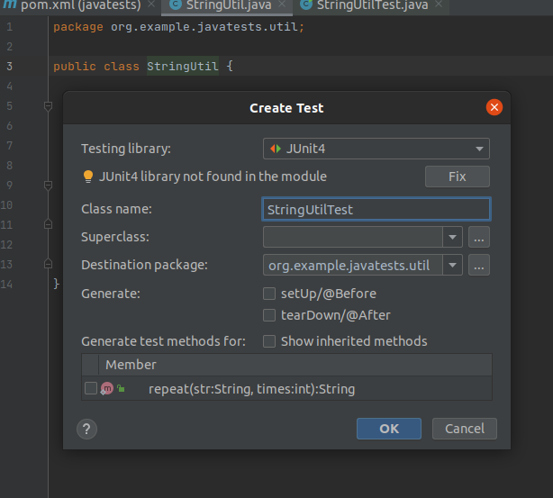

Se crea una nueva Clase con el nombre de la Clase seleccionada agregandole la palabra *Test* al final.

En Intellij tenemos algunos **shortcut**
- `psvm` (Public Static Void Main) que nos crea automaticamente la función Main.
- `sout` -> `System.out.println();`
- `fori` -> Bucle For

Clase StringUtil
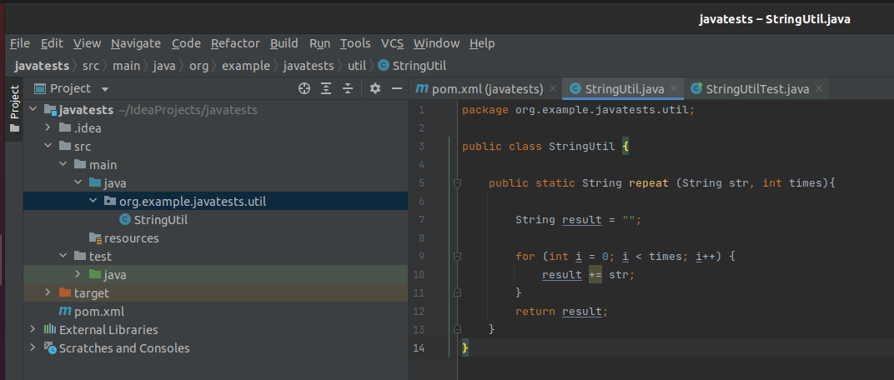

Clase StringUtilTest

---

### Clase 4 - Testing en Java con JUnit para verificar contraseñas
En esta clase se realizan Tests para verificar el nivel de seguridad del password.

**Shortcut**  
`Alt + Insert` -> en un espacio vacío para escribir un método de Test  
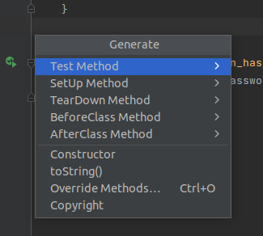

PasswordUtil
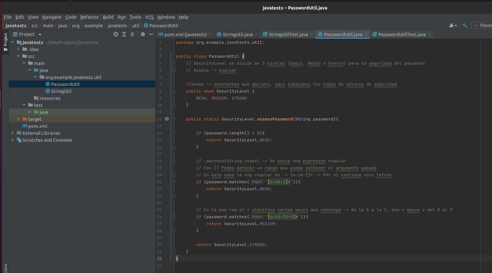

PasswordUtilTest
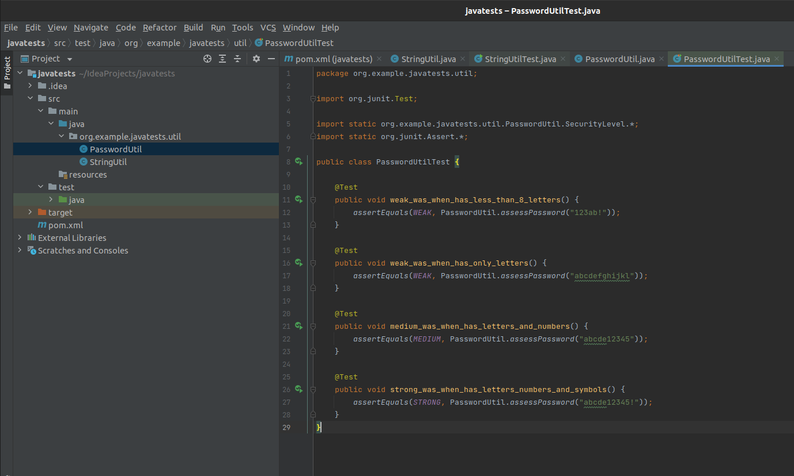

---

### Clase 5 - Creación de test unitario: lanzar una excepción para alertar sobre un error
Vamos a utilizar una excepción con la función **throw new RuntimeException("Error")** en lugar de la función System.out.println("Error") para identificar más fácil los errores.
Ahora, los mensajes tendrán un color diferente y pueden mostrarnos un poco más de información sobre los errores: ubicación, el resultado esperado, mensajes personalizados, entre otros.

**Shortcut**  
`thr` -> throw new

Algunas definiciónes de JUnit  
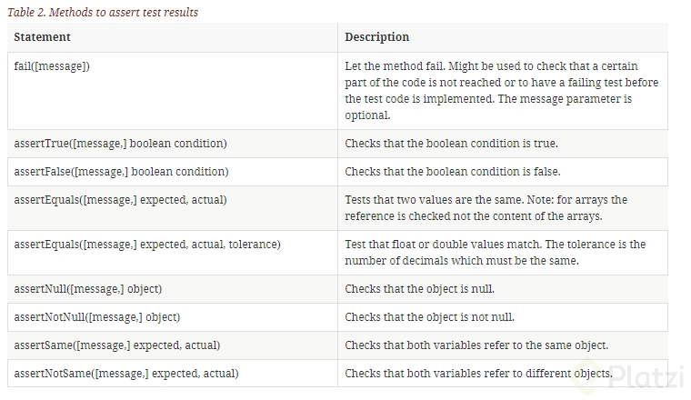

StringUtilTest  
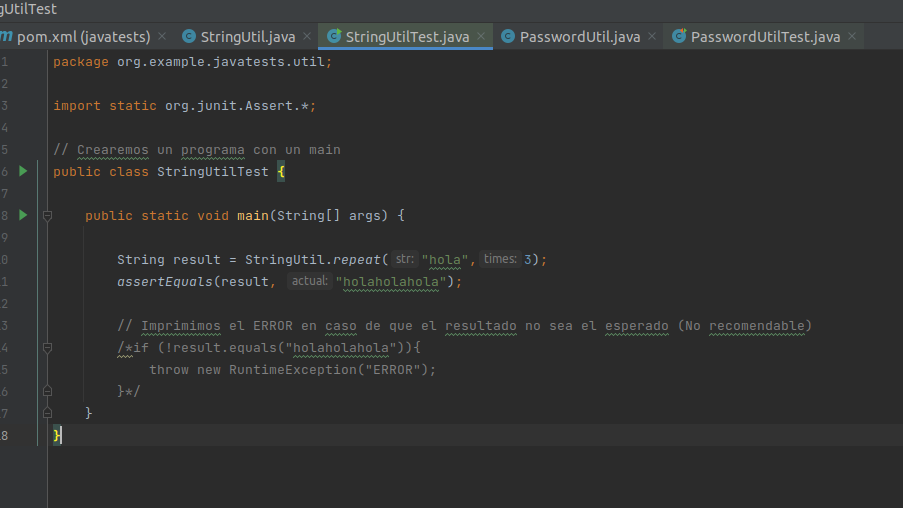

Yo ya tenia la libreria agregada por eso no me hizo falta crear desde cero esa función.

---

### Clase 6 - Test unitario con JUnit
Vamos a añadir Junit a nuestro proyecto copiando las siguientes líneas de código:
~~~
<dependencies>
  <dependency>
    <groupId>junit</groupId>
    <artifactId>junit</artifactId>
    <version>4.12</version>
     <scope>test</scope>
  </dependency>
</dependencies>
~~~

La función **assertEquals** de JUnit se encarga de comprobar que dos valores sean iguales, en este caso comprobar si nuestra función **repeat** retorna el valor esperado.

Debemos indicarle a JUnit mediante **@Test** que función va a realizar una prueba.

Con `Ctrl + P` -> Podemos ver los parámetros que pide una función.

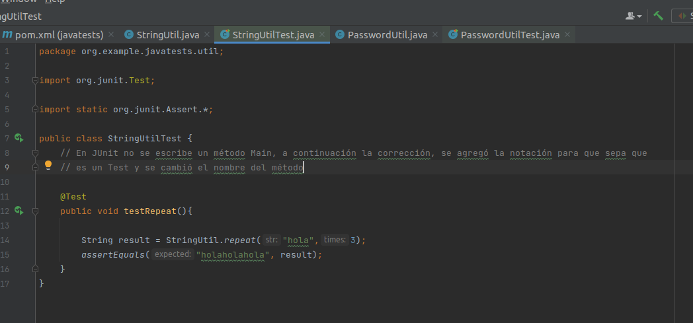

---

### Clase 7 - Organización de tests con JUnit
La forma correcta de separar nuestras pruebas es realizar cada una en su propia función, además, el nombre de la función debe describir que estamos probando.

Para indicarle a JUnit que esperamos una excepción lo debemos hacer de la siguiente forma:

~~~
@Test(expected = IllegalArgumentException.class)
~~~

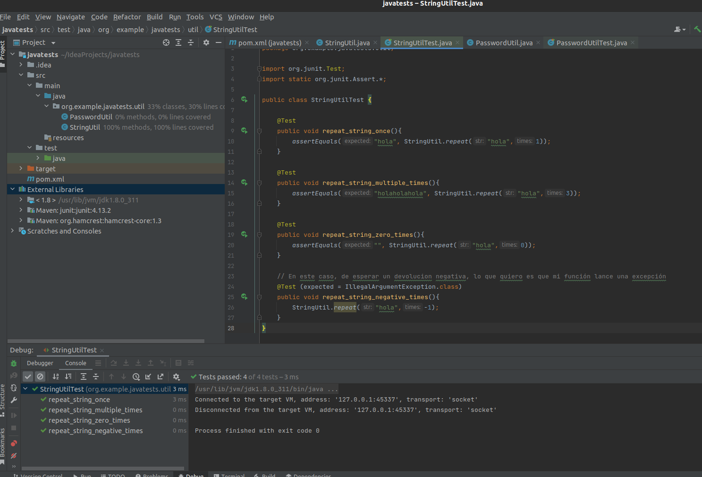
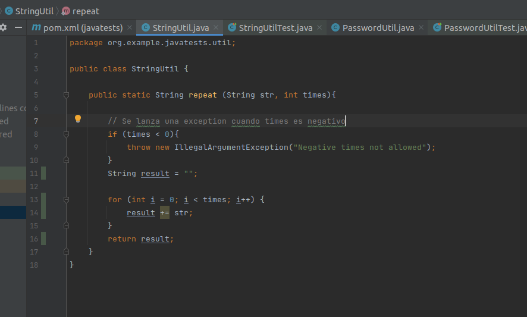

---

### Clase 8 - Test con Mockito para simular un dado
**Mockito** nos va a servir para simular clases mientras probamos, para añadirlo a nuestro proyecto debemos copiar las siguientes líneas de código:
~~~
<dependency>
  <groupId>org.mockito</groupId>
  <artifactId>mockito-core</artifactId>
  <version>2.23.4</version>
  <scope>test</scope>
</dependency>
~~~
Para instanciar un mock debemos utilizar la función **Mockito.mock()** e indicarle como parámetro la clase que va a simular.
Las funciones **assertFalse** y **assertTrue** tal como su nombre lo indican, sirven para comprobar si un valor es igual a **false** o **true** respectivamente.

Creamos la Clase *Player*, en un nuevo Package, con su constructor y una método que devuelve un booleano que dice si ganó o perdió.
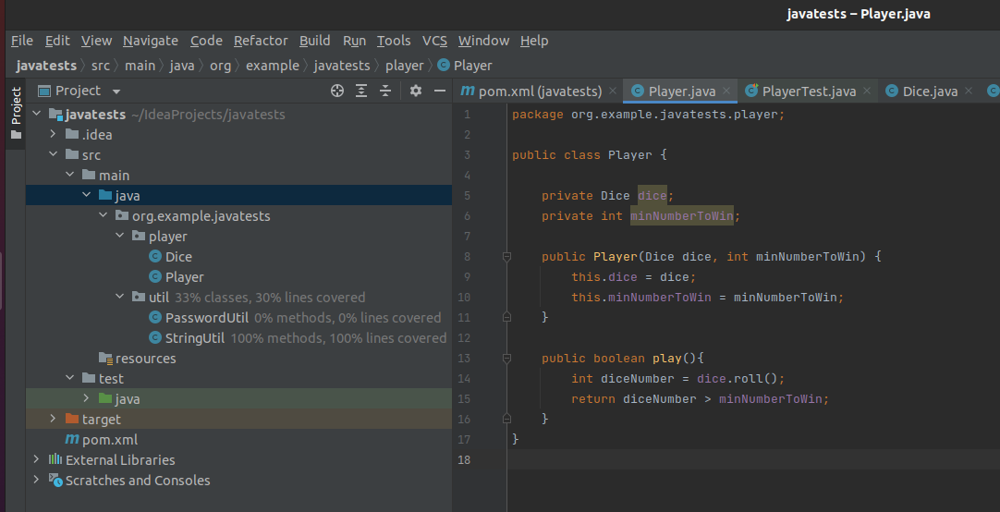

Creamos la Clase *Dice* que devuelve un numero random cuando se ejecuta la función *roll()*
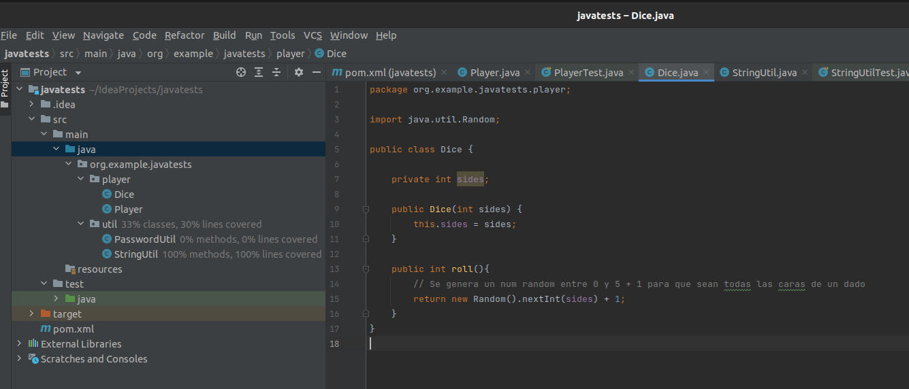

Creamos 2 tests (Perder y Ganar) utilizando *Mockito* para simular el dado y forzar el resultado que devuelve la clase Dice cuando se tira.
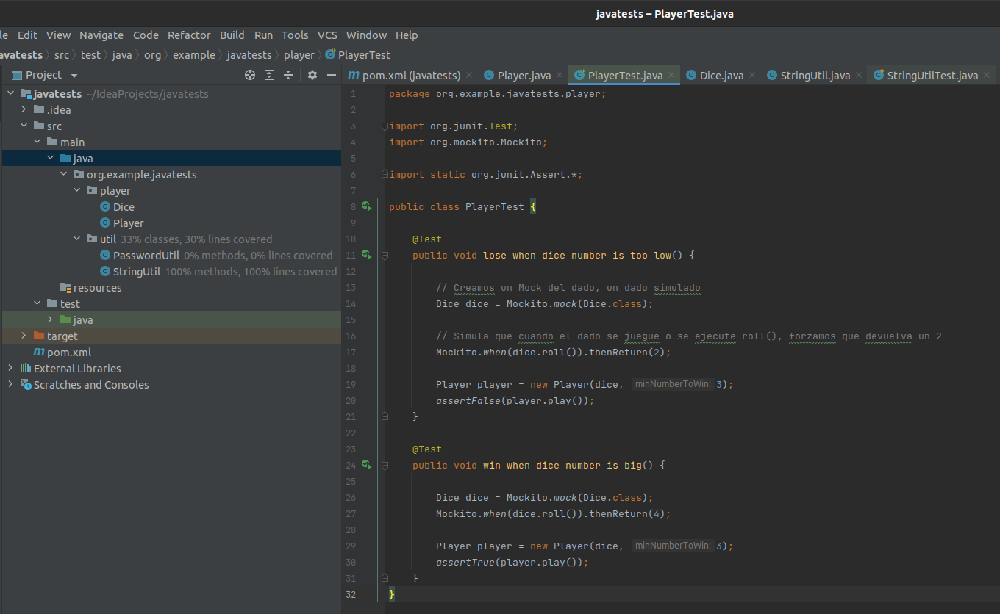

Podriamos decir que **Mockito** se usa para simular clases con las que se interactua o depende de ellas, muchas veces una clase depende de otros módulos y al momento de ejecutar un test,
no se sabe si el error proviene de la clase que ejecuta test o el modulo del cual depende.
Por ejemplo, si tengo una aplicación que usa una API para pedir datos sobre la temperatura de una zona específica, y en base a eso decir si la temperatura > 30°, usar bloqueador solar.
No puedo comprobar al momento del test si la API tendrá algún error y que mi test sea invalido. Debería usar Mockito para desacoplar la dependencia a la API y poder así testear mi clase
sola.

---

### Clase 9 - Test con Mockito: simular el uso de una pasarela de pago
Simular una pasarela de pagos nos ayuda a probar todas las funcionalidades de nuestra aplicación sin gastar dinero en pagos reales.

Creamos un nuevo Package ***Payments*** donde alojaremos nuestras clases y la interface ***PaymentGateway***

**Shorcut**  
`get` -> Intellij crea el método get() de alguna variable creada.

Clases creadas  
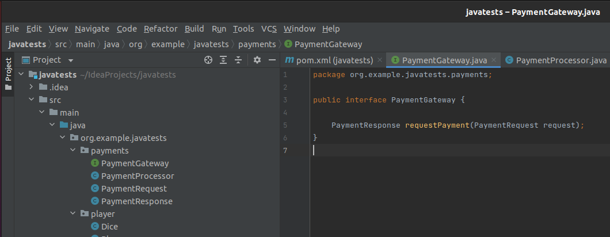

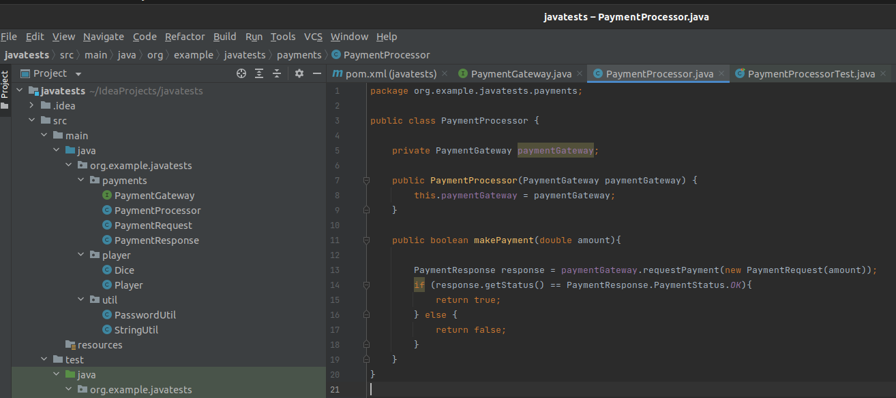

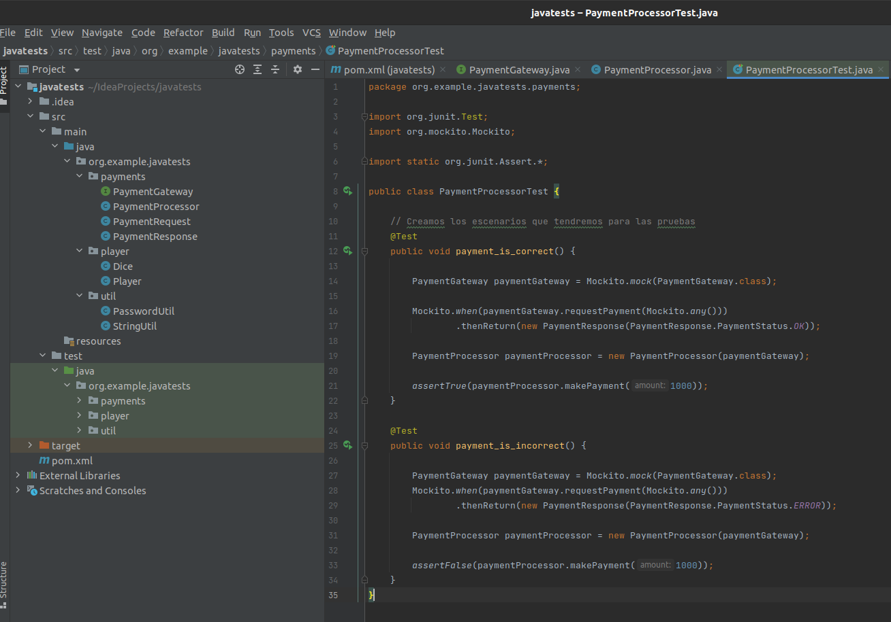

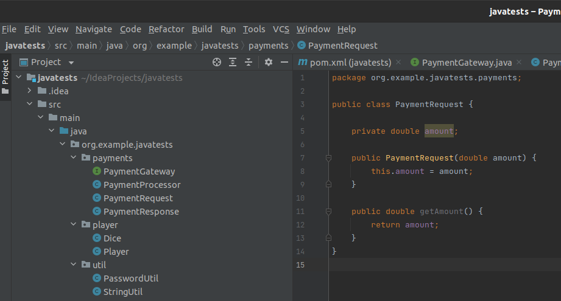

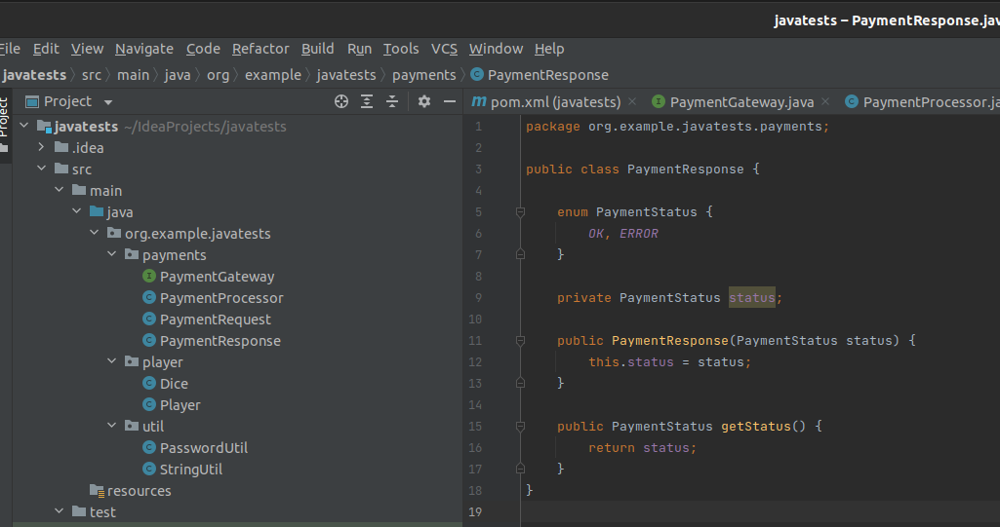

---

### Clase 10 - Análisis de los tests y mejoras
Nuestros test siguen un mismo proceso:
- Se preparan los objetos que vamos a probar.
- Llamamos al método que estamos probando.
- Comprobamos los resultados.  
Podemos reducir la cantidad de código moviendo las partes comunes de preparación a una función que se ejecute antes de cada prueba.
Con **@Before** le indicamos a JUnit la función que debe ejecutar antes de cada prueba.

En las imagenes vemos las separaciones de las partes de los tests  
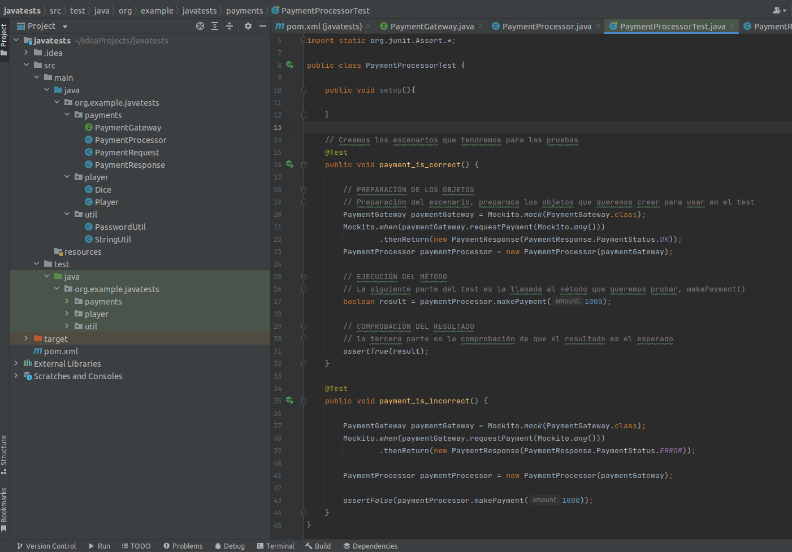

Y como a veces un código se puede repetir en varias pruebas, por eso se crea una función comun *(setup())*, en este caso para inicializar las variables.
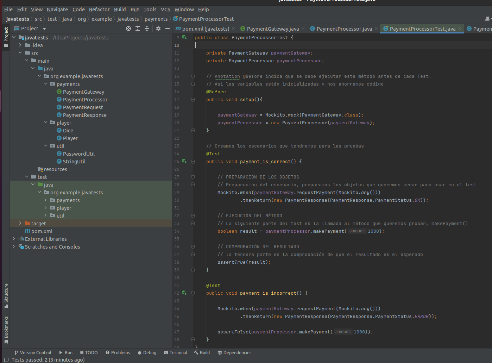

---

### Clase 11 - Reto 1: Crear la función isEmpty
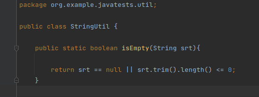

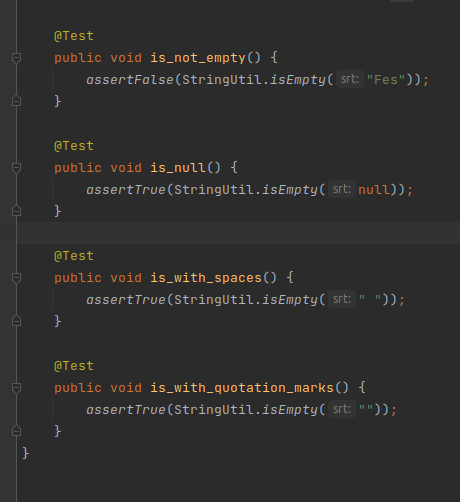

---

## Módulo 4 - TDD
### Clase 12 - TDD: Definición, beneficios, ciclos y reglas
El Test Driven Development (TDD) o desarrollo guiado por test, creado por Kent Beck, consiste en escribir primero los test antes que las clases permitiéndote ver si el diseño de una clase es la adecuada.

**El ciclo del TDD**
- Red: escribe un test que falle.
- Green: escribe el código necesario para que pase el test.
- Refactor: mejora el código.

Reglas
1. Sólo escribirás código de test hasta que falle.
2. Sólo escribirás código de producción para pasar el test.
3. No escribirás más código de producción del necesario.

Puedes combinar las reglas del TDD con su ciclo tal como hizo el profesor:
1. Red: Escribirás el mínimo de código test que falle.
2. Green: Escribirás el mínimo de código de producción que pase el test.
3. Refactor: sólo cuando los tests estén pasando.

---

### Clase 13 - Ejemplos de TDD: Calcular el año bisiesto
Descripción:
Los años bisiestos son años con 366 días en vez de 365 y suceden cada 4 años.

Para determinar si un año es bisiesto o no, debemos seguir las siguientes reglas o requerimientos:  
- Todos los años divisibles por 400 son bisiestos (1600, 2000, 2400)
- Todos los años divisibles por 100 pero NO por 400 NO son bisiestos (1700, 1800, 1900)
- Todos los años divisibles por 4 son bisiestos (1996, 2004, 2012)
- Todos los años que NO son divisibles por 4 NO son bisiestos (2017, 2018, 2019)

Algunas clases de pruebas terminan con la palabra Should en lugar de Test porque podemos entenderlas como frases cuando se leen en conjunto con los nombres de los métodos.

Por ejemplo, la clase ***DateUtilLeapYearShould*** con su método ***return_true_when_year_is_divisible_by_400*** pueden leerse como “Date utils leap year should return true when year is divisible by 400” o “Los utils para calcular el año bisiesto deben devuelven true cuando el año es divisible por 400”.

Utilizaremos las prácticas TDD  
Lo primero que hacemos es crear la Clase **DateUtil** con un método que que devuelve True, es el menor código que se puede escribir.  
Luego creamos un test para esa clase **DateUtilShould** y vamos ejecutando cada caso y refactorizando el código.

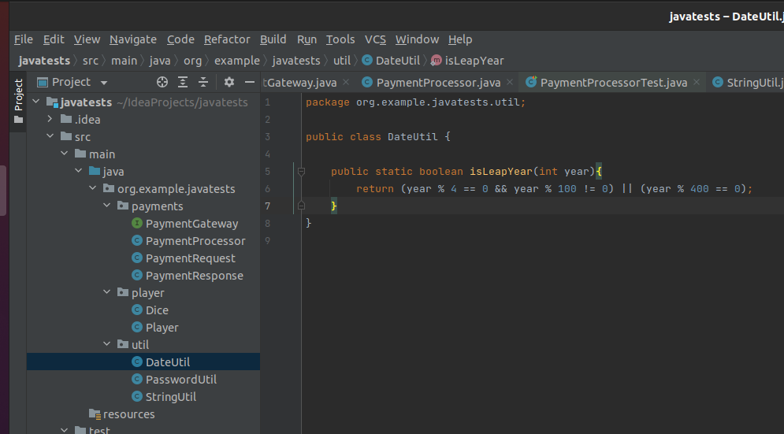

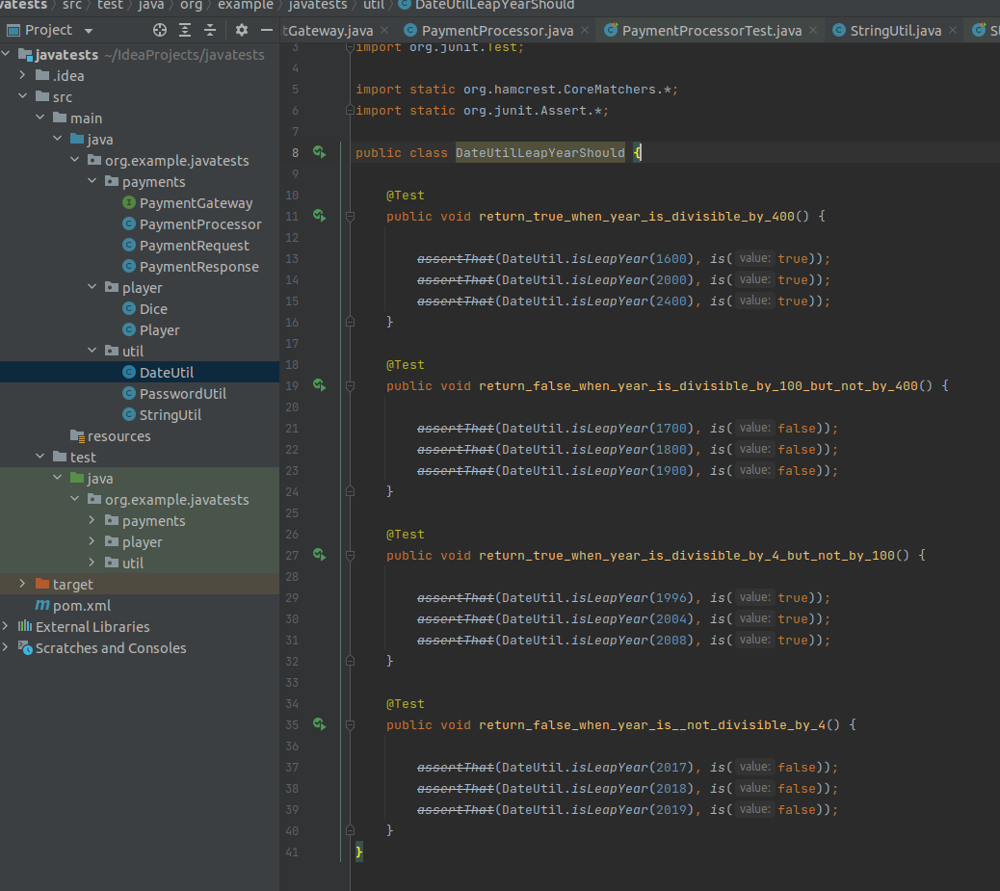

La clase Matchers es un comprobador, para esto usamos un comparador que se llama *is()* y este viene dentro de una librería llamada **Hamcrest**, en una clase llamada **CoreMatchers**.

[PDF](https://users.csc.calpoly.edu/~djanzen/courses/405W13/presentations/tdd.pdf) acerca de TDD

---

### Clase 14 - Ejemplos TDD: Cálculo de descuentos
Más ejemplos de aplicación de TDD

Shortcut `iter` -> Se construye un for

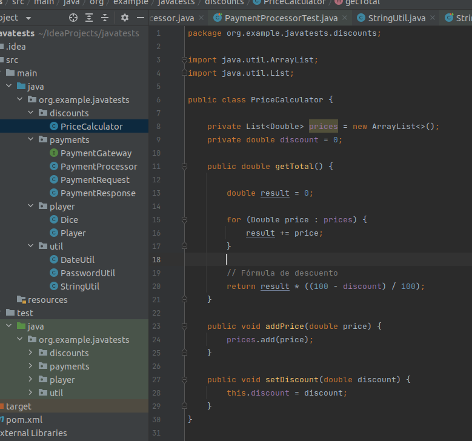

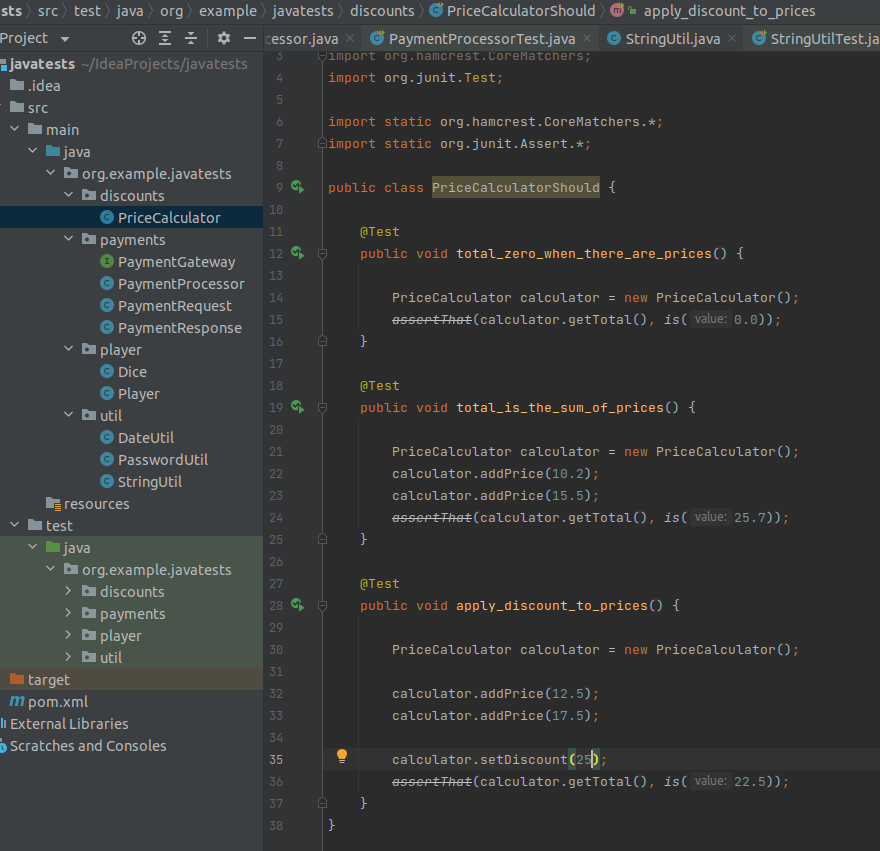

assertThat, actualmente esta deprecated. La forma de validar valores double es con assertEqueals(double expected, double actual, double delta). La funcion assertEquals(double expected, double actual) tambien está deprecated. Para los que no estén familiarizados con el valor “delta”, seria diciéndolo de una forma sencilla, _ el margen de error que vamos a permitir a la hora de ejecutar la igualdad_.
Por ejemplo: si comparamos 45.10 como valor esperado con un valor obtenido 45.19, si quieres un 100% de precisión, deberíamos pasar un delta con valor 0 (con esto estamos diciendo de que no vamos a permitir ningún valor por encima ni por debajo del valor esperado). Pero supongamos que estamos haciendo el test de una función que maneja grados y queremos permitir un margen de error de 0.10 grados. Este seria el valor que debemos pasar por delta, quedando nuestra assertEquals de la siguiente forma: assertEquals(45.10, 45.19, 0.10) este ejemplo pasaría el test y no nos daría error aunque el valor esperado y el valor obtenido sean distintos ya que estamos dentro del margen de error permitido.
Espero se entienda lo que quise explicar, me pareció interesante mencionar esto para que trabajemos fuera de métodos deprecated ya que son métodos destinados a desaparecer por varias razones que podemos verificar directamente en la api de referencia.

---

### Clase 15 - Reto 2: Práctica de TDD
Reto FizzBuzz  
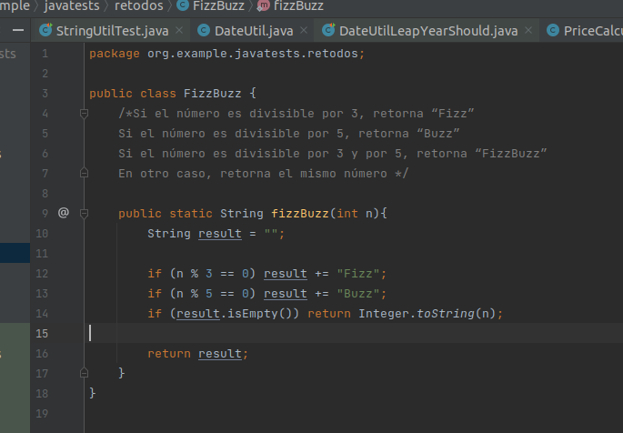

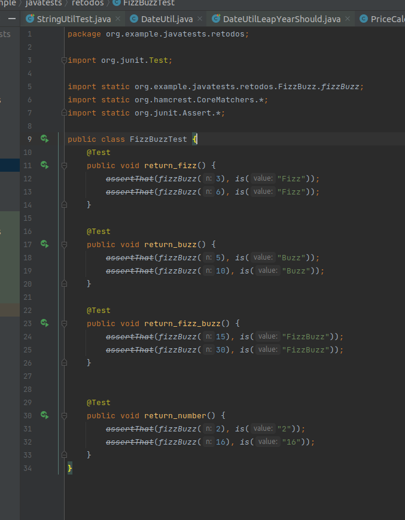

---

## Módulo 5 - Tests en una aplicación
### Clase 16 - Organización de una aplicación
Por lo general una aplicación se divide en:
- Interfaz: Se encarga de la comunicación con el exterior o un usuario.
- Negocio: Es la lógica de nuestra aplicación.
- Datos: Se encarga de guardar los datos de nuestra aplicación.
Cada capa se puede comunicar con otra, pero no conoce los detalles de implementación.

---

### Clase 17 - App de películas: Test de negocio
Acá creamos las siguientes clases y la interfaz para simular el repositorio de películas y en este caso filtrar por género.

**Movie**  
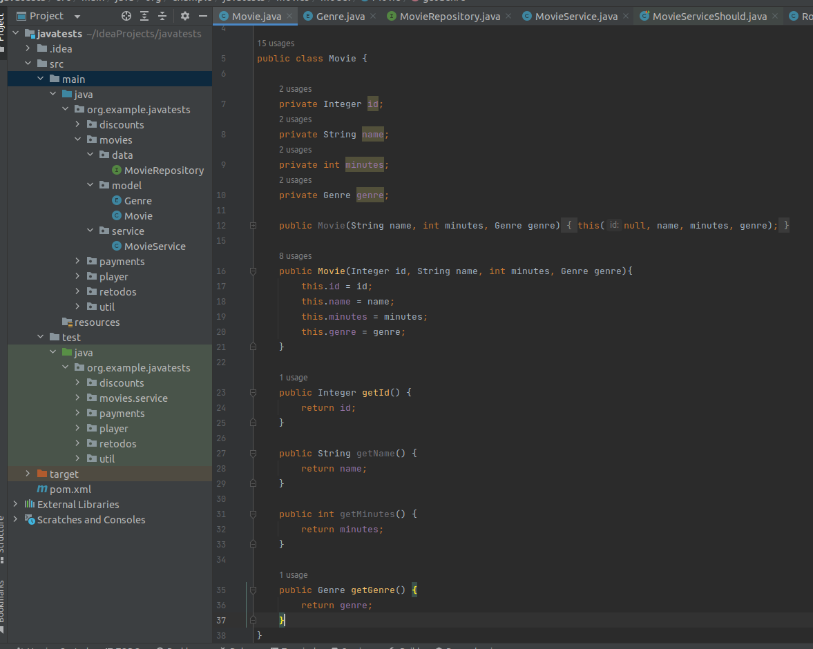

**Genre**  
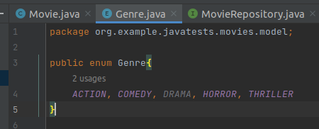

**MovieRepository**  
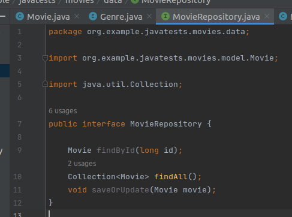

**MovieService**  
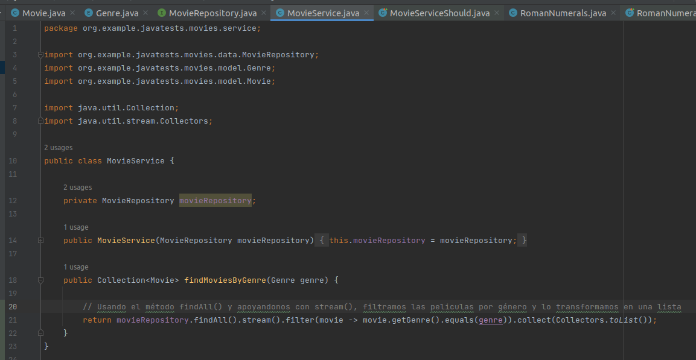

**MovieServiceShould**  
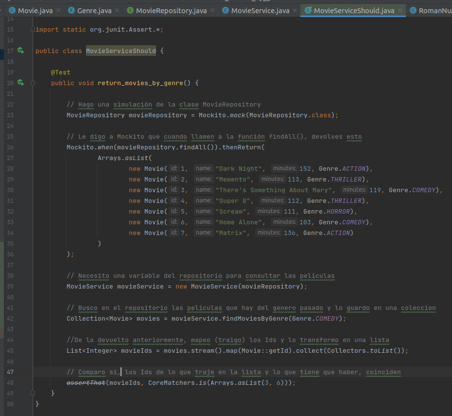

---

### Clase 18 - App de películas: Test de búsqueda de películas por su duración
Haciendo `Alt + Enter` (en mi caso `Fn + Alt + insert`) podemos crear el **SetUp Method** con la notacion de *@Before* para que todos los tests me carguen las películas.

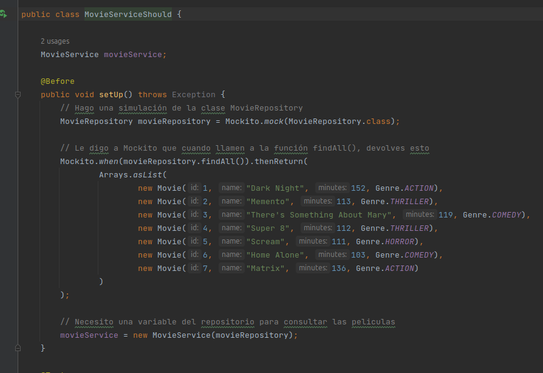

**Haciendo REFACTOR**  
Una forma de generar un método con Intellij IDEA es, seleccionando el trozo de código, que en ese caso se repite y queremos meter en una función, hacemos **Refactor** -> Extract ->
Method. El reemplazo es en cada trozo de código que se repite.

Cuando tenemos variables que se repiten, podemos hacer un *Inline* (Refactor -> Inline) para simplificar el código. Hay que hacerlo para cada variable.

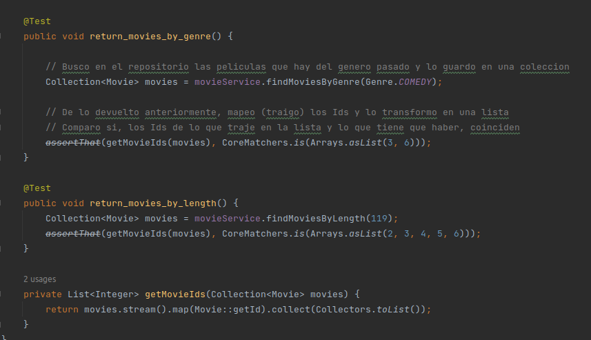

El método que agregamos a **MovieService**

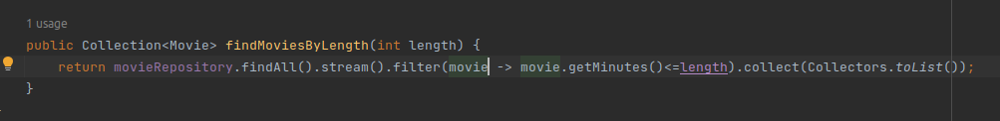

---

### Clase 19 - Creación de la base de datos y tests de integración con bases de datos
Realizaremos la implementación de la interface *MovieRepository*, para guardar y traer información de las películas.  
Para realizar un test de integración a la base de datos utilizaremos Spring y H2, asegúrate de copiar el siguiente código a tus dependencias:  

~~~
<dependency>
    <groupId>org.springframework</groupId>
    <artifactId>spring-jdbc</artifactId>
    <version>5.3.18</version>
</dependency>

<dependency>
    <groupId>com.h2database</groupId>
    <artifactId>h2</artifactId>
    <version>2.1.210</version>
</dependency>
~~~

`Alt + Enter` -> Implement interface. Para crear una clase que implemente la interface.  
Seleccionamos un nombre, en este caso termina con *Jdbc* porque vamos a usar *jdbc* que es la interfaz de Java para conexiones a base de datos e implementamos los 3 métodos de la interfaz.

La libreria de Spring-jdbc nos proporciona una clase muy util para la conexión con BD, llamada **JdbcTemplate**.

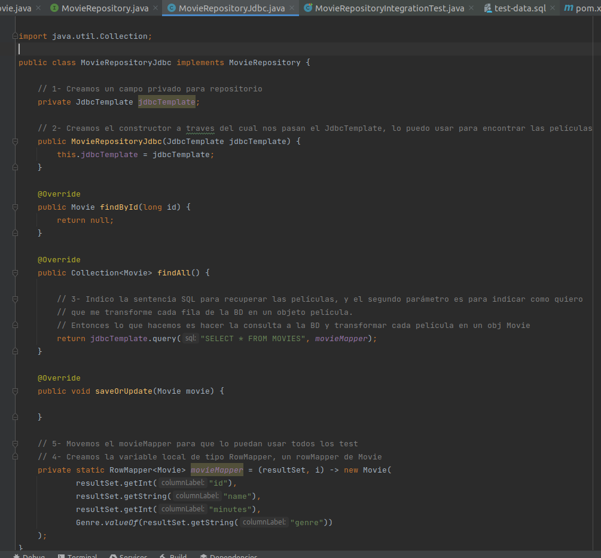

**RowMapper**  
Obtención de registros por Spring JdbcTemplate.  
Al igual que *ResultSetExtractor*, podemos usar la interfaz RowMapper para obtener los registros de la base de datos usando el método *query()* de la clase JdbcTemplate . En la ejecución
necesitamos pasar la instancia de RowMapper.  
La interfaz RowMapper permite mapear una fila de las relaciones con la instancia de la clase definida por el usuario. Itera el ResultSet internamente y lo agrega a la colección.  
[Fuente](https://www.javatpoint.com/RowMapper-example)

Cargar Script de SQL para que cree la DB y las películas.  
Lo podemos hacer con *ScriptUtils*, de Spring Jdbc, el método *executeSqlScript()* y le pasamos la conexión desde *DataSource* y *.getConection()*, también necesita un ClassPathResource,
que es básicamente indicarle la ruta donde tengo el archivo .sql, entonces carga el ese archivo script y me va a crear la DB.

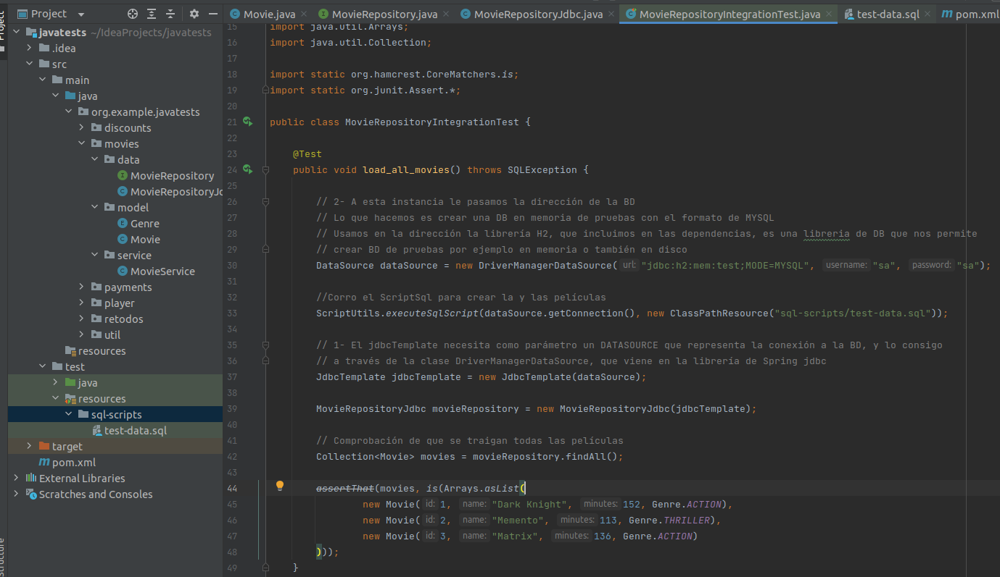

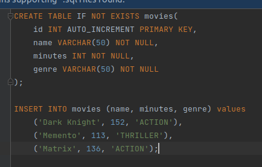

Java necesita el método equals para poder comparar objetos correctamente, por ello debemos añadirlos a nuestra clase.

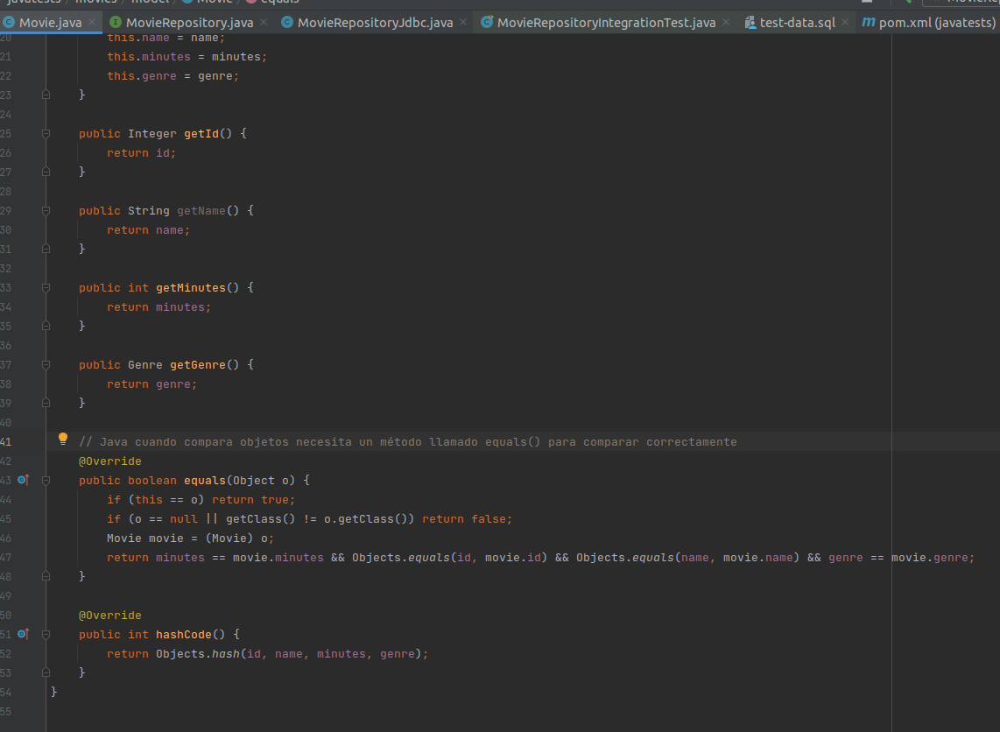

---

### Clase 20 - Test de integración con bas de datos: Guardar películas y búsqueda de películas individuales
Por el momento, nuestras pruebas están cargando varias veces la información de la base de datos y vamos a solucionar este problema creando una función que borre la información. Para esto,
debemos usar la instrucción @After para que JUnit ejecute la función cada vez que termina de hacer un test.

Buscaremos películas por ID, y para empezar moveremos la carga de DB, inicialización y creación de repository. Creamos un *setUp()* que se ejecuta antes de cada test.

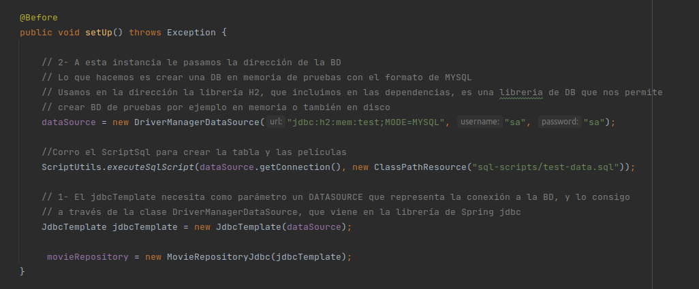

`queryForObject()` -> Devuelve solo un objeto y no una Colección como con solo **query()**, le pasamos la query para filtrar la DB y le pasamos como parámetro el id, que tiene que ser un
array de Object. También necesitamos indicar el Rowmapper, que es el que transformará los datos de la DB en un objeto Java.

**Implementación de métodos**  
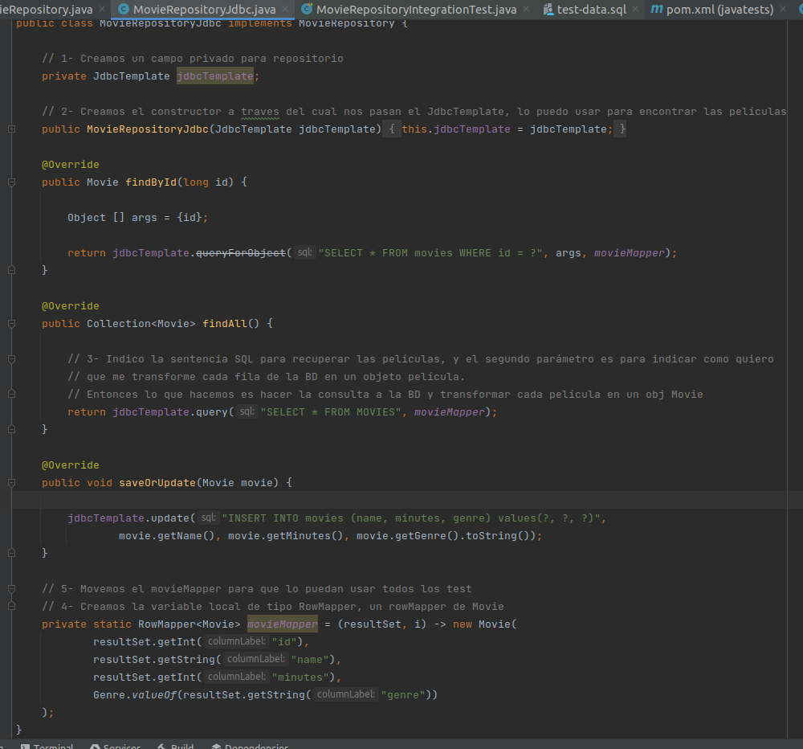

Al momento de probar los test, salta que *findAll()* devuelve muchas películas, para evitar esta acumulación tenemos que limpiar la DB cuando finalicen los test, similar a *@Before* pero
con la notación **@After**, hay un shortCut `Fn + Alt + insert` -> TearDown Method.

**Tests**  
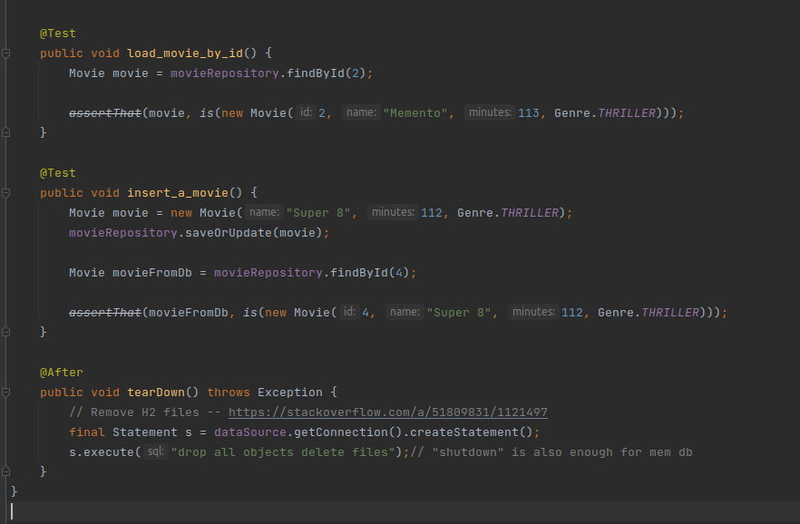

También se probó insertar una película en la DB.

---

### Clase 21 - Reto 3: Nuevas opciones de búsqueda

---

## Módulo 6 - Requerimientos y tests
### Clase 22 - Test a partir de requerimiento

---

### Clase 23 - Reto 4: Búsqueda por varios atributos

---

## Módulo 7 - Conclusiones
### Clase 24 - Resumen y conclusiones

---