# Curso de Fundamentos de Java Spring Boot
Índice
-
- [Módulo 1 - Introducción a Spring Boot](#módulo-1---introducción-a-spring-boot)
    - [Clase 1 - ¿Qué es Spring Boot?](#clase-1---¿qué-es-spring-boot)
    - [Clase 2 - Características principales de Spring Boot](#clase-2---características-principales-de-spring-boot)
    - [Clase 3 - Instalación de entorno de desarrollo: Windows](#clase-3---instalación-de-entorno-de-desarrollo-windows)
    - [Clase 4 - Instalación de entorno de desarrollo: macOS](#clase-4---instalación-de-entorno-de-desarrollo-macos)
    - [Clase 5 - Instalación de entorno de desarrollo: Ubuntu](#clase-5---instalación-de-entorno-de-desarrollo-ubuntu)
- [Módulo 2 - Dependencias en Spring Boot](#módulo-2---dependencias-en-spring-boot)
    - [Clase 6 - ¿Qué es una dependencia?](#clase-6---¿qué-es-una-dependencia)
    - [Clase 7 - Inversión de control y el patrón de inyección de dependencias](#clase-7---inversión-de-control-y-el-patrón-de-inyección-de-dependencias)
    - [Clase 8 - Autoconfiguration y runtime](#clase-8---autoconfiguration-y-runtime)
    - [Clase 9 - Anotaciones para indicar dependencias en Spring Boot](#clase-9---anotaciones-para-indicar-dependencias-en-spring-boot)
    - [Clase 10 - Creación de proyecto bajo arquitectura de dependencias](#clase-10---creación-de-proyecto-bajo-arquitectura-de-dependencias)
    - [Clase 11 - Inyección de dependencia "Component"](#clase-11---inyección-de-dependencia-"component")
    - [Clase 12 - Ejemplo de creación de dependencia propia](#clase-12---ejemplo-de-creación-de-dependencia-propia)
- [Módulo 3 - Configuración general de Spring Boot](#módulo-3---configuración-general-de-spring-boot)
    - [Clase 13 - Cambio de puerto y path](#clase-13---cambio-de-puerto-y-path)
    - [Clase 14 - Uso de properties y valores](#clase-14---uso-de-properties-y-valores)
    - [Clase 15 - Uso de properties con ejemplo de generación de POJO](#clase-15---uso-de-properties-con-ejemplo-de-generación-de-pojo)
    - [Clase 16 - Qué son los logs y cómo usarlos](#clase-16---qué-son-los-logs-y-cómo-usarlos)
- [Módulo 4 - JPA con Spring y Spring Data](#módulo-4---jpa-con-spring-y-spring-data)
    - [Clase 17 - Modelado de entidades con JPA](#clase-17---modelado-de-entidades-con-jpa)
    - [Clase 18 - Configuración de datasource con properties y classes](#clase-18---configuración-de-datasource-con-properties-y-classes)
    - [Clase 19 - Registro en base de datos con JpaRepository](#clase-19---registro-en-base-de-datos-con-jparepository)
    - [Clase 20 - Uso de JPQL en anotación query](#clase-20---uso-de-jpql-en-anotación-query)
    - [Clase 21 - Uso de anotación value para apuntar a properties](#clase-21---uso-de-anotación-value-para-apuntar-a-properties)
    - [Clase 22 - Obtención de información usando Query methods](#clase-22---obtención-de-información-usando-query-methods)
    - [Clase 23 - Uso de Query methods con Or, and, OrderBy, Between, Sort](#clase-23---uso-de-query-methods-con-or-and-orderby-between-sort)
    - [Clase 24 - Uso de JPQL con named parameters](#clase-24---uso-de-jpql-con-named-parameters)
    - [Clase 25 - Uso de anotación transactional](#clase-25---uso-de-anotación-transactional)
    - [Clase 26 - Rollback con la anotación transactional](#clase-26---rollback-con-la-anotación-transactional)
- [Módulo 5 - REST con Spring Boot](#módulo-5---rest-con-spring-boot)
    - [Clase 27 - CRUD bajo arquitectura REST](#clase-27---crud-bajo-arquitectura-rest)
    - [Clase 28 - Métodos CREATE, UPDATE y DELETE](#clase-28---métodos-create-update-y-delete)
    - [Clase 29 - Probando la API REST](#clase-29---probando-la-api-rest)
    - [Clase 30 - Pagination con Spring Boot](#clase-30---pagination-con-spring-boot)

---

[PDF](https://static.platzi.com/media/public/uploads/slides-fundamentos-springboot_d43cc29e-5845-48a5-a0a2-f182c2ce13dc.pdf)

# Módulo 1 - Introducción a Spring Boot
## Clase 1 - ¿Qué es Spring Boot?
- **Spring Boot** es un proyecto basado en **Spring**, no es lo mismo que **Spring**. Es un proyecto que forma parte del core de **Spring**, al igual que Spring Cloud, Spring Security, Spring Data, etc.
- El objetivo principal es que sólo te centres en correr la aplicación, sin preocuparte por temas de configuración, etc.
- Tiene la gran ventaja poder integrar librerías de terceros de manera muy sencilla.
- No tendremos que preocuparnos por configuraciones a nivel de XML, sólo configuraciones mínimas a nivel de properties (ponerle el puerto, etc).
- No tendremos que preocuparnos de desplegar nuestra aplicación en un servidor web local cuando queramos hacer pruebas, Spring Boot también contempla esto y lleva incorporado un servidor web dónde se desplegará nuestra aplicación automáticamente.

---

## Clase 2 - Características principales de Spring Boot
Características principales de **Spring Boot**:
- **Independiente**: no tenemos que preocuparnos de las dependencias del core de Spring ni de la compilación de estas.
- **Incrustado Tomcat, Jetty o Undertow**: Spring Boot trae consigo un servidor web como los tres mencionados donde podemos correr nuestra aplicación sin preocuparnos de generar un artefacto `WAR` o `JAR` y desplegarlo nosotros mismos.
- **Proporción de dependencias**: no debemos preocuparnos por las configuraciones de dependencias de terceros o del core de Spring, Spring Boot se encargará de inyectar todo lo necesario.
- **Sin generación de XML**: No debemos preocuparnos de configuración XML para que nuestra aplicación funcione.
- **Métricas de salud del aplicativo**: podemos validar el estado de un servicio desplegado, sus dependencias, estado de memoria, magnitud de configuración, etc.

---

## Clase 3 - Instalación de entorno de desarrollo: Windows

---

## Clase 4 - Instalación de entorno de desarrollo: macOS

---

## Clase 5 - Instalación de entorno de desarrollo: Ubuntu

---

# Módulo 2 - Dependencias en Spring Boot
## Clase 6 - ¿Qué es una dependencia?
- Objetos definidos como una funcionalidad, sin la cual, los otros objetos no podrían trabajar, ya que dependen de ella.  
Por ejemplo, un volante es una dependencia de un vehículo, ya que sin volante, no podemos conducir el vehículo.
- Las dependencias nos permiten modularizar nuestra aplicación, lo cual nos beneficia en las pruebas unitarias.

**Alta cohesión**: Involucra que la entidad ejecute sus acciones sin involucrar otra clase o entidad.

**Bajo acoplamiento**: Hablamos de acoplamiento bajo cuando existe una independencia entre los componentes entre si, por el contrario un alto acoplamiento es cuando tenemos varias dependencias relacionadas a un solo componente.  
Entonces podemos afirmar que en la definición de un buen diseño de software se debe tener una ALTA COHESIÓN y un BAJO ACOPLAMIENTO.

---

## Clase 7 - Inversión de control y el patrón de inyección de dependencias
[Video explicativo](https://www.youtube.com/watch?v=-Cs1HN6pEg4&list=PLU8oAlHdN5Blq85GIxtKjIXdfHPksV_Hm&index=7)

**Inversion of Control (IoC)**: Delegando responsabilidades  
Se refiere a todo aquel diseño de software cuyo propósito obedece a la necesidad de querer controlar el flujo de ejecución de este, de forma automática y transparente, es decir, ceder el control de ese flujo a un “agente externo”, normalmente un framework.

"No nos llame, nosotros lo llamamos."  
Se refiere a la transferencia del control del flujo de un programa a un contenedor o framework.
- En un website o una app móvil el contenedor sería el usuario.

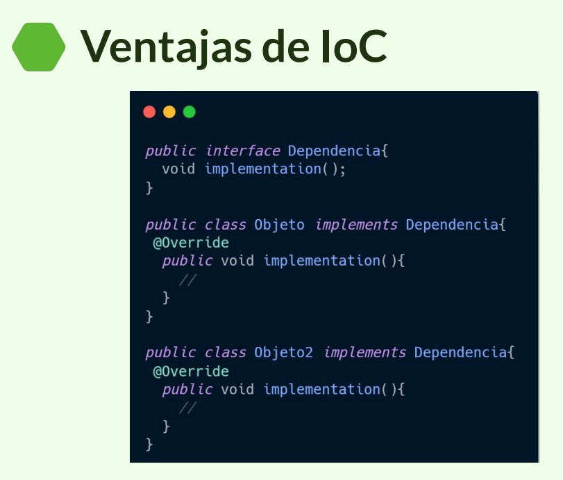

**Ventajas**
- Facil testing por componentes o mocks de dependencias.
- Mayor modularización.
- Desacoplamiento cuando lo objetos cuentan con sus dependencias.
- Segregación de interfaces.

IoC en el contexto de spring boot
- Los objetos que son administrados por el contenedor, spring boot los denomina `beans`. Un `bean` seria los objetos administrados por el usuario en un website.
- Un bean es un objeto el cual es instanciado, ensamblado y administrado por el contenedor de spring IoC.

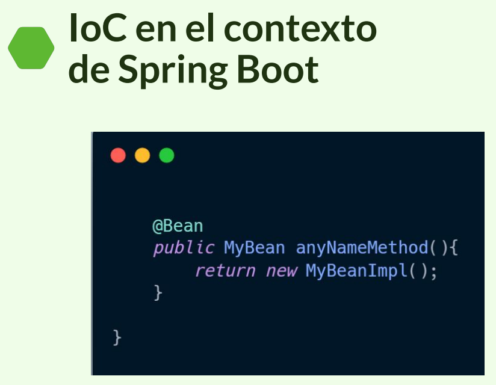

**Dependency Injection (DI)**: Inyectando componentes  
`DI` es un patrón de diseño que sirve para “inyectar” componentes a las clases que tenemos implementadas. Esos componentes son contratos que necesitan nuestras clases para poder funcionar, de ahí el concepto de “dependencia”. La diferencia sustancial en este patrón de diseño es que nuestras clases no crearán esos objetos que necesitan, sino que se les suministrará otra clase “contenedora” perteneciente al Framework DI que estemos utilizando y que inyectarán la implementación deseada a nuestro contrato, y todo ello sin tener que hacer un solo `new`.

Es el patrón que utiliza IoC para utilizar las dependencias anteriormente instanciadas por el contenedor de spring.

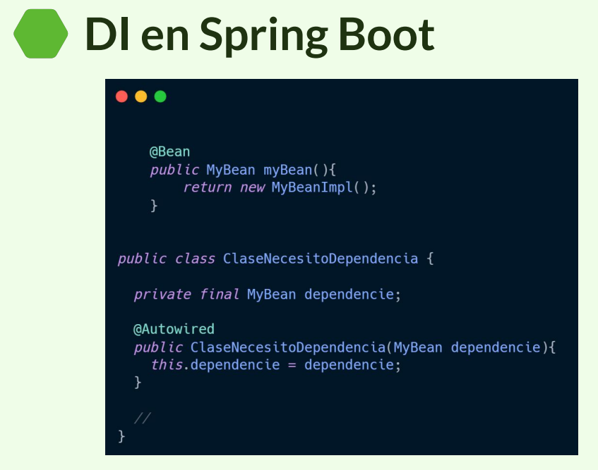

Un `bean` es una dependencia, un `método`, un `objeto`.  
Los `beans` básicamente son módulos desarrollados en Spring estos se encargan de brindarnos toda la lógica que necesitamos para nuestra aplicación. Ejemplo: Si necesitamos referenciar que nuestra clase es un modelo hacemos uso de el `bean` `@entity` . Esto nos permite usar propiedades creadas para este tipo de modulo que nos agilizan nuestro desarrollo. Al hacer inversión de control nosotros al llamar esos `beans` lo que hacemos es referenciar módulos funcionales creados por spring. Spring boot nos facilita el fácil instanciamiento de estos a nuestra aplicación.

Spring Boot es el proyecto de Spring, y Spring se encarga de manera abstracta de iniciarlizar los `beans`.

---

`@Autowired` es muy imporante al momento de autocablear nuestras soluciones, no es tan recomendada para nuestros proyectos, pero la verdad la idea es hacer el código menos verboso y esto simplifica muchísimo el código fuente.
Por otra parte, `@Qualifier` es una anotación que sirve para especificar el tipo de dependencia se esta inyectando con la funcionalidad de diferenciar nuestras abstracciones o uso de clases que implementan una misma interfaz (Según el principio SOLID) porque si usamos concreciones no seria util usar Qualifiers en la mayoría de los casos.

---

## Clase 8 - Autoconfiguration y runtime
Configura automáticamente tus aplicaciones basadas en dependencias `JAR` que agregaste mediante el `pom.xml`, pero si nosotros realizamos una configuración manual esta es priorizada por Spring Boot.

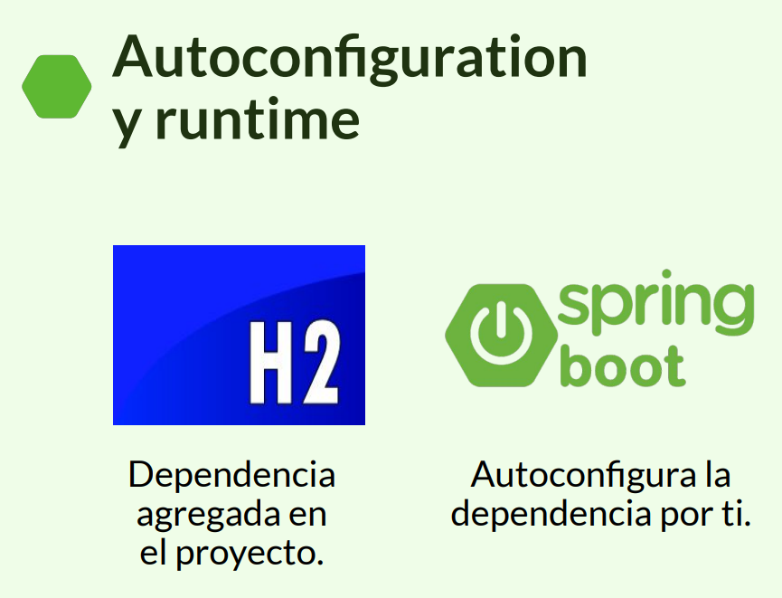

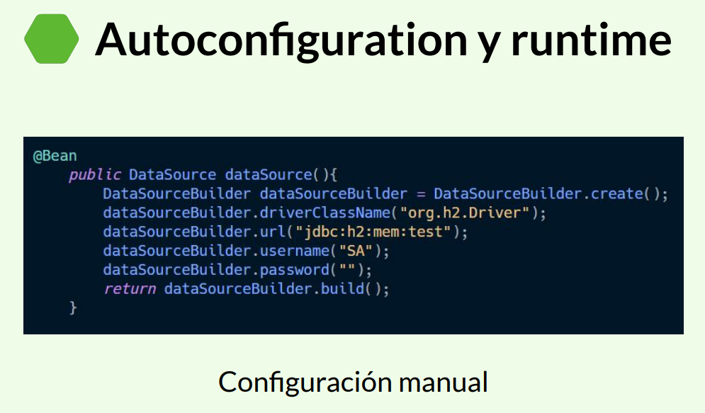

---

## Clase 9 - Anotaciones para indicar dependencias en Spring Boot
Una Anotación es una forma de añadir metadatos al código fuente `Java` que están disponibles para la aplicación en tiempo de ejecución o de compilación.

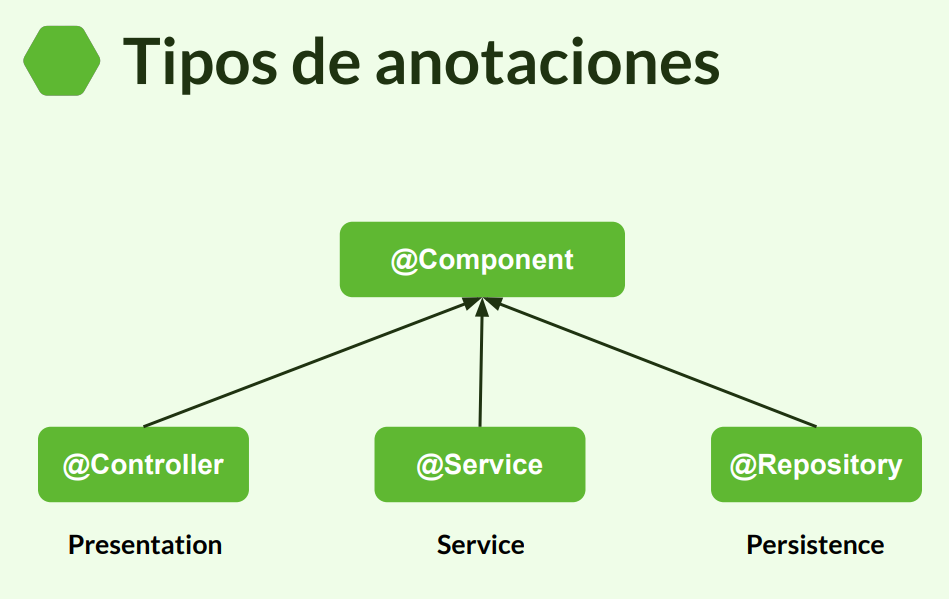

**TIPOS DE ANOTACIONES**
- @Controller: Para indicar que esta será la `clase` que gestionara las peticiones del usuario por `get`, `post`, `put`, `patch` o `delete`.
- @Service: Con esta notación especificamos que en esta `clase` se encontrara toda nuestra lógica de negocio, cálculos o llamadas a otras `API` externas.
- @Repository: Se usa para las `clases` o `interfaces` que funcionaran con el acceso a la base de datos.

Si nuestra `clase` o `interfaz` no tiene una especificación clara como `@Service`, `@Repository` o `@Controller`, simplemente recurrimos a `@Component` y le indicamos que sencillamente es un componente.

Por otro lado, no es estrictamente necesario que cumplas con colocar una notación especifica, pero es una buena practica.

---

Diferencias entre las anotaciones:
- @Component: Es un bean que es reconocido por el componentScan de Spring para su inicialización.

Todas las demás son meta anotaciones de @Component, pero con algunas diferencias:
- @Repository captura automáticamente las excepciones con la BD por medio de DataAccessExeption.
- @Sevice Solo se nombra para separación de responsabilidades.
- @Controller Igual que el anterior, pero además indica a spring que se trata de una clase que sirve métodos HTTP.

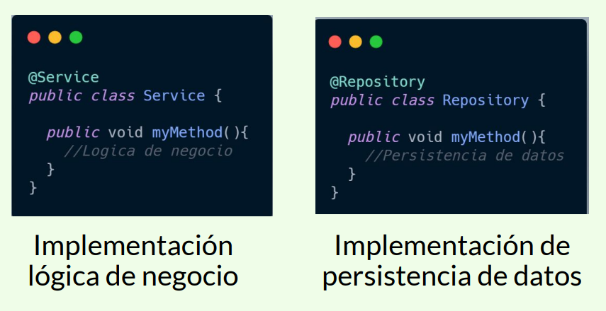

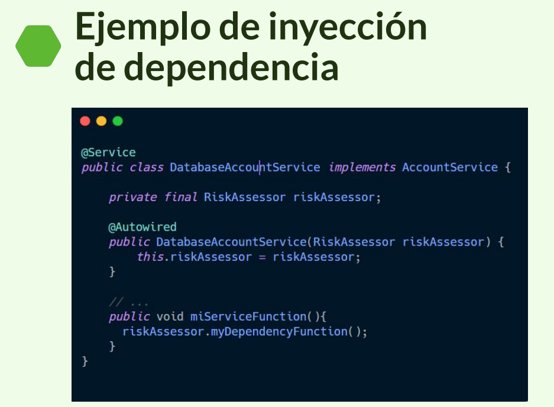

---

## Clase 10 - Creación de proyecto bajo arquitectura de dependencias
[Inicializador](https://start.spring.io/) por defecto para crear proyectos con Spring Boot.

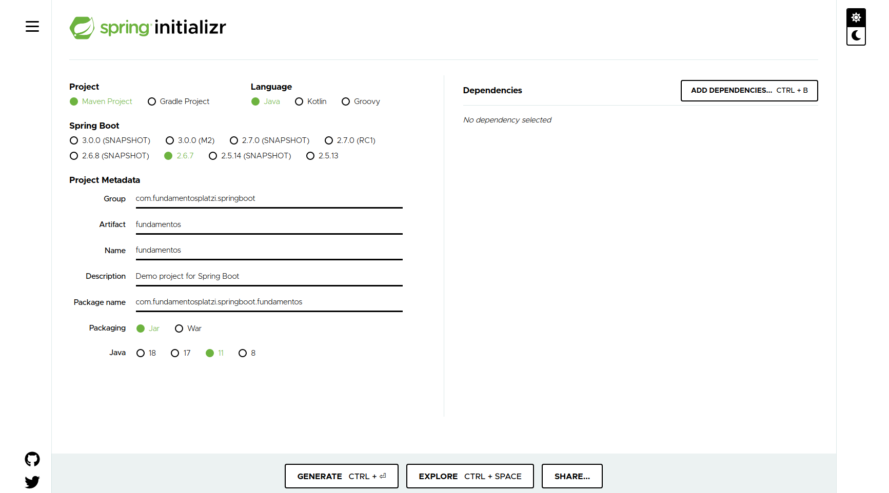

Descargamos el `ZIP`, lo descompriminos y lo abrimos con **Intellij**. Creamos el repositorio para el proyecto en GitHub, y las carpetas de la anotaciones dentro del sistema.

---

## Clase 11 - Inyección de dependencia "Component"
Creamos las siguientes `Clases`, inyactamos dependencia y probamos.

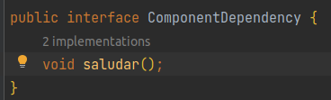

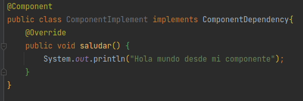

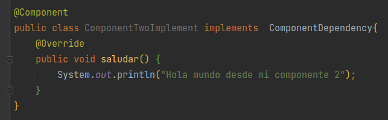

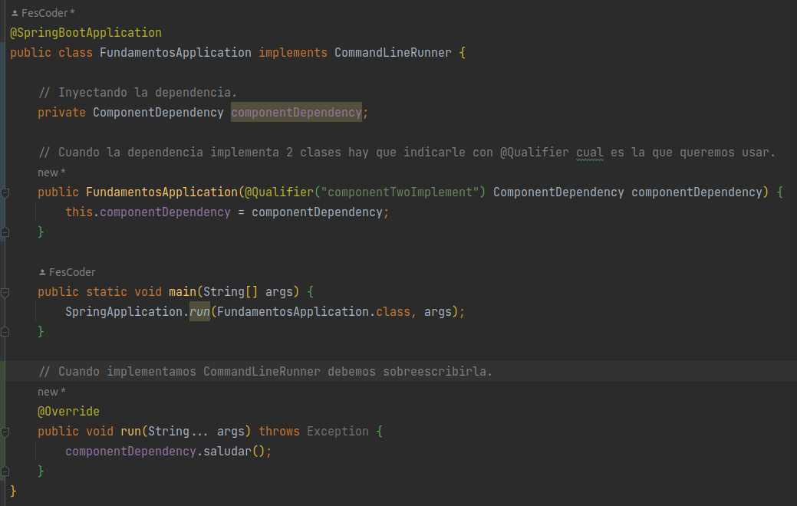

---

## Clase 12 - Ejemplo de creación de dependencia propia
Primero creamos una `interfaz` que tendrá una `función` para implementar.

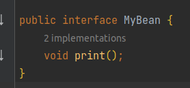

Creamos la `Clase` que implemente la `interfaz`.

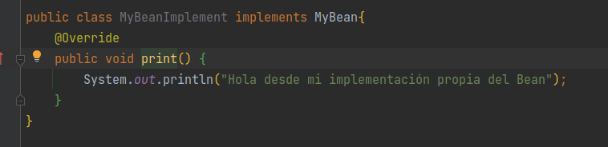

Podemos tener otra `Clase` con otra implementación.

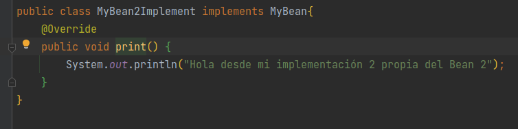

Creamos una `clase` de `configuración` para administrar nuestras `dependencias`.  
Ahora como tenemos 2 implementaciones diferentes, vamos a decir cual es la que se ejecutará.

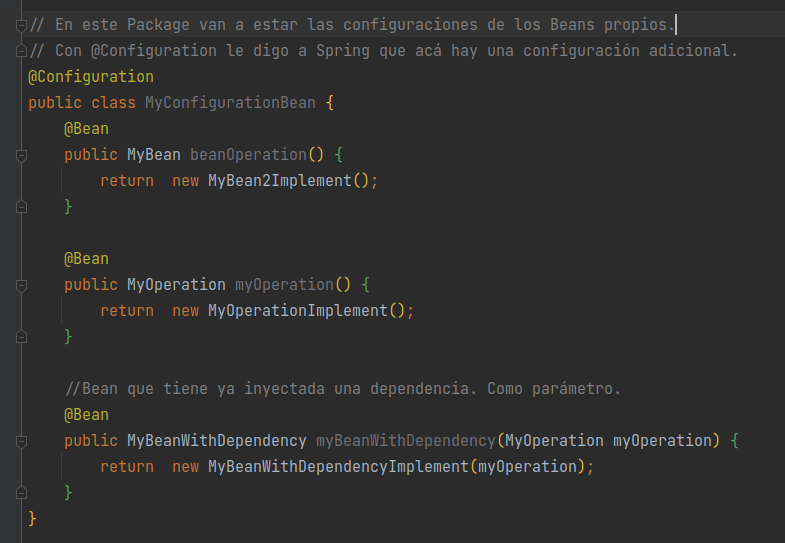

En `FundamentosApplication`, nuestro `main`, instanciamos y ejecutamos.  
Para inyectar la dependencia, crear una `variable` y agregarlo al `constructor`.

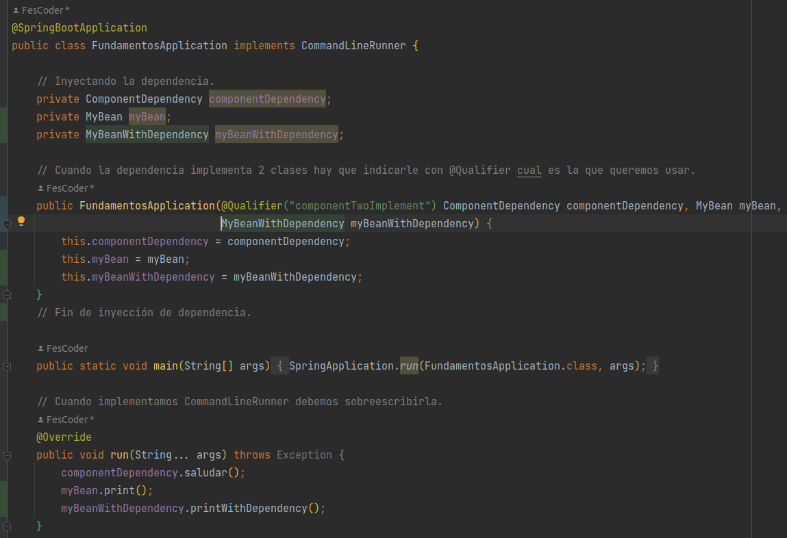

**Una dependencia dentro de otra**  
En este caso tenemos a `MyOperation` insertada en `MyBeanWithDependency`.

La `interface`

La `clase`

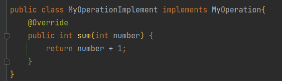

La `interface` `MyBeanWithDependency`

La `clase` donde se inyecta `MyOperation`

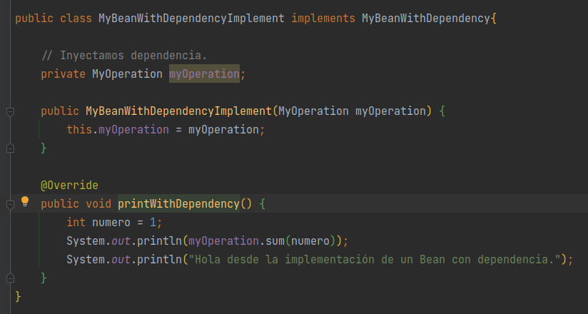

Diagrama secuencial de flujo.

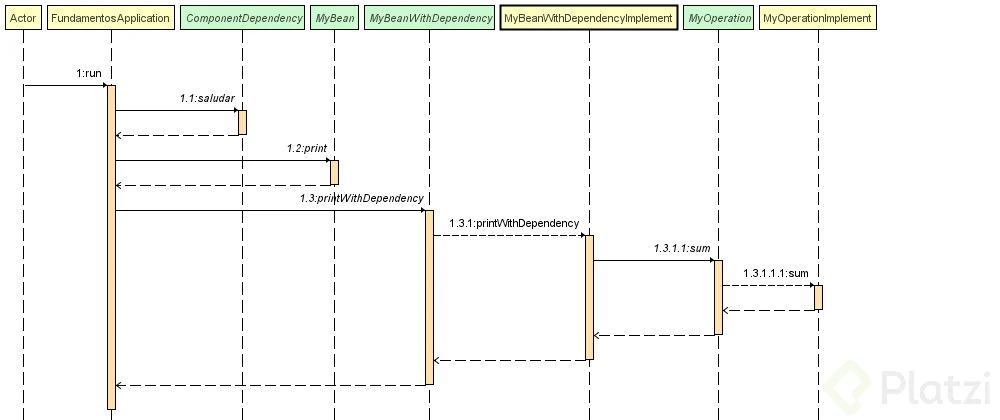

---

# Módulo 3 - Configuración general de Spring Boot
## Clase 13 - Cambio de puerto y path
Agregamos la dependencia al archivo `pom.xml`.  
Spring Boot se encarga de autoconfigurar e inicializar todas las dependencias.
~~~
<dependency>
	<groupId>org.springframework.boot</groupId>
	<artifactId>spring-boot-starter-web</artifactId>
</dependency>
~~~

Luego nos dirigimos a `application.properties` y acá lo que hacemos es cambiar el puerto de nuestra app, el path donde se mostrará el contenido y serán consumidos nuestros servicios.

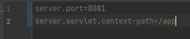

Luego creamos `TestController`, un `controlador` para probar el `puerto` y el `path`.

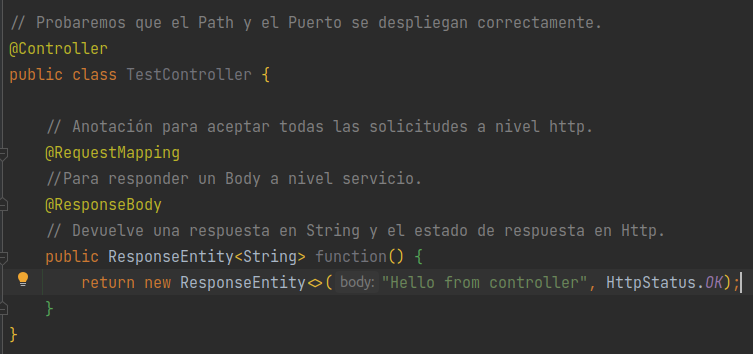

Desplegando la app. y viendo el navegador. Escribimos `http://localhost:8081/app/` y vemos que nos muestra el mensaje.

Este servicio lo estamos desplegando dentro de un servidor web o contenedor `servlet` embebido, el contendor actual por defecto es `Tomcat`.  
También vemos que todas las dependencias funcionan correctamente.

Agregaremos una nueva dependencia a `pom.xml` que nos dá herramientas para el desarrollo. 
~~~
<dependency>
    <groupId>org.springframework.boot</groupId>
    <artifactId>spring-boot-devtools</artifactId>
    <optional>true</optional>
</dependency>
~~~

Una de las herramientas que nos da esta dependencia es que podamos reinciar el servidor sin tener que volver a desplegar todo, es decir, una vez que hacemos cambios en el código fuente simplemente con buildear el archivo o reiniciando la app, ya se muestran los cambios.

---

## Clase 14 - Uso de properties y valores
Creamos 3 propiedades en `application.properties` que serán usadas dentro de un nuevo archivo de configuración.

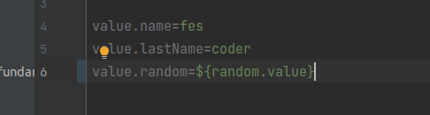

Creamos la nueva `clase` `GeneralConfiguration`

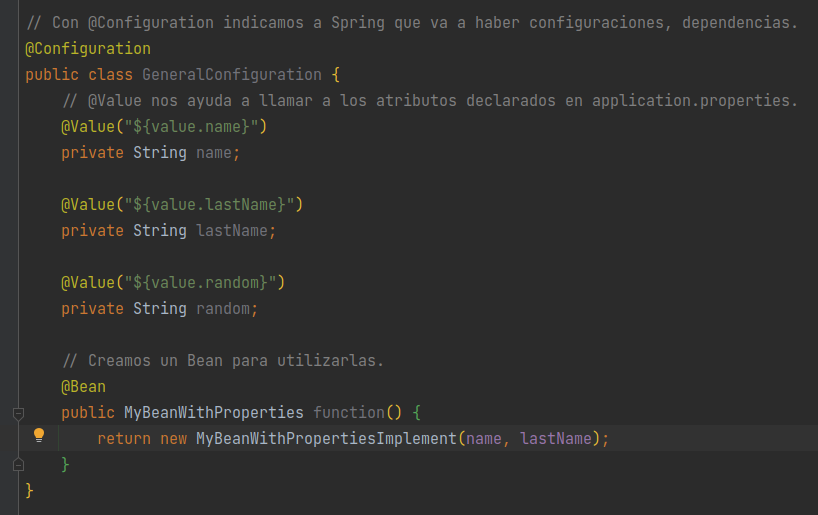

`@Configuration` indicamos a Spring que va a haber configuraciones, dependencias, etc.  
`@Value` nos permite llamar a los valores que inicializamos en `properties`

Creamos nuestro nuevo `Bean` con su interfaz y Clase que implementa.

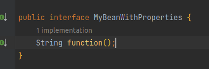

Luego, la ejecución en nuestro método principal.

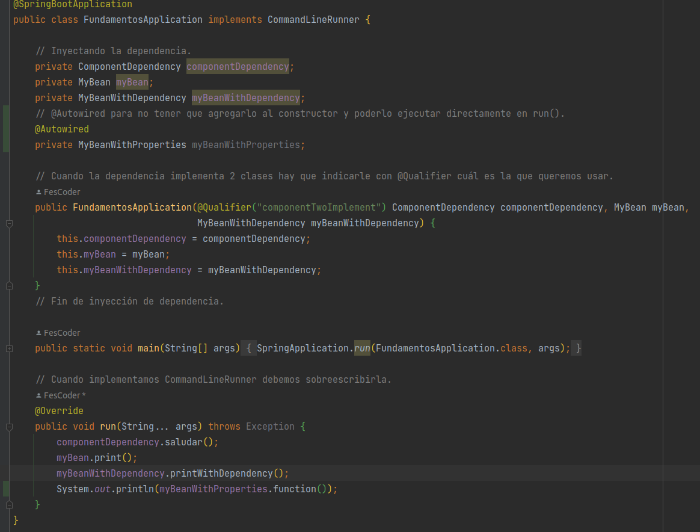

---

Lo mas recomendable es usar `@ConfigurationProperties` para encapsular la configuración, como se describe [acá](https://tuhrig.de/using-configurationproperties-to-separate-service-and-configuration/) y no usar `@Value` de manera suelta porque es más complicado de mantener.

---

## Clase 15 - Uso de properties con ejemplo de generación de POJO
Un `POJO` (Plain Old Java Object) es simplemente un objeto de `Java` que no implementa ninguna interfase especial.  
Configuraremos  un `pojo` a nivel de properties.

En nuestro archivo `properties` agregaremos nuevas propiedades a partir de una `clase` (user)

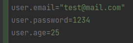

Ahora crearemos la `Clase` `UserPojo`, que representa esas propiedades, dentro del nuevo `Package` `POJO`, con su `constructor`, `getters` y `setters`.  
Usamos la anotación `@ConfugurationProperties`que tiene un valor, `prefix`, al que se le asigna el prefijo que indicamos en `properties`, `user`.
También usamos `@ConstructorBinding`para inyectar esto como una dependencia y se contruya el `pojo` con estas propiedades.

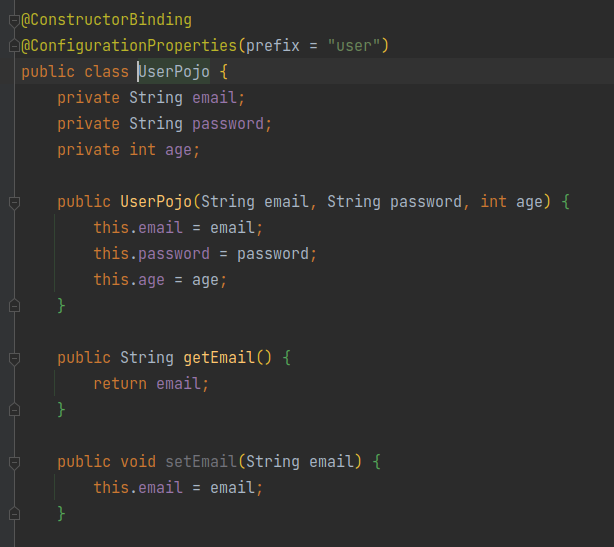

Y la ejecución.

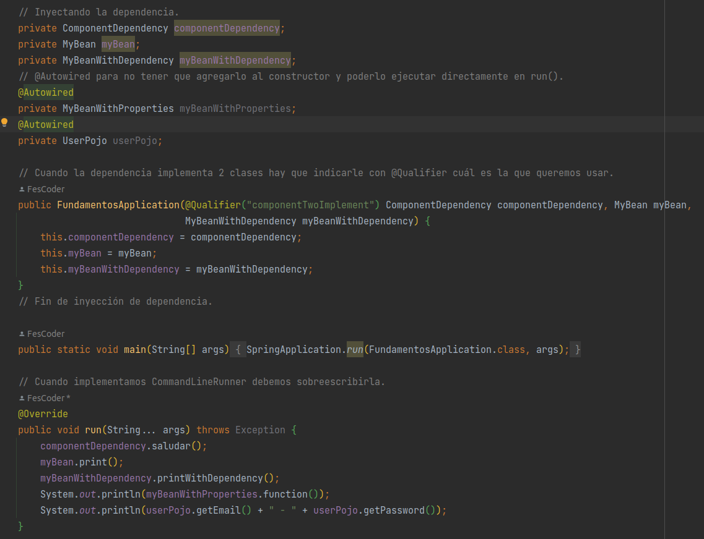

---

Podemos evitar crear nosotros mismos el `constructor` y los `getters` y `setters` simplemente añadiendo en nuestro `pom.xml` la siguiente dependencia [lombok](https://projectlombok.org/#):
~~~
<dependency>
	<groupId>org.projectlombok</groupId>
	<artifactId>lombok</artifactId>
</dependency>
~~~

Después de que añadamos esa dependencia, en nuestra `clase` tendremos que usar las anotaciones de esa librería (lombok) `@Getter`, `@Setter` y `@AllArgsConstructor`, quedando nuestra `clase` de la siguiente manera:
~~~
package com.fundamentosplatzi.springboot.fundamentos.pojo;

import lombok.AllArgsConstructor;
import lombok.Getter;
import lombok.Setter;

@ConfigurationProperties(prefix = "user")
@ConstructorBinding
@Getter
@Setter
@AllArgsConstructor
public class UserPojo {

	private String email;
	private String password;
	private int age;

}
~~~

- `@Getter`: crea los getters de todas las propiedades declaradas en la clase.
- `@Setter`: crea los setters de todas las propiedades declaradas en la clase.
- `@AllArgsConstructor`: crea un constructor con todas las propiedades declaradas en la clase.

---

## Clase 16 - Qué son los logs y cómo usarlos
Los `logs` es una herramienta que nos permite debugear la información y saber por donde está pasando, que `método`, que `clase` y elegir que nivel de depuración queremos mostrarlo.  
Usaremos la `librería` **Apache Commons** que tiene estos niveles de error:

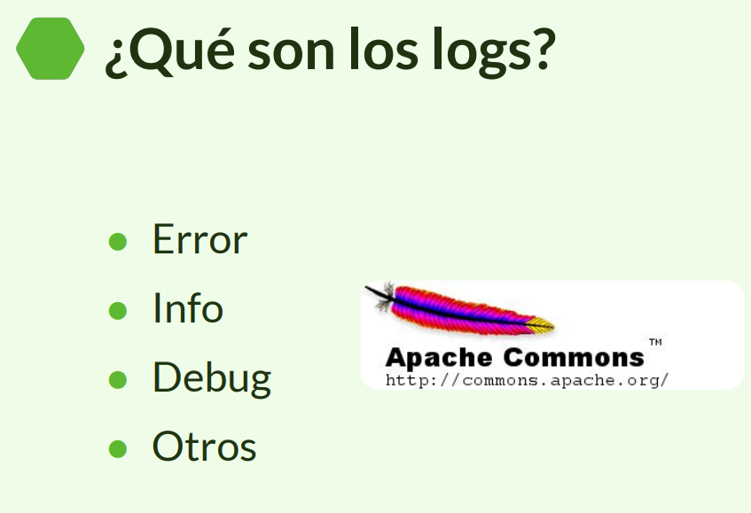

En `properties` vamos a programar los niveles de `logs` que queremos mostrar en el servidor.

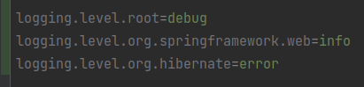

Como vemos es una utilidad importante, lo podemos usar en los `try-catch`, cuando tengamos un error, exception, podemos capturarla y mostrarla en el servidor, o consola, y le podemos agregar un mensaje que sea más explicativo o claro para el que lo lea.

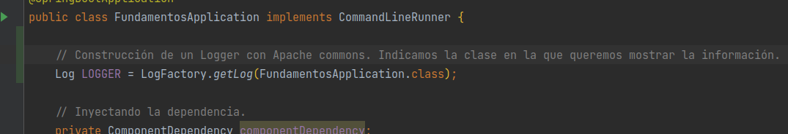

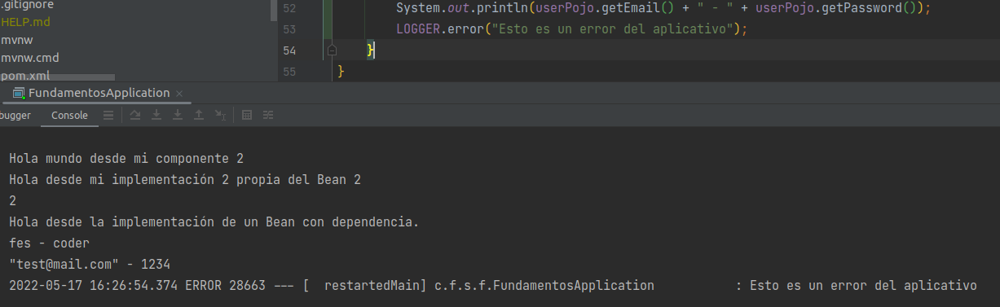

Otro ejemplo, en `MyBeanWithDependencyImplement`

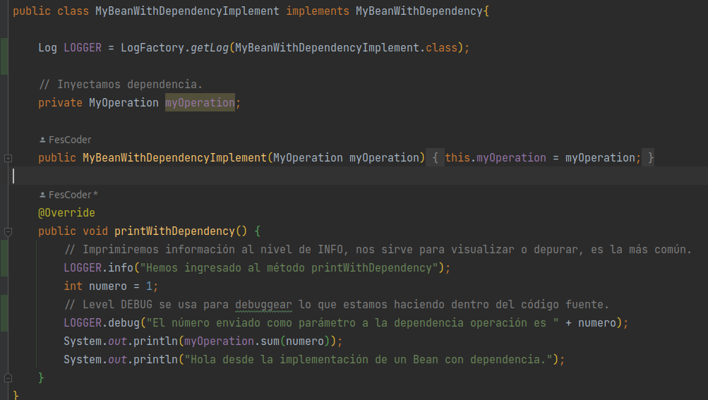

Capturando una `exception` y usando error para mostrarlo.

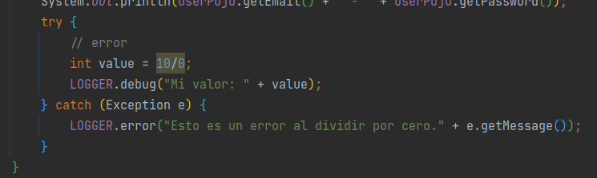

---

Otra manera que usamos en un proyecto es poner los logs con la librería `lombok` de la siguiente manera:
- Añadimos al pom.xml la librería lombok (está en la clase anterior).
- Añadimos justo arriba de la clase en la que queremos mostrar logs, la anotación `@Slf4j`
~~~
@Slf4j
public class Prueba {
	void test() {
        log.info("Entrando al método test");
	}
}
~~~

Con esta simple anotación, nos podemos ahorrar implementar la variable LOGGER. Aunque ambas opciones son buenas.

Pintar de color los LOGS, agregar en el archivo application.properties
~~~
spring.output.ansi.enabled=ALWAYS
~~~

---

# Módulo 4 - JPA con Spring y Spring Data
## Clase 17 - Modelado de entidades con JPA
`JPA` es el enfoque estandar de la industria para modelar objetos a nivel de DB en `Java`. Modelar tablas a `clases`.

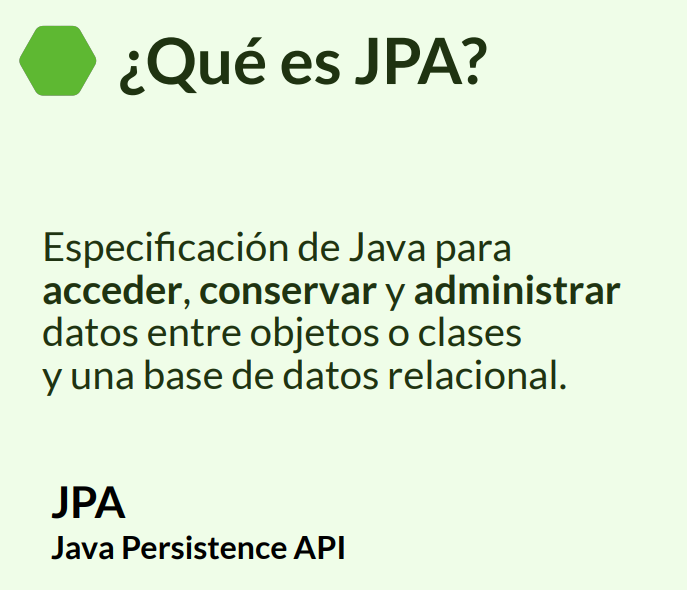

`JPA` no es `Hibernate` (una biblioteca ORM (Object Relational Mapping)), esta es una implementación de `JPA`.

Añadimos la dependencia para `JPA`, que nos permite hacer el modelado, las entidades, persistir en DB, y más.
~~~
<dependency>
	<groupId>org.springframework.boot</groupId>
	<artifactId>spring-boot-starter-data-jpa</artifactId>
</dependency>
~~~

En el proyecto creamos un nuevo `package`, `entity`, con una `clase` llamada `Post`, que es lo que el usuario va a usar para pasar las operaciones.  
Con sus respectivas `propiedades`, `constructores`, `getters`, `setters` y `toString`.

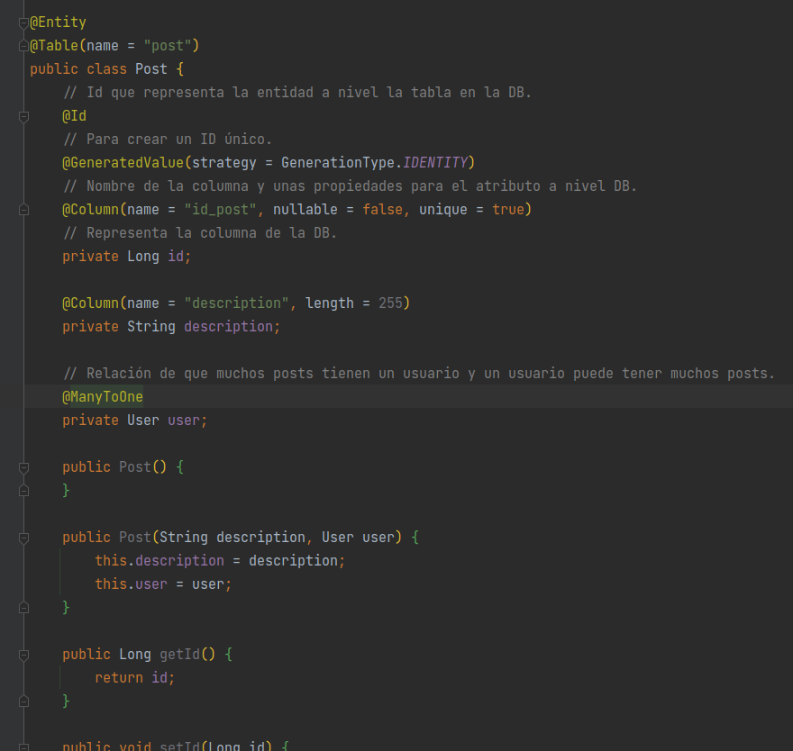

También la `clase` `User` que representará la tabla de usuarios de la DB, también con sus métodos y atributos.

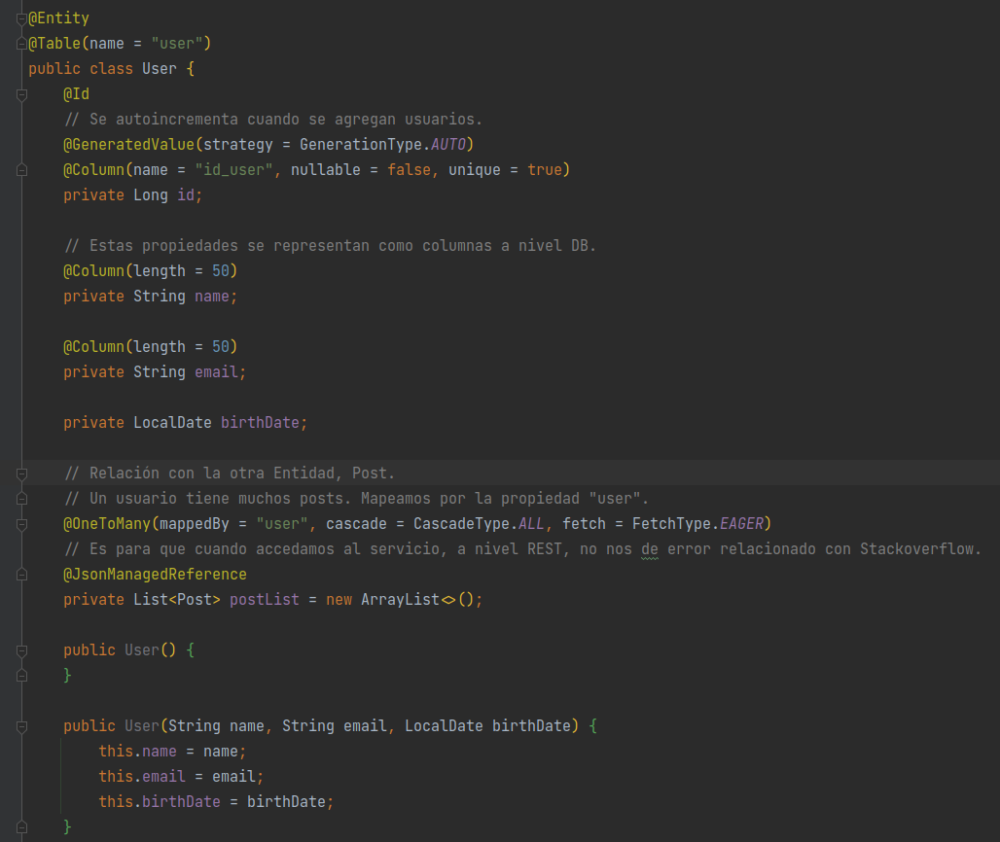

Anotaciones que se usaron: `@Table`, `@Id`, `@GeneratedValue`, `@Column`, `@ManyToOne`, `@OneToMany` y `@JsonManagedReference`.

En los comentarios dicen que podemos usar `Lombok` y la anotación `@Data` para no usar tanto código, es equivalente a `@ToString` + `@EqualsAndHashCode` + `@Getter` + `@Setter` + `@RequiredArgsConstructor`. Pero puede traer problemas a futuro.

---

## Clase 18 - Configuración de datasource con properties y classes
Agregamos una nueva dependencia **H2 Database Engine**, que se relaciona con nuestra DB. Puntualmente este DB se ejecuta en memoria, en tiempo de ejecución. Significa que una vez que nuestra app se cierre, los datos persistidos en esta DB se pierden.
~~~
<!-- https://mvnrepository.com/artifact/com.h2database/h2 -->
<dependency>
    <groupId>com.h2database</groupId>
    <artifactId>h2</artifactId>
    <version>2.1.212</version>
    <scope>runtime</scope>
</dependency>
~~~

En `properties` configuramos lo relacionado con esta DB. Con esto ya podemos crear nuestra capa de repositorio e insertar valores, actualizar, eliminar u obtener valores a nivel de DB.

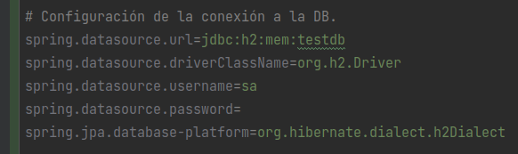

Pero no lo vamos a usar a estar configuración si no que lo haremos de forma manual en `GeneralConfiguration`, acá haremos toda la implementación o configuración a nivel de DB.

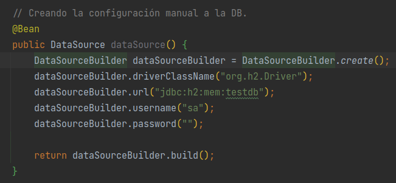

---

## Clase 19 - Registro en base de datos con JpaRepository
`JpaRepository` es el package que contiene las interfaces que extienden de `JPA` para que estas clases se conecten a la base de datos. Estas gestionan información ya sea de buscar, borrar, actualizar o crear un registro en la base de datos.

Creando repositorios, `UserRepository` y `PostRespository`, para poder usar las diferentes funcionalidades a nivel de DB, estas extienden de `JpaRepository`.

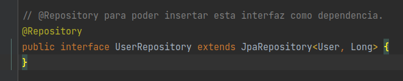

Creando un método para persistir la información, `saveUsersInDataBase`, en nuestro `main`. Inyectamos los repositorios como dependencias.

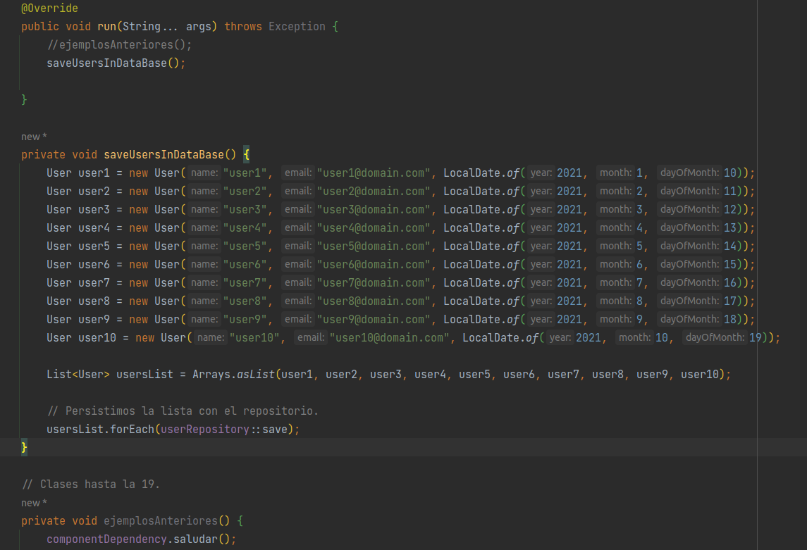

En `properties` si queremos mostrar los SQL, que se genera en el Servidor, en el Log.
~~~
spring.jpa.show-sql=true
~~~

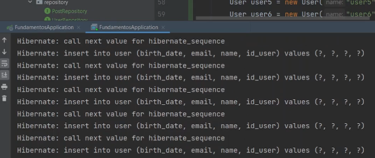

---

## Clase 20 - Uso de JPQL en anotación query

La principal diferencia es que en `SQL` se trabaja con tablas y columnas y en `JPQL` con objetos y propiedades, y nos permite hacer SELECTs, UPDATEs y DELETEs, no permite INSERTs dentro de `JPQL`.

En la repositorio agregamos 2 `funciones` que usan la anotacion`@Query` para formular las consultas a la DB.

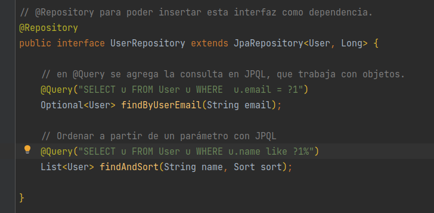

En nuestro `main` implementamos los nuevos `métodos`

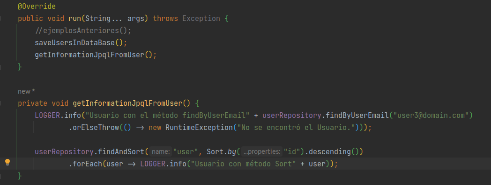

---

## Clase 21 - Uso de anotación value para apuntar a properties
Creamos una nueva `propertie`  en el `package` `resources`.

En `GeneralConfiguration` con `@PropertySource` indicamos que el archivo que pasado son las nuevas configuraciones de conexión, con `@Value` relacionamos el valor de las `properties` a una `variable`.

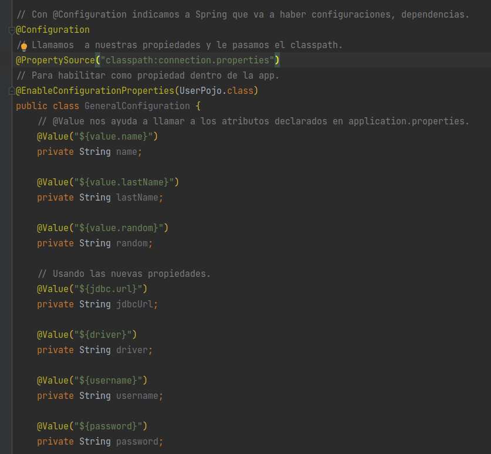

Y luego pasamos esas `variables` a `dataSource`.

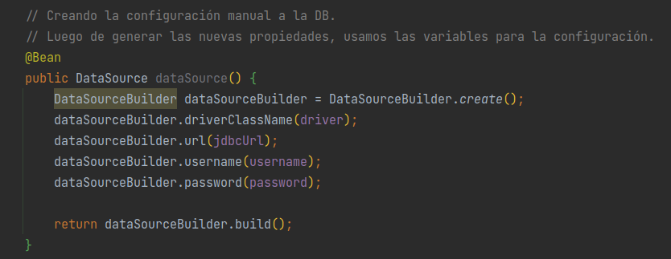

Cuando se van a configurar las conexiones a DB es mejor usar `variables de entorno`.

---

## Clase 22 - Obtención de información usando Query methods
Básicamente es definir una consulta `Query` dentro de un `método`, que se verá reflejado dentro de una `interfaz` o `clase`. Es una alternativa a `JPQL`.

Creamos 2 Querys.

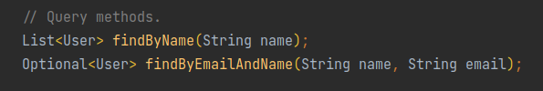

Las usamos.

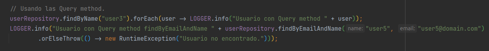

[Documentación](https://docs.spring.io/spring-data/jpa/docs/current/reference/html/#jpa.query-methods) de como usar Query methods.

---

## Clase 23 - Uso de Query methods con Or, and, OrderBy, Between, Sort

---

## Clase 24 - Uso de JPQL con named parameters

---

## Clase 25 - Uso de anotación transactional

---

## Clase 26 - Rollback con la anotación transactional

---

# Módulo 5 - REST con Spring Boot
## Clase 27 - CRUD bajo arquitectura REST

---

## Clase 28 - Métodos CREATE, UPDATE y DELETE

---

## Clase 29 - Probando la API REST

---

## Clase 30 - Pagination con Spring Boot

---