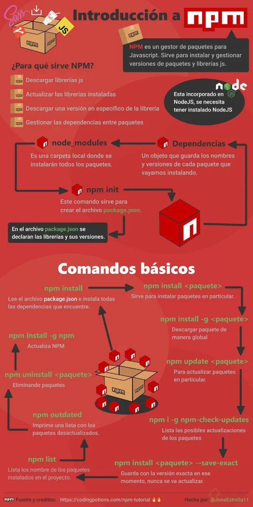
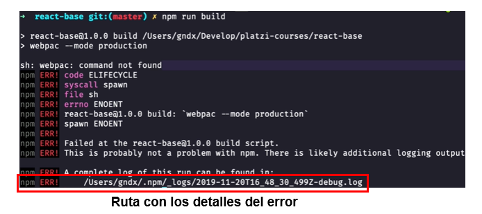
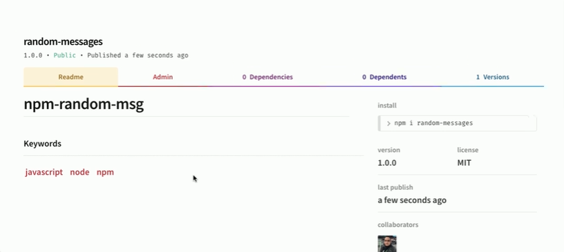

# Curso de gestión de dependencias y paquetes con NPM

## 01 - Acerca de NPM, paquetes y módulos
Te damos la bienvenida al curso de Gestión de Dependencias y Paquetes con NPM. En este curso aprenderás:

- Qué es NPM, dependencias y paquetes
- Cómo instalar dependencias a un proyecto
- Cómo compartir y crear paquetes para la comunidad
- Cómo funcionan los paquetes en NPM
Profesor: Oscar Barajas Tavares (Frontend Developer en Platzi).

NPM, paquetes y módulos
Los módulos son una solución a un problema individual que algún desarrollador ha creado y compartido para la comunidad.

Las dependencias y paquetes son el conjunto de módulos para resolver un problema mayor. Saber manejar los paquetes en un proyecto permite desarrollar la aplicación más rápido sin partir desde cero, y al saber administrarlos evitaremos posibles errores en el código.

Node Package Manager (NPM) es el manejador de paquetes de Node.js más popular. Mediante NPM, podremos instalar, crear y compartir paquetes de soluciones de JavaScript de manera sencilla.

La página oficial de NPM permite conocer toda la información de un paquete. Por ejemplo, React es un paquete para construir interfaces gráficas, en la página del paquete react tendrás información de instalación, participantes, versiones, documentación y posibles soluciones de errores.

## 04 - Iniciar un proyecto
Para iniciar tu proyecto, primero, desde una terminal, crea un directorio con el nombre de tu proyecto. Después, como buena práctica, inicia un repositorio local de Git dentro de la carpeta creada.

El símbolo $ representa la línea de entrada para los comandos en la terminal.
~~~
## Terminal

$ mkdir jsnpm
$ cd jsnpm
$ git init
Initialized empty Git repository in
<tu directorio>/pruebas/.git/
~~~

Una vez creado el espacio correspondiente al proyecto de JavaScript. Deberás tener un archivo de configuración llamado package.json.

Archivo de configuración package.json
El archivo package.json es un archivo de configuración que contiene la información más importante de tu proyecto como: datos específicos, dependencias, dependencias de desarrollo y archivos de ejecución.

Este archivo, como su extensión lo indicia, está estructurado en formato JSON (JavaScript Object Notation) que sirve para una mejor lectura e interpretación para los usuarios y las máquinas.

Datos específicos
Los datos específicos ayudan a identificar el proyecto y actúan como una base para que los usuarios y los contribuidores obtengan información sobre el proyecto.

El archivo package.json estaría estructurado inicialmente por las siguientes propiedades:

- "name": Indica el nombre del proyecto.
- "version": Indica la versión del proyecto.
- "description": Indica una breve descripción del proyecto.
- "main": Indica el archivo principal del proyecto.
- "scripts": Indica los comandos a ejecutar del proyecto (no te preocupes por el comando test por ahora).
- "keywords": Indica las palabras clave del proyecto.
- "author": Indica el nombre y dirección de correo electrónico del propietario del proyecto.
- "license": Indica la licencia del proyecto.
El archivo package.json estaría estructurado de la siguiente manera:
~~~
// archivo package.json

{
  "name": "jsnpm",
  "version": "1.0.0",
  "description": "Constuir un paquete para node",
  "main": "src/index.js",
  "scripts": {
    "test": "echo \"Error no test specified\" && exit 1"
  },
  "keywords": [
    "javascript",
    "node",
    "package"
  ],
  "author": "TuNombre <tucorreo@gmail.com>",
  "license": "MIT"
}
~~~

Comando npm init
Aunque puedes crear el archivo de configuración manualmente, NPM te ayuda a crearlo rápidamente mediante un comando: npm init. Este comando te permite ingresar los datos específicos del proyecto y genera el archivo package.json en tu directorio.
~~~
$ npm init
This utility will walk you through creating a package.json file.
It only covers the most common items, and tries to guess sensible defaults.

See `npm help init` for definitive documentation on these fields
and exactly what they do.

Use `npm install <pkg>` afterwards to install a package and
save it as a dependency in the package.json file.

Press ^C at any time to quit.
package name: (jsnpm)
~~~

Puedes ingresar tus propios datos, o utilizar la recomendación de NPM (lo que está entre paréntesis) y solamente dar enter. Al final, te preguntará si la configuración del package.json es correcta para generar el archivo.
~~~
version: (1.0.0)
description: Constuir un paquete para node
entry point: (index.js) src/index.js
test command: npm test
git repository:
keywords: javascript, node, package
author: TuNombre <tucorreo@gmail.com>
license: (MIT)
About to write to /jsnpm/package.json:

{
  "name": "jsnpm",
  "version": "1.0.0",
  "description": "Constuir un paquete para node",
  "main": "src/index.js",
  "scripts": {
    "test": "echo \"Error no test specified\" && exit 1"
  },
  "keywords": [
    "javascript",
    "node",
    "package"
  ],
  "author": "TuNombre <tucorreo@gmail.com>",
  "license": "MIT"
}

Is this OK? (yes)
~~~

Comando npm init --yes
El comando npm init --yes o npm init -y te ayudará a crear un archivo package.json de manera rápida con una configuración por defecto, sin la necesidad de ingresar los datos. Para establecer esta configuración por defecto, necesitarás utilizar el comando npm config set init-<atributo>.

Te comparto algunas de las configuraciones por defecto más comunes:
~~~
$ npm config set init-author-name "Tu Nombre"
$ npm config set init-author-email "TuEmail@email.com"
$ npm config set init-author-url "https://tuWeb.com"
$ npm config set init-license "MIT"
$ npm config set init-version "0.0.1"
~~~

## 05 - Instalación de dependencias
Las dependencias son recursos que vamos a utilizar en nuestro proyecto. Las dependencias y paquetes son el conjunto de módulos para resolver un problema mayor. Saber manejar los paquetes en un proyecto permite desarrollar la aplicación más rápido sin partir desde cero.

Existen tres tipos de dependencias: globales, locales y de desarrollador.

Qué son las dependencias locales
Las dependencias locales son aquellas que son obligatorias para el proyecto, es decir, son las necesarias para que la aplicación funcione en producción.

Cómo instalar dependencias locales
Para instalar una dependencia local, utiliza el siguiente comando, donde <paquete> es el nombre del paquete.
~~~
$ npm install <paquete>
~~~

Por ejemplo, para instalar express, un módulo popular del lado del servidor, deberás ejecutar el comando npm install express. Otra forma de hacerlo es con el flag --save.
~~~
$ npm install --save <paquete>
~~~

Las dependencias locales se encuentran en el package.json en la propiedad "dependencies", seguido de la versión que fue instalada.
~~~
{
  "name": "jsnpm",
  ...
  "dependencies": {
    "paquete": "1.0.0"
  }
}
~~~

Qué son las dependencias de desarrollador
Las dependencias de desarrollador son aquellas que no son obligatorias para el proyecto, es decir, sin estas la aplicación servirá. Estas dependencias ofrecen una ayuda para construir código de forma óptima, por ejemplo, formatear el código, agregar estilos, levantar un servidor para observar los cambios.

Cómo instalar dependencias de desarrollador
Para instalar una dependencia de desarrollador, utiliza el siguiente comando, donde <paquete> es el nombre del paquete.
~~~
$ npm install --save-dev <paquete>
$ npm install -D <paquete>
~~~

Por ejemplo, para instalar nodemon, un módulo popular para levantar un servidor que escuche cambios, deberás ejecutar el comando npm install -D nodemon.

Las dependencias de desarrollador se encuentran en el package.json en la propiedad "dev-dependencies", seguido de la versión que fue instalada.
~~~
{
  "name": "jsnpm",
  ...
  "dev-dependencies": {
    "paquete": "1.0.0"
  }
}
~~~

Qué son las dependencias globales
Las dependencias globales son aquellas que están disponibles para todos los proyectos en tu computador.

Cómo instalar dependencias globales
Para instalar una dependencia global, utiliza el siguiente comando, donde <paquete> es el nombre del paquete.
~~~
$ npm install --global <paquete>
$ npm install -g <paquete>
~~~

Por ejemplo, para instalar typescript, un módulo popular que permite el tipado en JavaScript, deberás ejecutar el comando npm install -g typescript.

Para ver que dependencias globales tienes instaladas, ejecuta el siguiente comando:
~~~
$ npm list -g --depth 0
~~~

Ten en cuenta que para instalar dependencias globales necesitar permisos elevados, esto se soluciona con la palabra reservada sudo en terminales basadas en Unix, o en Windows ejecutando la terminal como administrador. Puedes revisar este artículo: Resolving EACCES permissions errors when installing packages globally para evitar dar permisos cada vez que instalas una dependencia global.

Las dependencias globales no se encuentran en el package.json, por esta razón recomiendo no abusar de esta herramienta, ya que el archivo de configuración es muy importante para que otros desarrolladores tengan toda la información pertinente al proyecto, incluyendo las dependencias a utilizar.

## 06 - Instalación de dependencias con force
La manera de instalar de manera forzada un paquete es con el siguiente comando, donde <paquete> es el nombre del paquete.
~~~
$ npm install --force <paquete>
$ npm install -f <paquete>
~~~

Esto instalará una versión reciente de los servidores de NPM en la sección de "dependencies" del package.json, por lo que si es necesario, puedes cambiar de lugar modificando el archivo siguiendo la estructura de JSON correctamente para evitar errores.

Instalar una versión exacta de una dependencia
Para instalar una versión exacta de una dependencia, utiliza el comando, donde <paquete> es el nombre del paquete y <versión> es la versión exacta.
~~~
$ npm install <paquete>@<versión>
~~~

Este comando instalará la versión exacta del paquete desde el repositorio de NPM.
~~~
 $ npm install json-server@0.15.0
npm WARN deprecated har-validator@5.1.5: this library is no longer supported
npm WARN deprecated uuid@3.4.0: Please upgrade  to version 7 or higher.  Older versions may use Math.random() in certain circumstances, which is known to be problematic.  See https://v8.dev/blog/math-random for details.
npm WARN deprecated request@2.88.2: request has been deprecated, see https://github.com/request/request/issues/3142

added 154 packages, and audited 328 packages in 30s

25 packages are looking for funding
  run `npm fund` for details

found 0 vulnerabilities
~~~

Simular la instalación de una dependencia
Para simular la instalación de una dependencia, utiliza el siguiente comando, donde <paquete> es el nombre del paquete.
~~~
$ npm install --dry-run <paquete>
~~~

Este comando mostrará el resultado de instalación sin instalarlo en el proyecto.
~~~
$ npm i react --dry-run

added 4 packages in 2s

23 packages are looking for funding
  run `npm fund` for details
~~~

Comando npm install
Si se tiene un archivo package.json que contiene la información de las dependencias del proyecto, pero no tienes instaladas esas dependencias, la manera para instalarlas todas en un solo comando es npm install o la forma corta npm i. De este modo, instalarás cada paquete con su respectiva versión.

Si únicamente tenías el archivo package.json después de ejecutar el comando, aparte de instalar todas las dependencias, se generará un archivo package-lock.json y un directorio llamado node_modules.

El archivo package-lock.json muestra todo el árbol de dependencias de tu proyecto, ¿qué significa esto? Cada dependencia instalada también tiene sus respectivas dependencias, a estas se las denomina sub-dependencias. El árbol de dependencias muestra todas las sub-dependencias como si de ramas se tratasen.

El directorio node_modules contiene todos los archivos ejecutables de Node y los archivos que contiene cada dependencia. Este directorio es ignorado por los repositorios de Git, por eso es importante el archivo package.json, ya que te permitirá instalar este directorio con un simple comando.

## 07 - Cómo actualizar y eliminar paquetes
Con los siguientes comandos, podrás actualizar y eliminar paquetes. Hacer esto es muy importante para mantener tus proyectos actualizados y libres de vulnerabilidades de seguridad.

Cómo actualizar paquetes
El comando npm outdate mostrará los paquetes que están desactualizados. Con el comando npm outdate --dd verás de manera más detallada la información.

Para actualizar todos los paquetes utiliza el siguiente comando:
~~~
$ npm update
~~~

Ten en cuenta que actualizar varios paquetes no es recomendable, solamente deberías actualizar un paquete si estás muy seguro de que no afectará al proyecto y que realizaste los cambios pertinentes.

Utiliza el siguiente comando para actualizar a la última versión (latest) de la dependencia, donde <paquete> es el nombre del paquete.
~~~
$ npm install <paquete>@latest
~~~

Cómo eliminar paquetes
Existen dos formas de eliminar paquetes:

Eliminando el paquete del package.json y del directorio node_modules:
~~~
$ npm uninstall <paquete>
~~~

Eliminando solamente del directorio node_modules:
~~~
$ npm uninstall --no-save <paquete>
~~~

Un pequeño resumen:

Actualizar paquetes

Revisar que paquetes disponen de nuevas versiones
npm outdate

Para ver un output más detallado
npm outdate --dd

Actualizar los paquetes que no están en la ultima versión
npm update

Actualizar un paquete especifico
npm install json-server@latest

Eliminar paquetes

Eliminar un paquete de node_modules y del archivo package.json
npm uninstall json-server

Desinstalar un paquete de todo node_modules pero no del archivo package.json
npm uninstall webpack --no-save

## 08 - Package lock y el uso los símbolos ^ y ~
El archivo package-lock.json describe todo el árbol de dependencias de cada paquete instalado. Cuando alguien hace fork de un repositorio no tiene el directorio node_modules.

Con el comando npm install se instalarán las dependencias indicadas en el package.json con la versión indicada. También, se instalarán las sub-dependencias indicadas en package-lock.json con la versión indicada. Pero, ¿qué significan estas diferentes versiones en cada dependencia?

Versionado de paquetes
El versionado de paquetes está conformado por tres valores:

- Major: el valor que muestra la versión que contiene los cambios importantes del paquete
- Minor: el valor que muestra la versión que contiene los cambios en funcionalidades, pero no representan un cambio significativo
- Patch: el valor que muestra la versión que contiene cambios rápidos para solucionar problemas de seguridad o bugs

Símbolos ^ y ~ para actualizar las versiones minor y patch
Existen dos símbolos que acompañan a este versionado, que sirven para actualizar las versiones minor y patch del paquete:

- Caret (^): Permite actualizar las versiones minor y patch
- Tilde (~): Permite actualizar las versiones patch
Por ejemplo, tenemos la versión “5.2.3”:

- Si tiene el carret ^, actualizará la versión minor y patch, por lo que tendrás versiones como “^5.3.3”, “^5.4.3”, “^5.4.4”, etc.
- Si tiene la tilde ~, actualizará la versión de patch, por lo que tendrás versiones como “~5.2.4”, “~5.2.5”, “~5.2.6”, etc.
Lo recomendable es quitar estos símbolos y tener la versión exacta para evitar problemas de versionado, principalmente con paquetes que los mantienen pocas personas o no son fiables.

## 09 - Ejecutar tareas
El apartado de "scripts" en el package.json es el que indica los comandos a ejecutar del proyecto. Esta sección es la que utilizarás para crear comandos que optimicen el desarrollo de tu aplicación.

Crear un comando en tu proyecto
Para crear un comando en tu proyecto sigue la siguiente estructura, donde <nombre> es el nombre del comando que debería ser muy descriptivo y <comando> es el comando que utilizarías en la terminal:
~~~
{
    "scripts": {
        "<nombre>": "<comando>"
    }
}
~~~

Una vez hayas escrito el comando en el archivo package.json, la manera de ejecutarlo será con el comando npm run.

Por ejemplo, creemos tres comandos para iniciar el proyecto (start), crear un archivo para producción (build) y combinarlos (deploy). Que no te preocupe si no entiendes cada comando, solo entiende cómo ejecuta NPM el script.
~~~
{
    "scripts": {
        "start": "webpack-dev-server --open --mode development",
        "build": "webpack --mode production",
        "deploy": "npm run format && npm run build"
    }
}
~~~

Y para ejecutarlos, es necesario utilizar el comando pertinente en la terminal:
~~~
$ npm run start
$ npm run build
$ npm run deploy
~~~

Puedes también especificar scripts con el prefijo “pre” que se ejecutarán automáticamente antes del comando que ejecutaste. Por ejemplo, si defines el comando build y prebuild, cuando corras npm run build el comando prebuild se ejecutará primero. Esto sirbe para poder ejecutar tareas que hagan algún tipo de preparación necesaria para correr el comando principal. Sin embargo, hay que hacer notar que si el comando pre falla (retorna un valor que no es 0) el comando principal no se ejecutará. Esto es algo bueno ya que si nuestro proceso de preparación no se realiza de forma exitosa, puede que tengamos problemas al querer ejecutar la tarea principal.

En algunas ocaciones, sin embargo, la tarea previa puede fallar sin que eso afecte la ejecución de la tarea principal. En esos casos puedes usar || exit 0 para retornar 0:
~~~
"presass-build": "(rm css/*.css; rm css/*.css.map) || exit 0"
~~~

Ese es un ejemplo de un comando que hice hace un tiempo. rm puede fallar si el directorio css está vacio, y en ese caso no hay problema, la tarea principal puede funcionar sin ningún problema ya que presass-build tiene el propósito de vaciar ese directorio.

npm run agrega el directorio ./node_modules/bin/ al PATH de modo que para ejecutar un comando no es necesario agregar la ruta completa. Esto es algo que hace tiempo me confundió, cuando vi que Laravel ejecuta un comando setenv y yo quice buscarlo en mi computadora con which setenv y resultó que el comando no existía. Esto es porque en realidad el binario está ubicado en node_modules/bin/

## 10 - Solución de problemas en proyectos con NPM
Cuando estés desarrollando un proyecto con NPM, puede que generes errores que no permitan seguir con tu trabajo. Saber manejar los errores es fundamental para solucionarlos y seguir con tus tareas (y no entrar en pánico). Alguno de estos errores pueden ser:
- Errores en la configuración del archivo package.json
- Errores del sistema operativo
- Configuración errónea de Git o GitHub
- Errores ortográficos (typos)
- O errores que no estén ligados directamente a NPM
Mostrar todos los pasos de un comando de NPM
Para identificar el error que puede existir en tu proyecto, es necesario analizar cada paso que ejecuta un comando, para saber qué o en dónde ocurre el problema.

El flag --dd en un comando de NPM, te mostrará de manera verbosa cada paso que se ejecuta. De esta manera podrás observar si existe un error para solucionarlo.
~~~
$ npm [comando] --dd
~~~

Otra forma, es ejecutar el comando de NPM. Si existe un error, la terminal te mostrará los diferentes errores que encontró. Al final de este resumen, existirá una ruta con los detalles del error, lo puedes abrir para observar los pasos que ejecutó NPM.

Error de dependencias en node_modules
Existen situaciones en las que instalas una dependencia con una versión que no corresponde a la deseada. En esta situación, puedes utilizar los siguientes comandos, el primero para borrar el caché de NPM y el segundo para verificar si están eliminados correctamente.
~~~
$ npm cache clean --force
$ npm cache verify
~~~

Si existen valores corruptos o una instalación incorrecta de una dependencia, deberás eliminar el directorio de node_modules y después ejecutar el comando npm install para instalar correctamente los paquetes.

## 11 - Gestionar la seguridad en proyectos con NPM
La seguridad de tu proyecto puede ser vulnerada por paquetes desactualizados, ya que estas inseguridades son resueltas en versiones minor o patch. Al momento de instalar tus paquetes con el comando npm install puede mostrar advertencias (NPM WARN) de las dependencias desactualizadas.

Auditar tus dependencias
El comando npm audit muestra una descripción de las dependencias instaladas, si se encuentran vulnerabilidades, se calculará el impacto al proyecto.

El comando npm audit fix proporciona una actualización de los paquetes, similar al comando npm f <paquete>. Si se requiere un informe más detallado en formato JSON, utiliza el comando npm audit --json.

Sería recomendable primero intentar solucionar con npm audit fix y lo que no se solucione lo actualizamos de a uno.

## 12 - Crear un paquete para NPM
Al crear un paquete para NPM, podrás compartir tu trabajo a varios desarrolladores y utilizar tu código mediante npm install. Te mostraré un ejemplo, un proyecto de mensajes aleatorios que estará instalado globalmente y se ejecutará mediante la terminal.

Proyecto de mensajes aleatorios
Crea el directorio del proyecto y el archivo package.json mediante npm init. Inicia un repositorio local de Git con git init. Al momento de publicar un paquete, el proyecto debe tener un nombre único, puedes agregar tu nombre de usuario para diferenciarlo, pero no agregues números, ya que NPM lo detecta como spam.

Dentro del proyecto crea la siguiente estructura de archivos:

- Un directorio llamado src que contenga el archivo principal del proyecto index.js
- Un directorio llamado bin que contenga un archivo ejecutable global.js

En el archivo index.js agrega el siguiente código, un array llamado messages que contiene cinco nombres y una función randomMsgque mostrará de manera aleatoria los elementos del array. Al final, exporta la función mediante module.exports.
~~~
const messages = ["Oscar", "Ana", "Nikolai", "Diego", "Laura"];

const randomMsg = () => {
  const message = messages[Math.floor(Math.random() * mesagges.length)];
  console.log(mesagge);
};

module.exports = { randomMsg };
~~~

En el archivo global.js agrega el siguiente código, en el que importamos el la función del archivo index.js y la ejecutamos.
~~~
#!/usr/bin/env node
let random = require('../src/index.js');

random.randomMsg();
~~~

#!/usr/bin/env node es una instancia de una línea shebang, la primera línea en un archivo de texto plano ejecutable en plataformas similares a Unix que le dice al sistema: a qué intérprete debe pasar ese archivo para su ejecución, a través del comando línea siguiendo la magia #! prefijo.
⠀⠀
En el archivo package.json, agrega "bin" haciendo referencia a nuestro archivo global.js y "preferGlobal" en true (el signo + representa las líneas de código a añadir).
~~~
{
  "name": "random-mesagges-<tuUsuario>",
  "version": "1.0.0",
  "description": "Vamos a crear un paquete para NPM",
  "main": "src/index.js",
  "scripts": {
    "test": "echo \"Error: no test specified\" && exit 1"
  },
  "author": "Tu Nombre <tunombre@gmail.com>",
  "license": "MIT",
+"bin": {
+  "random-msg": "./bin/global.js"
+ },
+ "preferGlobal": true
}
~~~

## 13 - Publicar un paquete en NPM
Antes de publicar un paquete en NPM debes asegurarte de cumplir con los siguientes requisitos:
- Asegurar que el programa funcione reduciendo en lo posible los bugs
- Revisar que la configuración del archivo package.json sea correcta
- Tener un nombre único para el proyecto, usando guiones (-) para separar palabras y evitando números
- Crear una cuenta en NPM, ya que aquí estarán tus paquetes a tu nombre. Después, debes utilizar el comando npm adduser para iniciar sesión en la terminal. Si no aparece tu contraseña, no te preocupes, es una forma de seguridad
Una vez hayas cumplido los requisitos, ejecuta el comando npm publish y si no existen errores, tu paquete será publicado. Puedes utilizar el comando npm whoami para visualizar el usuario en el que publicarás el paquete, esto es importante si tienes varias cuentas de NPM.

Si realizas cambios en tu código, deberás cambiar la versión de tu proyecto, puedes utilizar los siguientes comandos:
~~~
##Aumenta una version path (1.0.0) -> (1.0.1)
$ npm version patch 

##Aumenta una version minor (1.0.0) -> (1.1.0)
$ npm version minor

##Aumenta una version major (1.0.0) -> (2.0.0)
$ npm version major

##Aumenta una version específica (1.0.0) -> (3.1.1)
$ npm version <version>
~~~

Una vez actualizada la versión de tu proyecto, puedes ejecutar nuevamente el comando npm publish para actualizarlo en los repositorios de NPM.

Publicando el proyecto de mensajes aleatorios
Antes de publicar el proyecto de mensajes aleatorios, debemos asegurarnos de que el programa se ejecute bien en la terminal. Para esto, identifica el directorio en el que te encuentras, debe ser el mismo del proyecto con el comando pwd.

También debes ejecutar el comando sudo npm link que te permitirá hacer una referencia al paquete hacia el directorio global de NPM, similar a cómo se instalaría desde los servidores de NPM.

Otra forma es instalarlo de manera global, como cualquier otra dependencia, pero en lugar del nombre de la dependencia, estará la ruta del proyecto:
~~~
$ sudo npm install -g /users/tuUsuario/random-messages
~~~

De esta manera, ya puedes ejecutar el programa con el comando que creamos en "bin", random-msg y funcionará de forma global en el sistema.

Una vez revisado todo, ya puedes ingresar tu usuario con npm adduser y publicarlo con npm publish. En los paquetes de tu usuario de NPM aparecerá algo parecido a esto:

## 14 - Paquetes privados
Para usar paquetes privados, debes:

- Estar usando una versión igual o superior a la 2.7.0 de NPM
- Tener una cuenta de usuario u organización de pago
En un paquete privado de NPM, solo pueden participar el propietario y los colaboradores autorizados. De esta manera, puedes seguir construyendo el paquete con una combinación de código privado y dependencias públicas.

Actualizar tus paquetes con buenas prácticas
Tu paquete debe contener toda la información posible para que el usuario puede instalarlo, utilizarlo y hasta colaborar para solucionar posibles bugs. Por ende, es necesario que tengas configurado, por lo menos, un archivo README.md y un repositorio remoto (GitHub, GitLab, etc.).

Una vez tengas estos requisitos, puedes actualizar tu paquete a una nueva versión, luego publicalo nuevamente.

Crear un archivo README.md para tu paquete
Para crear un archivo README.md puedes utilizar esta estructura base y adecuarla a tu proyecto. Puedes mirar el código haciendo clic en el botón “Raw”.

Crear un archivo repositorio remoto para tu paquete
Para crear un repositorio remoto, utiliza el comando pertinente para conectar tu repositorio local de Git con un servicio en la nube, usualmente se utiliza GitHub. Por ejemplo:
~~~
$ git remote add origin <https://...>
~~~

Si no conoces este comando, te recomiendo seguir con el Curso Profesional de Git y GitHub, en el que aprenderás el software de control de versiones de tu código más importante en tu carrera como desarrollador.

Después, debes actualizar tu archivo de package.json con la información de tu repositorio remoto. Puedes hacerlo manualmente modificando el archivo, o emplear el comando npm init que no cambiará tu configuración, solamente la actualizará con la nueva información que ingreses.

Debería agregar las propiedades "repository", "bugs" y "homepage" con los enlaces pertinentes del repositorio remoto, en el archivo de configuración de la siguiente manera:
~~~
//package.json
{
    ... ,
    "repository": {
        "type": "git",
        "url": "http://github/.../random-msg.git"
    },
    "bugs": {
        "url": "http://github/.../random-msg/issues"
    },
    "homepage": {
        "url": "http://github/.../random-msg#readme"
    }
}
~~~

