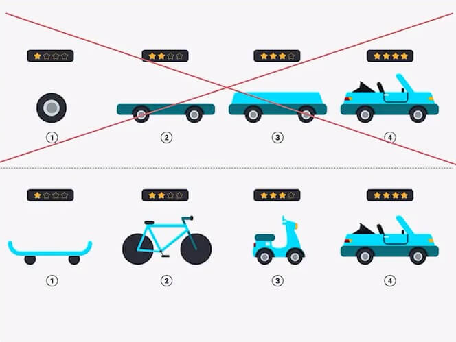
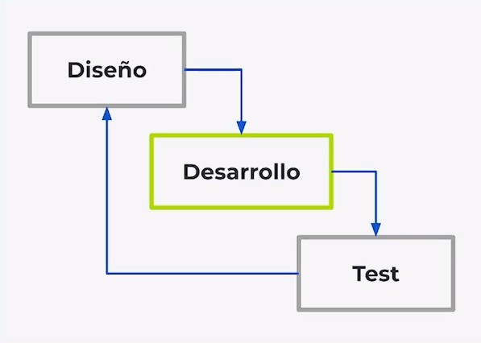
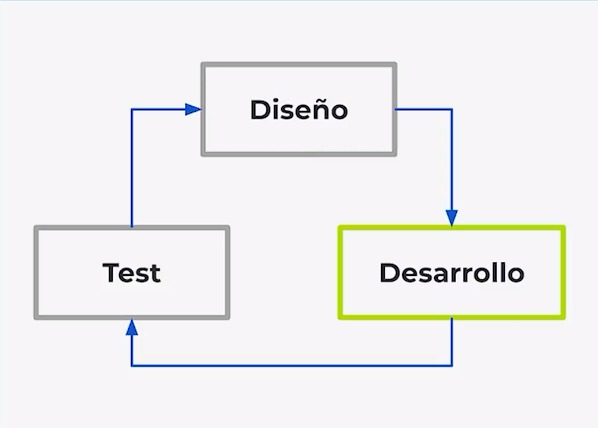

# Curso de Introducción a React.js
Índice
-
- [Módulo 1 - ](#)
    - [Clase 1 - ](#)
    - [Clase 2 - ](#)
    - [Clase 3 - ](#)
    - [Clase 4 - ](#)
    - [Clase 5 - ](#)
- [Módulo 2 - ](#)
    - [Clase 6 - ](#)
    - [Clase 7 - ](#)
    - [Clase 8 - ](#)
    - [Clase 9 - ](#)
    - [Clase 10 - ](#)
    - [Clase 11 - ](#)
- [Módulo 3 - ](#)
    - [Clase 12 - ](#)
    - [Clase 13 - ](#)
    - [Clase 14 - ](#)
    - [Clase 15 - ](#)
    - [Clase 16 - ](#)
    - [Clase 17 - ](#)
    - [Clase 18 - ](#)
    - [Clase 19 - ](#)
- [Módulo 4 - ](#)
    - [Clase 20 - ](#)
    - [Clase 21 - ](#)
    - [Clase 22 - ](#)
    - [Clase 23 - ](#)
    - [Clase 24 - ](#)
    - [Clase 25 - ](#)
    - [Clase 26 - ](#)
    - [Clase 27 - ](#)
- [Módulo 5 - ](#)
    - [Clase 28 - ](#)
    - [Clase 29 - ](#)
    - [Clase 30 - ](#)
    - [Clase 31 - ](#)
    - [Clase 32 - ](#)
    - [Clase 33 - ](#)
- [Módulo 6 - ](#)
    - [Clase 34 - ](#)
    - [Clase 35 - ](#)
    - [Clase 36 - ](#)
    - [Clase 37 - ](#)
- [Módulo 7 - ](#)
    - [Clase 38 - ](#)
    - [Clase 39 - ](#)
    - [Clase 40 - ](#)

---
La Reactividad
Es un paradigma, una forma de pensar nuestras aplicaciones de forma que sigan dos reglas o lineamientos.
- Responsive: Que sabe reaccionar, las apps responsive saben que hacer sin importar lo que pase, cumplen dos condiciones:
  - Ser resilientes: Que nuestra app siempre sabe que hacer incluso en situaciones malas
  - Ser escalables: o elásticos, es decir, que no importa con cuanta información tenemos que trabajar o cuantos usuarios entren a la app al mismo tiempo la aplicación debe poder crecer y funcionar sin problemas
- Message Driven: Arquitectura basa en mensajes, consiste en programar nuestras apps con emisores y receptores de mensajes, pero los emisores no entregan directamente los mensajes a los receptores; los mensajes no se entregan sincrónicamente, lo hacen asincrónicamente, se guardan en una cola a la que los receptores se deben suscribir para recibir los mensajes. Para esto se usan observers, una librería muy usada es rx.js, la implementación de reactivex.

Otros dos conceptos para trabajar la reactividad son:
- Estado o State: Aquí se guarda la información reactiva de nuestros componentes, no todos los frameworks lo llaman así pero en esencia son lo mismo, son variables a las que nos suscribimos para recibir una actualización cada vez que cambian sus valores. Podemos manejar un campo de búsqueda o filtrado en una lista de elementos. Con el estado estamos preparados para cuando el usuario solicite la búsqueda nosotros podamos reaccionar.
- Render: Es el proceso por el cuál nuestro HTML pasan a ser información visual en el navegador (el DOM), con JS podemos manipular el HTML que ya está en el navegador y cambiarlo dependiendo de las interacciones de nuestros usuarios.

Estrategias de render:
  - Virtual DOM: Puede decirse que es la más popular, es una copia del DOM en JS. Leer, comparar y modificar el DOM directamente es muy costoso. Cada vez que hay un render creamos una copia del DOM en JS, así cuando evaluemos en un futuro que componentes debemos volver a renderizar, no tenemos que ir al DOM, lo hacemos con el virtual DOM que es mucho más rápido y cuando ya sabemos cuales debemos de renderizar le volvemos a hacer render directo al DOM, haciendo la app más rápida.
  - No Virtual DOM: El virtual DOM es un “paso extra” y es innecesario según este approach. Lo que proponen es crear un mini virtual DOM específicamente para el componente que se quiere modificar.
Estas son las que usan los frameworks así que debemos elegir el que más se adapte a nuestro proyecto.

---

Un pequeño RESUMEN de frameworks y librerias que se usan con JS
Existen empaquetadores que nos ayudan a tener todos los archivos en produccion pero al momento de mandar al navegador sea lo mas ligero posible
- Webpack: Requiere que configuremos un archivo para especificar como queremos nuestro archivo.
- Parcel: Es evitarnos cualquier configuracion, trae todo listo para que construya toda su magia. No tenemos control de como empaqueta.
- Rollup: Se especializa en tener todo optimizado con una tecnica especial donde elimina el codigo inutil
Se dice que usemos webpack para paginas web y aplicaciones y Rollup para librerias.

Compiladores que transforman codigo Javascript que no es exactamente JS que los navegadores si pueden entender:
- Babel: Nos permite usar el codigo del futuro en proyectos que utilizan otra version, unificando todo en una version que entiendan los programadores
- TypeScript: Es un lenguaje de programacion con sus nuevas reglas que nos permiten entender mas facil los errores en JavaScript

Las herramientas para UI son para encargarse de las vistas e interaccion con los usuarios, puede ser JS solito pero si trabajamos en Frameworks se suelen usar:
- React
- Vue
- Svelt

Estan los estilos donde se pueden usar diferentes cosas, pero hay que tener en cuenta que a veces escribimos mas JS que CSS:
- CSS
- SASS
- LESS
- STYLUS

En CSS-in-JS normalmente el html, el css y el JS estaria en cada archivo individual pero esto nos permite desarrollar en los 3 lengaujes en un mismo componente, que necesariamente no es un mismo archivo.
- Styled Components
- Emotion

En los Routers son la forma en la que hacemos la navegacion de la aplicacion, muestra cierto contenido dependiendo de la URL
- React Router
- Vue Router
- Svelte Router
- LitElement Router
- Whatever Router

Los frameworks son elementos todos en uno, que se encargan de todos los apartados ya que todo lo contiene. Trabajar con un Framework acelera tu desarrollo.
- Angular: Es todo poderoso pero por ser tan grande es bastante dificil de integrar con otras herramientas que no sean especiales para ANGULAR.

Los entornos de desarrollo completos son un todo en uno, un grupo de librerias configuradas para trbajar con mas librerias. se llaman mas CLI y desde la consola podemos elegir lo que queremos y configurar todo por nuestro lado.
- Create React App
- Vue CLI
- Svelte CLI
- Polymer CLI
- Whatever CLI

En el manejo de estado son las librerias que podremos definir un estandar de flujo de datos constante y predecible dentro de la aplicacion, en vez de que todos sean diferentes podremos definir un patron comun
- Redux
- XState
- MobX

En la consulta de datos son formas o protocolos para comunicarnos con el backend para enviar y recibir informacion, hay herramientas para hacer peticiones que no hacen diferencia, pero estas herramientas si hacen diferencia:
- API REST
- GraphQL

---

# Módulo 1 - Primero pasos con React
## Clase 1 - Cómo aprender React.js
Para comenzar tu camino en el mundo de React necesitas tener una base sólida en las principales tecnologías del front end: HTML, CSS y JavaScript, te recomendamos seguir la Escuela de Desarrollo Web en orden.

El trabajo de un desarrollador front-end es darle la mejor experiencia posible a nuestros usuarios en:
- Flujo de navegación
- Tiempos de carga
- Accesibilidad
- Optimización
- Usabilidad

¿Qué es React.js?
React es una herramienta de JavaScript en el front end que nos ayuda a construir la parte visual de nuestras aplicaciones web, las interfaces con las que van a interactuar nuestros usuarios.

React es una librería progresiva, esto porque puedes hacer desde una página sencilla hasta poder desarrollar aplicaciones gigantes, y llegar a convertirse en un framework en conjunto de muchas herramientas que existen a su alrededor.

Pero… ¿Por qué aprender React?
Mientras más crecen nuestras aplicaciones web, se vuelve más complicado nuestro trabajo utilizando solamente HTML, CSS y JavaScript. La magia de React es que nos facilita crear y organizar nuestro código, acelerar el proceso de creación, además de ofrecernos una mejor experiencia como desarrolladores.

Seguramente por esto quieres aprender React:
- Curiosidad sobre por qué React es tan poderoso
- Quieres conseguir un mejor empleo
- Te apasiona el desarrollo web
- Quieres mejorar tu salario
Sea cual sea tu motivación, React te puede ayudar.

---

## Clase 2 - Cuándo usar React.js
Para saber cuándo usar React es necesario conocer el tipo de proyecto que estás desarrollando. Conociendo los alcances actuales y los futuros, podrás tener un panorama completo de las necesidades que vas a cubrir y cuáles son las funciones básicas que debe tener para ser un MVP.

React es muy útil cuando queremos construir rápidamente la primera versión funcional de una aplicación web sin sacrificar su escalabilidad. Si no necesitamos escalarla después, no es necesario utilizar React, podemos utilizar JavaScript vanilla.

¿Qué es un MVP?
MVP (Minimum Viable Product - Producto Mínimo Viable): se refiere a construir funcionalidades pequeñas que sean completas para que podamos lanzarla y medir su impacto y decidir si seguir ese camino o probar otra cosa.

Hay que escoger el problema más crucial que debe resolver la aplicación.

Flujos de trabajo para aplicaciones web
Existen dos flujos de trabajo para crear aplicaciones web profesionalmente.

1. Modelo en cascada
Cada equipo tiene un tiempo para hacer todo su respectivo trabajo para construir una aplicación.

Por ejemplo: el equipo de diseño diseña la aplicación, el de desarrollo programa todo lo diseñado y finalmente se lanza la app recogiendo el feedback de los usuarios y se vuelve a empezar tomando en cuenta lo dicho por los usuarios.

Es problemático porque el esfuerzo puede ser en vano porque no se tiene un feedback hasta que se termina de construir la app.

2. Modelo del ciclo MVP iterativo
El modelo del ciclo MVP se refiere a que cada equipo se enfocará en ciclos pequeños para construir partes más pequeñas de una app que en conjunto se puedan ir ensamblando para hacer la app completa.

Resuelve el problema del modelo anterior, aquí se recibe el feedback al terminar cada pequeño ciclo, recibiendo así el feedback de manera más inmediata que antes.

Análisis: componentes y comportamientos
Componentes: son la forma de estructurar las piezas de nuestra página web para hacerlas escalables, nos ahorran tiempo y esfuerzo. Son abstracciones de los elementos de nuestra página web para ser reusados las veces que necesitemos.

Los componentes pueden trabajar de manera independiente a los demás, pero con React todos los componentes tienen una conexión con el resto de componentes, para que en conjunto puedan reaccionar al comportamiento de los usuarios.

Comportamiento: cómo actúan nuestros componentes con las interacciones de los usuarios.

---

## Clase 3 - Cambios en React 18: ReactDOM.createRoot
React 18 fue publicado el 29 de marzo de 2022. Sus cambios más importantes van a ayudar muchísimo para optimizar el render e hidratación de aplicaciones o componentes de React en el DOM. El más importante, crucial y significativo fue la migración de ReactDOM.render a ReactDOM.createRoot.

En la próxima clase vamos a usar Create React App, una de las herramientas más populares para instalar un entorno de desarrollo con React.js de forma muy rápida. No hay absolutamente ningún problema si decides usar React 18. Solo ten en consideración los cambios para hacer el render principal de tu aplicación.

Migración de ReactDOM.render a ReactDOM.createRoot
Antes de React 18:
~~~
const root = document.getElementById('root');
ReactDOM.render(e(LikeButton), root);
~~~

Desde React 18:
~~~
const rootElement = document.getElementById('root');
const root = ReactDom.createRoot(rootElement);
root.render(e(LikeButton));
~~~

Antes de React 18:
~~~
ReactDOM.render(
  <React.StrictMode>
    <App />
  </React.StrictMode>,
  document.getElementById('root')
);
~~~

Desde React 18:
~~~
const rootElement = document.getElementById('root');
const root = ReactDom.createRoot(rootElement);

root.render(
  <React.StrictMode>
    <App />
  </React.StrictMode>
);
~~~

---

## Clase 4 - Instalación con Create React App
Una manera muy sencilla de crear un proyecto con React es utilizando Create React App, así puedes iniciar un proyecto sin preocuparte por la configuración de herramientas como webpack o babel.

💡 Aunque siempre será mejor si nosotros hacemos esta configuración desde cero, ya que tendremos mayor control de todo e incluso nuestra aplicación tendría un mejor rendimiento.

Maneras de instalar React
Existen varias formas de trabajar con React, cada una tiene sus ventajas y desventajas, siempre que trabajemos con React necesitaremos las dependencias react y react-dom.

React en JavaScript vanilla
Podemos importar los scripts del código fuente de React, existen las versiones para desarrollo que nos facilita debuggear y para producción que está optimizada para el producto final.

React con JavaScript vanilla casi no se usa, lo ideal es crear un entorno de desarrollo que facilite nuestro trabajo.

Configuración manual desde cero
Es la mejor manera si queremos tener control absoluto de nuestro entorno de desarrollo, necesitamos emplear y configurar varias herramientas.

Create React App
Esta es la manera más simple y rápida para trabajar con React, solo necesitamos ejecutar el comando: npx create-react-app nombre-del-proyecto o npx create-react-app nombre-del-proyecto --template typescript para typescript y en unos instantes tendremos un entorno de desarrollo totalmente configurado para comenzar a trabajar.

Entorno de Create React App
Dentro de este entorno tenemos un archivo package.json en el que se encuentran nuestros scripts, dependencias y meta datos de nuestro proyecto, también tendremos dos carpetas principales:

public/: Es la carpeta pública en donde tendremos nuestro archivo HTML y algunos assets
src/: Es la carpeta fuente, en donde tendremos todos nuestros archivos de trabajo
Dentro del index.html siempre tendremos un div con un id, como root que será la raíz de nuestro proyecto, y la usaremos para empezar a construir con JavaScript:
~~~
<!-- Aquí es en donde todo nuestro código será renderizado. -->

~~~

¿Cómo inicializar nuestro servidor?
Para iniciar el entorno de desarrollo podemos ejecutar el comando npm start, con esto tendremos nuestro servidor corriendo en el puerto 3000 y también se refrescará automáticamente con cualquier cambio hecho en el proyecto. (A excepción de los cambios hechos en el archivo index.js).

---

Algo que quiero aportar es la estructura del ReactDOM.render(QUE, DONDE)

Quiere decir que como primer parámetro el render recibe el componente que queremos renderizar y el segundo parámetro es donde lo vamos a mostrar

Recién intenté levantar un proyecto con create-react-app y me di cuenta que a la hora de hacer un cambio y guardarlo, no se refrescaba el navegador.

Desconozco la razón pero haciendo un poco de investigación encontré la solución:

Crear un archivo .env en root del directorio (a nivel del package.json)
Agregar la variable FAST_REFRESH=false
Guardar y reiniciar el servidor de React. 😀

---

## Clase 5 - JSX: componentes vs. elementos (y props vs. atributos)
JSX es una extensión de JavaScript creada por Facebook para usarse con React.js. Nos presenta muchas ventajas el trabajar con elementos y componentes muy similar a la sintaxis de HTML.

La función que JSX tiene es de ser un preprocesador y transformar el código a JavaScript.

💡 JSX es solamente azúcar sintáctica para el método React.createElement(component, props, ...children) de React.

Nota: dentro del código encontrarás comentarios que explicarán que es lo que se está añadiendo o algunos consejos.

¿Cómo crear un componente?
Existen varias formas de crear un componente en React, por convención siempre los creamos utilizando PascalCase (La primera letra de cada palabra en mayúscula y juntas).

Crear un componente con clases
Este es el modo que se empleaba antes, ahora ya casi nadie la utiliza, pero es bueno saber cómo funciona, por si llegamos a trabajar con proyectos que las usen, con el método render podemos renderizar el JSX que retorna nuestra clase.
~~~
class Componente extends React.Component {
	render() {
		return (
		    // JSX
		)
	}
}
~~~

Podemos agregar JSX entre los paréntesis del return.

Crear un componente con funciones
Los componentes funcionales son los más utilizados hoy en día, ya que nos permiten controlar el ciclo de vida mucho más fácil con los hooks de React:
~~~
function Component() {
    return (
        // JSX
    )
} 

// Utilizando arrow function
const Component = () => {
    return(
        // JSX
    )
}
~~~

Componentes vs. Elementos
Los componentes son invisibles para HTML, pero no para React, de hecho React utiliza los componentes para renderizar, y optimizar los re-renderizados.

Componente
Un componente es una pieza de código que describe una parte reutilizable de la interfaz, recibe propiedades y retornan elementos, dentro de los componentes podemos utilizar variables de JavaScript con ayuda de las llaves {}.
~~~
const Component = () => {
    const titulo = Soy un título;
    
    return(
        <h1>{titulo}h1>
    )
}
~~~

Elemento
Un elemento es lo que devuelve un componente, es una representación de un nodo en el DOM.
~~~
<h1>Soy un títuloh1>
~~~

Propiedades vs. Atributos
La diferencia principal es que un atributo no se puede modificar y una propiedad si, ya que los atributos son de HTML y las propiedades son de JavaScript.

Atributo
Los atributos los pueden tener las etiquetas de HTML.
~~~
 <h1 class="titulo">Soy un títuloh1>
~~~

Propiedad
Las propiedades las pueden recibir los elementos y componentes en React.
~~~
const Component = () => {
    return(
        <h1 className="titulo">
            Soy un titulo
        h1>
    )
}
~~~

Es importante notar que algunos atributos de HTML se escriben diferente como propiedades, por ejemplo; el atributo class de HTML no se debe utilizar como propiedad de una clase o elemento de React, ya que class es una palabra reservada para crear clases en JavaScript, en su lugar utilizamos className.

Pasando propiedades a nuestros componentes
Algo mágico de React es que podemos pasarle propiedades a nuestros componentes.
~~~
// Le pasamos la propiedad saludo
"Oli" />

// Recibimos las propiedades

const Componente = (props) => {
    return(
        {/* ¡Así creamos un comentario en JSX! */}
        {/* Accedemos a saludo desde las props */}

            {props.saludo}
            {/* props.salido = Oli */}

    )
}
~~~

Propiedad children
También podemos utilizar los componentes de React como etiquetas abiertas, para pasarle contenido, elementos o incluso otros componentes, la manera de acceder a ellos es con la propiedad especial children.
~~~
¡Soy un título anidado!

const Componente = (props) => {
    return(
        

            {props.children}
            {/* props.children = <h1>¡Soy un título anidado!h1> */}
        div>
    )
}
~~~

---

# Módulo 2 - 
## Clase 6 - 

---

## Clase 7 - 

---

## Clase 8 - 

---

## Clase 9 - 

---

## Clase 10 - 

---

## Clase 11 - 

---

# Módulo 3 - 
## Clase 12 - 

---

## Clase 13 - 

---

## Clase 14 - 

---

## Clase 15 - 

---

## Clase 16 - 

---

## Clase 17 - 

---

## Clase 18 - 

---

## Clase 19 - 

--

# Módulo 4 - 
## Clase 20 - 

---

## Clase 21 - 

---

## Clase 22 - 

---

## Clase 23 - 

---

## Clase 24 - 

---

## Clase 25 - 

---

## Clase 26 - 

---

## Clase 27 - 

---

# Módulo 5 - 
## Clase 28 - 

---

## Clase 29 - 

---

## Clase 30 - 

---

## Clase 31 - 

---

## Clase 32 - 

---

## Clase 33 - 

---

# Módulo 6 - 
## Clase 34 - 

---

## Clase 35 - 

---

## Clase 36 - 

---

## Clase 37 - 

---

# Módulo 7 - 
## Clase 38 - 

---

## Clase 39 - 

---

## Clase 40 - 

---