# Curso de Java Spring
Índice
-
- [Módulo 2 - Introducción a Spring boot](#módulo-2---introducción-a-spring-boot)
    - [Clase 6 - ¿Qué es y qué usaremos de Spring?](#clase-6---¿qué-es-y-qué-usaremos-de-spring)
    - [Clase 7 - Conocer qué es una aplicación autocontenida](#clase-7---conocer-qué-es-una-aplicación-autocontenida)
    - [Clase 8 - Crear nuestra aplicación con Spring Initializr](#clase-8---crear-nuestra-aplicación-con-spring-initializr)
    - [Clase 9 - Hola mundo con Spring Boot](#clase-9---hola-mundo-con-spring-boot)
    - [Clase 10 - Configurar Spring Boot](#clase-10---configurar-spring-boot)
    - [Clase 11 - Crear la estructura del proyecto](#clase-11---crear-la-estructura-del-proyecto)
- [Módulo 3 - Spring Data](#módulo-3---spring-data)
    - [Clase 12 - ¿Qué es JPA?](#clase-12---¿qué-es-jpa)
    - [Clase 13 - Conocer qué es Spring Data](#clase-13---conocer-qué-es-spring-data)
    - [Clase 14 - Conectar la base de datos a nuestra aplicación](#clase-14---conectar-la-base-de-datos-a-nuestra-aplicación)
    - [Clase 15 - Mapear las tablas como clases](#clase-15---mapear-las-tablas-como-clases)
    - [Clase 16 - Crear Entity cuando su clave primaria es compuesta](#clase-16---crear-entity-cuando-su-clave-primaria-es-compuesta)
    - [Clase 17 - Mapear relaciones entre clases](#clase-17---mapear-relaciones-entre-clases)
    - [Clase 18 - Usar la interface CrudRepository](#clase-18---usar-la-interface-crudrepository)
    - [Clase 19 - Query Methods](#clase-19---query-methods)
- [Módulo 4 - Construyendo nuestra API](#módulo-4---construyendo-nuestra-api)
    - [Clase 20 - Implementar la anotación @Repository](#clase-20---implementar-la-anotación-repository)
    - [Clase 21 - ¿Qué es el patrón Data Mapper y qué resuelve?](#clase-21---¿qué-es-el-patrón-data-mapper-y-qué-resuelve)
    - [Clase 22 - Orientar nuestra API al dominio con MapStruct](#clase-22---orientar-nuestra-api-al-dominio-con-mapstruct)
    - [Clase 23 - Orientar nuestro repositorio a términos del dominio](#clase-23---orientar-nuestro-repositorio-a-términos-del-dominio)
    - [Clase 24 - Inyección de dependencias](#clase-24---inyección-de-dependencias)
    - [Clase 25 - Implementar la anotación @Service](#clase-25---implementar-la-anotación-service)
    - [Clase 26 - Implementar la anotación @RestController](#clase-26---implementar-la-anotación-restcontroller)
    - [Clase 27 - Exponer nuestra API](#clase-27---exponer-nuestra-api)
- [Módulo 5 - Mejorando nuestra API](#módulo-5---mejorando-nuestra-api)
    - [Clase 28 - Controlar las respuestas HTTP](#clase-28---controlar-las-respuestas-http)
    - [Clase 29 - Crear el dominio de compras](#clase-29---crear-el-dominio-de-compras)
    - [Clase 30 - Mapear el dominio de compras](#clase-30---mapear-el-dominio-de-compras)
    - [Clase 31 - Crear el repositorio de compras](#clase-31---crear-el-repositorio-de-compras)
    - [Clase 32 - Probando nuestros servicios de compras](#clase-32---probando-nuestros-servicios-de-compras)
    - [Clase 33 - Documentar nuestra API con Swagger](#clase-33---documentar-nuestra-api-con-swagger)
- [Módulo 6 - Spring Security](#módulo-6---spring-security)
    - [Clase 34 - Configurar la seguridad de nuestra API con Spring Security](#clase-34---configurar-la-seguridad-de-nuestra-api-con-spring-security)
    - [Clase 35 - Generar un JWT](#clase-35---generar-un-jwt)
    - [Clase 36 - Autenticación con JWT](#clase-36---autenticación-con-jwt)
    - [Clase 37 - Autorización con JWT](#clase-37---autorización-con-jwt)
- [Módulo 7 - Despliegue de nuestra aplicación](#módulo-7---despliegue-de-nuestra-aplicación)
    - [Clase 38 - Desplegar nuestra API desde la ventana de comandos](#clase-38---desplegar-nuestra-api-desde-la-ventana-de-comandos)
    - [Clase 39 - Desplegar nuestra base de datos con Heroku](#clase-39---desplegar-nuestra-base-de-datos-con-heroku)
    - [Clase 40 - Desplegar nuestra API con Heroku](#clase-40---desplegar-nuestra-api-con-heroku)

---

[PDF del curso](https://static.platzi.com/media/public/uploads/presentacion_curso-de-java-spring_76d8fbd4-ad4a-4542-8751-a472edefcf82.pdf)

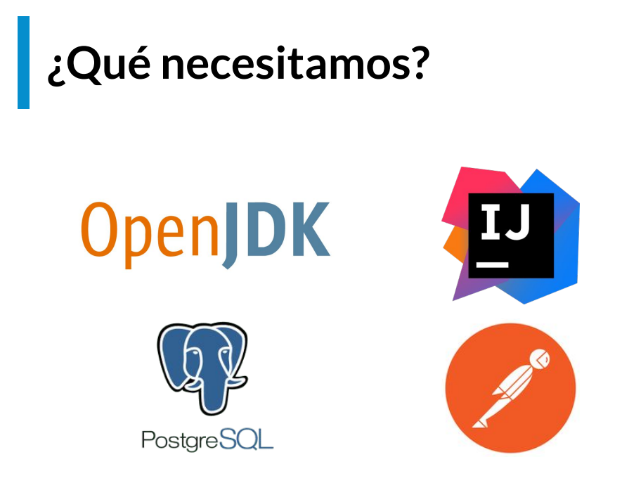

# Módulo 2 - Introducción a Spring boot
## Clase 6 - ¿Qué es y qué usaremos de Spring?
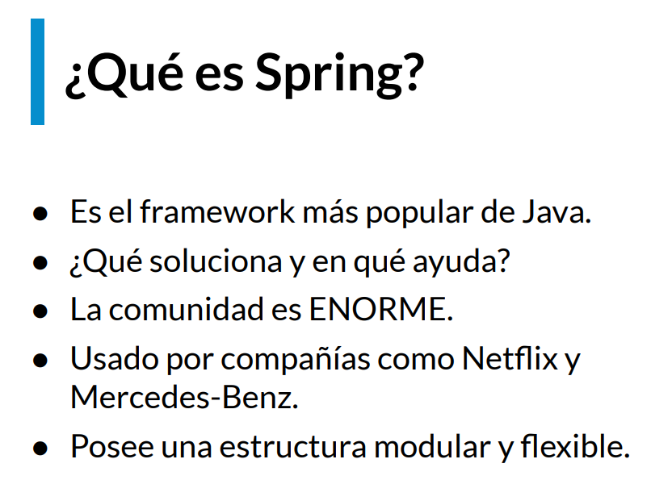

- **Framework** es una estructura que nos ayuda a trabajar de una manera más sencilla con algo, en este caso con `Java`. Nos dá herramientas para hacer desarrollos avanzados, utilizando menos código, mejores prácticas en menor tiempo.

- **Spring** es el framework más usado de `Java`, y nos dá herramientas a los desarrolladores para que nos ocupemos por lo que es importante y es crear un código increible, delegandole a `Spring` tareas repetitivas o de los cuales uno de los subporyectos de `Spring` se pueda encargar.

- También posee una gran comunidad, lo que nos brinda muchísima documentación y ayuda.

- `Spring` contiene cerca de 30 proyectos internos, los cuales van desde crear app web, app reactivas o procesamientos de grandes lotes de información con `Batch`.

- `Spring` tiene una estructura modular y flexible, lo que nos hace usar solo lo que necesitemos.

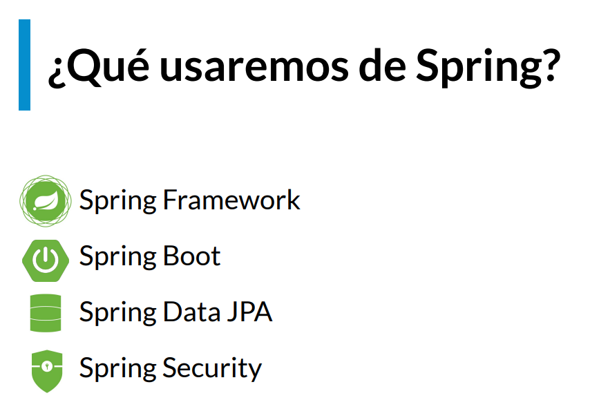

Vamos a usar 4 subproyectos de `Spring`:
- **Spring Framework**: Permite crear aplicaciones empresariales. Es transversal, ya que todos lo usan.
- **Spring Boot**: Con el que podemos crear aplicaciones autocontenidas y autoconfigurables.
- **Spring Data**: Gestionar e integrar bases de datos.
- **Spring Security**: Gestionar la seguridad de la aplicación.

[Documentación de Spring](https://spring.io/projects)

---

## Clase 7 - Conocer qué es una aplicación autocontenida
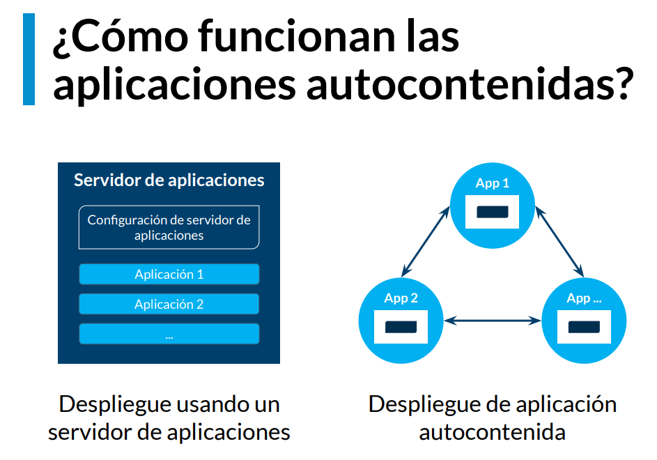

Antes las apps web empresariales lucian como la imagen izquierda, teniamos un servidor de apps configurada, también se desplegaban todas las apps que queriamos que interactuaran entre si.

Ahora las arquitecturas modernas, nos sugieren tener algo como el diagrama de la derecha, donde tengamos pequeñas apps o servicios que interactuen entre si, en vez de una gran app, esto nos da mucha facilidad para el desarrollo y mantenimiento de nuestra app.  
Cada app internamente contiene su propio servidor de apps con una configuración totalmente independiente una de la otra.

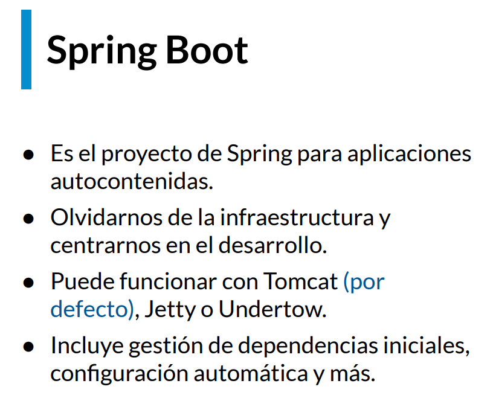

- `Spring Boot` es el proyecto de `Spring` para crear apps autocontenidas.
- Esto permite olvidarnos de la arquitectura y enfocarnos en el desarrollo delegandole a `Spring Boot` labores como configuración de dependencias o desplegar nuestro servicio o app a un servidor de aplicaciones y enfocarnos unicamente en crear el mejor código posible.
- Para esto `Spring Boot` utiliza internamente un servidor de apps embebido o contendor de apps embebido, por defecto usa `Tomcat`.
- También nos provee un completo gestor de dependencias con `Maven` o `Gradle`, configuraciones automaticas y más para que nuestra app sea a la medida

---

## Clase 8 - Crear nuestra aplicación con Spring Initializr
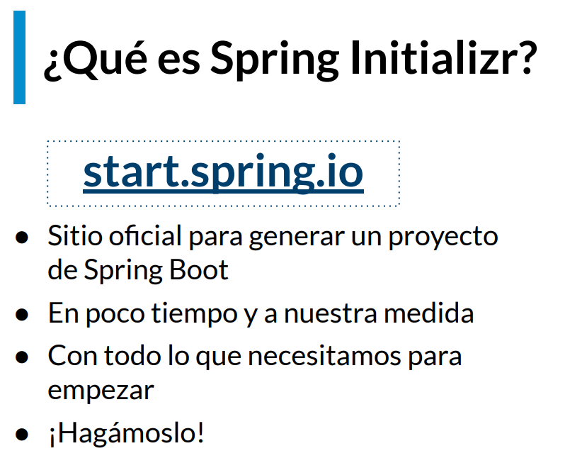

[Spring Initializr](https://start.spring.io/) es el sitio oficial de `Spring` para crear apps autocontenidas, nos ofrece la oportunidad de crear nuestra propia app, utilizando las dependencias que necesitemos y con muy pocos clicks.

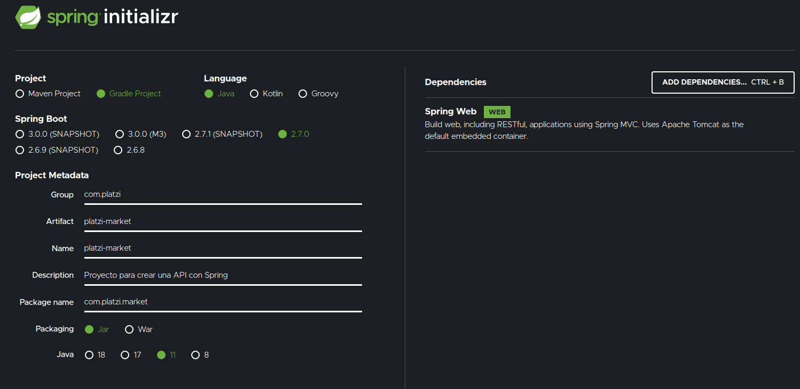

Lo primero que vemos en `Spring Initializr` es que nos pide es el tipo de proyecto:
- `Maven`: Gestionan las dependencias con archivos `XML`.
- `Gradle`: Son escritos en `Groovy` y nos permite crear tareas que se pueden ejecutar al momento de hacer despliegue o integración continua.

Se recomienda siempre usar la versión estable de `Spring Boot`.  
También podemos incluir las dependencias que sabemos que vamos a necesitar, en este caso usaremos `Spring Web`, que me permite crear `APIs REST` usando `Apache Tomcat` como contenedor por defecto.

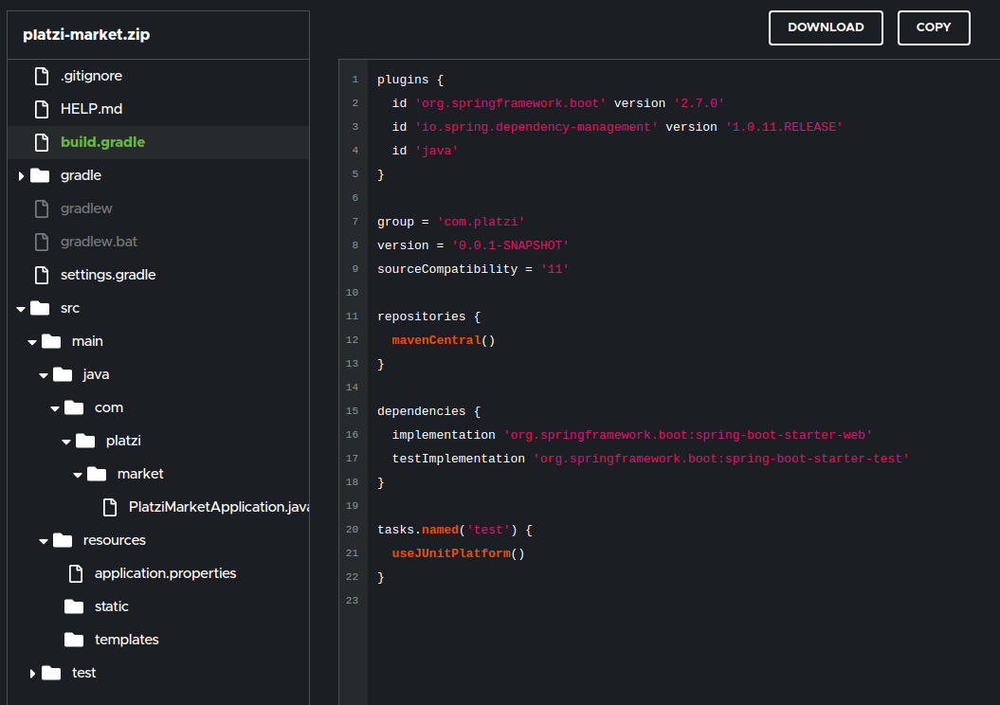

Tenemos varios archivos que nos descargamos con el proyecto:
- `.gitignore`: Nos sirve si queremos montar nuestro código a un servidor de versión de código, un repositorio como ***GitHub***.
- `HELP.md`: Describe brevemente nuestro proyecto.
- `build.gradle`: Escrito en `Groovy` esta toda la configuración de la app. Plugins, grupo, versión, versión de `Java`, repositorios, dependencias y pruebas que vamos a utilizar.
- `gradle`, `gradlew`, `gradlew.bat` y `settings.gradle`: Son necesarios para que `Gradle` funcione y no tenemos que interactuar con ellos.
- `src`: Contiene internamente 2 carpetas:
    - `main`: Para todo lo relacionado con el proyecto.
        - `java`: Contiene todo el paquete de `clases` `Java`.
        En este caso contiene `com/platzi/market` y dentro está `PlatziMarketApplication`, que es la `clase` que contiene el `método` `main`, y tiene la anotación `@SpringBootApplication` para indicar que es esta `clase` la que gestiona la app.
        - `resources`: Dentro está `application.properties` y acá configuramos todo lo necesario para que nuestra app se acomode a nuestro gusto, `variables` que podemos encontrar en la documentación de `Spring` o `variables` que nosotros definamos.
    - `test`: Para nuestras pruebas del proyecto.

---

## Clase 9 - Hola mundo con Spring Boot
Lo primero que hacemos es descomprimir el zip, abrimos una terminal en esa carpeta y con `git init` iniciamos el repositorio de nuestro proyecto.  
Con `git remote add origin git@github.com:FesCoder/platzi-market.git` enlazamos el repo local con el remoto.

Ahora con **Intellij IDEA** vamos a importar el proyecto, nos dirigimos a donde lo tenemos y seleccionamos `build.gradle`.  
Lo que haremos ahora es un pequeño `Controller` para probar que todo es ok y levante el servidor.

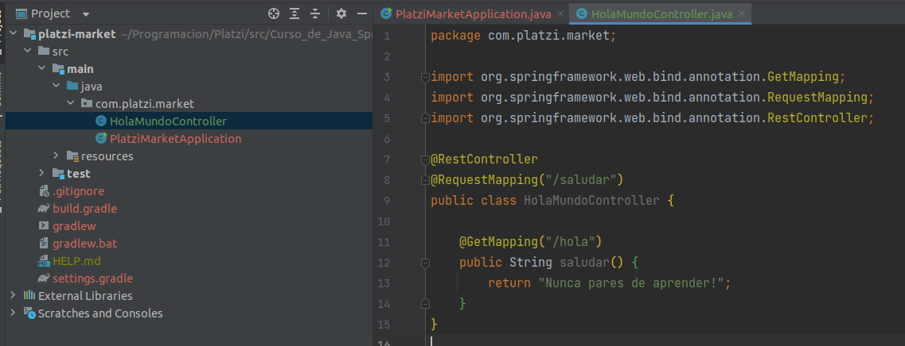

A la hora de compilar lo que hace `Spring` es crear un contendor de apps o un servidor de apps para que nuestra app pueda funcionar.
En el navegador probamos la app, por defecto el puerto que usa `Spring Boot` es el 8080, entonces escribimos `localhost:8080/saludar/hola`.

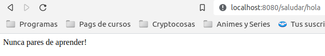

---

Es buena practica usar otro puerto distinto al 8080, hay veces pone problemas segun lo que tengas instalado y ejecutando en tu maquina.  
Y se puede cambiar en el `application.properties` con `server.port=8090`.

---

## Clase 10 - Configurar Spring Boot
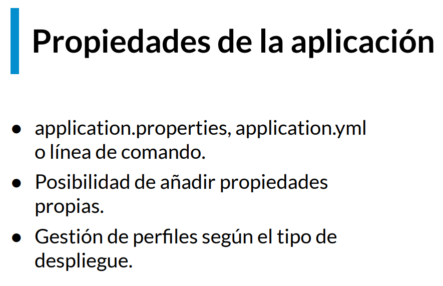

- En `application.properties` podemos gestionar la configuración que va a tener nuestro proyecto, si queremos modificar el puerto por el que se ejecuta, o el context path de nuestra app, entre otras. De forma alternativa podemos usar `application.yml` directamente en la linea de comandos cuando lancemos la app.
- También existe la posibilidad de añadir nuestras propias `variables` o `atributos` para la configuración.
- Nos ofrece la capacidad de gestionar diferentes `perfiles` de acuerdo a los entornos donde estemos. Podemos crear un `perfil` que se ejecute en tiempo de desarrollo y otro que se enfoque unicamente cuando nuestra app esté en producción.

Lo primero que hacemos es modificar el puerto y el class path de nuestra `application.properties`.

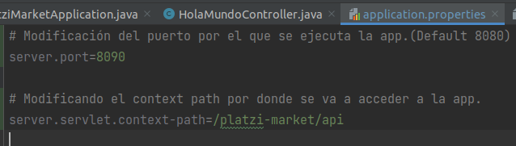

El archivo `application.properties` tiene la capacidad de ser gestionado para varios entornos.  
Lo que tenemos que hacer es crear un nuevo `archivo.properties`, en este caso `application-dev.properties`, lo hacemos con `New -> File`, para que se comporte para un entorno de desarrollo y añadiremos otro para cuando sea producción, `application-pdn.properties`.  
Es importante los nombres de las properties despues del guión(`-`).

Indicaremos con que entorno queremos trabajar en `application.properties` con `spring.profiles.active=dev`, decimos que el perfil activo de `Spring` en este momento es `dev`. Y en `dev` le decimos el puerto que vamos a usar, y para producción será el puerto 80.

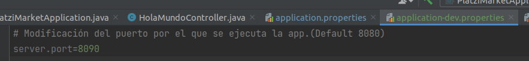

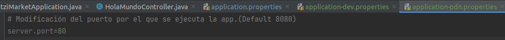

El atributo `class path` se va a compartir con los 2 perfiles ya que lo dejamos en `application.properties`.

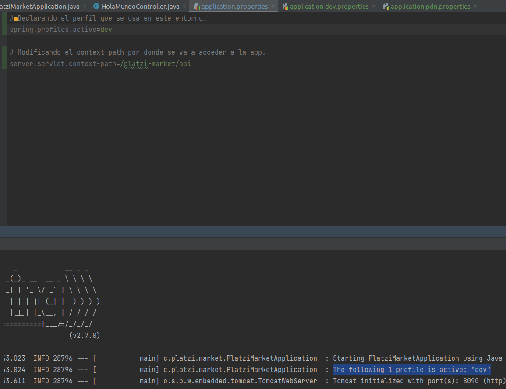

Como podemos ver cuando iniciamos la app nos dice para que perfil está activo en ese momento.

En [este enlace](https://docs.spring.io/spring-boot/docs/current/reference/html/application-properties.html) tenemos todos los atributos de `Spring` que podemos modificar.

---

El tema de los perfiles en Spring Boot es fascinante. Inclusive se pueden utilizar implementaciones de objetos específicos por perfil con la ayuda de la anotación `@Profile`. [Más info.](https://docs.spring.io/spring-boot/docs/current/reference/html/spring-boot-features.html#boot-features-profiles)

Formato de configuración con `yml`.

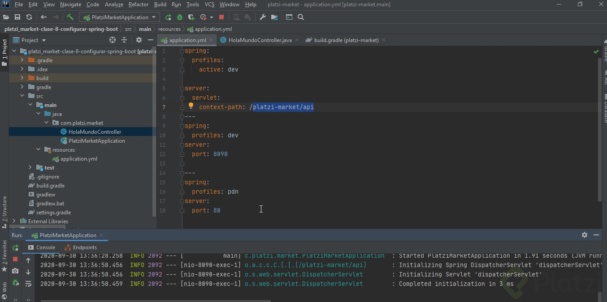

---

## Clase 11 - Crear la estructura del proyecto
La arquitectura que usaremos será una por capas orientada al ***Dominio***, conocida como `DDD` (Domain Driven Design).

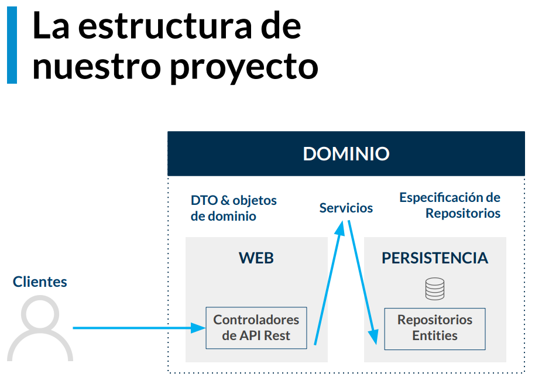

- La primera capa es la del ***Dominio***, donde vamos a tener:
    - **Los DTOs y objetos de dominio**: que son objetos que hacen parte del contexto de nuestra app, en este caso de un supermercado.
    - **Los servicios**: son los encargados de servir como puente entre los `controladores` de la `API` y la `capa de persistencia` o `repositorio`, que es quien interviene en la DB.
    - **La especificación de los repositorios**: son interfaces que definen las reglas de juego o contratos, que de cumplir la persistencia, para intervenir entre los objetos de dominio y la DB.
- La otra capa es la ***Web***, en esta vamos a tener los `Controladores` de nuestra `API`. Como el que hicimos en la clase anterior.
- La última capa es la de ***Persistencia***, que es la capa que tiene la obligación de interactuar con lal DB. Acá vamos a tener los `repositorios`, que son los que van a implementar las especificaciónes que tenemos en ***Dominio*** y también las `Entities`. Las `Entities` son las clases que mapean y hacen de tablas de nuestra DB.

El flujo seria:
- Un `cliente` hace un llamado a un `Controlador` de nuestra `API`.
- El `controlador` va al `servicio`, que contiene todo lo necesario para intervenir en esa operación.
- El `Servicio` va a ir al `repositorio` que necesite, y acá es donde ocurre cuando tenemos que hacer alguna gestion o movimiento a nuestra DB.

Entonces en el proyecto creamos:
- 3 `packages` llamados `domain`, `persistence` y `web`.
    - Dentro de `domain` creamos 3 `packages` llamados `dto`, `repository` y `service`.
    - Dentro de `persistence` creamos 2 `packages` llamados `crud` y `entity`.
    - Dentro de `web` creamos 1 `package` llamado `controller`.

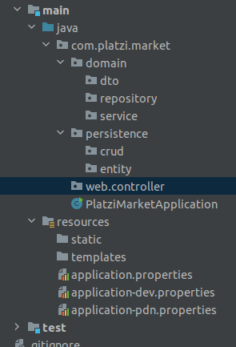

Con esto nuestro proyecto ya cuenta con una estructura solida, que nos permite tener un código más organizado, donde sea más facil escribir código y mantenerlo.

---

Al realizar creaciones de `paquetes` estas deben estar por debajo de la clase donde se encuentre nuestro `main` (`@SpringBootApplication`), ya que `Spring` scanea desde ese punto hacia abajo por defecto, de lo contrario se tendra que mencionar en esa misma clase la ruta que scaneara.

Para quien esté interesado en conocer un poco más sobre `DDD` (Domain Driven Design) [aquí](https://medium.com/@jonathanloscalzo/domain-driven-design-principios-beneficios-y-elementos-primera-parte-aad90f30aa35) les dejo un artículo introductorio.

---

# Módulo 3 - Spring Data
## Clase 12 - ¿Qué es JPA?
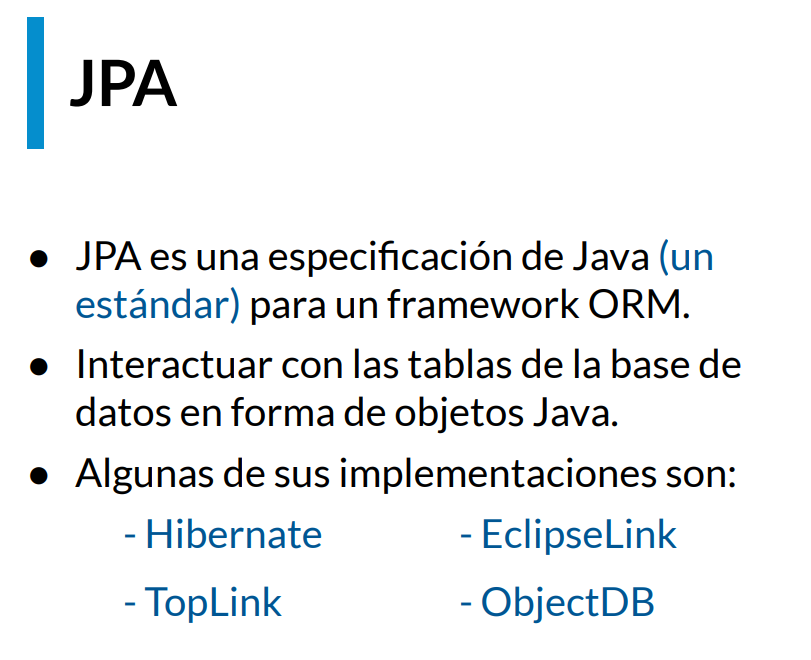

`JPA` (Java Persistence API) es una especificación de `Java` para un framework `ORM` (Object Relational Mapping, un mappeo objeto relacional).  
Quiere decir que son unas series de reglas que `Java` define para que cualquier framework que quiera interactuar con la DB, desde `Java`, tenga que seguir.

Para este fin, `JPA` usa anotaciones para conectar `clases` a `tablas` de nuestra DB y así evitar hacerlo de manera nativa con `SQLs`, y lo hacemos directamente con código `Java`.

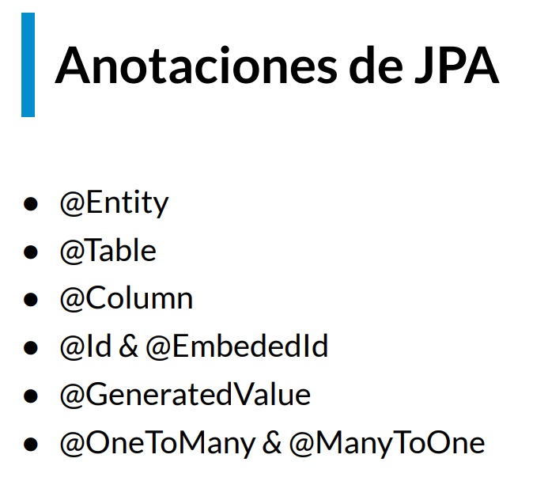

- `@Entity`: Es la que indica a una `clase` que está representando una `tabla` de nuestra DB.
- `@Table`: Es la que recibe el nombre de la `tabla` a la cual está mapeando nuestra `clase`.
- `@Column`: Es una anotación que se le pone a los `atributos` de nuestra `clase`. No es obligatoria, solamente debemos ponerla cuando el nombre de nuestra `columna` sea diferente al nombre del `atributo` de nuestra `tabla`.
- `@Id` y `@EmbededId`: Representan la `PK` de nuestra `tabla` en la `clase`.
    - `@Id` se usa cuando es una `PK` sencilla.
    - `@EmbededId` cuando es una `PK` compuesta.
- `@GeneratedValue`: Nos permite generar automaticamente valores para las `PK` de nuestras `tablas` en la `clase`.
- `@OneToMany` y `@ManyToOne`: Representan las relaciones que existen entre las `tablas`, pero a nivel de las `clases`.

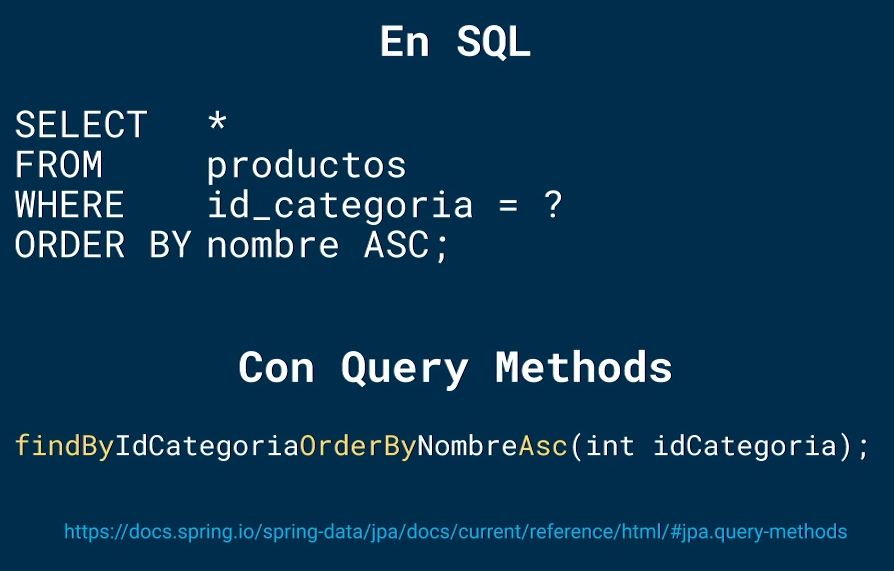

Con esto nos queda claro como `Java` se integra con nuestras DB mediante `JPA`.

---

## Clase 13 - Conocer qué es Spring Data
`Spring Data` no es una implementación de `JPA`, es un proyecto que usa `JPA` para que la gestión de tareas desde `Java` en las DB sea más poderosa y llena de posibilidades.

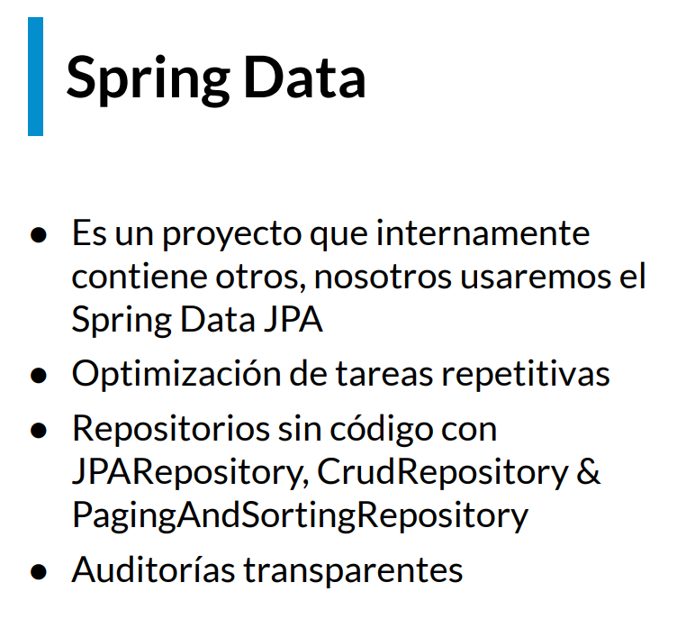

- `Spring Data` contiene varios subproyectos, entre ellos:
    - `Spring Data JPA` o `Spring Data JDBC`: Estos sirven para conectarnos a DBs que son `SQL` o `relacionales`.
    - `Spring Data MongoDB` o `Spring Data Cassandra`: Para conectarnos a DBs que son no `SQL`.
- La tarea principal de `Spring Data` es optimizar tareas que resultan repetitivas para los desarrolladores (escribir, consultar, actualizar y borrar registros).
- Todo esta ya lo tiene en sus repositorios sin código, que son un sin fin de posibilidades, nos permiten hacer todo tipo de operaciones en DB sin escribir una sola linea de código.
- También nos provee de auditorias transparentes, de las cuales no nos tenemos que preocupar, `Spring Data` posee un motor de auditorias que nos permiten saber cuando se inserto, borro o actualizo un registro.

Para incluir `Spring Data` dentro de nuestra app primero tenemos que encontrarlo en [MVNRepository](https://mvnrepository.com/) y lo buscamos como `Spring Boot Starter Data JPA`, elegimos la última versión y en el tag de `Gradle` vemos que tenemos el grupo y el nombre.

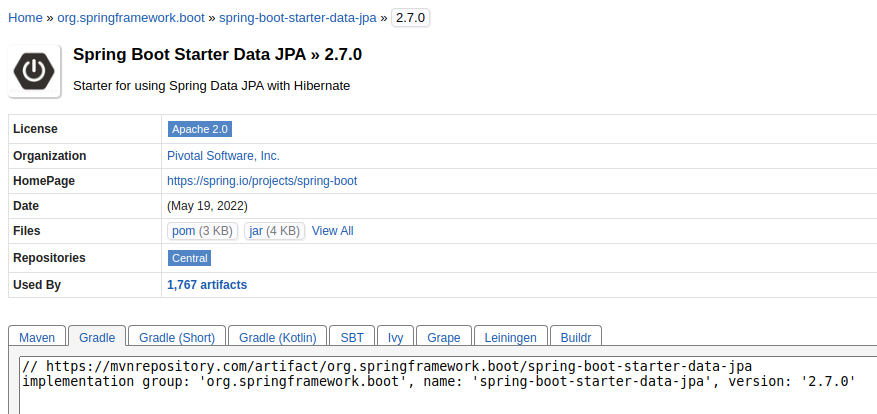

En `build.gradle`, en la sección de dependencias lo insertamos escribiendo `grupo:nombre` y recargamos `Gradle` para los cambios.

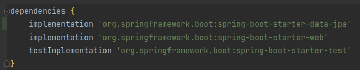

---

## Clase 14 - Conectar la base de datos a nuestra aplicación
Modelo de datos del proyecto:

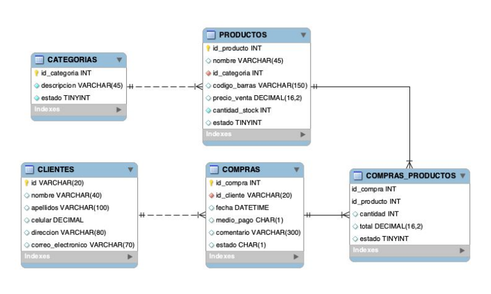

Tenemos 2 archivos en la clase:
- `schema.sql`: Contiene el modelo de datos en `SQL` para que podamos crear la DB.
- `data.sql`: Contiene un set de datos iniciales para interactuar con la DB por medio de la `API`.

**Creando la DB**
- Abrimos `PostgreSQL` a través de `pgAdmin4`.
- Creamos una nueva DB llamada `platzi-market`, `click derecho en Databases -> Create -> Database`.
- Creamos un nuevo `Script` en la DB, `click derecho en la DB -> CREATE Script`.
- Copiamos y pegamos el `schema.sql` en el nuevo `Script` y lo ejecutamos.
- Hacemos lo mismo con `data.sql` y a parte de insertar el set de datos inciales estamos reiniciando las secuencias.

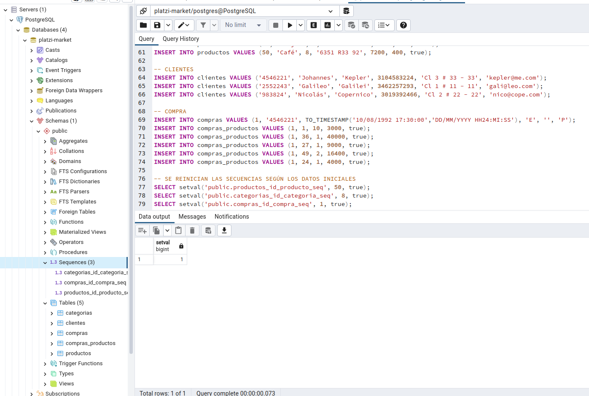

Una secuencia es el numero en el que va una `PK` de nuestro modelo de datos, en este caso reinciamos `producto`, `categorias` y `compras`, para que empiecen conforme en donde dejamos nuestro set de datos. Si el último `producto` tiene `id` 9, lo indicamos en la secuencia y cuando ingresemos un nuevo `producto` sera con el `id` 10.

**Conectando la app a la DB**  
En `Intellij IDEA` añadimos una `dependencia` que se encarga de gestionar el `postgreSQL`.  
En vez de `implementation` escribimos `runtimeOnly`, ya que solo lo necesitamos en tiempo de ejecución, la `dependencia` la obtenemos en `MVNRepository` buscando `postgresql` y encontramos `PostgreSQL JDBC Driver`.  
Actualizamos `Gradle`, que lo que hace internamente es verificar las nuevas `dependencias` incluidas y cargandolas dentro de nuestra app.

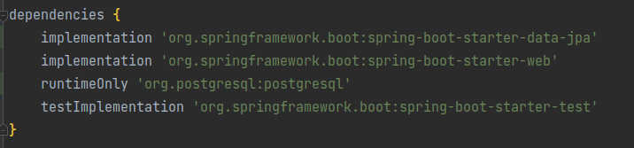

En `application-dev.properties` vamos a añadir la configuración para que la app se conecta a la DB.

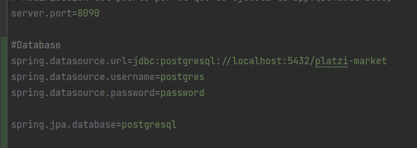

Lanzamos nuestra app, es decir, compila el código, procesa los recursos, crea las `clases` y lanza la app de `Spring Boot`.  
Nuestra app en poco tiempo es capas de iniciar el servidor, meter la app en ese servidor, crear la conexión a la DB y conectarla a esa DB.

---

Aunque `Java` puede descubrir el `driver` por la `url`, es buena practica decir el `driver`. Para `postgresql`:
~~~
spring.datasource.driver-class-name=org.postgresql.Driver
~~~

De esta forma `Spring` usara ese `driver` y si la `url` esta mal escrita indicará los errores, sino se coloca el `driver` y la `url` esta mal escrita `Spring` dira que no encuentra `driver` para conectarse.

---

Podríamos incluir `Flyway` para versionar la base de datos y mantener la consistencia sin importar si ejecutamos la aplicación en desarollo o producción, con solo incluir la `dependencia` de `flyway` en el proyecto, el starter de `Spring Boot Data JPA` se encarga de autoconfigurarlo.
~~~
implementation 'org.flywaydb:flyway-core:7.0.0'
~~~

Dentro de `resources` creamos la estructura de carpetas como se muestra en la imagen y un archivo donde pegaremos el contenido de `schema.sql`.

Ya solo bastaría agregar una `clase` para decirle a `flyway` que ejecute todos los `scripts` que encuentre en la carpeta `db/migration`.
~~~
@Configuration
public class DatabaseConfig {

    @Bean
    public FlywayMigrationStrategy migrationStrategy() {
        return flyway -> {
            flyway.repair();
            flyway.migrate();
        };
    }
}
~~~

Al correr la aplicación veremos que se genera una `tabla` que lleva el control de las versiones de la base de datos llamada `flyway_schema_history`.  
Si necesitamos cambiar la estructura de la base de datos ya solo agregaremos archivos `.sql` en la carpeta `db/migration` y `flyway` se encargará de ejecutarlos automáticamente. Así mantenemos la consistencia en todos los ambientes donde ejecutemos la aplicación sin tener que correr los `scripts` manualmente.

---

## Clase 15 - Mapear las tablas como clases
Las `Entities` son las `clases` que mapearan las `tablas` gracias a `JPA` y sus anotaciones.

Para crear nuestras `entity beans` usaremos:
- `@Entity`: Para que `Java` sepa que es una `clase` que representa una `tabla` de la DB.
- `@Table(name="nombre_tabla_db")`: Cuando tenemos nombres diferentes entre `tabla` y `clase` agregamos esta anotación.
- `@Column(name="nombre_columna_db")`: Lo mismo que `@Table` pero para `columnas` y `atributos`.
- `@Id`: Cuando es la `PK` sencilla.
- `@GenerateValue(strategy = GenerationType.IDENTITY)`: Cuando la `PK` se genera automáticamente.

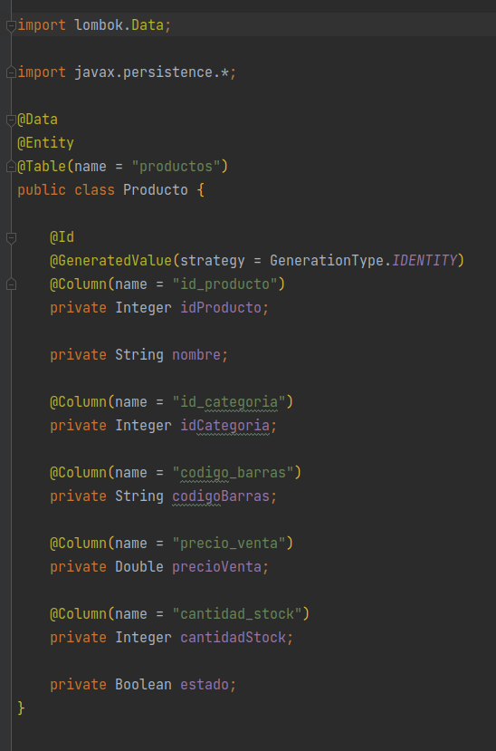

También generamos sus respectivos `Getters` y `Setters`.  
Hacemos lo mismo con las `clases` `Compra`, `Categoria` y `Cliente`.  
Siempre usar `Atributos` que sean de tipo `clase`, en vez de usar `int` (tipo primitivo) debemos usar `Integer`. Siempre trabajaremos con objetos ya que es posible que en un determinado momento tengamos un valor null desde la base de datos. Sí tuviéramos un `int` sería 0 por defecto y esto sería un `error`.

---

Dicen que es conveniente cambiar los tipo de `Ids` por `Long`.

Con la `libería` `Lombok` podemos generar automáticamente los `Getters` y `Setters` usando anotaciones y así ahorrarnos mucho código.  
Para incluirla debemos añadir esta `dependencia` en `Gradle`:
~~~
compileOnly 'org.projectlombok:lombok'//, version: '1.18.24'
~~~

Y ya solo bastaría agregar las `anotaciones` en la `clase` para generar los `Getters` y `Setters`.
~~~
@Getter
@Setter
@Entity
@Table(name = "products")
public class Product {}
~~~

Si ponemos `@Getter` y `@Setter` a nivel de `clase`, se generarán `Getters` y `Setters` para todas sus `propiedades`. Si queremos para sólo una `propiedad` basta con poner las `anotaciones` arriba de la `propiedad`.

Podemos reemplazarlos con la `anotación` `@Data` que nos genera toda la estructura del proyecto (`Getters`, `Setters`, `equals` y `toString`).  
En IntelliJ, en el lado izquierdo nos aparece una pestaña con el nombre Structure donde muestra todos los métodos generados pero no aparece el código por lo que nos queda un fichero muy limpio.
~~~
import lombok.Data;

@Entity
@Data
@Table(name = "products")
publicclassProduct {}
~~~

**Conclusión profe:**  
Puedes utilizar las anotaciones `@Getter`, `@Setter`, e incluso `@Builder` de `Lombok` para tu `Entity`.  
Sin embargo, debes tener cuidado con otras anotaciones como `@Data`, `@ToString` ó `@EqualsAndHashCode` ya que generan código que no es 100% correcto para `entities` (estas clases tienen algunos requerimientos especiales para estos métodos).  
En este [vídeo](https://www.youtube.com/watch?t=65&v=j_hEdLPDczI&feature=youtu.be) puedes ver a lo que me refiero y cómo evitarlo.

---

## Clase 16 - Crear Entity cuando su clave primaria es compuesta
No podemos añadir directamente los `atributos` que componen la `PK` dentro de nuestra `Entity` `comprasProducto`.  
Lo que debemos hacer es crear otra `clase`, `ComprasProductoPK`, que las contenga y luego meterla dentro de `comprasProducto`.

Como no va a mapear una `tabla` no le ponemos `@Entity`, la `anotación` que usamos es `@Embeddable`, porque esta `clase` la vamos a embeber dentro de `comprasProducto`, debemos implementar una `interfaz` de `Java`, `Serializable`, con esto ya podemos incluir los `atributos` que componen la `PK`.

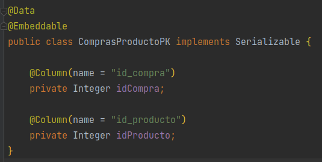

Ahora en la `clase` `ComprasProducto` añadimos un `atributo` de tipo `ComprasProductoPK` y lo anotamos con `@EmbeddedId`, entonces podemos decir que `@Id` se usa cuando es una `PK` sencilla y `@EmbeddedId` cuando es compuesta y está dada por otra `clase`.

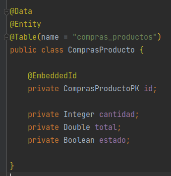

---

Para `variables` que representan dinero se debe de ocupar `Bigdecimal` en vez de `Double`, el `MonetaryAmount` tambien puede ser una posibilidad.  
Podemos leer todo lo que viene en `Java` para el manejo de dinero en [Java Money and Currency API.](https://www.baeldung.com/java-money-and-currency)

---

## Clase 17 - Mapear relaciones entre clases
Comenzamos relacionando las `clases` `Producto` y `Categoria`, creamos una `variable` en `Producto` de tipo `Categoria`, al que le agregaremos `anotaciones`:
- `@ManyToOne`: Este es el tipo de relación. Porque tengo muchos productos para una categoria.
- `@JoinColumn(name="id_categoria", insertable = false, updatable = false)`:
    - `Producto` esta relacionada con `Categoria` a traves de `id_categoria`.
    - `insertable` y `updatable` es para que no puedan insertar ni actualizar nada en la `tabla` desde acá. Se debe hacer desde `Categoria`.

Para cerrar, en `Categoria` hay que crear una `lista` de tipo `Producto` y la anotamos con:
- `@OneToMany(mappedBy="categoria")`: Es el tipo de relación, de una a muchas, una categoria tendrá muchos productos. Y añadimos un `parámetro` `mappedBy` que dice por quien está mepeado o que relación respalda este `atributo`, que es `categoria`.

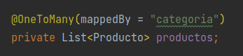

Lo mismo con la relación `Cliente` y `Compra`, para saber donde usar el `@ManyToOne` o `@OneToMany` se lee: la primera palabra es de la clase y la otra del atributo, por ejemplo, Many Compras pertenecen a One cliente, al revés, One Cliente tiene Many compras, por eso es una `Lista`.

**Cliente**  
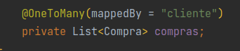

**Compra**  
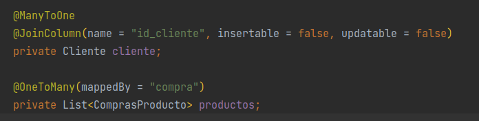

Hacemos la relación `CompraProductos` y `Compra`.

**CompraProductos**  
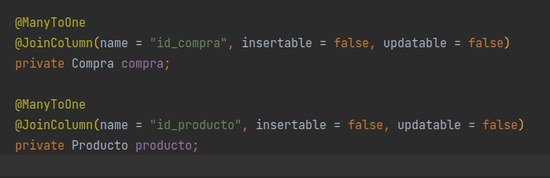

Este tipo de relaciones deben ser creadas siempre respondiendo a la pregunta ***"¿De verdad necesito esta relación?"*** porque claramente pueden existir relaciones innecesarias que afecten el rendimiento y la gestión de memoria de nuestra aplicación.

---

## Clase 18 - Usar la interface CrudRepository
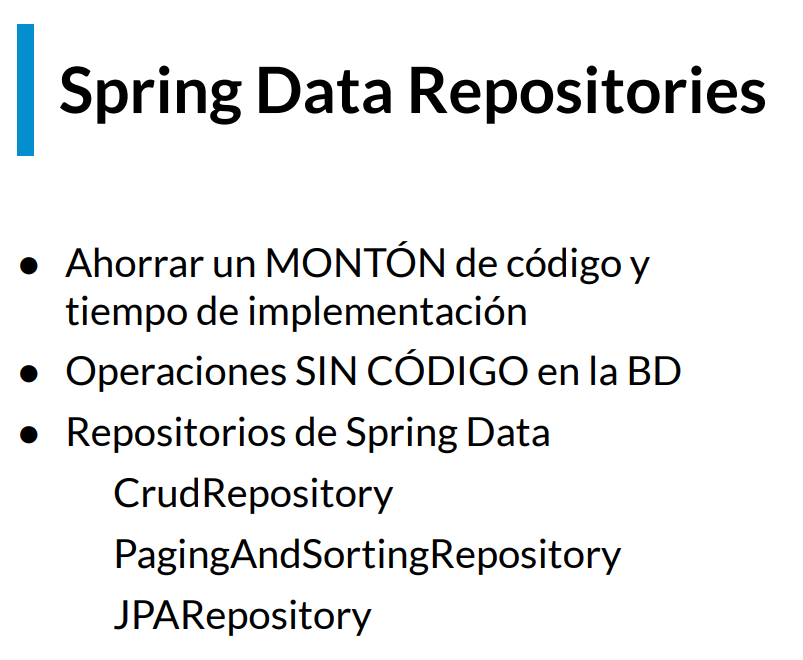

- Los repositorios de `Spring Data` nos ayuda ahorrando mucho tiempo a la hora de construir nuestras apps.
- Esto nos permite hacer operaciones sobre la DB sin escribir tantas lineas de código, los hace automaticamente los repositorios de `Spring Data`
- Repositorios de `Spring Data`:
    - `CrudRepository`: Permite realizar operaciones CRUD (Crear, Leer, Actualizar o Eliminar).
    - `PagingAndSortingRepository`: Nos permite hacer lo del `CrudRepository` + tareas de paginación y ordenamiento del repositorio.
    - `JPARepository`: Lo mismo que los 2 anteriores + tareas de JPA especificas, como `flush` que combina o guarda todo en memoria sin que otras entidades o entornos vean esos cambios en la DB.

Crearemos una `interfaz`, en `crud`, que interactue con `Producto` implementando `CrudRepository`, a lo cual recibe 2 parámetros, la `Tabla` y el tipo de `PK` y ya con esto nos ahorramos mucho código.

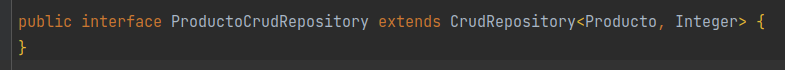

Si analizamos un poco dentro de esa interfaz encontramos `métodos` que podemos usar:
- `save`: Guarda una `entidad`, un registro.
- `saveAll`: Guarda muchas `entidades`, muchos registros.
- `findById`: Recibiendo un `Integer` devuelve un `Entity`.
- `existById`: Verifica dada una `PK` si una `Entidad` existe o no.
- `findAll`: Para recuperar toda la `lista` de registros que existan en esa `tabla`.
- `findAllById`: Recupera toda la `lista` con una `PK`.
- `count`: Para averiguar cuantos elementos existen en esa `tabla`.
- `deleteById` y `delete`: Para borrar información de esa `tabla`.
- `deleteAll`: Borra todo lo de la `tabla` que le pasemos como `parametros` en una `lista` o simplemente todo sin `parámetros`.

Ahora implementaremos nuestra nueva `interfaz`, en el `paquete` `Persistence` creamos la `clase` `ProductoRepository` y vemos como instanciando una variable de esa interfaz podemos acceder a todas estas posibilidades.

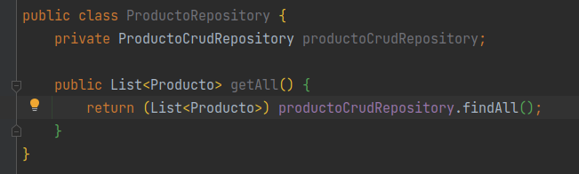

---

## Clase 19 - Query Methods
Una poderosa herramienta de `Spring Data` para hacer consultas sin `SQL`.

Los `Query Methods` nos permiten generar consultas solo nombrando a los `métodos` de una manera en particular, y podemos retornar el tipo de dato `Optional`, esto para garantizar que nuestro sistema sea felxible hacia la `programacion funcional`.

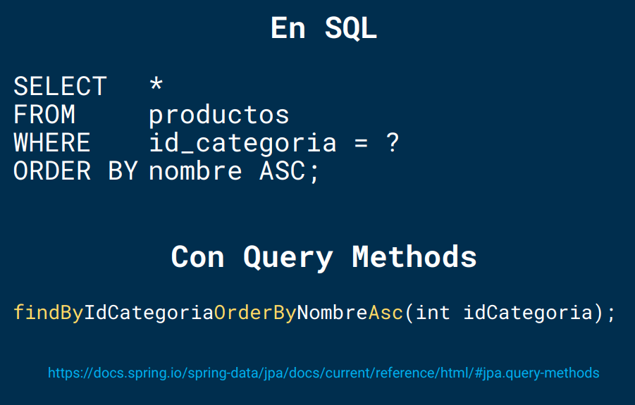

A modo didactico, podemos hacer `Queries nativos`, le indicamos cual es la consulta dentro de `Query` y como nombre del `método` puede ser cualquiera, funcionaria de la misma forma, esto se usaría más si terminan siendo muy largos los nombres de los `métodos`.

Ejemplos:  
Traer los productos que se estan agotando y estoy vendiendo, es decir que estan activos.

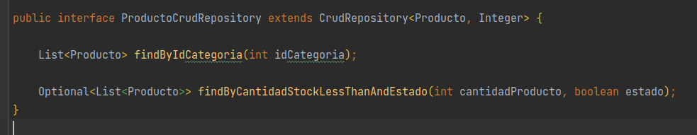

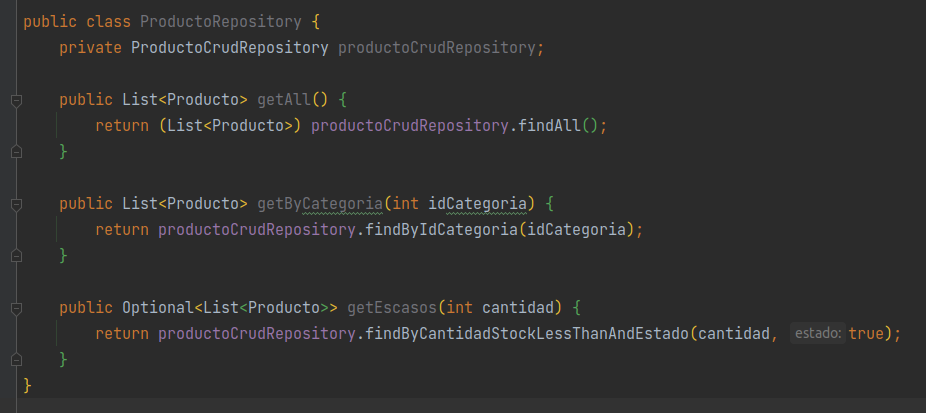

---

Los `Query Methods` son muy potentes, también permiten realizar múltiples operaciones de comparación con:
- **Números:** Mayores, menores, iguales…
- **Textos:** Contiene cierta porción de texto, empieza o termina con una porción de texto, ignora case sensitive…
- **Fechas:** Antes de cierta fecha, después de cierta fecha, entre cierta fecha…
- **Joins entre entidades:** Si tenemos una entidad que se relaciona con otra, es posible realizar “joins” con esa relación para tener queries más específicas según nuestra necesidad. Por ejemplo, si tengo una relación de Producto y Categoría y quiero tener todos los productos de cierta categoría podría hacer: findAllByCategoriasId(Integer categoriaId) y así poder llegar a esta relación. Esto puede mezclarse con múltiples relaciones en simultáneo.
- **Comparación entre un conjunto de datos:** Si por ejemplo quiero traerme los productos con varias categorías, podría escribir findAllByCategoriasIdIn(List<Integer> categoriaIds); y así trabajar bajo un conjunto de Id de categorías.

Se pueden ver más detalles [acá](https://docs.spring.io/spring-data/jpa/docs/current/reference/html/#jpa.query-methods.query-creation)

---

# Módulo 4 - Construyendo nuestra API
## Clase 20 - Implementar la anotación @Repository
`@Component` es una generalizacion de tipo de anotaciones para `Spring`, estamos diciendo que es una componente de `Spring` basicamente, y con `@Repository` especificamos que tipo de componente es y es una anotación para indicarle a `Spring` que esta `clase` se encarga de interacrtuar con la DB.

---

**¿Por que @Repository y no @Service?**  
El repositorio (ver Repository Pattern) es una capa de abstracción que se añade a tu sistema para desacoplar el motor de base de datos de tu aplicación, básicamente te ayuda a que tu aplicación no dependa del tipo de base de datos que estas utilizando, si mañana quisieras cambiar Postgres por mysql o MongoDB, solo tendrías que modificar el repositorio y el resto de tu aplicación no debería verse afectada en gran medida (sería lo ideal). Esta capa es solo para interactuar con tu base de datos y NO posee lógica de negocio.

Un service por el contrario, es la capa que guarda la mayor parte de la lógica de tu negocio y su responsabilidad es esa, implementar lógica, no relacionarse con una base de datos.

---

## Clase 21 - ¿Qué es el patrón Data Mapper y qué resuelve?
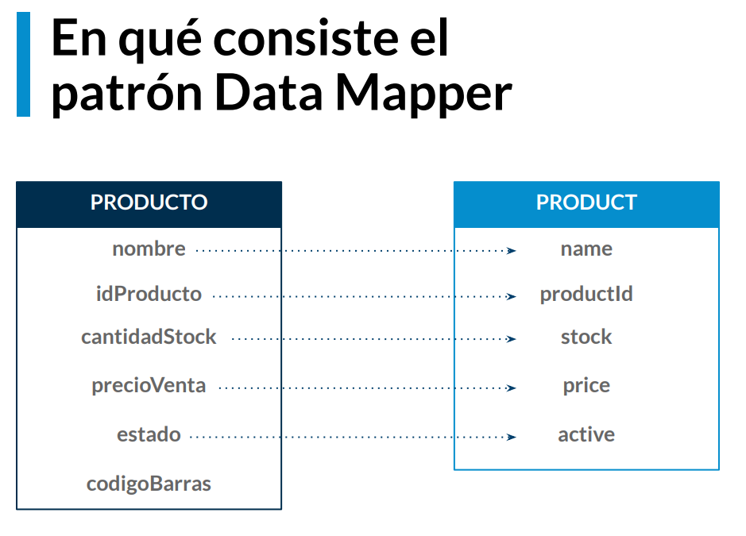

El patrón `Data Mapper` se encarga de convertir 2 objetos que pueden hacer una misma labor.

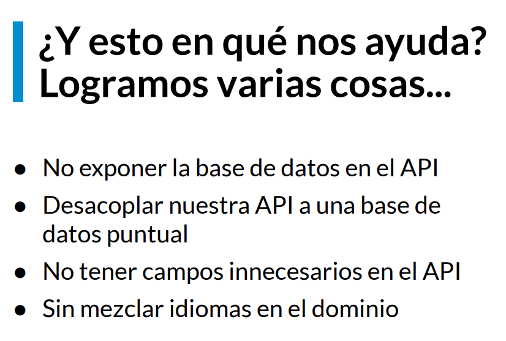

- No exponemos la DB, nos garantizamos de que ningún agente externo va a poder darse cuenta de que forma estan diseñadas nuestras `tablas` de DB.
- Si a futuro queremos integrar una nueva DB, que contenga otros nombres, no tenemos que cambiar todo el código para que funcione, simplemente creamos otro traductor que sirva para traducir esta nueva `tabla` al `dominio`.
- Existen atributos, como `codigoBarras`, que no me interesan llevar hasta la API, porque solo tienen sentido dentro de la DB o la capa de persistencia.
- Evitamos mezclar idiomas dentro de nuestra app.

Para implementar `Data Mapper` dentro de nuestro proyecto vamos a usar [MapStruct](https://mapstruct.org/) que es un generador de código que simplifica mucho las cosas para hacer este tipo de mapeos, para usarlo instalamos las dependencias de `Gradle`.
~~~
implementation 'org.mapstruct:mapstruct:1.4.2.Final'
annotationProcessor 'org.mapstruct:mapstruct-processor:1.4.2.Final'
~~~

Agregamos tambien un plugin para autocompletar las estrucutras de `MapStruct` dentro de **Intellij** y podemos:
- Googlear ***map struct for intellij idea*** y nos sale un plugin de Jet Brains. Entramos, instalamos y vemos que Intellij nos dice que acaba de instalar el plugin.
- O buscarlo dentro de Intellij `File-> Settings-> Plugins-> Buscar MapStruct Support-> Install`.

Como el proyecto está enfocado a `Dominio`, vamos a usar esta estructura, creamos 2 `clases`, `Product` y `Category`, que contendran sus respectivos `atributos` que se convertiran en los `atributos` de las `@Entitys` (`Producto` y `Categoria`).

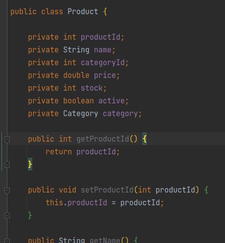

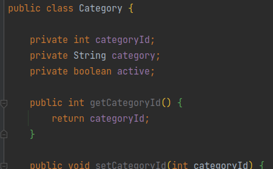

Incluso agregamos `Category` como atributo de `Product` ya que estamos hablando en terminos de `Dominio` y excluimos `codigoBarras`, o sea no lo tenemos dentro del `Dominio`, y agregamos los `Getters` y `Setters` para terminar con mi `Dominio` en ese sentido.

Creamos un nuevo `repositorio` para que le indiquemos a todos los `repositorios` como se deben de comportar cuando estemos hablando en terminos de `Productos`.  
En el `paquete` `repository` cremos una nueva `interfaz`, `ProductRepository`, en la que indicaremos el nombre de los métodos que queremos que, cualquier repositorio que vaya a trabajar con `Productos`, tenga que implementar.

Una vez construidos, la clase `ProductoRepositoy` (la encargada de interactuar con la DB) va a implementar los métodos declarados en este nuevo `repositorio` para que al final del día hablen en terminos de `Dominio`, es decir de `Product` y no de `Producto` que es la `tabla` a la cual estamos haciendo referencia en la DB.

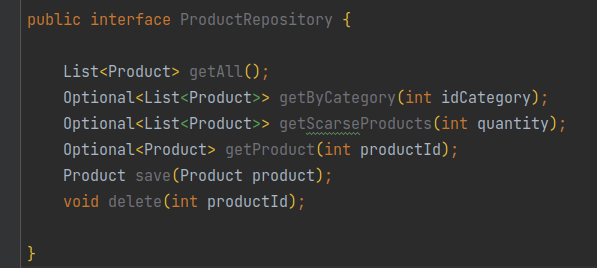

Con esto ya definimos las reglas que va a tener nuestro `Dominio` al momento que cualquier repositorio quiera usar o acceder a `productos` dentro de una DB, esto nos garantiza no acoplar nuestra solución a una DB especifica si no que siempre estemos hablando en terminos de `Dominio`, en este caso de `Product`, y quedan los objetos de `Dominio` para ser utilizados. Son muy importantes estos objetos ya que se encargan de llevar a cuestas toda la lógica de nuestro Domnio o negocio.

---

**DATA MAPPER**
- Convertir o traducir dos objetos que pueden hacer una misma labor.
- No exponer directamente la base datos medianta la API.
- Esto garantiza que ningun agente externo, vizualice la forma del diseño de la base de datos.
- Desacoplar la API de una base de datos puntual.
- En el caso que se desee integrar una nueva base de datos con otros campos, pero que sea para el mismo proyecto, no es necesario cambiar todo el código, simplemente se crea otro traductor que sirva para traducir la nueva tabla al dominio.
- Evita tener campos innecesarios en la API.
- Evitar mezclar idiomas en el dominio.

Cuando se construye un software siempre buscamos que exista un bajo acoplamiento entre componentes.  
En este caso, `MapStruct` me permite evitar que los `entities` se conviertan en objetos transversales de la aplicación (que van desde la base de datos hasta el controlador Rest). Así tendré objetos de dominio que serán los que finalmente estarán expuestos en la `API` y por otra parte tengo los `entities` que solo vivirán en la capa de datos.

**¿Porque en Entity se usa Integer en Id y en Dominio se usa int?**  
La única razón es porque los `entities` deben lidiar con datos `null` que vienen desde la base de datos y que se deben procesar así. En realidad los `DTO` también pudieron ir igual porque sería lo mismo, pero como estoy seguro que desde la base de datos siempre se trae información no hay problema.

---

## Clase 22 - Orientar nuestra API al dominio con MapStruct
Para empezar a mapear nuestros `objetos de Dominio` y las `entities`, primero creamos un `package`, `mapper`, que contengan estos traductores.
Dentro de `mapper` creamos una `interfaz`, `CategoryMapper`, con la anotación `@Mapper` para indicar que es un mapeador, adicionalmente `MapStruct` nos ofrece una integración con `Spring`, para esto usamos `componentModel` al que le decimos "spring", para que se entienda que es un componente de `Spring`.

Diseñamos los mappers, en este caso el que convierte de `Categoria` a `Category`, lo llamamos `toCategory` y lo anotamos con `@Mappings`, para indicarle como quiero traducir mis objetos, dentro de la anotacion usamos `@Mapping` y le decimos, con `source` (fuente, la variable que pasamos) y `target` (a donde quiero llevarlo, destino `Category`), que `variable` representa a la `variable` de la otra `clase`.

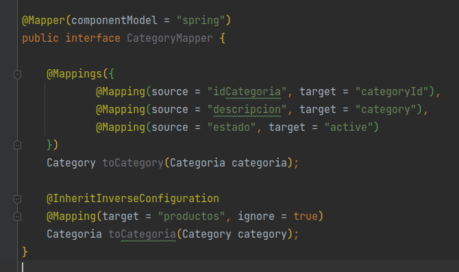

Conversión externa, invertido, de `Category` a `Categoria`, para este caso usamos la anotación `@InheritInverseConfiguration` que indica a `MapStruct` que la conversion que haremos acá es la inversa (source pasa a ser target y lo de target a source) a la que hacemos en `toCategory`, por lo cual no tenemos que definir `@Mappings`.  
Pero pasa que también tenemos una `lista` de `Productos` en `Categoria` que en la otra clase no, y como no lo mepeamos, lo ignoramos con `@Mapping(taget = "productos", ignore = true)`.

Cuando ya tenemos un `mapper` y lo queremos incluir dentro de otro, como en `toProduct`, agregamos dentro de `@Mapper` otro `parámetro` `uses=CategotyMapper.class`, entonces internamente sabe que cuando convierta `categoria` dentro de `toProduct` tiene que usar `CategoryMapper`.

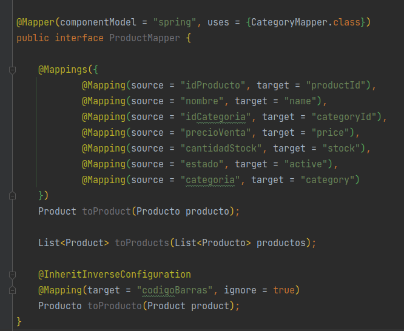

Si queremos crear un `mapper` de una `lista` de `productos`, solo debemos definirla porque `MapStruct` se encarga de usar lo que ya le indicamos para convertirlo ya que es el mismo tipo de conversión.

---

## Clase 23 - Orientar nuestro repositorio a términos del dominio
Es momento de tomar nuestro `ProductoRepository` y orientarlo a `dominio`.  
Lo primero que hacemos es extender de la `interfaz` `ProductRepository`, que habla en terminos de lo que queremos retornar finalmente, y nos pide implementar los `métodos` faltantes, tenemos unos errores de conversión y acá es donde entra nuestro `ProductMapper` para ayudarnos.

Como no tengo un `método` que me devuelva una `Lista de Optionals` hacemos la conversión con `map` y hacemos que cada `producto` de la `lista` lo enviamos al `mapper`, de esta manera el `map` nos retorna un `Optional` de lo que estamos haciendo dentro de la `lambda`.

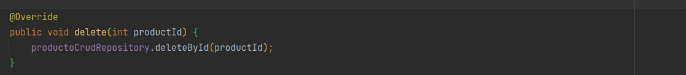

Una vez que implementamos todos los `métodos` correctamente hicimos que nuestro `ProductoRepository` quedara enfocado al `dominio` en vez de a una `tabla` puntual `Producto`.

---

**¿Cual es la diferencia entre una lista normal y una lista optional?**  
Uno es una lista “normal” como las que siempre hemos visto en `Java` y el otro es un concepto que fue introducido en `Java 8` y que me permite tener componentes opcionales (que pueden o no estar) con un montón de funcionalidades. Puedo tener un `Optional` ó un `List` o de lo que sea gracias a los `Generics` y el `Diamond operator`.

**¿Si la DB esta en ingles y todo esta en ingles… ya no es necesario usar MapStruct?**  
Sí vas orientar tu aplicación en términos de `dominio`, si es necesario usar `MapStruct`.  
Sí el `entity` y la `clase de dominio` tienen los mismos nombres de `atributos` solo basta con crear la `interface Mapper` pero sin definirle ningún mapeo porque se harán automáticamente.  
La idea es que el objeto de `dominio` solo lleve lo que sea estrictamente necesario, por lo cual debería tener menos campos que el `entity` y en ese sentido el `Mapper` tendrá uno que otro ignore.

**¿Porque Optional.of?**  
El `Optional.of` permite convertir cualquier objeto en un `Optional`.  
En nuestro caso puntual lo usamos porque el `método` `findByIdCategoriaOrderByNombreAsc` de la `interface` `ProductoCrudRepository` retornamos una `List<Producto>` y según nuestra `interface` `ProductRepository` debemos retornar un `Optional<List<Product>>`. Para no usarlo simplemente retorna un `Optional` desde este `método` en `ProductoCrudRepository`.

---

## Clase 24 - Inyección de dependencias
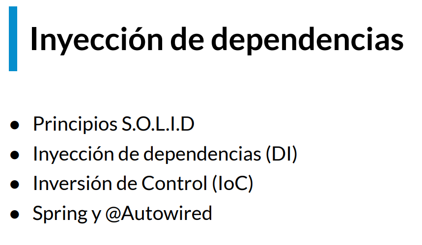

- Es uno de los 5 principios SOLID. (No lo es, pero tiene que ver, la D es de **Inversión de Dependencias**)
Estos principios nos ayuda como desarrolladores a crear código que sea más facil de leer, que sea más mantenible a largo plazo.
- `DI`: El principio de inyección de dependencia consiste en pasar la dependencia a la clase que lo va a utilizar en lugar de crearla internamente en esa clase, esto con el fin de no acoplar la clase a la implementación que está utilizando.
- `IoC`: Se refiere a que es un framework a quien toma el control de los objetos, en este caso `Spring` que contiene un contenedor de inversión de control, el cual se encarga de administrar y crear instancias de objetos que se conocen como `Beans` o `Components`.
- `Spring` usa la anotación `@Autowired` para hacer `DI` .

Como vemos en nuestro `ProductoRepository` estamos usando un par de `atributos`, los declaramos pero en ningún momento lo instanciamos o inicializamos, es decir que tienen valor nulo, es porque en `Java` necesitamos crear los objetos antes de poderlos usar, si dejamos todos como está, podemos encontrarnos con casos de `NullPointerException` cuando llamemos a algún `método`, es nulo porque no lo creamos, no lo inicializamos.

`Spring` nos ayuda creando estos objetos gracias a su contenedor de `IoC`. Nosotros solo debemos de escribir `@Autowired`, con esto le damos a entender a `Spring` que estos objetos son cedidos a él para que cree esas instancias.  
Gracias a esto no nos tenemos que preocupar por crear objetos manualmente, lo cual sería una mala práctica porque estaríamos violando el principio de `DI`.

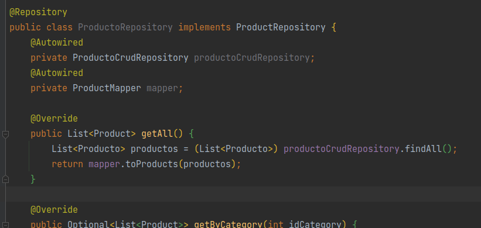

Solamente tenemos que tener cuidado cuando usemos `@Autowired`, tenemos que estar seguros que el `atributo` sea un componente de `Spring`, es decir que las clases tienen que extender o implementar de otra clase que tenga alguna anotación de `Spring`, asi sí lo podemos inyectar.  
Por ejemplo, el `atributo` `mapper` es de `ProdcutMapper`, esta `interfaz` tiene un `@Mapper` (que no es `Spring`) pero le indicamos que es un componente de `Spring`. Por otro lado `ProductoCrudRepository` extiende de `CrudRepository` que tiene, en su propia `interfaz` un `@NoRepositoryBean`.

---

Es preferible la inyección de dependencias a nivel del constructor.  
Existen tres maneras de usar la inyección dependencias con `@Autowired`: En el atributo, en el constructor y en el método set.  
A pesar de que hacerlo en el `atributo` (Field-based) es lo más práctico, elegante y la manera en que mejor se lee; lo mejor es hacerlo en el `constructor` (Constructor-based) para poder declarar los `atributos` inyectados como `final` para que sean `inmutables`, y además es muy recomendado para declarar `dependencias` obligatorias. Así mismo se evita que la `dependencia` en un momento determinado pueda ser `null`.  
[Más info](https://reflectoring.io/constructor-injection/)

## Clase 25 - Implementar la anotación @Service
Una vez terminamos el `repositorio`, es el momento de crear el `servicio de dominio`, que va a actuar de intermediario entre el `controlador` de nuestra `API` y el `repositorio`.

Creamos una `clase` dentro del `package` `service` que se llama `ProductService` al cual lo anotamos con `@Service` y dentro creamos un `atributo` de la `interfaz` `ProductRepository`, que contiene los `métodos` que hicimos, observemos que no es la implementación de `ProductoRepository` si no que es esta `interfaz`, para que `Spring` sepa que tiene que usar, lo anotamos con `@Autowired`, asi `Spring` sabrá que tiene que hacer e internamente incializará un nuevo `productoRepository` que es la `clase` que en realidad está implementada. Podemos usar `@Autowired` porque `ProductoRepository`, que es la implementación, tiene un `@Repository`.

Ahora podemos escribir los `métodos` y podemos observar que estamos trabajando en terminos de `dominio` ya que donde ocurre la conversión es en `ProductoRepository` y el `servicio` desconoce totalmente esa operación, el `servicio` unicamente está trabajando en terminos de lo que mejor conoce, que es el `dominio`.

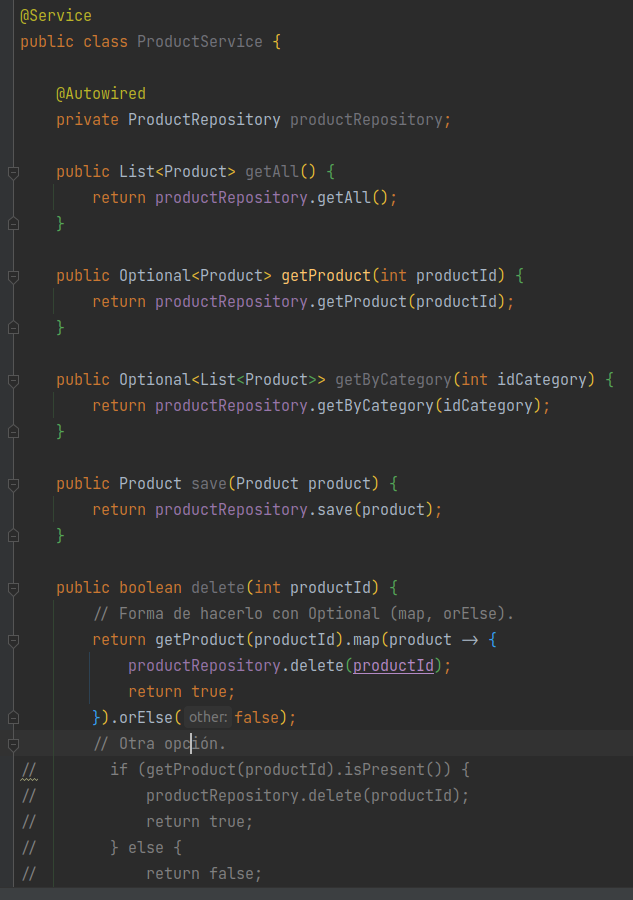

---

Las implementaciones del `método` `delete` son buenos ejemplos de los estilos declarativo e imperativo.  
El primero define el **QUÉ** va a hacer el código mientras que el segundo define el **CÓMO** y por consiguiente se ven más detalles. Cabe aclarar que el estilo declarativo no puede existir sin el estilo imperativo ya que el primero se apoya en el segundo para ocultar las estructuras de control (if, else, switch, etc).

---

**¿Porqué es necesario verificar que el producto exista en la base de datos antes de borrarlo?**  
El `Id` normalmente se obtiene de procesos anteriores como de un `listado`, y si queremos saber si el borrado es exitoso se podría obtener el número de fila(s) eliminada(s) … lo digo porque esto se ve muy bonito y mantenible, pero es costoso en máquina… ¿no?

Lo hice así era pensando en implementar una solución más imperativa que me permita describir claramente cuando se realiza bien o no este procedimiento.  
Una solución mucho más optima sería controlar esto con un `try-catch`, así:
~~~
public boolean delete(int productId){
    try {
        productRepository.delete(productId);
        return true;
    } catch (EmptyResultDataAccessException e) {
        return false;
    }
}
~~~

- El `repositorio` es la capa simple de acceso o de comunicación con el sistema de almacén de datos (ojo, solo comunicación), mientras que el `servicio` es la lógica de acceso a estos datos desde la aplicación.
- Nuestros `servicios` son negociadores entre el `repositorio` y los `controladores`.
- `@Service`: Intermediario entre el controlador de la API y el repositorio

---

## Clase 26 - Implementar la anotación @RestController
Creando el primer `controlador REST`, para esto usaremos 2 anotaciones de `Spring`:
- `@RestController`: Indica a `Spring` que esta `clase` es un `controlador` de una `API REST`.
- `@RequestMapping`: Lleva como `parámetro` el `path` en donde va a aceptar las peticiones.

Una vez agregados podemos empezar a armar el cuerpo, primero inyectamos el `servicio` y luego implementamos los `métodos` necesarios.

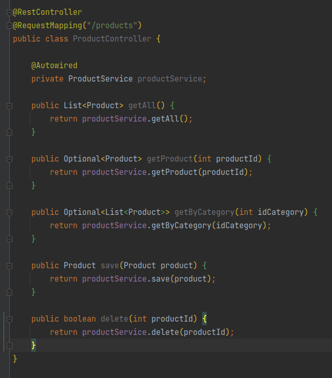

Probamos la app, al darle al boton **RUN** se empiezan a ejecutar tareas, compilar `Java`, los `recursos`, crear nuestras `clases` y lanzar la app de `Spring Boot` con todas sus `dependencias`.

Aun falta decirle a nuestros `métodos` que como van a responder a las diferentes peticiones, falta exponerlos.

---

Para los que usaron `lombok`, si llegan a tener algún error en `ProductMapper`, por ejemplo `<No property named “idProduco” exists in source parameter(s). Did you mean “null”?>` es debido a que `mapstruct` tiene que esperar a que `lombok` haga todas sus modificaciones antes de que cree las `clases` de mapeo.  
Para solucionar esto, pueden modificar el archivo `build.gradle` de la siguiente manera:
~~~
// MapStruct
compileOnly 'org.mapstruct:mapstruct:1.4.1.Final'
annotationProcessor 'org.mapstruct:mapstruct-processor:1.4.1.Final'

// Lombok
compileOnly 'org.projectlombok:lombok'
annotationProcessor 'org.projectlombok:lombok'
~~~

También es importante que el `Lombok` esté antes del de `MapStruct` para evitar el error.

---

## Clase 27 - Exponer nuestra API
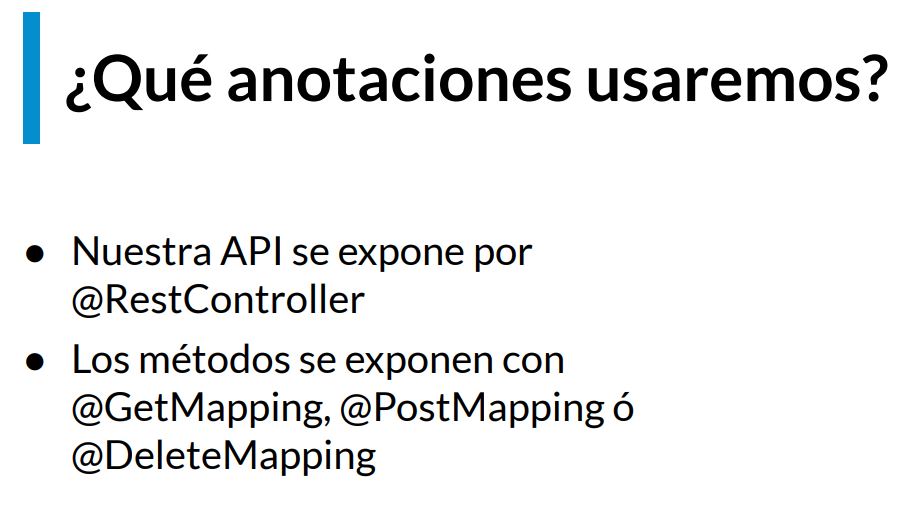

A la hora de exponer nuestra `API`, `Spring` nos da una serie de anotaciones para simplificarnos la tarea.

Nuestra `API` está expuesta como `controlador` a través de `@RequestMapping` y `@RestController`, asi mismo los `métodos` deben tener unas anotaciones especificas para que sean expuestas.
- `@GetMapping`: Para obtener información.
    - `@PathVariable`: Sirve para referenciar el `atributo` que se va a usar en el path, `@GetMapping`.
- `@PostMapping`: Para guardar o actualizar información.
    - `@RequestBody`: En el `método` `save`, como el `producto` no va a viajar en el `path` si no que va a ser parte del cuerpo de la petición, debemos indicarlo con esta anotación.
- `@DeleteMapping`: Para borrar algún registro.

En clase:  
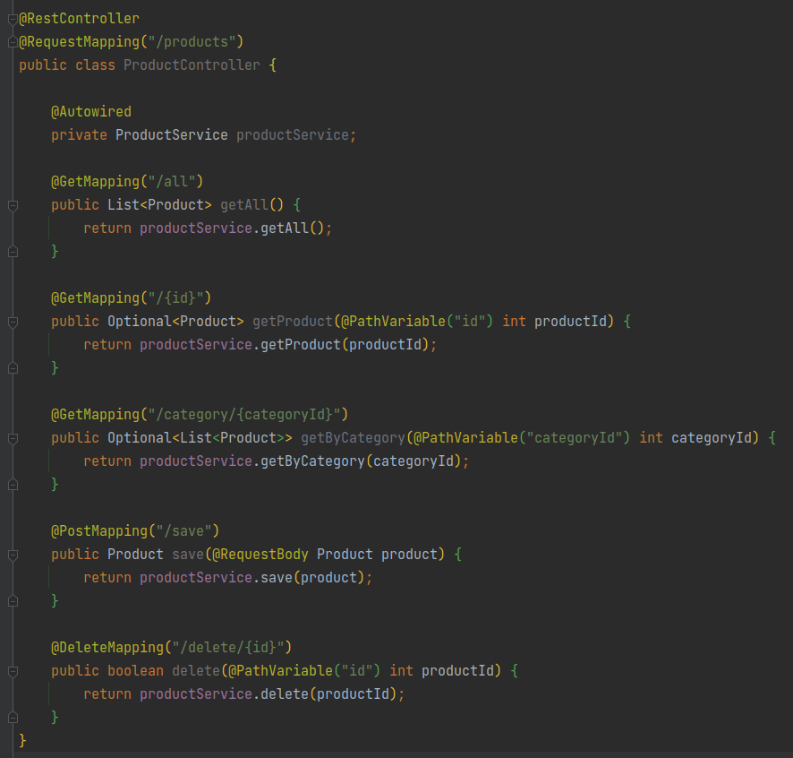

Más limpio:  
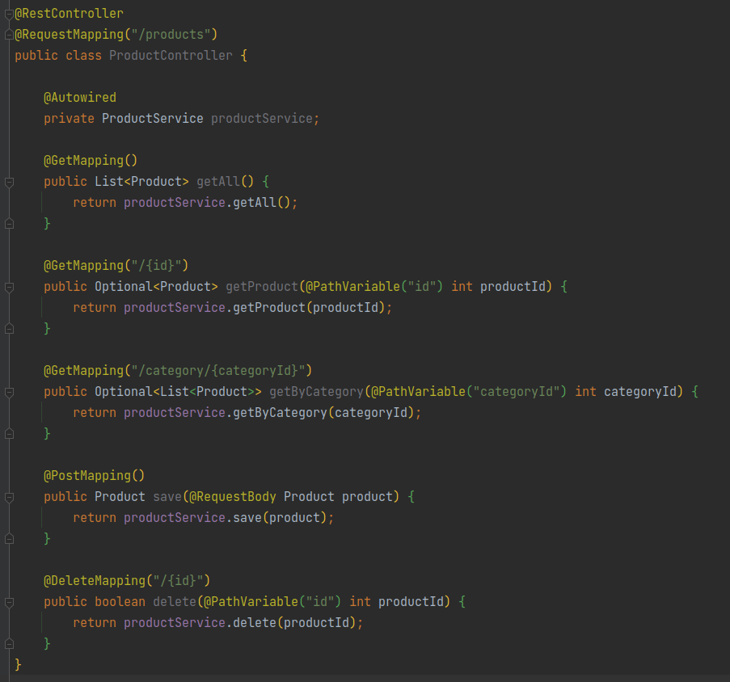

---

# Módulo 5 - Mejorando nuestra API
## Clase 28 - Controlar las respuestas HTTP
Aprenderemos a controlar de mejor manera los llamados que reciben nuestros **EndPoints**, esto gracias a códigos http particulares para las peticiones.

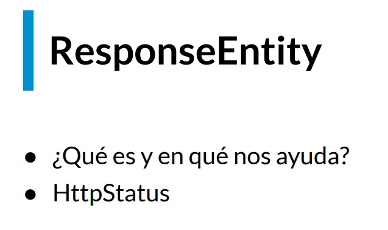

- `ResponseEntity`: Es una `clase` dedicada para controlar los llamados y respuestas que reciben nuestros `controladores`
- `HttpStatus`: Se usa para definir que código queremos retornar según el caso.

En nuestro proyecto vamos a cambiar el tipo de retorno de los `métodos` de nuestro `servicio`, ahora serán `ResponseEntity`, que recibe en el operador diamante (`<>`) lo que en realidad está devolviendo, lo que había antes. Y en el `return`, claramente lo tenemos que cambiar por un `new ResponseEntity` que recibirá como `parámetros`, lo que tiene que devolver y el estado de `Http`, `HttpStatus.OK` por ejemplo.

En el caso de `getProduct` que retorna un `Optional` vamos a sacarlo y solo devolvemos un `ResponseEntity<Product>`, pero todavía el `getProduct` de `productService` sigue retornando un `Optional`, entonces podemos usar `map` para poder operar con lo que hay en su interior.

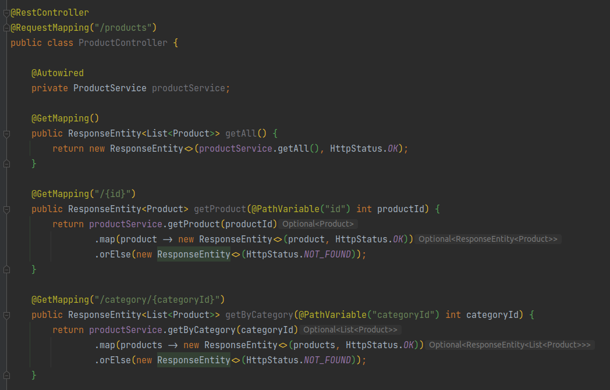

En el caso de `delete`, el `ResponseEntity` no tiene un tipo, solo queremos que responda si se borro OK o si no se encontro en la DB.

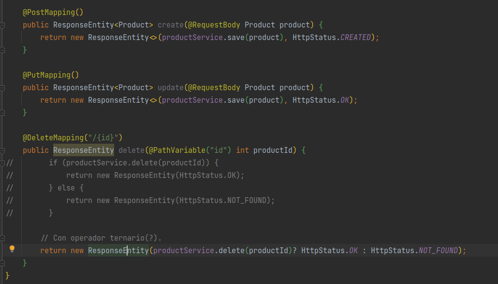

---

Agregué el `método` `update` con la anotación `@PutMapping`, para hacer modificaciones, y el nombre de `save` paso a ser `create`, para también diferenciar las respuestas Http.

---

## Clase 29 - Crear el dominio de compras
Para crear todo el esquema de `compras` orientandolo a dominio, empezamos creando las `clases` del dominio, `Purchase` y `PurchaseItem`.  
Dentro de `Purchase` vamos a tener todo lo relacionado con la compra, es la que luego va a ser traducida o mapeada a la `Entidad` `Compra`.

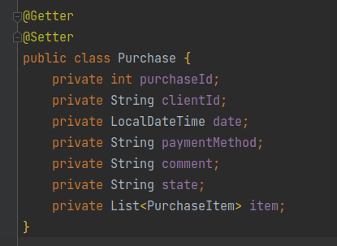

En `PurchaseItem` que será `ComprasProducto`.

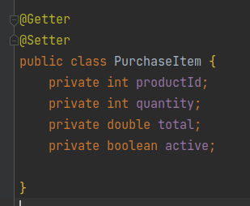

Ahora crearemos la especificación del repositorio, lo que yo quiero que luego sus implementaciones hagan cuando estemos hablando de `compras` o `purchase`.

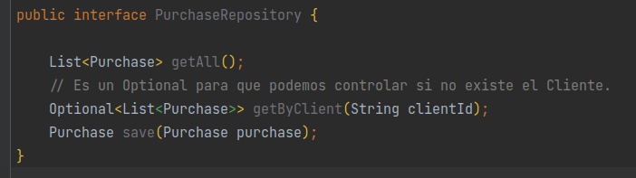

---

## Clase 30 - Mapear el dominio de compras
Creamos las 2 `interfaces` que traducirán nuestras `clases`. `PurcheseItemMapper` y `PurcheseMapper`.

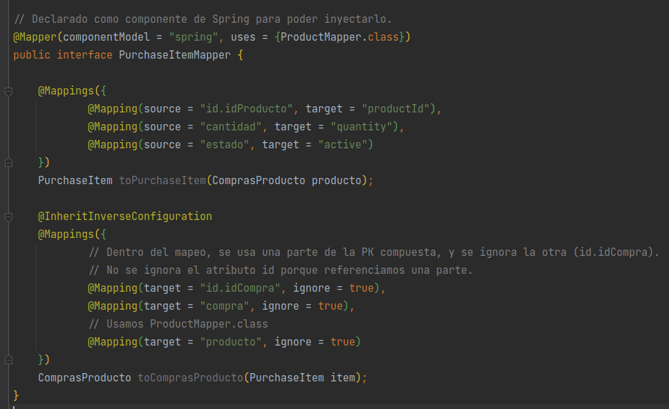

- Al querer mapear de `ComprasProducto` a `PurcheseItem` vemos que este último tiene un `id` compuesto de tipo `ComprasProductoPK`, entonces para indicar cual es el `id` de `ComprasProducto` tenemos que hacer `id.idProducto`.
- Como el `atributo` `total` se llama de la misma manera en ambas `clases` se puede suprimir o ignorar el mapeo.
- Como estamos haciendo referencia a `producto` en el mapeo, debemos indicarle en el `mapper` que lo vamos a usar `ProductMapper.class` para ignorar. (Al final de esta clase vemos que no hace falta.)

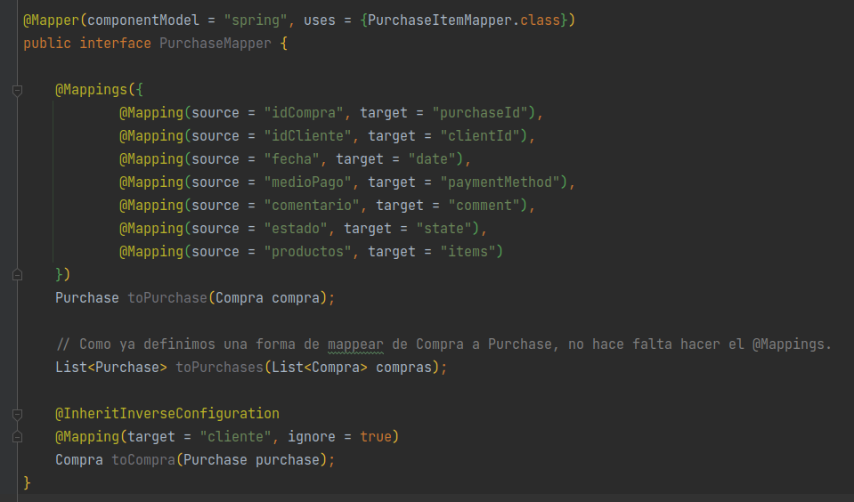

Siempre en la `clase` destino tiene que tener todos los mapeos, si no tiene todos los mapeos debemos ignorarlos explicitamente.  
Si bien se explica así porque nos gusta tener control visual de todos los atributos a la hora de mapearlos, también podríamos agregar el parámetro `unmappedTargetPolicy = ReportingPolicy.IGNORE` en la anotación `@Mapper` para no tener que ignorarlos explícitamente en los métodos con `ignore = true`.  
Por ejemplo, para el `PurchaseMapper` sería algo así:
~~~
@Mapper(..., unmappedTargetPolicy = ReportingPolicy.IGNORE)
public interface PurchaseMapper {
		...
}
~~~

---

Con respecto a `MapStruct` desde `Java 8` en adelante no es necesario usar la anotación `@Mappings` (No afecta si se usa).  
Pasamos de esto (`CategoryMapper`):
~~~
@Mappings({
    @Mapping(source = "idCategoria", target = "categoryId"),
    @Mapping(source = "descripcion", target = "category"),
    @Mapping(source = "estado", target = "active")
})
Category toCategory(Categoria categoria);
~~~

A esto:
~~~
@Mapping(source = "idCategoria", target = "categoryId")
@Mapping(source = "descripcion", target = "category")
@Mapping(source = "estado", target = "active")
Category toCategory(Categoria categoria);
~~~

---

## Clase 31 - Crear el repositorio de compras
Crearemos la implementación de nuestro `repositorio` para interactuar con la DB con todo lo relacionado a las `compras` de nuestro **Supermercado**.

- Recordemos que tenemos que agregarle `@Repository` para indicarle a `Spring` que es un `bean` y que es un `repositorio` que se va a comunicar con la DB.
- Para poder interactuar con la DB también es necesario implementar una `interfaz` que extienda de `CrudRepository`. La creamos e inyectamos.

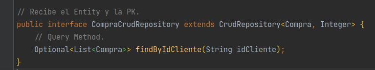

- También inyectamos el `mapper` para que el `repositorio` hable en terminos de dominio.

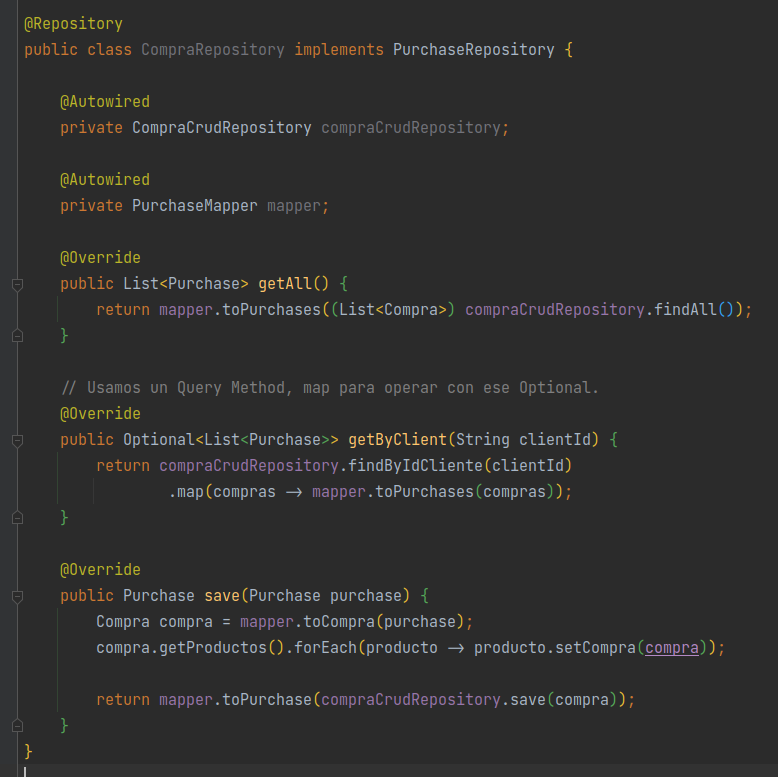

Recordemos que `map` lo usamos para operar con lo que sea que venga dentro de un `Optional`, si es que viene o hay algo, si no sencillamente no se ejecuta.

En `save` recibimos el `purchase`, lo pasamos a tipo `compra` y tenemos que garantizar de que toda esa información se va a guardar en cascada en `ComprasProducto`, para hacerlo tenemos que estar seguros de que `compra` conoce los `productos` y los `productos` conocen a que `compra` pertenecen.

Entonces traemos la `lista` de `ComprasProducto`, con `getProductos`, de la `clase` `Compra`, la recorremos y le asignamos a cada `producto` a que `compra` pertenece.  
Para que esto ocurra debemos ir al `entity` de `Compra` e indicarle que se va a guardar `productos` en cascada, esto dentro de la anotación `@OneToMany` con `cascade = {CascadeType.ALL}`.

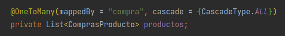

Quiere decir que todos los procesos que se hagan contra la DB de una `Compra` van a incluir en cascada sus productos.  
También lo hacemos en `ComprasProducto` por su relación con `compra`, agregamos la anotación `@MapsId` en el que incluimos la `PK` que queremos que se enlace, `idCompra`.

Ya de esta manera cuando `ComprasProducto` se vaya a guardar en cascada va a saber a que `PK` pertenece cada uno de los `productos` que están en una `compra`.

---

Cuando queremos guardar en cascada debemos poner la anotación `@MapsId` porque esta anotación es la que proporciona la asignación para una `clave primaria` cuando se usa `@EmbeddedId`.  
La anotación `@JoinColumn` solo especifica que columna se relaciona a la hora trabajar con el atributo de la relación.

---

El `Servicio`, creamos la `Clase` `PurchaseService`, lo anotamos con `@Service`, inyectamos el `repositorio` e implementamos los `métodos`.

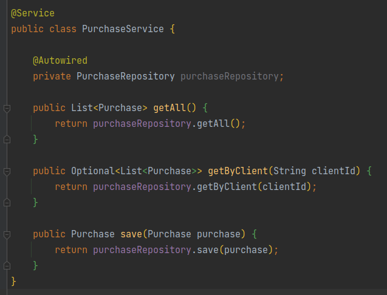

El `Controlador`, creamos la `Clase` `PurchaseController`, lo anotamos con `@RestController` y `@ResquestMapping("/purchases")` para poder acceder a él, inyectamos `purchaseService` e implementemos los `métodos` con sus respectivas anotaciones `@GetMapping`, `@PostMapping` y `@PutMapping` que retornan un `ResponseEntity` con el `HttpStatus` correspondiente.

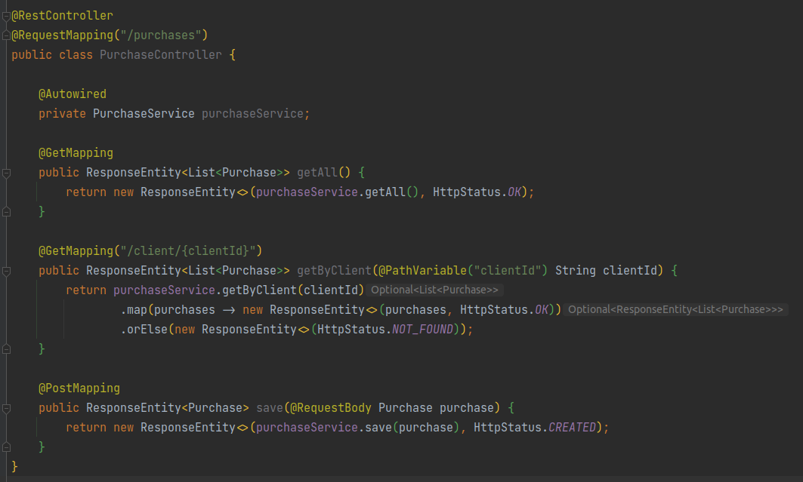

---

## Clase 32 - Probando nuestros servicios de compras
Me arrojó un error `error Caused by: org.postgresql.util.PSQLException: Bad value for type int : 3104583224 ` y se solucionó cambiando el tipo de dato del atributo `celular` del `Cliente` a tipo `String`.

---

## Clase 33 - Documentar nuestra API con Swagger
[Swagger](https://swagger.io/) una herramienta que nos permite documentar nuestros `servicios` usando anotaciones.

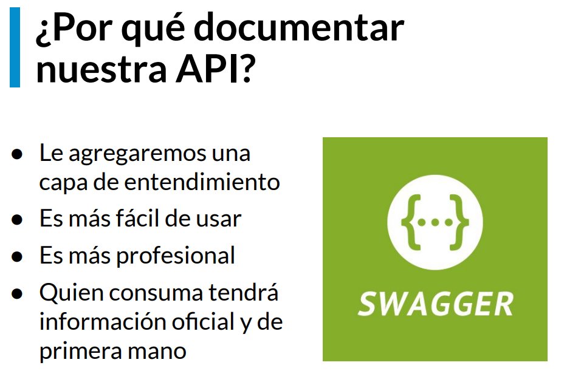

Documentar es una excelente práctica, porque hace que nuestra `API` sea profesional y robusta. Va a ser muy descriptible, decirle a quien quiera consumir como debe hacerlo y de manera oficial.

Lo primero que debemos hacer para usar `Swagger` dentro de nuestro proyecto es incluir las dependencias.  
Buscamos en [MVNRepository](https://mvnrepository.com/) `Springfox Swagger2`, y como no es de `Spring` vamos a usar la versión más utilizada.  
También incluiremos otra dependencia para que `Swagger` se convierta en una página donde podamos visualizar todos los **EndPoints** de nuestra `API`.  
Buscamos `Swagger ui` y nos sale `Springfox Swagger UI`, usamos la misma versión.
~~~
implementation 'io.springfox:springfox-swagger2:2.9.2'
implementation 'io.springfox:springfox-swagger-ui:2.9.2'
~~~

Ya con `Swagger` vamos a crear dentro de `web` un nuevo `package`, `config` y dentro una `clase`, `SwaggerConfig` al que la anotamos con `@Configuration` y le indicamos que habilitamos en esta `clase` `Swagger2` con `@EnableSwagger2`.  
Incluimos un `bean`, que es un `método` público que devuelve un `Docket` (de springfox), es específico para la documentación de `Spring`, le indicamos el tipo de documentación que es `DocumentationType.SWAGGER_2`, le decimos qué queremos que exponga en la documentación con `select().apis()` y dentro de `apis` indicamos que solamente los que esten dentro del `paquete` `controller`, porque en `controller` es donde tenemos nuestros `endpoints` del `API`, todo esto con `ResquestHandlerSelectors` (pertenece a springfox) y `basePackage` que recibe el nombre del `paquete` donde están nuestros `controladores`, `"com.platzi.market.web.controller"`. Y para finalizar simplemente debemos construir esta respuesta con `build`.

Al correr mi `servicio` me ocurrio un error de tipo `NullPointerException` y lo solucioné agregando a `application.properties` `spring.mvc.pathmatch.matching-strategy = ANT_PATH_MATCHER`. Para usar la versión 2.9.2 de `Swagger` con la version de `SpringBoot` 2.6+.

Una vez levantado el `servicio` ingresamos a `http://localhost:8090/platzi-market/api/swagger-ui.html` y veremos toda la documentación de nuestros `controladores` dentro de `Swagger`.

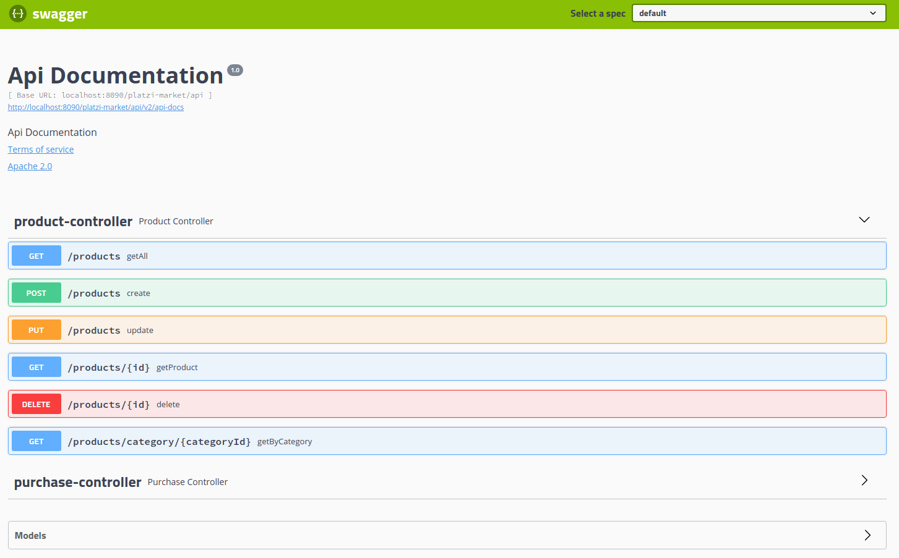

Podemos ver todos los `métodos` que tenemos implementados, incluso nos da ejemplos de implementación, de lo que espera que reciba y lo que retorna, nos provee un `cliente` donde podemos probarlo (**Try it out**).

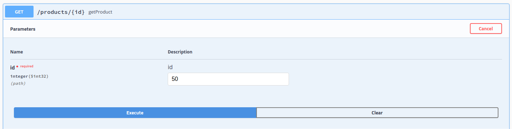
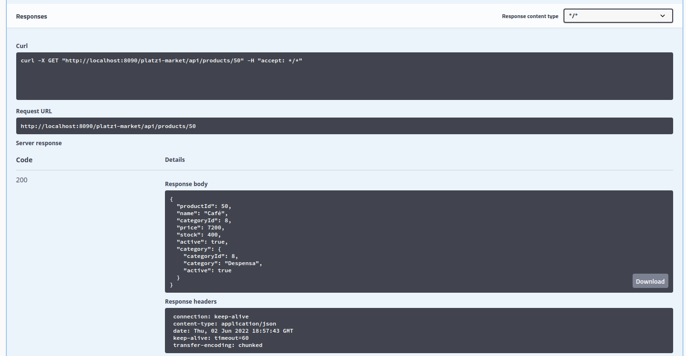

Ahora, podemos modificar como se ve todo esto desde `Swagger`, por ejemplo podemos ir a `ProductController` y los `métodos` los anotamos con:
- `@ApiOperation`: Agregamos la descripción de lo que hace nuestra `API`.
- `@ApiResponse`: Indicamos el código `http` que tiene que responder y un mensaje.
- `@ApiResponses`: En el caso de que pueda tener 2 respuestas o más.
- `@ApiParam`: Descripción del `parámetro` que recibe, que será requerido y hasta con un ejemplo.

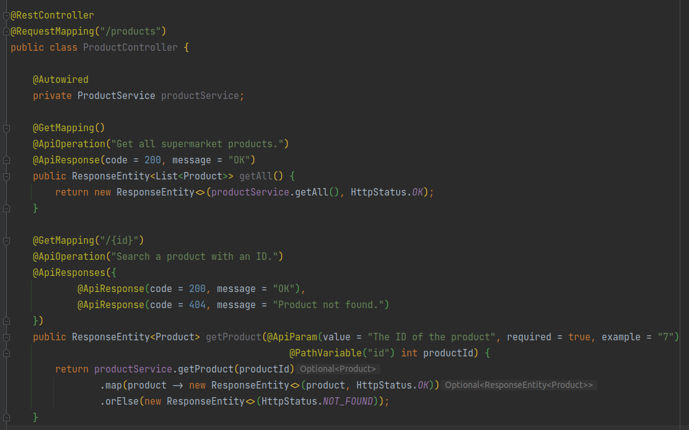

Muestra con ejemplo que indicamos.

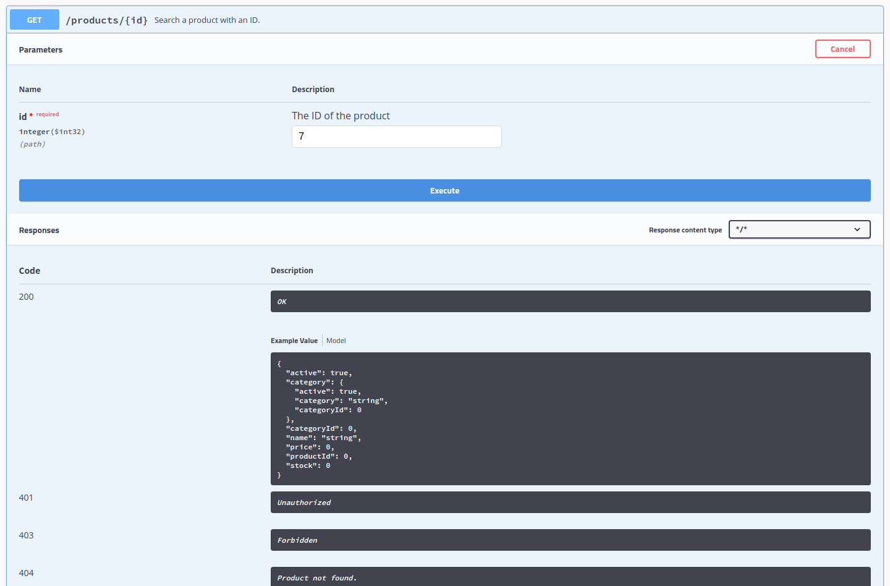

---

Una forma para ponerle un poco mas de detalle a nuestras `APIs`.

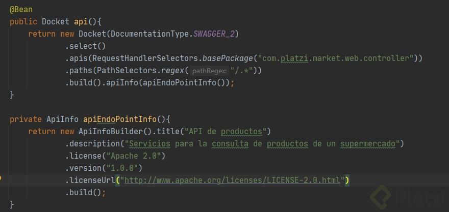

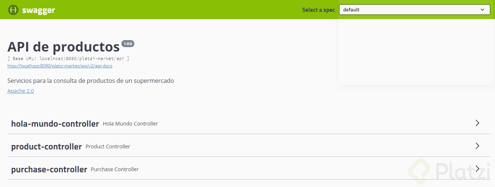

---

La forma en la que el profesor implementa `Swagger` ya no funciona hoy en día, le dejo el link de maven repository para que solo copien y agreguen el archivo `build.gradle`.
~~~
// https://mvnrepository.com/artifact/org.springdoc/springdoc-openapi-ui
implementation group: 'org.springdoc', name: 'springdoc-openapi-ui', version: '1.5.12'
~~~

Se puede ver en la [documentación](https://mvnrepository.com/artifact/org.springdoc/springdoc-openapi-ui/1.5.12)

Recuerden ya no va ser necesario crear en archivo `SwaggerConfig`.

Para acceder a la documentacion -> `http://localhost:8090/api/swagger-ui.html`

---

`Swagger` no es la única manera de hacer esto, hay otra alternativa llamada [RAML](https://raml.org/) que esta bastante interesante.

---

# Módulo 6 - Spring Security
## Clase 34 - Configurar la seguridad de nuestra API con Spring Security
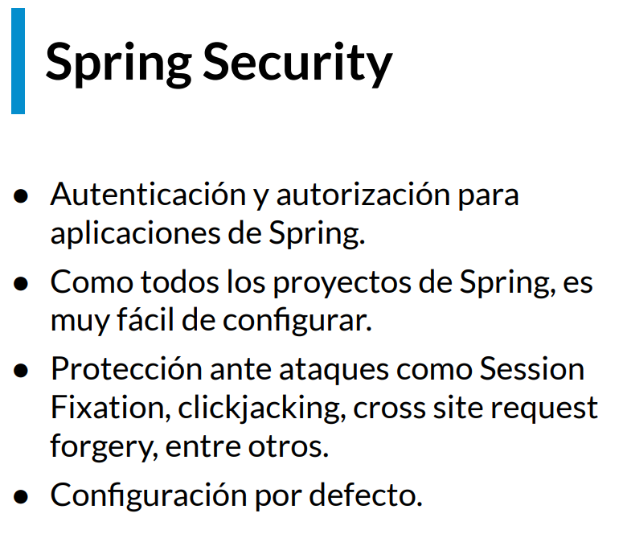

`Spring Security` ofrece varios mecanismos para autenticación y autorización de apps construidas en `Spring`.  
La seguridad de `Spring` contiene una configuración por defecto para que no tengamos que ocuparnos directamente.

Agregamos la dependencia, sin incluir la versión ya que de eso se encarga `Spring`
~~~
implementation 'org.springframework.boot:spring-boot-starter-security'
~~~

Con solo esto, ya si queremos acceder a consultar algún dato de nuestro servidor, nos va a pedir nos loguemos y encontramos el password en la consola cuando levantamos el servidor, que cambia cada levantada, y el usuario siempre es ***user***.

Si queremos usar un usuario y contraseña propios podemos hacerlo.

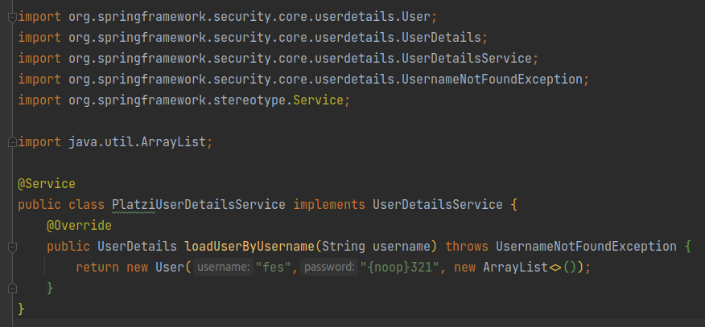

Primero creamos una `clase` dentro de `service`, `PlatziUserDetailsService`, que implementara una `interfaz` de `Spring Security`, `UserDetailsService`, implementamos el único método y lo anotamos como `@Service` para poder inyectarlo, y este `método` retornara un nuevo usuario de `Spring Security` en el que se le indica el nombre, el pass, al que le agregamos `{noop}` porque no pasó por ningún encoder, y un array que puede contener los tipos de roles de ese usuario.

Ahora creamos un nuevo `paquete` dentro de `web`, `security`, que se encargará de gestionar la seguridad, dentro una `clase`, `SecurityConfig`, que extenderá de otra `clase` de `Spring Security`, `WebSecurityConfigurerAdapter` (deprecado) y con la anotación `@EnableWebSecurity` le decimos que esta `clase` está encargada de la seguridad, inyectamos la `clase` anteriormente creada y le indicamos que usuario y pass queremos loguearnos sobreescribiendo un `método` y usando la dependencia.

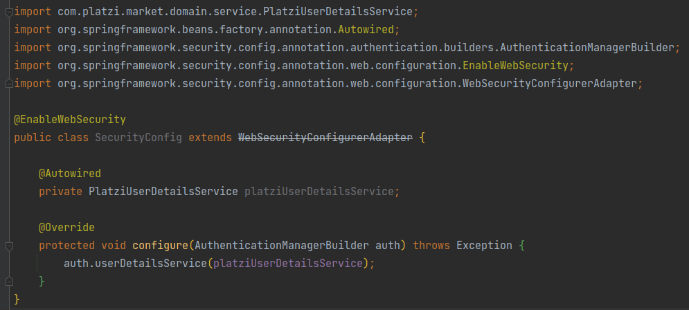

Cabe mencionar que el usuario y el pass son un demo para demostrar, lo que debería de suceder es ir a una DB o un sistema para que verifique el correcto inicio de sesión antes de usar nuestros servicios.

---

## Clase 35 - Generar un JWT
[JWT](https://jwt.io/) (JSON Web Token) sirve para controlar las peticiones que recibe nuestra app.

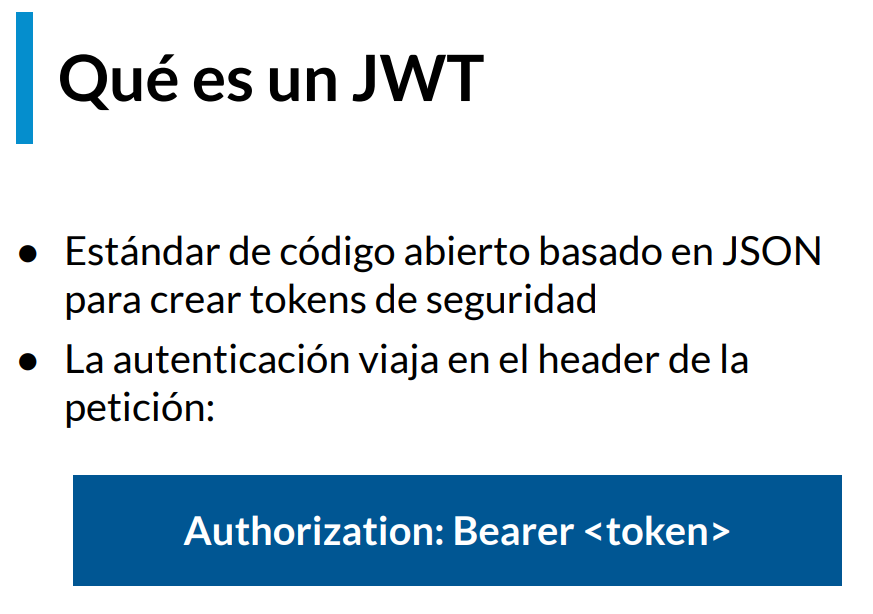

`JWT` es un estandar de código abierto basado en `JSON` para controlar la seguridad de nuestra app por medio de `tokens`.  
Cuando usamos `JWT` para este `método` lo que debemos hacer es incluirlo en el header de la autorization de la petición con el prefijo `Bearer`.

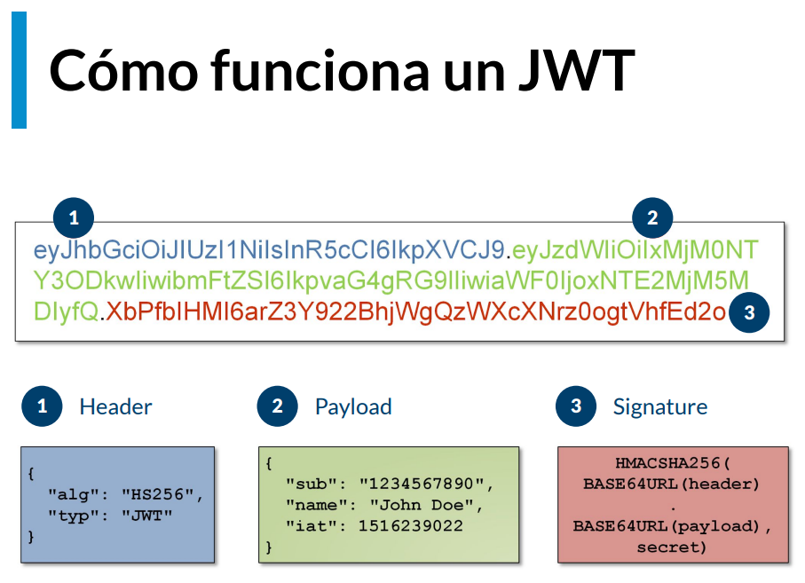

Un `JWT` por dentro está dividido en 3 secciones:
- `Header`: Incluye el algoritmo y el tipo de `token` que se está generando.
- `Payload`: Está toda la información del `token`, el usuario para el cual fue generado, cuando fue su fecha de vencimiento, etc.
- `Signature`: La firma agarra los dos anteriores y los encripta según el algoritmo seleccionado.

Inyectamos la dependencia.  
En MVN lo encontramos buscando `JSON Web Token Support For The JVM » 0.9.1`.
~~~
implementation 'io.jsonwebtoken:jjwt:0.9.1'
~~~

Creamos una `clase`,`JWTUtil`, que se encargará de generar nuestros `JWT`, esto en `web.security`, creamos un `método`, lo anotamos con `@Component` y usamos la reciente dependencia para crear `JWT` en una secuencia de `métodos`.

- `setSubject`: Es el usuario que lo obtenemos de `userDetails`.
- `setIssuedAt`: Fecha en la que fue creada el `JWT`, en este caso, la actual.
- `setExpiration`: Fecha de expiración, en este caso, 10 hs.
- `signWith`: La firma de nuestro `método` que recibe un algoritmo y un pass para firmarlo, que la insertamos con una `constante`.
- `compact`: Para crear nuestro `token`.

Para poder generar un `JWT` tenemos que crear un `controlador` que reciba como `parámetro` el usuario y la contraseña y que como respuesta envie el `JWT`.

Antes del `controlador`, es valido crear unas `clases` que controlen esto de una mejor manera, dentro del `paquete` `dto` creamos:
- `AuthenticationRequest`: Para recibir los 2 `parámetros` a evaluar, con sus `Getters` y `Setters`.
- `AuthenticationResponse`: Que tendrá el `JWT`, con sus `Getters`, `Setters` y `constructor`.

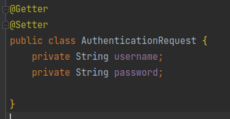

Estos dos son los encargados de recibir y enviar la información necesaria para crear un `JWT` dentro de un `controlador`.

---

**Cuando es necesario crear un constructor? y cuando no?**  
Cuando necesites tener información desde el momento en que creas un objeto es necesario que utilices un constructor o un builder (sí son muchos atributos ó si hay algunos opcionales).

Creo que es necesario que se entienda que estamos haciendo con la expiracion.  
Siento que poner 1000 * 60 * 60… es una mala practica.  
Esto esta un poco mas largo, pero totalmente leible.
~~~
Calendar calendar = Calendar.getInstance();
calendar.setTime(new Date());
calendar.add(Calendar.HOUR_OF_DAY,10);
~~~

---

## Clase 36 - Autenticación con JWT
Teniendo nuestros `AuthenticationRequest` y `AuthenticationResponse` es hora de crear el `controlador` que va a ser las veces de autenticación, para esto creamos una `clase` en `controller` llamada `AuthController`, con sus anotaciones de `controlador` y va a tener un `método` que se encargue de responder un `JWT` cuando alguien trate de iniciar sesión.

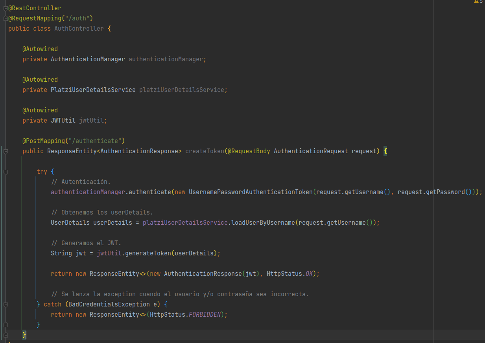

- El `createToken` recibe un `AuthenticationRequest` en el body a través del `@PostMapping` y le decimos al gestor de autenticación de `Spring` que verifique si el usuario y la contraseña son correctos, para esto inyectamos el `AuthenticationManager` que tiene `Spring` y lo verificamos con `autenticate` que recibe un `UsernamePasswordAuthenticationToken`, porque nuestra comprobación se va a hacer a través de un usuario y una contraseña.
- Ahora vamos a obtener los datos del usuario a través del servicio que creamos para este fin, inyectamos el `PlatziUserDetailsService`, que es el que se encarga de generar la seguridad por usuario y pass, y lo guardamos en un `userDetails`, usando `loadUserByUsername`.
- Generamos el `JWT` con `JWTUtil` que recibe el `userDetails`.
- Retornamos un `ResponseEntity` con el `jwt` y un `OK`.

Todo esto dentro de un `try-catch`, si el usuario o el pass es incorrecto capturamos la `exception` `BadCredentialsException` y simplemente retornamos un `FORBIDDEN`.

Para finalizar vamos a `SecurityConfig` para indicar que queremos autorizar todas las peticiones que se reciba en `"/authenticate"`, porque para invocar este `servicio` no necesitan estar autenticados.

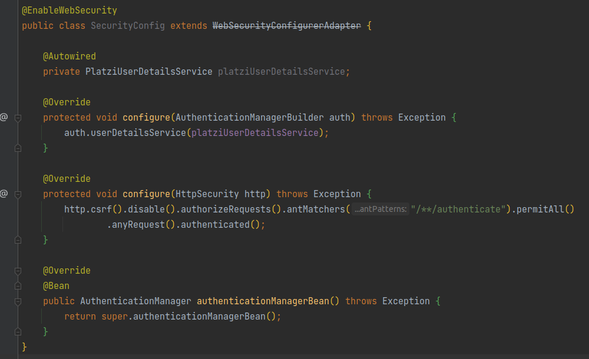

Para esto sobreescribimos `configure` que recibe un `HttpSecurity`, borramos la configuración por defecto y escribimos esta nueva.

- `csrf().disable()`: Deshabilita las peticiones cruzadas.
- `authorizeRequest()`: Autoriza las peticiones.
- `antMatchers()`: Escribimos que es lo que quiero permitir, en este caso este `servicio` `"/authenticate"`, todas las peticiones que terminan con `authenticate` van a tener el permiso.
- `anyRequest().authenticated()`: Indicamos que el resto de peticiones, si necesitan autenticación.

Como desde `AuthController` estamos usando el `AuthenticationManager` debemos incluirlo también y solo sobreescribimos `authenticationManagerBean` ya que `Spring` es quien controla la gestión de autenticación. Le agregamos `@Bean` para que no simplemente lo use si no para que explicitamente que lo estamos eligiendo como gestor de autenticación de la app.

Ahora para hacer alguna consulta, habrá que autenticarse y con el `JWT`, que obtenemos como respuesta cuando nos logueamos, podemos hacer el resto de las peticiones.

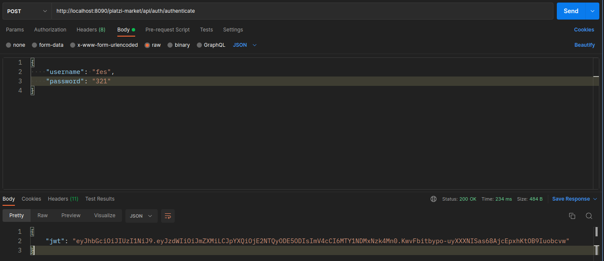

---

Para permitir la visualización de `Swagger` públicamente sin tener que estar autenticados en la aplicación pueden agregar el siguiente `método` en la clase `SecurityConfig`:
~~~
@Override
public void configure(WebSecurity web) throws Exception {
    web.ignoring().antMatchers("/v2/api-docs", "/configuration/ui",
            "/swagger-resources/**", "/configuration/security",
            "/swagger-ui.html", "/webjars/**");
}
~~~

Otra alternativa es agregar estas rutas 👆 al `antMatchers("/**/authenticate", …)` que escribimos en el `método` `configure(HttpSecurity http)` de esta clase que estás viendo.

---

**En un ambiente productivo, ¿Cómo se puede bloquear la pruebas de estas apis en swagger?**  
En este aporte explico a detalle como proteger Swagger con la autenticación de la aplicación.

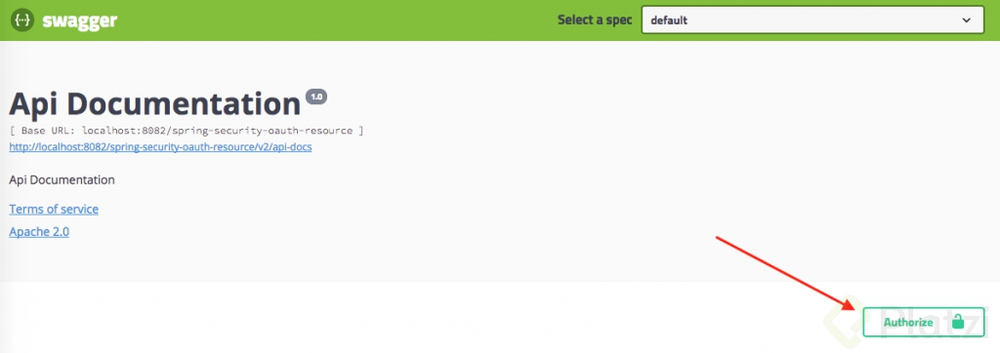

Existen varias formas y te voy a mostrar una.

Para poner ese botón tienes que modificar la clase `SwaggerConfig` y agregar el siguiente `método`:
~~~
private ApiKey apiKey(){
	returnnew ApiKey("JWT", "Authorization", "header");
}
~~~

Ahora, en el método `api()` de la misma `clase`, debes adicionar la línea `.securitySchemes(Arrays.asList(apiKey()))` al `builder` de `Docket` que tenemos; te quedará algo así:
~~~
@Bean
public Docket api(){
	returnnew Docket(DocumentationType.SWAGGER_2)
		.securitySchemes(Arrays.asList(apiKey()))
		.select()
		.apis(RequestHandlerSelectors.basePackage("com.platzi.market.web.controller"))
		.build();
}
~~~

Ahora, a cada operación que quieras incluirle el `JWT` debes agregarle el `parámetro` `authorizations`, teniendo cuidado de usar el valor “JWT” que declaramos en el `método` `apiKey()` de la `clase` `SwaggerConfig`.  
Por ejemplo, la anotación para el `método` `getAll()` de la clase `ProductController` quedaría así:
~~~
@ApiOperation(value = "Get all supermarket products", authorizations = { @Authorization(value="JWT") })
~~~

Con esto ya tendrás ese botón Authorize. Al darle click te saldrá un modal donde te pedirá que ingreses el `JWT`; ahí lo ingresas (incluyendo el `Bearer`), le das Authorize y luego close.

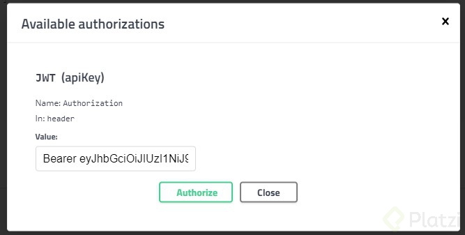

En este punto ya está cargado el `token` en `Swagger` y todas las peticiones que realices van a tener el `Header` de `Authorization` y se resolverán sin problemas. Verás que tienen un candado abierto o cerrado según el caso.

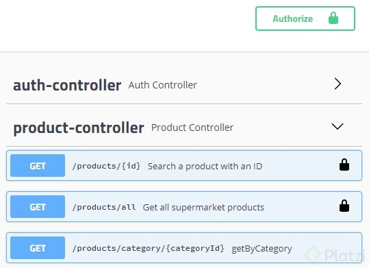

Otra alternativa sería agregar un `parámetro` global (ya no aparecería el botón Authorize) para todos nuestros `enpoints` tal cual y como lo hacen en este [post](https://thearjunmdas.github.io/entries/authorization-field-in-swagger-ui/).

---

## Clase 37 - Autorización con JWT

---

# Módulo 7 - Despliegue de nuestra aplicación
## Clase 38 - Desplegar nuestra API desde la ventana de comandos

---

## Clase 39 - Desplegar nuestra base de datos con Heroku

---

## Clase 40 - Desplegar nuestra API con Heroku

---