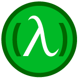
# Curso de Programación Funcional con Java SE
Índice
-
- [Curso de Programación Funcional con Java SE](#curso-de-programación-funcional-con-java-se)
    - [Módulo 1 - Introducción a la Programación Funcional](#módulo-1---introducción-a-la-programación-funcional)
        - [Clase 1 - ¿Qué es la Programación Funcional?](#clase-1---¿qué-es-la-programación-funcional?)
    - [Módulo 2 - Entendiendo las partes de la Programación Funcional](#módulo-2---entendiendo-las-partes-de-la-programación-funcional)
        - [Clase 2 - ¿Qué es una función en Java?](#clase-2---¿qué-es-una-función-en-java?)
        - [Clase 3 - Funciones como ciudadanos de primera clase](#clase-3---funciones-como-ciudadanos-de-primera-clase)
        - [Clase 4 - Funciones puras](#clase-4---funciones-puras)
        - [Clase 5 - Entendiendo los efectos secundarios](#clase-5---entendiendo-los-efectos-secundarios)
        - [Clase 6 - Funciones de orden mayor](#clase-6---funciones-de-orden-mayor)
        - [Clase 7 - Funciones lambda](#clase-7---funciones-lambda)
        - [Clase 8 - Inmutabilidad](#clase-8---inmutabilidad)
    - [Módulo 3 - Functional programming en Java](#módulo-3---functional-programming-en-java)
        - [Clase 9 - Repositorio del curso](#clase-9---repositorio-del-curso)
        - [Clase 10 - Configuración del entorno de trabajo](#clase-10---configuración-del-entorno-de-trabajo)
        - [Clase 11 - Revisando el paquete java.util.function: Function](#clase-11---revisando-el-paquete-javautilfunction-function)
        - [Clase 12 - Revisando el paquete java.util.function: Predicate](#clase-12---revisando-el-paquete-javautilfunction-predicate)
        - [Clase 13 - Revisando el paquete java.util.function: Consumer y Supplier](#clase-13---revisando-el-paquete-javautilfunction-consumer-y-supplier)
        - [Clase 14 - Revisando el paquete java.util.function: Operators y BiFunction](#clase-14---revisando-el-paquete-javautilfunction-operators-y-bifunction)
        - [Clase 15 - Entendiendo dos jugadores clave SAM y FunctionalInterface](#clase-15---entendiendo-dos-jugadores-clave-sam-y-functionalinterface)
        - [Clase 16 - Operador de referencia](#clase-16---operador-de-referencia)
        - [Clase 17 - Analizando la interferencia de tipos](#clase-17---analizando-la-interferencia-de-tipos)
        - [Clase 18 - Comprendiendo la sintaxis de las funciones lambda](#clase-18---comprendiendo-la-sintaxis-de-las-funciones-lambda)
        - [Clase 19 - Usando métodos default en nuestras interfaces](#clase-19---usando-métodos-default-en-nuestras-interfaces)
        - [Clase 20 - Dándole nombre a un viejo amigo chaining](#clase-20---dándole-nombre-a-un-viejo-amigo-chaining)
        - [Clase 21 - Entendiendo la composición de funciones](#clase-21---entendiendo-la-composición-de-funciones)
    - [Módulo 4 - Optional y streams datos mas interesantes](#módulo-4---optional-y-streams-datos-mas-interesantes)
        - [Clase 22 - La clase optional](#clase-22---la-clase-optional)
        - [Clase 23 - Entendiendo los streams](#clase-23---entendiendo-los-streams)
        - [Clase 24 - ¿Qué son los stream listeners](#clase-24---¿qué-son-los-stream-listeners)
        - [Clase 25 - Operaciones y Collectors](#clase-25---operaciones-y-collectors)
        - [Clase 26 - Stream de tipo específico y paralelismo](#clase-26---stream-de-tipo-específico-y-paralelismo)
        - [Clase 27 - Operaciones terminales](#clase-27---operaciones-terminales)
        - [Clase 28 - Operaciones intermedias](#clase-28---operaciones-intermedias)
        - [Clase 29 - Collectors](#clase-29---collectors)
    - [Módulo 5 - Todo junto proyecto job search](#módulo-5---todo-junto-proyecto-job-search)
        - [Clase 30 - job search un proyecto para encontrar trabajo](#clase-30---job-search-un-proyecto-para-encontrar-trabajo)
        - [Clase 31 - Vista rápida a un proyecto de gradle](#clase-31---vista-rápida-a-un-proyecto-de-gradle)
        - [Clase 32 - Revisando las opciones para nuestro CLI](#clase-32---revisando-las-opciones-para-nuestro-cli)
        - [Clase 33 - Librerías adicionales para nuestro proyecto](#clase-33---librerías-adicionales-para-nuestro-proyecto)
        - [Clase 34 - Entendiendo la api de jobs](#clase-34---entendiendo-la-api-de-jobs)
        - [Clase 35 - Diseñando las funciones constructoras de nuestro proyecto](#clase-35---diseñando-las-funciones-constructoras-de-nuestro-proyecto)
        - [Clase 36 - Agregando validaciones de datos](#clase-36---agregando-validaciones-de-datos)
        - [Clase 37 - Diseñando las funciones de transformación de datos](#clase-37---diseñando-las-funciones-de-transformación-de-datos)
        - [Clase 38 - Creando flujos extras de transformación de datos](#clase-38---creando-flujos-extras-de-transformación-de-datos)
    - [Módulo 6 - Conclusiones](#módulo-6---conclusiones)
        - [Clase 39 - Un repaso a lo aprendido](#clase-39---un-repaso-a-lo-aprendido)

---

## Módulo 1 - Introducción a la Programación Funcional
### Clase 1 - ¿Qué es la Programación Funcional?
[PDF de las primeras clases](https://static.platzi.com/media/public/uploads/javase-functional_6a4212af-2764-4614-97ea-fb0faa854628.pdf)

La programación funcional no es mas que un paradigma, una forma de programar, un estilo de programación, hay gente que le gusta programar orientado a objetos y hay lenguajes que te ayudan
con ello, hay gente que le gusta programar con procesos y es valido, incluso hay lenguajes que tiene estructuras lógicas para programar, la programación funcional es otro tipo de
paradigma, otro tipo de estilo, es un estilo más enfocado a tener casos específicos en el cual nos preocupamos por que resolver.

Cuando pensamos en programación funcional casi siempre la primera idea que nos viene a la mente es *lambdas*, toda la gente de Java 8 habla de lambdas, pero la realidad es que es más
que eso. Hay lenguajes que te obligan a programar funcionalmente y estos lenguajes son relativamente "legendarios", pero hay otros que no te obligan si no que te dan la posibilidad
de hacerlo, lenguajes que no son 100% funcionales pero que buscan apoyarte en que puedas hacer este tipo de estilo de programación sin necesidad de que entiendas conceptos complejos
matemáticos.  
Y después tenemos a Java, el rey del POO, que a partir de Java 8 te da la posibilidad de hacer programación funcional. Veremos lo nuevo en esta versión pero nos reduciremos a dos cosas:

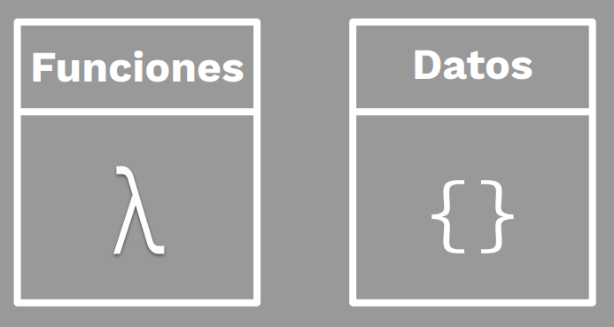

- Funciones
- Datos

Entendiendo que es una **Función** y que tipo de **Datos** hay, podremos generar muchísimas de las partes de la programación funcional.  
Básicamente la prog funcional se enfoca en **QUE** resolver y no en COMO resolver, generalmente cuando pensamos en POO pensamos mucho en vamos a crear esta clase, que genera este
objeto, que va a generar esta otra clase, en la prog funcional estamos más preocupados por resolver el problema, no en que elementos están involucrados, lo importante es tener una función
que pueda resolver el problema, no importa su procedencia, y en la parte de los datos vamos a aprender que son los datos mutables e inmutables, esto es muy importante porque esto nos va a
poder dar diferentes tipos de funciones, según los datos que tengamos.  
Es importante recalcar que esto ya existe en Java en versiones anteriores, solo que ahora haremos un mayor énfasis en como obtenerlo en el lenguaje para que nuestras funciones puedan ser
más simples.

**La prog funcional entonces nos va a dar ciertos beneficios:**

- **Legibilidad:** Uno de ellos es la legibilidad, vamos a estar muy enfocados en que resolver, es decir, nuestras funciones van a ser más explicitas en cuanto a que es lo que hacen, no en
como lo hacen, no nos vamos a preocupar en como construir objetos, o tener mil procesos para obtener una solución, nos vamos a preocupar por resolver un problema.
- **Testing:** Va a ser mas fácil hacer pruebas, tener testings de nuestras funciones, porque al tener nuestro código separado en funciones resolviendo pequeños problemas, es más facil
hacer un test de una sola función que tener que resolver todo el sistema.
- **Concurrencia:** La concurrencia se hace más fácil y se hace más didáctica, dinámica, porque ahora podemos liberar muchos threads o procesos simultáneos a partir de la misma función. Ya
no necesitamos tener control de los objetos que existen en memoria porque tenemos funciones y son únicas.
- **Comportamientos más definidos:** Vamos a tener comportamientos más definidos que van a estar dados por funciones simples, una función simple vamos a poder leerla rápidamente y entender
qué es lo que hace.
- **Menos manejo de estados:** También vamos a tener un menor manejo de estado, es decir, no nos vamos a preocupar porque objeto tiene el dato en el momento en el que estamos funcionando
sino si tenemos el dato o no.
- **No hay que instalar nada adicional:** Y no hay que agregar nada, ya es parte del lenguaje, no librerias o cambiar de lenguaje, es Java puro.

Otras características de la Programación Funcional:
- En el paradigma de la programación funcional, un programa se considera una función matemática, la cual describe una relación entre una entrada y una salida y donde el concepto de estado
o variable se elimina completamente.
- Fácil de combinar con la programación orientada a objetos
- Uso de listas como estructuras de datos fundamentales. No hay bucles, solo vas a iterar arrays o listas.
- En la programación funcional no existen los bucles “for” y “while”. En su lugar, para la iteración se depende de la recursividad.
- Funciones como tipos de datos primitivos: expresiones lambda y funciones de orden superior.

---

## Módulo 2 - Entendiendo las partes de la programación funcional
### Clase 2 - ¿Qué es una función en Java?
En la programación funcional una función es un tipo de dato, un tipo de dato que puede operar sobre un dato **X** y generar un dato **Y**, como la matemática de la escuela, tenemos una
función que recibe una X y genera una Y, incluso podemos generar una tabla de resultados con ellos, idealmente siempre una X va a generar la misma Y.

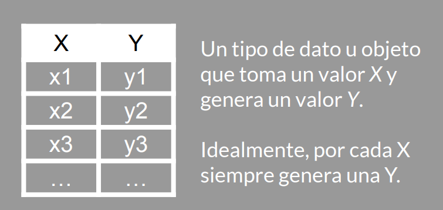

- Una función es una serie de pasos parametrizados. Por ejemplo, inicia con esto, sigue con esto y termina con aquello.
- Las funciones pueden generar o no un resultado, la ausencia de un resultado no quiere decir que no haya un resultado como tal si no que el tipo de dato que se regresa es un tipo de dato vacio.
- Las funciones se definen, almacenan o declaran bajo demanda como cualquier otro tipo de dato.

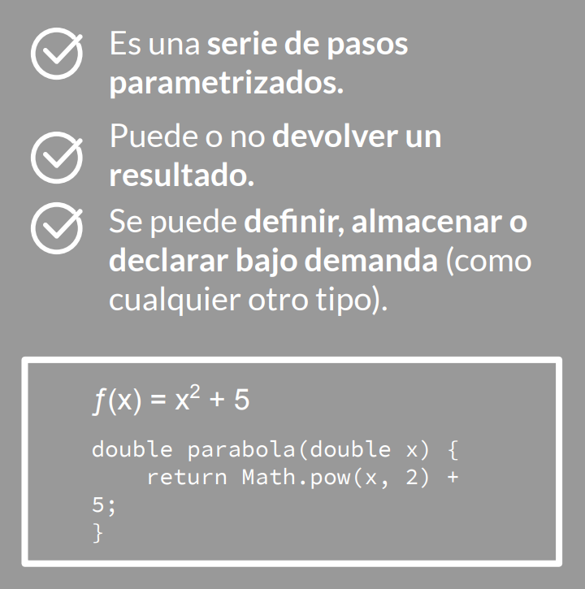

- Pueden definirse funciones con respecto a otras funciones
`esPar(x) = !esNon(x)`
- Pueden definirse funciones con respecto a sí mismas (Recursividad), es decir una función que se invoque a si misma dentro de su cuerpo.
~~~
factorial(x) = if x <= 2 :
x
else : x *
factorial(x-1)
~~~
- Pueden existir funciones que toman a otras funciones como parámetros:
`f(x, g(x)) = x2 * (gx)`

---

### Clase 3 - Funciones como ciudadanos de primera clase
Una vez que definimos que es una función, tenemos que entender que ahora se vuelven ciudadanos de
primera clase y ¿que representa que sean ciudadanos de primera clase? Esto representa que ahora las
funciones son algo reconocido por el lenguaje como algo que podemos definir y utilizar.

Generalmente declaras variables de tipo String o de tipo
entero. Ahora puedes declarar variables de tipo función e incluso puedes asignarles un valor.
Y también es importante declarar que ahora puedes tomar las como parámetros de otras funciones o
retornarlas como resultado de una ejecución.

Entonces, el tenerlas como ciudadanos de primera clase
implica que ya son tipos reconocidos por el lenguaje que podemos almacenar en alguna parte.
Podemos tenerlos en variables, en parámetros o en retornos.

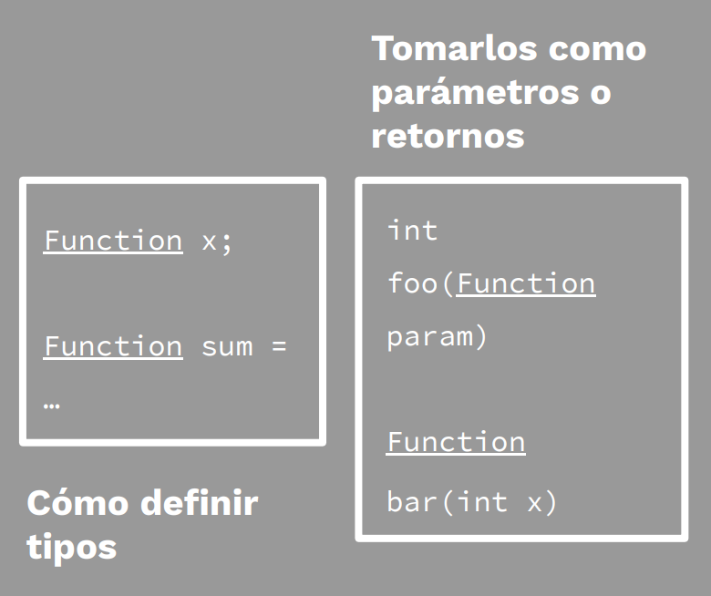

Incluso podemos empezar a definir los bajo demanda.
Así como tú definirías un string *hi*, hay también podrías definir una función.
Por ahora quedémonos con esta sintaxis. Esta sintaxis nos dice que es una función definida al
aire. Es una función que no está asignada, una variable y que simplemente estamos pasandola como
parámetro hacia otra función no se obtienen de ningún otro lado.
Son valores constantes, por así decirlo.

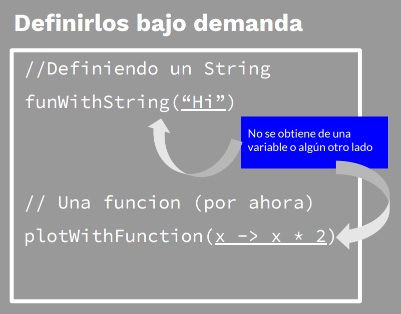

Algunos usos que puede llegar a tener el pasar este tipo
de funciones declaradas en el aire puede ser, por ejemplo, obtener una configuración de conexión o
simplemente hacer un procesamiento de un dato específico para un caso muy específico, como una petición
web o recibir un dato y manipularlo de una base de datos.  
Declarar este tipo de lógica en el aire es porque probablemente en otros lugares no se necesita, así
como el String se necesita exclusivamente en esta parte de nuestro código, tal vez este tipo de lógica
se necesita exclusivamente en esta parte del programa, y nos da el beneficio de poder tener aisladas las las partes de nuestro código, donde
vamos a necesitar lógica para hacer transformaciones, creaciones o simplemente alguien que nos provea
de un dato.

En otra parte del curso explicaremos qué tipos de funciones pueden generar datos que se pueden
utilizar, consumir posteriormente.

Cuando decimos que algo es ciudadano de primera clase en un lenguaje, quiere decir que el lenguaje reconoce que se pueden usar estos elementos como un componente mas del lenguaje. Sabe que tienen su propia sintaxis o que cumple al menos con estas caracteristicas:

Un ciudadano de primera clase puede:
- Ser pasado como argumento
- Ser el retorno de una funcion
- Ser definido y modificado
- Ser asignado a variables

Por ejemplo, otros ciudadanos de primera clase en java son:
- Clases
- Interfaces
- Datos primitivos
- Anotaciones
- Generics

---

### Clase 4 - Funciones puras
Cómo definimos las funciones pueden ser categorizadas al ser ciudadanos de primera clase.
Y el primer tipo sobre el que vamos a hablar son las **funciones puras** o conocidas como **Pure functions**.

**¿Que es una función pura?**  
Una función pura no es más que una función que
siempre genera el mismo resultado para el mismo parámetro.  
Es decir, no importa cuántas veces mandemos a invocar esta función siempre que los parámetros sean los mismos
va a generar el mismo resultado.

Las funciones puras también funcionan en aislamiento.
Eso quiere decir que no dependen del estado del sistema, no dependen sobre si el sistema está corriendo en una computadora o está corriendo en un servidor remoto, y **son deterministas**.  
Quiere decir que nosotros podemos predecir el resultado de la ejecución de una función pura.  
Si nosotros sabemos que pasamos cinco y tres a sum, podemos predecir que el resultado será ocho. (5+3) del ejemplo.  
Esto nos va a dar una ventaja gigante, y es que al estar escribiendo pruebas de nuestro código va a ser muchísimo más fácil hacer casos de prueba donde nosotros digamos. al pasar estos parámetros deberíamos obtener este resultado.

Ejemplos de funciones puras.  
Tenemos `f(x) = x^3`. Esta es una función pura porque no genera valores aleatorios.

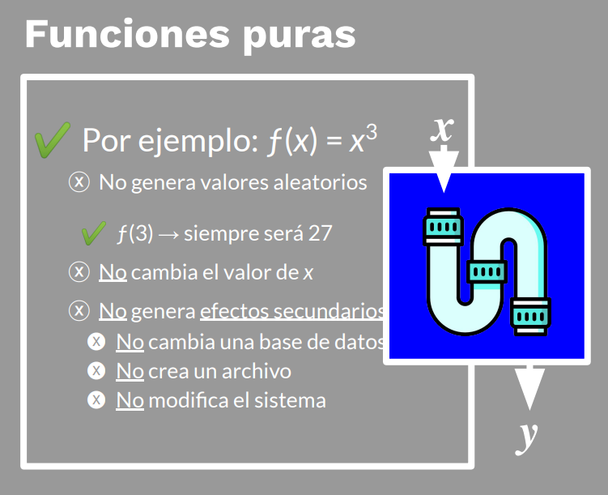

A su vez, no cambia el valor de X, Es decir, para cada X genera
un Y sin alterar el valor de X. Tres siempre va a seguir siendo tres y el resultado de la invocación
siempre será veintisiete.

**No genera efectos secundarios.**  
Ahora tenemos que entender que un efecto secundario
es que no cambia en la base de datos, no crea un archivo y no modifica el sistema.
Invocar a f(x) no apaga el Internet o borra un archivo en el sistema.
Es por esto que esta es una función pura.

Un ejemplo de función pura en Java es la función `hasAvialableFound()`

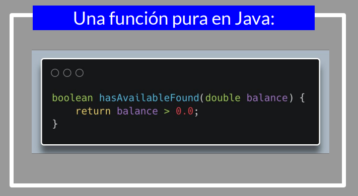

Que recibe un double que representa el balance de un usuario
y nos dice si tiene o no disponible un balance para poder operar dentro del sistema.
Es un ejemplo muy básico que lo único que hace es decirnos si un número, es mayor o
no a cero, pero es una función pura.  
Piensa en esto, el dato del usuario no se ve modificado.
El sistema no se ve alterado por ello. Es una función pura.

A las funciones que no son puras, se les conoce como impuras.
Y las reglas nos dictan algo. Lo primero que nos dictan es que una función pura puede
invocar a otra función pura. ¿Por qué? Porque podemos pronosticar cuál va a ser el resultado de esta
ejecución. Al fin Sabemos que una función pura es determinista, es decir, podemos pronosticar
el resultado.

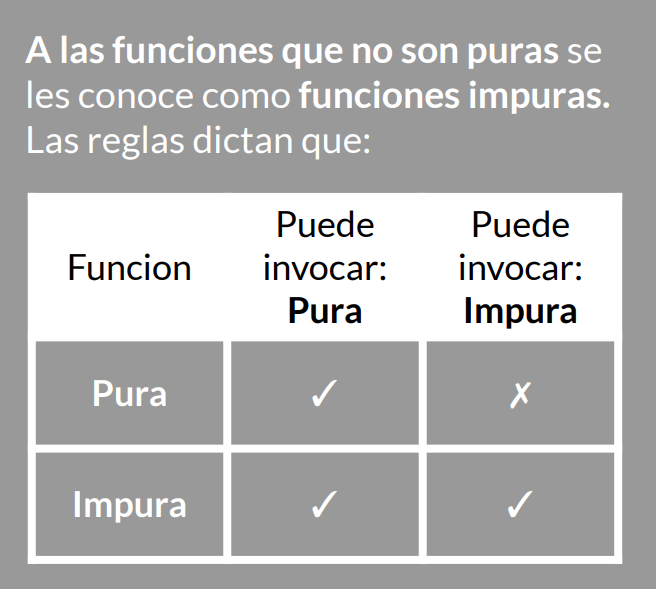

Sin embargo no podemos invocar una función impura desde una función pura porque rompería la estructura. Es decir, si desde una función pura tratáramos de invocar a una función impura, no podríamos pronosticar o predecir cuál va a ser el resultado.
Y al no poder pronosticar o predecir el resultado no tendríamos una función pura así
de simple. Entendemos que hay una regla entre cómo podemos invocar mutuamente las funciones y
qué categorías tenemos para ellas.

---

### Clase 5 - Entendiendo los efectos secundarios
Ya definimos que es una función pura y definimos que existen las funciones impuras, y
las funciones impuras generan efectos secundarios.  
¿Pero Que tiene esto de malo, que tiene esto de bueno, que es un efecto secundario?  
Vamos a hablar un poco más de ello y entender que son para poder identificar dentro
de nuestro código, que es un efecto secundario que no es un efecto secundario, y entonces poder separar las funciones que los generan de las que no, para poder entender nuestro proyecto
mejor.

Un efecto secundario es ***todo cambio observable desde fuera del sistema es un efecto secundario***.  
Es decir, si nosotros hacemos una operación y el resultado de esa operación es
observable desde fuera del sistema, es un efecto secundario.  
Por ejemplo, tenemos una función que, una vez invocada, cambia el color de algo.
A esto se le considera un efecto secundario y es observable desde fuera del sistema, tal
cual alguien que vaya y vea cómo va la ejecución del sistema podrá observar este cambio.
Es por ello que se le considera un efecto secundario.

Todos estos efectos secundarios no son evitables y los hemos tenido en nuestro código
toda la vida. Al final de cuentas son parte de poder interactuar en el sistema como por ejemplo:

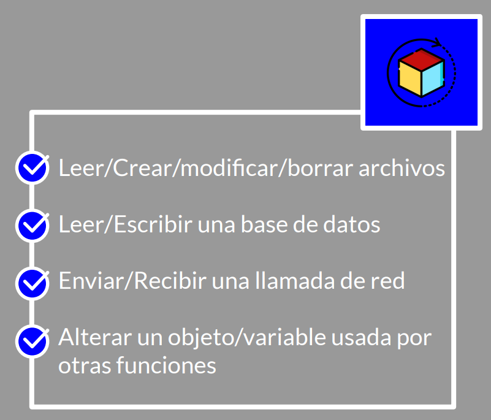

Son necesarios, no podemos evitarlos.
Sin embargo, podemos reducir las ocurrencias de los efectos secundarios.

**¿Por qué querríamos reducir o evitar los efectos secundarios?**  
Porque esto nos ayuda a tener una mejor estructura de nuestro código, nos ayuda a generar más funciones puras y nos ayuda también a tener mejor separadas las
definiciones y responsabilidades de nuestro código.  
Hay que entender esto, **los efectos secundarios son inevitables**, no podemos tener código sin efectos secundarios, pero podemos reducirlos.

La principal idea es tener código bien estructurado, código bien separado donde las responsabilidades están
aisladas, es decir, tener una arquitectura o tener un sistema en el cual todas
nuestras funciones impuras sean solamente puntos de entrada para información.
Pero una vez que la información está dentro del sistema, mantener toda esa información entre
funciones puras.

Por ejemplo, una conexión de red recibió una petición va genera un efecto secundario, pero una vez el dato este dentro del sistema, podemos transformarlo, manipularlo o hacer operaciones
con él sin necesidad de generar un nuevo efecto secundario.

La intención es tener la mayor cantidad de funciones puras dentro de nuestro sistema,
con esto vamos a reducir la cantidad de errores y vamos a mejorar la estructura de nuestro sistema
y aumentar la **testeabilidad** de nuestro sistema.

Recuerda que la **testeabilidad** de nuestro sistema
es que tantas pruebas podemos escribir sobre nuestro propio código.  
Escribir pruebas nos da como beneficio evitar errores posibles o errores conocidos dentro de nuestro código nos va a permitir tener un código más
robusto y que sea más fácil de escalar a largo plazo.
Teniendo muchas pruebas de nuestro código, podemos reducir casos inesperados que puedan llegar a pasar
teniendo funciones puras. Podemos tener mayor cantidad de pruebas.

---

### Clase 6 - Funciones de orden mayor
Definimos que ahora las funciones son ciudadanos de primera clase, definimos que tenemos funciones puras e impuras, pero la parte importante aquí es definir las funciones de orden mayor.

Una función de orden mayor es una función que cumpla al menos con alguna de estas dos características:
- Toma otra función o funciones como parámetro.
- Retornar una función como resultado de su ejecución.

Eso define que es una función de orden mayor, veamos ejemplos.
~~~
int foo (Function param)
~~~
En este caso, la función ***foo*** toma una función ***param*** y la utiliza para generar un valor entero.  
¿Que puede ser esto? Por ejemplo, podríamos tener la función para Ploteo o una función a
partir de la cual generar todos los resultados de los salarios o algo por el estilo.

O tenemos este otro caso.
~~~
Function bar (int x)
~~~
La función ***bar*** que reciben un entero y genera de nueva función.  
Y este es un caso en el cual podríamos, por ejemplo, tener una función que genere accesos a una base
de datos basado en un ***ID*** o basado en una contraseña, un password.

Podemos generar funciones de manera dinámica, basado en parámetros o incluso ambos casos.
~~~
Function baz (Function f)
~~~
Podemos tener una función que tome como primer parámetro una función y que ejecute sus datos
y resulte en otra función.  
Por ejemplo, o transformaciones de datos, es decir, tenemos una función que va a tomar un Json, va a aplicar los la función F
sobre ese JSON y generar una nueva función que va a estar generando dinámicamente datos
a partir de JSON.  

Ventajas de tener high order function:
- Podemos pasar comportamientos.  
Como filtrar elementos de una base de datos, es pasar una función como una manera de filtrar los datos.
- Compartir un medio de comunicación (Callbacks).  
Sí sabemos que algo va a ir generando resultados y necesitamos un medio de comunicación, pásame los datos a través de esta función. Es un caso muy común en el caso de JS el generar este tipo de callbacks, es simplemente cuando tengas algún dato, pásamelo por esta función es
un medio de comunicación.
- Incluso compartir lógica o reglas.  
Por ejemplo, el filtrado de una base de datos, o el cómo detectar un
password seguro o inseguro y que ese tipo de lógica se repite a lo largo del proyecto. Entonces podemos mantener una sola función con esta lógica y compartirla entre diferentes invocaciones.

**En resumen:**  
FUNCIONES DE ORDEN MAYOR  
- Toma otra funciona como parámetro.
- Retorna una función después de su ejecución.

VENTAJAS  
- Pasar comportamientos.
- Compartir un medio de comunicación.
- Compartir logica/reglas.

---

### Clase 7 - Funciones lambda
Definimos entonces que tenemos funciones puras, funciones impuras, funciones de orden mayor y seguramente hasta este punto te has encontrado mucho con esto.

Cuando se habla de Programación funcional en Java se
habla de las **Lambdas**, las famosas lambdas y a veces estamos asustados porque muchos incluso refieren al lambda
cálculos.

**¿Pero que son las Landas realmente? ¿Que representan las lambdas en el proyecto? ¿Que representan las lambdas a nivel Java?**

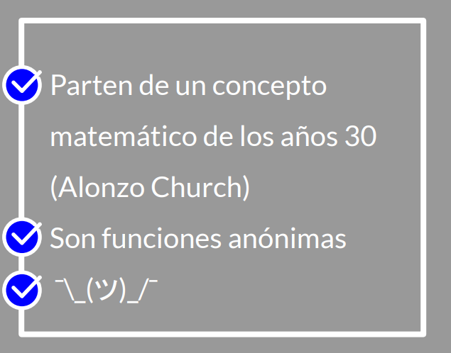

- Las lambdas provienen del cálculo Lambda. El cálculo Lambda es un concepto que se creó en los años 30 por el matemático **Alonzo Church**.  
Pero lo único que proponía era que se podía obtener resultados de una operación a partir de funciones
anónimas. Eso es el cálculo Lambda.  
- Aqui hablaremos de que es la lambda y una lambda es una función anónima, así de simple.  
Cuando tienes una función que no tiene un nombre, es una función anónima, y eso es una lambda. 
- No hay más, tan simple como eso.

Veamos una comparativa.

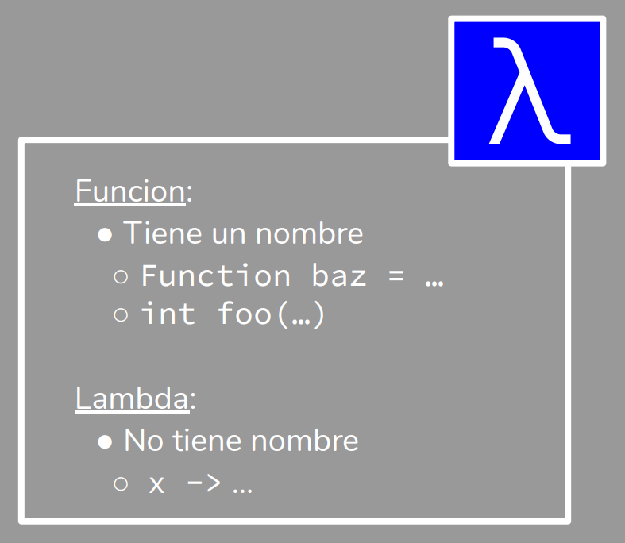

Tienes una función que se llama ***baz***, lo sabemos porque está definida como una variable baz y tenemos la función ***foo***, sigue siendo una función, recibe parámetros y generó un entero. Tienen nombre, no son anónimas.  
En cambio debajo tenemos la función sin nombre, no tiene un hombre, es una función anónima.  
Al no tener nombre, se le considera una lambda, es una forma de llamar le estas funciones sin nombre, pero siguen siendo funciones.

**¿Porque querría yo utilizar algo sin nombre?, ¿Porque no querría yo tener el dato almacenado en algún lado?, ¿Porque no querría yo tener una referencia así a esta?**

- Y la solución es simple, en muchas ocasiones necesitamos un comportamiento de uso único.  
Por ejemplo, una manera de filtrar archivos bajo extensión y solamente lo necesitamos en un momento del
sistema. Generar una lamda para este tipo de caso es algo muy sencillo.
- O es una regla que se requiere de un solo lugar.  
Por ejemplo, dime cómo filtrar a los empleados basado en su edad o
dime cómo filtrar alumnos de mi base de datos que aprobaron o no aprobar una materia. Es
una regla específica que se utiliza en un solo lugar e incluso puede que también se reutiliza otros
lados.Pero serán Landas diferentes o en ese caso, crearás una función con nombre a la cual referenciaras.
- La lambda tiene que ser algo extremadamente simple.  
Una lambda idealmente es una función de una sola línea, o menos incluso que pueda ser legible de primera instancia, y ese es un gran beneficio porque hace que el código sea más fácil de entender.

Y tener siempre en cuenta que una lambda sigue siendo una función, por más que la llamemos lambda.

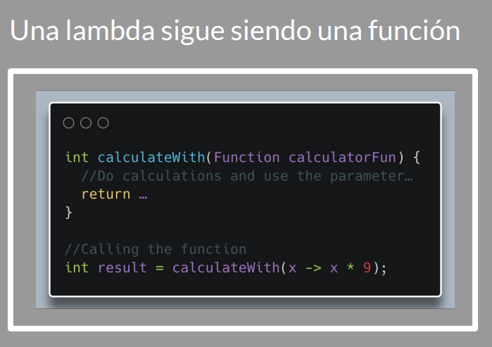

**Resumen**  
Función = Tiene un nombre.  
Lambda = Función que no tiene un nombre.

¿Por qué usar lambdas?  
Es un comportamiento único.  
Es una regla que solo se requiere en un lugar.  
Es una función muy simple (1 línea).

---

### Clase 8 - Inmutabilidad
[Video de la clase](https://platzi.com/clases/1826-java-funcional/26226-inmutabilidad/)

Hasta este punto no hemos hablado de una parte importante de la programación
funcional, que es la inmutabilidad de los datos, los datos en sí, con los que vamos a operar nuestras
funciones.  
Hablemos entonces de la diferencia con respecto a lo que usualmente hacemos en otros
lenguajes de programación, y como la programación funcional espera manejar los datos.  
Y esto es principalmente a través de datos de dos tipos **mudables** e **inmutables**, en la mayoría de casos
vas a preferir tener datos inmutables y a continuación te voy a explicar por qué:

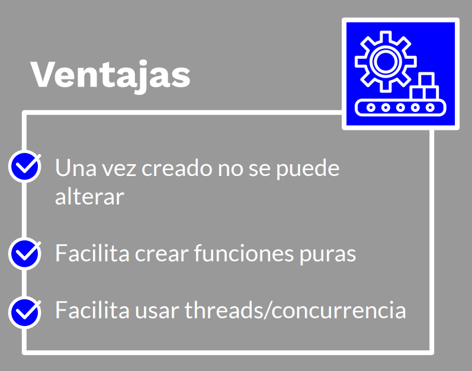

- Las principales ventajas de tener datos inmutables es que una vez creado un dato ya
no puede alterarse.  
Es decir, creas una instancia de un cierto objeto y ese objeto ya
no cambia.  
Y ¿Por qué querrías eso? Porque ciertamente, al crear a un ciudadano, por ejemplo, su
identificador único no va a cambiar o sus nombres no van a cambiar.  
O a lo mejor quieres establecer un identificador para un libro o de alguna manera necesitas una lista
de asistentes que ya no va a cambiar y esa es una ventaja que, una vez creado un dato ya
no cambia.
- Esto nos facilita crear funciones puras.  
Al tener datos que no cambian, tenemos
funciones que no generan efectos secundarios, lo cual hace que nuestras funciones se vuelvan puras
casi en automático.  
- Por otro lado, si son puras, hace más fácil el tener **threads**.  
Es decir, una función que no genera efectos secundarios es más fácil de meter en diferentes procesadores,
puedes tomar esa función, ejecutarla en un procesador de ocho núcleos en ocho diferentes ocasiones y
a final de cuentas no va a haber problema entre tratar de sincronizar los datos que la función uno y
la función ocho están tratando de generar.  
Es una ventaja enorme al momento de hacer programación concurrente.

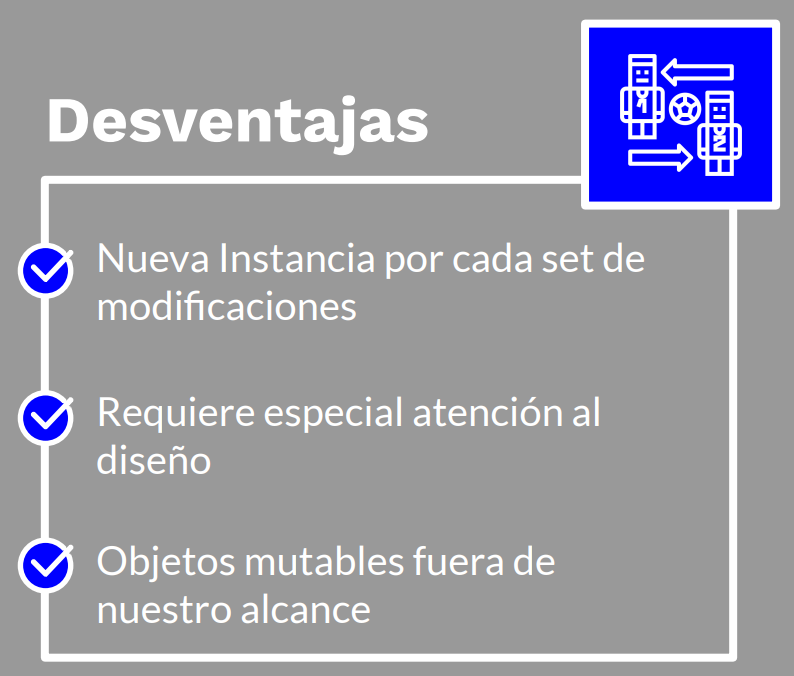

Pero también tiene sus desventajas.  
- Por cada modificación que necesite sobre los datos, vas a tener que crear una nueva instancia del dato.  
Es decir, si tu quisieras alterar el apellido de una persona que es inmutable, vas a tener que generar
una nueva persona y se van a tener que identificar diferente.  
Esto puede llegar a ser bastante molesto a nivel código, pero puede tener también sus ventajas.
- Requiere especial atención al diseño.
- Objetos mutables que no tenemos nosotros control sobre ello.  
Esa es una desventaja enorme. Existen objetos de librerías, existen objetos dentro del
lenguaje o incluso datos que nos llegan de algún otro lado, que son mutables por sí mismos.
Nosotros no tenemos control de cómo funcionan esos objetos.
Entonces tenemos que generar alguna manera de que esos objetos no muten aún cuando su naturaleza se
los permite.

Una manera de generar inmutabilidad es haciendo copias nuevas, protegiendo nuestros datos.

Ejemplos de mutabilidad e inmutabilidad.

PureFunctions.java
~~~
package com.platzi.functional._01_pure;

public class PureFunctions {
    /**
     * Aunque hoy dia conocemos a los metodos estaticos como metodos de clase o simplemente metodos estaticos,
     * en realidad un metodo puede ser considerado o visto como una funcion.
     *
     * Basandonos en nuestra definicion de funcion, sabemos que para cada X genera una Y. En este caso,
     * nuestra "x" es en realidad el par (x, y) y nuestra "y" sera el resultado de sumarlas.
     *
     * Habra algun cambio en el resultado si yo ejecuto 90 veces sum(3,5)?
     *
     * La respuesta es: NO.
     *
     * Una funcion pura no depende de estados exteriores (propiedades, objetos, variables
     * externas a su definicion, etc.) ni ve afectado su resultado por agentes externos.
     */
    public static int sum(int x, int y) {
        return x + y;
    }

    /**
     * Imagina que la siguiente clase es parte de un sistema financiero
     */
    static class Person {
        //Nos enfocaremos solo en esta propiedad por ahora…
        private double balance;

        public Person(double balance) {
            this.balance = balance;
        }

        public double getBalance() {
            return balance;
        }

        public void setBalance(double balance) {
            this.balance = balance;
        }
    }

    /**
     * Teniendo esta funcion, se le puede considerar pura?
     */
    public static boolean hasAvailableFunds(double funds) {
        return funds > 0.0;
    }

    /**
     * La respuesta es: Si!
     *
     * porque la funcion revisa unicamente si un numero es mayor a 0, no importa la referencia de donde vengan
     * los fondos, mientras esos fondos sean menores o iguales a 0, la respuesta siempre sera false.
     *
     * Por otro lado, cuando una persona consigue fondos en su cuenta, la funcion en realidad no ve ese cambio.
     * Para la funcion la respuesta cambiara hasta que le den un nuevo valor a evaluar. La funcion no depende
     * de la presencia de los datos en ningun lugar o de un contexto.
     *
     * Mira el ejemplo abajo:
     */
    public static void main(String[] args) {
        Person sinuhe = new Person(-20.00);
        //False, Sinuhe esta endeudado hasta los dientes
        System.out.println(hasAvailableFunds(sinuhe.getBalance()));

        Person ricardo = new Person(1300.00);
        //True, Ricardo tiene dinero disponible!
        System.out.println(hasAvailableFunds(ricardo.getBalance()));

        //La funcion es evaluada al momento y no depende de que objeto es quien la manda a invocar,
        //es por ello que se considera pura.
    }
}
~~~

SideEffects.java
~~~
package com.platzi.functional._02_sideeffects;

import java.io.BufferedReader;
import java.io.File;
import java.io.FileReader;
import java.io.IOException;

public class SideEffects {
    /**
     * Funcion impura, el resultado de ejecutarla puede ser observado desde fuera
     * del codigo. Por ejemplo en una consola.
     */
    static void helloWorld() {
        System.out.println("Hello World!");
    }

    /**
     * Funcion impura, depende de la existencia y el estado de un archivo,
     * eso provoca que sea no determinista
     * Que sucede si esta funcion se ejecuta en mi computadora y en tu computadora?
     * - Podemos determinar la salida en ambos casos?
     * - Como nos aseguramos que nadie mas este modificando el archivo?
     */
    static boolean containsMexico(File file) {
        try (BufferedReader bfReader = new BufferedReader(new FileReader(file))) {
            String line;
            while ((line = bfReader.readLine()) != null) {
                if (line.contains("Mexico")) {
                    return true;
                }
            }
        } catch (IOException ignored) {
            return false;
        }

        return false;
    }

    /**
     * Funcion impura. Aunque el codigo no esta implementado, con entender lo que hace
     * sabemos que es no determinista y que no podemos garantizar los resultados para
     * un cierto parametro
     */
    static String getLastNameForGivenName(String name) {
        //Obtener una conexion a la Base de datos
        //Ejecutar un query en la base de datos
        //Revisar los resultados del query…
        //retornar el valor del lastName o un valor por default en caso de ausencia
        //...
        return "";
    }
}
~~~

**POJO** Plain Old Java Object  
Utilizada por programadores Java para enfatizar el uso de clases simples y que no dependen de un framework en especial.

MutablePerson.java
~~~
package com.platzi.functional._03_immutable.mutable;

import java.util.List;

/**
 * POJO comun. Incluye propiedades y metodos para acceder y modificar dichas propiedades
 */
public class MutablePerson {
    private String firstName;
    private String lastName;

    private List<String> emails;

    public MutablePerson() {
    }

    public String getFirstName() {
        return firstName;
    }

    public void setFirstName(String firstName) {
        this.firstName = firstName;
    }

    public String getLastName() {
        return lastName;
    }

    public void setLastName(String lastName) {
        this.lastName = lastName;
    }

    public List<String> getEmails() {
        return emails;
    }

    public void setEmails(List<String> emails) {
        this.emails = emails;
    }

    @Override
    public String toString() {
        return "MutablePerson{" +
                "firstName='" + firstName + '\'' +
                ", lastName='" + lastName + '\'' +
                ", emails=" + emails +
                '}';
    }
}
~~~

MutablePerson_2.java
~~~
package com.platzi.functional._03_immutable.mutable;

import java.util.List;

/**
 * Clase mejorada.
 * Ahora obligamos a quien use esta clase a crear instancias usando el constructor.
 * Quitamos el setter para evitar que hagan modificaciones peligrosas…
 */
public class MutablePerson_2 {
    private String firstName;
    private String lastName;

    private List<String> emails;

    public MutablePerson_2(List<String> emails) {
        this.emails = emails;
    }

    public String getFirstName() {
        return firstName;
    }

    public void setFirstName(String firstName) {
        this.firstName = firstName;
    }

    public String getLastName() {
        return lastName;
    }

    public void setLastName(String lastName) {
        this.lastName = lastName;
    }

    public List<String> getEmails() {
        return emails;
    }

    @Override
    public String toString() {
        return "MutablePerson_2{" +
                "firstName='" + firstName + '\'' +
                ", lastName='" + lastName + '\'' +
                ", emails=" + emails +
                '}';
    }
}
~~~

MutablePerson_3.java
~~~
package com.platzi.functional._03_immutable.mutable;

import java.util.List;

/**
 * Mas mejoras. Ahora nuestra lista de emails es final. Eso nos garantiza que nadie sobre escribe
 * el valor de la propiedad y una vez creado siempre sera la misma lista.
 *
 * Eso deberia resolver el problema… cierto?
 */
public class MutablePerson_3 {
    private String firstName;
    private String lastName;

    private final List<String> emails;

    public MutablePerson_3(List<String> emails) {
        this.emails = emails;
    }

    public String getFirstName() {
        return firstName;
    }

    public void setFirstName(String firstName) {
        this.firstName = firstName;
    }

    public String getLastName() {
        return lastName;
    }

    public void setLastName(String lastName) {
        this.lastName = lastName;
    }

    public List<String> getEmails() {
        return emails;
    }

    @Override
    public String toString() {
        return "MutablePerson_3{" +
                "firstName='" + firstName + '\'' +
                ", lastName='" + lastName + '\'' +
                ", emails=" + emails +
                '}';
    }
}
~~~

MutablePerson_4.java
~~~
package com.platzi.functional._03_immutable.mutable;

import java.util.LinkedList;
import java.util.List;

/**
 * Alguien decide que puede extender de nuestra clase y cambiar solo algunos
 * elementos… ¡nos hackea!
 *
 * De nada sirvieron las modificaciones en la clase MutablePerson_3, esta clase nos
 * esta suplantando!
 */
public class MutablePerson_4 extends MutablePerson_3 {
    public MutablePerson_4(List<String> emails) {
        super(emails);
    }

    @Override
    public List<String> getEmails() {
        List<String> spammyEmails = new LinkedList<>();
        spammyEmails.add("tubanco@mibanco.banco.com");
        spammyEmails.add("cheapfoods@blackmarket.com");

        return spammyEmails;
    }
}
~~~

Outsider.java
~~~
package com.platzi.functional._03_immutable.mutable;

import java.util.LinkedList;
import java.util.List;

public class Outsider {
    public static void main(String[] args) {
        List<String> sierEmail = new LinkedList<>();
        sierEmail.add("sier@sier.com");

        MutablePerson sier = new MutablePerson();
        sier.setEmails(sierEmail);
        sier.setLastName("Israel");
        sier.setFirstName("Sergio");

        //Veamos un poco los peligros de una clase mutable
        System.out.println(sier);
        badFunction(sier);
        System.out.println(sier);

        System.out.println("///////////////////////////////");

        MutablePerson_2 sinuhe = new MutablePerson_2(sierEmail);
        System.out.println(sinuhe);
        otherBadFunction(sinuhe);
        System.out.println(sinuhe);

        System.out.println("///////////////////////////////");

        MutablePerson_3 sinuhe_3 = new MutablePerson_3(sierEmail);
        System.out.println(sinuhe_3);
        otherBadFunctionPart3(sinuhe_3);
        System.out.println(sinuhe_3);

        System.out.println("///////////////////////////////");

        MutablePerson_3 sinuhe_4 = new MutablePerson_4(sierEmail);
        System.out.println(sinuhe_4);
    }

    /**
     * Este metodo modifica la lista mediante un setter.
     * Tener el setter es peligroso…
     */
    static void badFunction(MutablePerson person) {
        List<String> emails = new LinkedList<>();
        emails.add("imnotevil@mail.com");

        person.setEmails(emails);
    }

    /**
     * Este metodo toma el objeto devuelto por el getter… pero el
     * objeto es mutable, asi que podemos modificarlo sin restricciones…
     */
    static void otherBadFunction(MutablePerson_2 person) {
        List<String> emails = person.getEmails();
        emails.clear();

        emails.add("imnotevil@mail.com");
    }

    static void otherBadFunctionPart3(MutablePerson_3 person) {
        List<String> spammyEmails = new LinkedList<>();
        spammyEmails.add("tubanco@mibanco.banco.com");
        spammyEmails.add("cheapfoods@blackmarket.com");

        List<String> emails = person.getEmails();
        emails.clear();

        emails.add("imnotevil@mail.com");
        emails.addAll(spammyEmails);
    }
}
~~~

ImmutablePerson.java
~~~
package com.platzi.functional._03_immutable.immutable;

import java.util.LinkedList;
import java.util.List;

/**
 * Clase final de nuestro diseño.
 *
 * Cuenta con mas de una mejora:
 *
 * 1. Es final, asi nadie puede extender de ella. No mas suplantaciones
 * 2. Las propiedades son finales, una vez creado un objeto no puede mutar
 * 3. El constructor exige todas las propiedades para generar un objeto
 *    (podria incluso generarse un builder derivado de este constructor)
 * 4. Cuando se accede a los emails, se genera una copia! no se envia la lista mutable!
 */
public final class ImmutablePerson {
    private final String firstName;
    private final String lastName;

    private final List<String> emails;

    public ImmutablePerson(String firstName, String lastName, List<String> emails) {
        this.firstName = firstName;
        this.lastName = lastName;
        this.emails = emails;
    }

    public String getFirstName() {
        return firstName;
    }

    public String getLastName() {
        return lastName;
    }

    public final List<String> getEmails() {
        return new LinkedList<>(emails);
    }

    @Override
    public String toString() {
        return "ImmutablePerson{" +
                "firstName='" + firstName + '\'' +
                ", lastName='" + lastName + '\'' +
                ", emails=" + emails +
                '}';
    }
}
~~~

Outsider.java
~~~
package com.platzi.functional._03_immutable.immutable;

import java.util.LinkedList;
import java.util.List;

public class Outsider {
    public static void main(String[] args) {
        String firstName = "Sinuhe";
        String lastName = "Jaime";

        List<String> emails = new LinkedList<>();
        emails.add("sier@sier.com");

        ImmutablePerson sier = new ImmutablePerson(firstName, lastName, emails);

        System.out.println(sier);
        badIntentionedMethod(sier);
        System.out.println(sier);
    }

    /**
     * No importa que el metodo intente modificar a la persona, la persona esta diseñada
     * para no recibir modificaciones.
     */
    static void badIntentionedMethod(ImmutablePerson person) {
        List<String> emails = person.getEmails();
        emails.clear();
        emails.add("imnotthebadguy@mail.com");
    }
}
~~~

Entonces a la clase que se creó para generar objetos inmutables se utilizó la palabra **final** tanto en la clase como los atributos o propiedades para evitar la modificación, el método que exige todas las propiedades y por ultimo permitió que se generara una copia de la lista de correos.

Tener este tipo de estrategias requiere diseño especial para determinar qué es y qué no es inmutable,
pero es importante, a nivel código, porque con esto podemos asegurar que nadie llegue y cambie un password, que nadie llegue y cambie un salario, que nadie llegue y cambie correos o me agregue correos spam.

En muchas ocasiones va a ver objetos fuera de nuestro control que nosotros no podemos evitar que sean
inmutables, como es el caso de las listas de Java, pero protegernos utilizando copias nuevas es una manera de generar inmutabilidad, incluso cuando no tenemos control sobre ellos.

---

## Módulo 3 - Functional Programming en Java
### Clase 9 - Repositorio del curso
¡Vamos a comenzar con el código!  
Para que tengas todos los archivos descargados de antemano, te comparto el repositorio del curso:  
[Repositorio del curso](https://github.com/sierisimo/JavaSE-Functional-platzi)  
Lo hice con:
~~~
git submodule add https://github.com/sierisimo/JavaSE-Functional-platzi.git Repositorios_del_Curso_Programacion_Funcional
~~~

**TENER EN CUENTA QUE CONTIENE ARCHIVOS CON EXPLICACIÓN DE LOS TEMAS QUE SE IRAN VIENDO.**

---

### Clase 10 - Configuración del entorno de trabajo
Tengo clonado todo los repos con todas las ramas, pero en el branch `job-search` tiene todas las pruebas que vamos a usar en estos módulos, lo que hice fue situarme en la rama y abrir desde el Intellij IDEA la carpeta del proyecto(Repositorios_del_curso_programacion_funcional).

---

### Clase 11 - Revisando el paquete java.util.function: Function
**Atajos y Plugins**  
`psvm` o `main` -> public static void main.  
`sout` -> system.out.println.  
Plugin Intellij para tener las llaves de apertura y cierre en colores -> [Plugin](https://plugins.jetbrains.com/plugin/10080-rainbow-brackets/).  
Se puede bajar desde la pág o instalar desde las preferencias del IDE (File -> Settings -> Plugins).  
`Shift + F6` -> Para reemplazar el nombre de una función, en este caso, y que donde se utiliza también cambie.  
Acá esta la [Documentación](https://www.jetbrains.com/help/idea/rename-dialogs.html?keymap=secondary_macos) de shorcuts de Intellij.

Empecemos experimentando con funciones, creamos una clase para ello, llamada **MathFunctions**.

Para crear una función solamente tenemos que utilizar el tipo, la interfaz ***Function*** que se encuentra disponible en Java, basta con escribir y presionar enter para que te lo importe. Si revisamos la definicion de Function encontramos lo siguiente:

La funcion recibe como parametro un tipo y genera un resultado, puede recibir una función y devolver una función.

Crearemos la funcion **square** que recibe un entero y devuele el cuadrado del mismo.

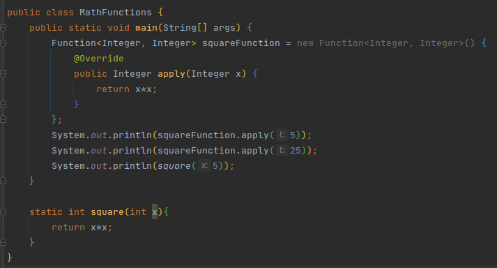

Un método también puede ser una función, la diferencia es que las funciones también son tipos y al ser tipos se puede realizar operaciones con ellas:
- Involucrarse como variables
- Pasarlas como parámetros
- Recibirlas como retorno de ejecución

---

### Clase 12 - Revisando el paquete java.util.function: Predicate
Ésta es la forma tradicional de crear una función pero esta sintaxis no aporta mucho porque hace que el código sea menos legible, podemos hacer algo que Java nos permite con esta nueva  sintaxis, que nos deja definir de una manera más simple y más legible.

Entonces podemos hacer la siguiente función **isOdd**, que reciba un entero y devuelva un booleano.
~~~
Function<Integer, Boolean> isOdd = x -> x % 2 == 1;
~~~

Si revisamos las dos sintaxis vemos una clara diferencia y una es mucho más corta y legible que la anterior.

La interfaz **Predicate**, que está dentro del package *Function*, no es más que una especie de función que trabaja sobre un tipo pero genera un boolean, lo que hace es testear si algo es válido.

Crearemos un *Predicate* llamado **isEven** que recibe un entero y dice si es par o no, y para probar los predicados solo tenemos que invocarlas con **.test()**, estamos revisando si un predicado es verdad.

Otro ejemplo práctico de predicate.

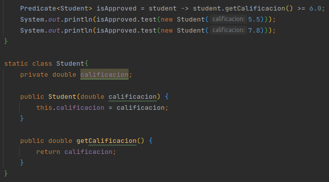

Con los predicados entonces podemos hacer validaciónes rápidas, sobre los mismos métodos o funciones que ya tengamos, nos puede beneficiar mucho al momento de estar filtrando elementos o corroborando que tenga datos.

---

**Activar el estilo de fuentes con ligaduras**

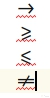

- Settings → Editor → Font Seleccionar la fuente fira code (Yo deje JetBrains Mono) y activarlo.
- Enable in Settings → Editor → Font → Enable Font Ligatures

---

### Clase 13 - Revisando el paquete java.util.function: Consumer y Supplier
Adicional a las funciones y a los predicados que tenemos dentro de Java funcional.
También tenemos otros dos elementos que están diseñados para consumir o para proveer de datos: **Consumer** y **Supplier**.

Veamos con un ejemplo cómo podemos consumir un objeto o cómo podemos
proveer de un objeto, para eso crearemos una pequeña clase que se llama **CLIArguments**.  
Y esta clase lo único que hace es contener los elementos que se le pasarán por terminal a
nuestro programa.  
Vamos a agregar primero que nada, algo muy común en una terminal que es pedir
el manual de usuario. Entonces crearemos una propiedad que se llame **isHelp**.  
Esta propiedades un booleano que simplemente cuando esté presente lanzaremos el
manual de la terminal, o si no está presente, continuaremos operando normalmente. Y
lo que haremos será crear un pequeño getter para esta propiedad.

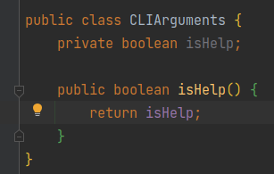

Hagamos unas utilidades para esta, llamaremos **CLIArgumentsUtils**, y aquí lo que haremos será crear una función que
nos muestre el manual únicamente cuando la propiedad *isHelp* está presente.
Entonces llamaremos a **showHelp** que recibe un *CLIArguments* y lo que haremos internamente es definir un **Consumer**.  
Un Consumer es una interfaz genérica que trabaja sobre un tipo de dato (T).  
Trabajaremos sobre nuestra clase creada y le llamaremos **ConsumerHelper**, recibirá un *CLIArguments* e
internamente diremos: si solicitaron la ayuda, imprimiremos *"Manual Solicitado"*.

Para invocar a nuestro nuevo consumer recién creado simplemente tenemos que llamar a *ConsumerHelper.accept()* y le pasamos el dato.

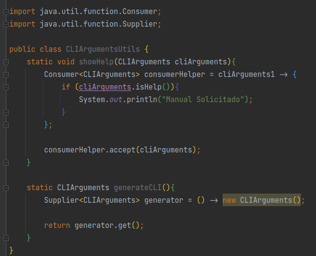

Un uso práctico que puede llegar a tener el Consumer es
realizar operaciones sobre un tipo de dato.  
Tenemos un listado de datos y por cada dato en esa lista
vamos consumiendo y operando sobre ese dato en específico.  
Por ejemplo, borrar archivos. Recibes una lista de archivos y vas borrando cada archivo que va recibiendo
el Consumer.

Lo segundo que haremos será crear una función rápida que nos provea de **CLIArguments**, que es la clase que estamos creando y para esto le llamaremos **generateCLI** y lo que haremos será simplemente crear un **Supplier**.

Un *Supplier* es otra Interfaz genérica que
va a generar datos de un cierto tipo, es un tipo de función que se encarga de generar datos, de proveer datos.

Crearemos también un generator que lo que hacemos es generar un nuevo *CLIArguments* y retornaremos el *generator.get()*.

Utilidades que puede tener esto es, por ejemplo, generar configuraciones bajo demanda o tener alguna manera de crear archivos
bajo demanda. Ya no tienes que proveer una configuración completa.
Sólo creas una forma de obtener el siguiente resultado.
Eso lo podemos ver más adelante en el módulo de Strings, donde generaremos muchos
datos de manera infinita a partir de un Supplier.

[Página donde explican mejor algunos conceptos](https://medium.com/swlh/understanding-java-8s-consumer-supplier-predicate-and-function-c1889b9423d)

---

### Clase 14 - Revisando el paquete java.util.function: Operators y BiFunction
Hasta este punto hemos visto que tenemos funciones que nos permiten validar, los **Predicate**.  
Tenemos funciones que nos permiten recibir de un tipo y generar otro tipo como resultado, y vimos que tenemos funciones que nos permiten consumir o que nos permiten generar
objetos o generar datos de alguna manera.

Existen otros tipos de operadores y otros tipos de funciones que nos permiten trabajar sobre un cierto tipo de tipo indefinido, sin
necesidad o problema para tener que definir qué tipos vamos a estar recibiendo y generando.
Y esas funciones se les conoce como **Operators**.

Creamos la clase **StringFunctions**.
Hemos estado utilizando hasta ahora métodos estáticos y esto es porque es una manera más sencilla de tener funciones.
Sin necesidad de crear objetos bajo demanda.  
Usaremos el *main* ahora.

Usaremos una nueva función que se llama **UnaryOperator** que es una función que trabaja sobre un cierto tipo definido, pero si vamos a la definición. La definición trabaja sobre función y es una función que recibe
un tipo, pero genera un resultado del mismo tipo.
Entonces no tenemos que definir una función bajo, un tipo de entrada y un tipo de salida.

Entonces generaremos un tipo UnaryOperator que se llamara *quote* y
lo que haremos será tomar un texto y agregarle comillas.
Para hacer eso, haremos una función sencilla que tomará un texto y lo que devolverá será la
definición de ese texto con comillas.

La manera de utilizar un *UnaryOperator* es exactamente la misma que la que tenemos
para una función, simplemente tenemos que mandar a llamar al método *apply* y
le pasaremos cualquier texto, y lo que veremos es que internamente le pone comillas.  
Podemos hacer esto también para agregar un énfasis.

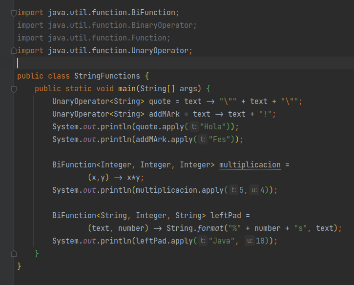

La segunda interfaz que veremos
ahora será **BiFunction**.

El problema que tenemos con funciones es que cómo están definidas, reciben un elemento
de un cierto tipo y generan un elemento de un cierto tipo. Eso quiere decir que
nada más recibimos un parámetro. El problema está en que muchas de las operaciones generalmente requieren
más de un parámetro.

BiFunction es una función que va a tomar
dos tipos de dato y va a generar otro tercer tipo de dato.

Volviendo este ejemplo rápido de multiplicación tomaríamos un entero, tomaríamos otro entero y generariamos otro entero.
Y entonces la función de multiplicación sería una función que toma un dato X, uno Y y como resultado nos va a generar simplemente X multiplicado Y.  
Es relativamente sencillo de entender y la parte curiosa es que tiene el mismo método *apply* que
función. Entonces podríamos invocarla directamente con multiplicación.apply, pasandole los argumentos, por ejemplo, cinco por cuatro nos daría como resultado veinte.

Así como existe UnaryOperator para un solo parámetro, también existen BiFunction y BiOperator. Entonces, en lugar de definir esta función multiplicación
con tres tipos de dato, podríamos irnos directamente con un solo tipo de dato y
cambiando de BiFunction a BiOperator.

BiOperator funciona de la misma manera, recibe un tipo
y los dos argumentos más el resultado van a ser del mismo tipo.

Hagamos un ejemplo con BiFunction para poder agregar espacios algún String.
Esto es una función famosa conocida como **leftPad**.
Tomaremos un String sobre el cual vamos a agregar espacios, un entero, que será la cantidad de espacios
que nos gustaría agregar y como resultado, generaremos un nuevo String.  
A este le llamaremos **leftPad** y recibiremos entonces un texto, el número de espacios y
utilizaremos una función que existe dentro de Java, ya que se llama **String.format**.  
Este va a tratar de generar un nuevo String formateado con los parámetros que le demos.
En nuestro caso, queremos generar un nuevo String que tome la cantidad de espacios que le estamos diciendo
y esto está definido por la letra **S**, al agregar la letra estamos diciendo que formatee con espacios
y le tenemos que decir que texto tiene que formatear con espacios, utilizaremos el texto que nos están pasando como parámetro. Es importante mencionar que si nuestro texto es más grande que la cantidad de espacios, no va a añadir
ningún espacio adicional. Es decir, nos va a devolver el texto que ya tenemos.  
Diremos directamente que queremos, que a la palabra Java la
convierta en una palabra que tenga al menos un total de diez elementos agregando
espacios a la izquierda. Y entonces, al ejecutar, vemos que agregan los seis espacios faltantes para
tener una palabra de diez espacios.

Con esto entendemos que podemos generar funciones
más complejas o más interesantes que hagan esto mismo de muchas maneras.
Un ejemplo práctico para poder utilizar una BiFunction sería un formateador de texto.
Tienes un programa que se encarga de leer un archivo y le vas agregando todos los formatos conforme lo vas necesitando y te paso yo una serie de funciones, podríamos tener entonces incluso
una lista de BiFuncions que pudieran hacer el tipo de formateo con respecto a lo que necesitamos con
un String, un Integer y otros String y lo llamaríamos formateadores.

La intención de esto final de cuentas es que podemos empezar a pasar este tipo de lógica entre
diferentes funciones y entre diferentes métodos para compartir alguna manera de hacer las cosas sin
necesidad de tener esta lógica regado, definida en múltiples clases o en múltiples métodos y tenerla solamente definidas como variables y estar compartiendo la mutuamente

---
**Resumen**  
Estas funciones extienden de Function. Quiere decir que tienen el método apply.
- **UnaryOPerator** --> Solo se especifica un solo tipo de dato. Se entiende que tendrá como resultado el mismo tipo.
- **BinaryOperator** --> Solo se especifica un tipo de dato. Se entiende que tendrá 2 parámetros de entrada y el de retorno del mismo tipo de dato.
- **BiFunction** --> 2 parámetros de entrada, se tiene que especificar el tipo de dato. Puede tener diferentes tipos de entradas como también diferente tipo de salida.

[Más información](https://www.baeldung.com/java-bifunction-interface)

---

### Clase 15 - Entendiendo dos jugadores clave: SAM y FunctionalInterface
Hasta ahora vimos que Java nos proporciona del paquete *Functional* interfaces con la que podemos escribir nuestras propias funciones.  
Podemos hacer evaluaciones con **Predicate**, funcion con **Function**, funciones de 2 parámetros con **BiFuncion**, y si todos los datos son del mismo tipo podemos usar **UnaryOperator** o **BinaryOperator**, si vamos a consumir algún dato tenemos a **Consumer** y si necesitamos proveer algun datos tenemos a **Supplier**.

Esto no es todo, Java introduce una manera en la que nosotros podemos definir nuestras funciones o nuestra propia estructura de funciones.
Primero definamos que es una interfaz de tipo **SAM**(Single Abstract Method), es una interfaz que tiene un solo método sin definir, es decir, si creo
una interfaz tengo que definir un solo método, en este caso **accept** y asi solo ya es una SAM.

Con la notacion `@FunctionalInterface` puedo decir que ese método se va a utilizar como una función. Con esto, el lenguaje sabe que puedo usar esta sintaxis en la que tengo la flecha en la que voy a poder hacer definiciones concretas. Sin embargo si agregaramos otro método Java no va a permitir que compile el método, porque no es un SAM.

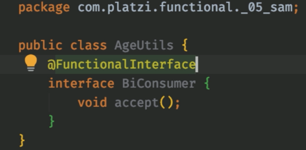

Definiendo nuestras propias funciones.  
La primera llamada **TriFunction** recibe como parámetros tres tipos de datos *T, U, V* y devuelve un *R*, son genéricos, no sabemos con que tipos de datos va a trabajar pero alguien me lo va a definir después.  
También vamos a generar un método **Apply**, para tener consistencia con las demás funciones, este retorna un *R* y usa como parámetros *T, U, V*.  
Tenemos también una función que recibe 3 Integer y devuelve un **LocalDate** para transformar a fecha los valores dados.  
Entonces si le pasamos los valores a la función **calculateAge** usamos **Period** que es un periodo de tiempo en Java, y calculamos cuanto hay entre hoy y la fecha que hemos generado antes, y devolvemos los años que hay entre ellos.

Para asegurarnos de que la fecha este bien escrita, es decir que los dias o meses tengan un 0 delante si son menores que 10, hacemos una función **addCeros** que toma un Integer y devuelve un String.

Entonces pudimos crear una nueva función que recibe 3 parámetros que en Java no existe. Podemos hacer esto para casos específicos que trabajen con tipos especificos o que requiramos de algún tipo de nombre de método o necesitemos algún tipo de estructura en específico.

---

### Clase 16 - Operador de Referencia
En un proyecto donde ya tengo definidos métodos, funciones o tengo definidas clases, que ya tiene una manera de trabajar entre ellas o recibiendo objetos, Java pensó en los operadores de referencia y lo que hizo fue proveerte de una manera de hacer referencia a eso que ya tiene definido.

Para este caso definiremos un método que va a recibir una cantidad indefinida de elementos y nos va a generar una Lista, llamada **getList**.  
Ahora la lista incluye un método para poder proveerle con un **Consumer**. Entonces puedo hacer un `profesores.forEach()`, con este método, la estructura nos dice que requiere de un *Consumer* que reciba cada uno de los elementos de la lista.  
Podemos pasarle un Consumer propio que lo único que hace es imprimir en pantalla, e internamente la lista va a iterar cada uno de los elementos y va a ejecutar el Consumer para cada uno.

Pero esto es un poco redundante y Java nos da un operador que nos permite hacer referencia a métodos o funciones que ya estan definidas en alguna clase o algún objeto.  
Podemos hacer esto mismo, directamente con forEach y en lugar de crear un nuevo Consumer, podemos usar la referencia de algun método que pueda hacer eso. Entonces podemos referirnos a `System.out` y usamos el operador `::` que dice anda a buscar este método o función definida en este objeto, que en este caso es println. -> `(System.out::println)`, estas dos instrucciones son exactamente lo mismo.

Entonces ya no tenemos la necesidad de crear funciones u objetos si ya tenemos métodos estáticos o métodos en objetos con los cuales trabajar.  
Esto facilita el poder referenciar directamente un método que haga una creación de archivo o un método que haga un parseo, o un método que pueda tomar una desición por nosotros que ya esta en nuestro proyecto y no tenemos que convertir en una función, de alguna u otra manera los métodos también son funciones. Los métodos son funciones que estan ligados a una clase u objeto.

Para poder usarlo a partir de nuestro operador de referencia, el método tiene que cumplir con las mismas caracteristicas que la función que deberiamos escribir, en este caso concreto, para poder usar este método directamente sobre el forEach, tiene que ser una función que tome un String y devuelva nada, void. Entonces para poder usar métodos como funciones solo tienen que cumplir con la misma cantidad y tipo de parámetros para poder generar el mismo resultado. De esa manera puedes usar el operador de referencia sin preocuparte realmente por definir nuevos elementos.

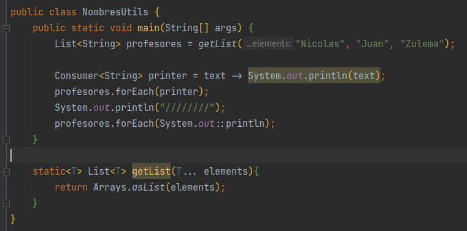

---

### Clase 17 - Analizando la interferencia de tipos
Hasta ahora vimos que las funciones reciben un Tipo y devuelven un Resultado, hay otras funciones que trabajan sobre diferentes tipos, pero al momento de definir las funciones no estamos definiendo explicitamente los tipos.

**¿Como sabe Java que el dato que enviamos es un entero?** A esto se lo conoce como inferencia de tipos. En tiempo de compilación, Java se encarga de validar que los datos que estan pasando a traves de nuestra función sea del tipo que corresponde, Java "adivina" basado en la definición que es el tipo de dato, tanto el que genera como el que emite de vuelta.

Cuando nosotros mandamos a llamar al método forEach, no tenemos que definir un Tipo, si lo quisieramos hacer seria -> `alumnos.forEach((String name) -> System.out.println(name))`, pero gracias a la inferencia de tipos no hace falta y podemos usar directamente *name* -> `alumnos.forEach(name -> System.out.println(name))` y es más interesante usando el operador de referencia -> `alumnos.forEach(System.out::println)`. Acá estamos invocando una función que ya sabe de que tipo es.

El entender que para poder utilizar la referencia de otro método, necesitamos
que ese método también reciba el mismo parámetro y generar el mismo resultado.  
Java en tiempo de compilación
va a inferir estos datos de manera que no tengamos que ponerlos explícitamente
como lo estamos haciendo en el código.  
Ya No tenemos que definir el tipo estrictamente cuando
estamos trabajando con funciones, Java se va a encargar de en tiempo de compilación corroborar
que los tipos correspondan. Así no tendremos el problema que al mandar nosotros una petición de un
archivo recibamos una conexión a Internet

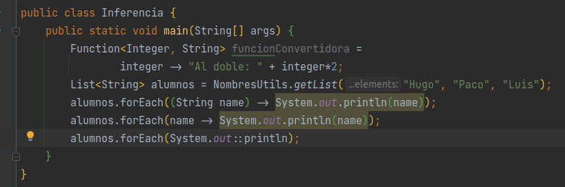

---

### Clase 18 - Comprendiendo la sintaxis de las funciones lambda
Las lambdas son funciones anónimas y hasta ahora hemos almacenado todas nuestras funciones en un nombre en algún lugar.  
Las lamdas sabemos que no se guardan en ninguna parte del código, esta unica y exculsivamente utilizada en ese fragmento de código, las lambdas son para casos únicos, para pequeños ejemplos, para partes muy pequeñas del código que requieren lógica muy simple.

**Estructura Funciones Lambda**  
Lambda que recibe un parámetro y realiza una operación simple:
~~~
text -> System.out.println(text)
~~~

Lambda que no recibe parámetros y realiza una operación de retorno simple:
~~~
() -> "Hello world"
~~~

Lambda que recibe un solo parámetro y realiza una operación de retorno simple:
~~~
x -> x % 2 == 0
~~~

Lambda que recibe varios parámetros:
~~~
(x, y) -> x * y
~~~

Cuando dentro de mi función necesito hacer varias cosas. Cabe la posibilidad que podamos agregar llaves o braces para tener un body o cuerpo más grande. Al hacer esto Java necesita explicitamente que le digamos donde retornamos.
Lambda que realiza varias operaciones:
~~~
(x, y) -> {
  System.out.println("Suma de x: " + x + ", y: " + y);
  System.out.println(x + y);
}
~~~

Lambda que realiza varias operaciones y retorno:
~~~
(x, y) -> {
  System.out.println("Suma de x: " + x + ", y: " + y);
  return x + y;
}
~~~

Lambda con tipado de parámetros:
~~~
(String text) -> System.out.println(text);
~~~

Lambda que retorna un dato que ocupa varias lineas:
~~~
() -> (
  "
" +
  " 
" +
  "   <button class='movie-close-button'>" +
  "     <figure>" +
  "       " +
  "     </figure>" +
  "   </button>" +
  " 
" +
  "
"
)
~~~

Lambda que no recibe por parámetros nada y tampoco retorna nada:
~~~
() -> {}

() -> System.out.println("No recibo nada")

() -> {
  System.out.println("No recibo nada");
  System.out.println("No retorno nada");
}
~~~

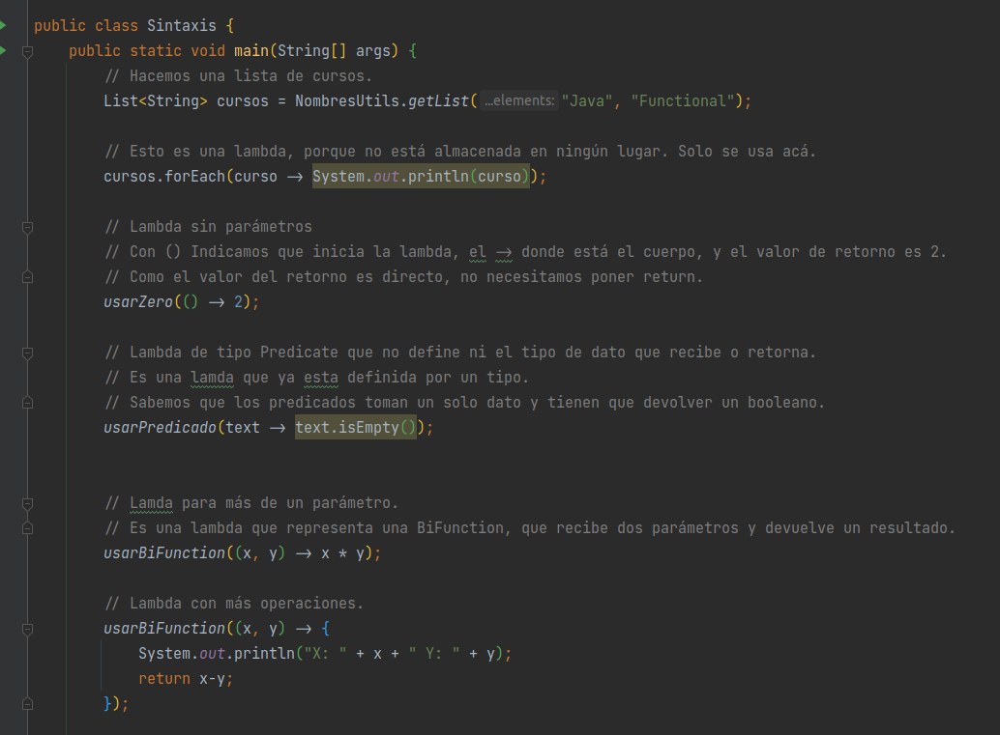

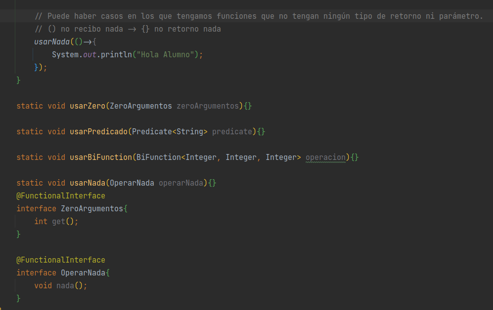

A veces para hacer nuestro código más legible podemos poner el tipo de dato que recibe.  
`usarBiFunction((int x, int y) -> x*y)` -> Esto nos marca un error sobre los argumentos ya que las funciones al ser intefaces trabajan directamente sobre objetos, no trabajan sobre tipos de datos primitivos, quiere decir que tendremos que usar clases y objetos y no podemos usar los tipos de datos primitivos (int, char, boolean, byte, etc.). En este ejemplo se reemplaza el int por **Integer**.

Puede ser que en algunos casos estes trabajando sobre una clase que es de un subtipo de algún otra clase
y esto lo vas a encontrar mucho al estar operando, por ejemplo, con las listas.  
Cuando nosotros queremos utilizar el método forEach directamente Intellij nos sugiere que
necesitamos utilizar un Consumer de un tipo de dato que extienda de String.
Por eso dice super la sugerencia, va a pasar mucho que podamos generar funciones que trabajen con subtipos
y siempre y cuando nosotros tengamos una Lambda definida para el tipo tal cual.

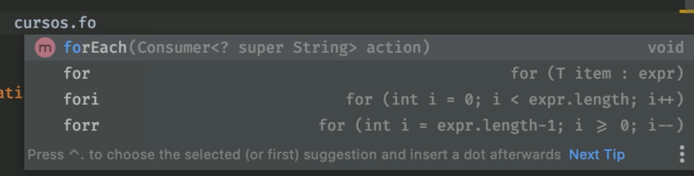

---

### Clase 19 - Usando métodos default en nuestras interfaces
A partir de Java 8 se pueden agregar métodos default.  
Para poder hacer funciones definidas por nosotros tenemos que tener una interfaz que tenga un solo método sin definición. Pero podemos agregar muchos métodos que tengan una definición de como comportarse y estos son los métodos default, empiezan con la palabra **default**.

Escencialmente una interfaz con la anotación `@FunctionalInterface` solo puede tener 1 método abstracto. Como los métodos default tienen una implementación no son abstractos y por lo tanto no rompen el contrato de @FunctionalInterface.

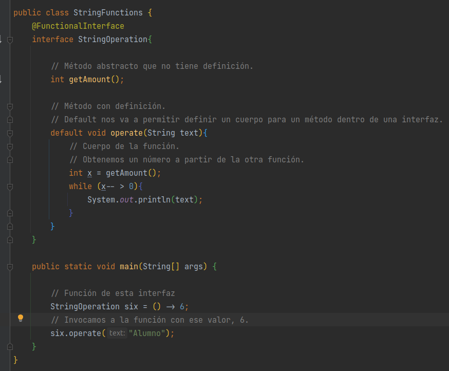

**Otro ejemplo**

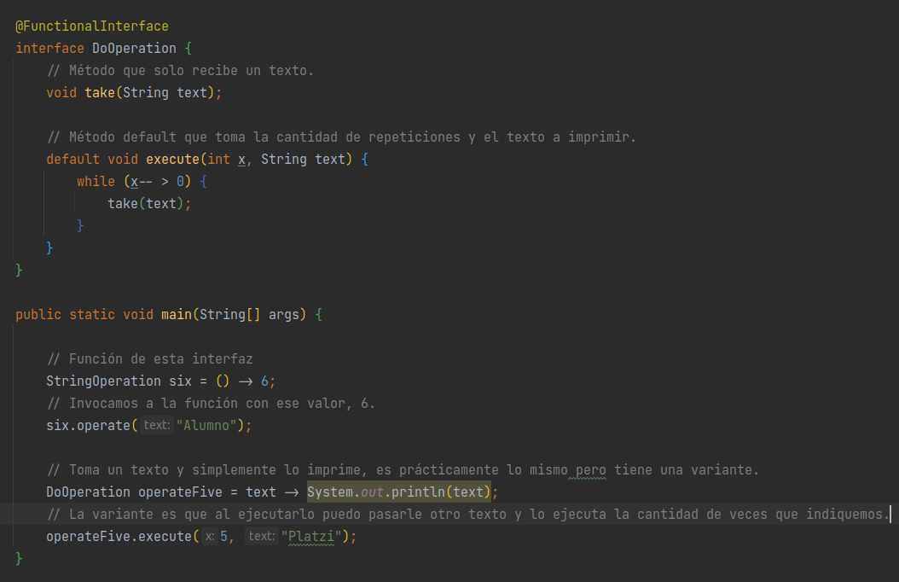

La particularidad de esto es que puedo tener una definición a través de la cual ultilice mi método abstacto, esto me da la versatilidad de que podria generar una interfaz que haga queries a una base de datos y simplemente tener un método default que haga la conexión y la parte que tendriamos que implementar seria estrictamente la funcionalidad de lo que se va a hacer con la conexión abierta. O operar sobre un archivo, o hacer una comunicación web en la que no tendriamos que saber que método web se está usando si no definir que una vez que el método se vaya a invocar que es los parámetros que se le va a pasar.

---

### Clase 20 - Dándole nombre a un viejo amigo: Chaining
Chaning es sencillamente *encadenar* el resultado de una ejecucion con respecto a otra ejecución.

**StringBuilder** es una clase con la cual podemos crear un String.

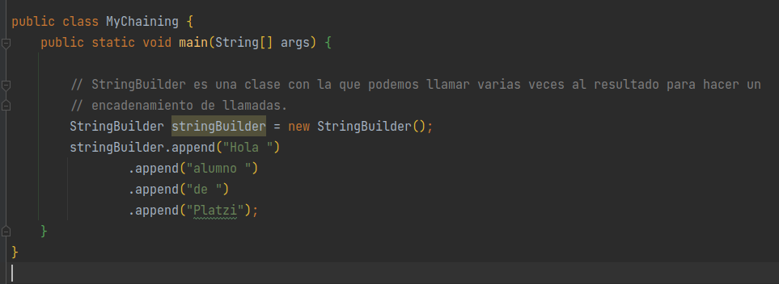

La ejecución de una función nos devuelve un resultado y ese resultado lo usamos para pasarselo a otra función.

Hagamos una clase que haga chaining, que lo único que hace es devolver una instancia de *Chainer* en cada ocasión o iteración.

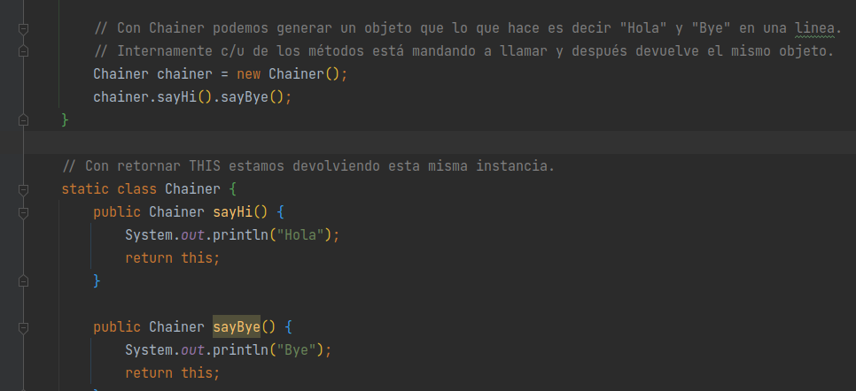

Internamente c/u de los métodos está mandando a llamar y después devuelve el mismo objeto. Esto se ve mucho cuando estamos haciendo composición de funciones.  
Entonces el chaning nos da la ventaja de no tener que almacenar los resultados.

Tiene más sentido cuando hacemos encadenamientos de operaciones sobre un solo tipo de dato y le vayamos diciendo que haga un filtrado o alguna conversión de datos y podamos ir agregando funciones sin necesidad de almacenar el resultado en diferentes variables.

---

Cuando hablamos de chaining o en español encadenamiento es hacer consecutivas las llamadas a diferentes metodos de diferentes resultados.

Por ejemplo si yo tengo una clase con un metodo que me retorna una lista:
~~~
classExample{
    public List<String> getList(){ … }
}
~~~

Se que puedo hacer algo como:
~~~
Example example = new Example();
List<String> myList = example.getList();
String firstString = myList.get(0);
String largeString = firstString.concat("…");
~~~

Porque cada metodo devuelve un dato, pero tambien esto es valido:
~~~
new Example().getList().get(0).concat("…");
~~~

Porque los resultados intermedios no son de mi interes. Estoy aplicando unicamente el concepto de chaining entre los resultados de cada metodo.

Cuando hablamos de el patron de diseño **Builder** estamos hablando de una clase en concreto que esta encargada de generar otra clase. Lo utilizas comunmente porque la clase que necesitas es “compleja” de construir y porque podria ser que durante la creacion puedas tener accidentes no contemplados, por ejemplo:
~~~
classPanBuilder{
    public PanBuilder conHuevos(int cantidadDeHuevos){…}

    public PanBuilder conHarina(float gramosHarina){…}

    public PanBuilder conSal(short sal){…}

    public PanBuilder conLeche(float mililitrosLeche){…}

    public PanBuilder conLevadura(float gramosLevadura){…}

    public PanBuilder conAgua(float mililitrosAgua){…}

    public Pan build(){…}
}
~~~

La clase PanBuilder se encarga del proceso de mezclar ingredientes para cuando tu decidas crear un Pan.

Existe otro patron de diseño que se llama *Chain of Responsability* cuya función es totalmente diferente a lo que buscamos.

**Chain of Responsability** hace que un grupo de objetos de un cierto tipo se deleguen una operación hasta que todos los objetos que puedan estar involucrados en la operación han sido llamados, por ejemplo:

En un cajero automatico, tienes un grupo de Repartidores de billetes que se encargan de entregar los billetes que corresponda y pasar el sobrante al siguiente Repartidor de billetes.

Algo asi:
~~~
abstractclassRepartidorBilletes{
    private RepartidorBilletes siguienteEnCadena;

    abstractvoidagregarBilletes(int cantidadPendiente);

    public RepartidorBilletes siguienteEnCadena(RepartidorBilletes repartidorBilletes){
        this.siguienteEnCadena = repartidorBilletes;
        return repartidorBilletes;
    }

    protectedvoidrepartirSiguiente(int cantidadPendiente){
        if(siguienteEnCadena != null){
            siguienteEnCadena.agregarBilletes(cantidadPendiente);
        }
    }
}

classRepartidorBilletes20extendsRepartidorBilletes{
    @Override
    voidagregarBilletes(int cantidadPendiente){
        int cantidadDeBilletes = …;
        int totalADescontar = …;
        int nuevaCantidadPendiente = cantidadPendiente - totalADescontar;

        getCajeroATM().entregarBilletes(cantidadDeBilletes, 20);

        repartirSiguiente(nuevaCantidadPendiente);
    }
}
~~~

Podrias despues hacer una clase que sea tambien `RepartidorBilletes50` que se encargue de repartir billetes de 50… etc. El chiste es que en un Chain of Responsability cada objeto se encarga de mandar a llamar al siguiente objeto en la cadena y pasarle datos para operar. Puedes leer mas [aca](https://refactoring.guru/design-patterns/chain-of-responsibility).  

NOTA: Hay mejores estrategias y patrones de diseño para la tarea de administrar la entrega de billetes de un cajero automatico.

---

### Clase 21 - Entendiendo la composición de funciones
**Función de orden mayor** es una función que o toma como parámetro otra función o devuelve como resultado una función e incluso pueden ser los dos casos. Con esto podemos generar composición de funciones, funciones llamando a otras funciones.

Si queremos una función que a un numero se le agregara 1 y después multiplicara por 3, podemos hacerlo con el método COMPOSE.  
Lo que haremos ahora es agregar un println a nuestra lambda para mostrar en pantalla y saber como se va ejecutando el código, esto es porque **Compose** genera una nueva función en la que no podemos intervenir, pero podemos interferir la lamda, para hacerlo agregamos las llaves y dentro del cuerpo escribimos lo que queremos hacer.

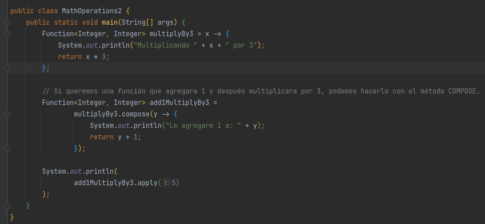

De fondo cuando invoco a *add1MultiplyBy3* estoy generando una función intermedia a partir de *compose*, compose toma una función, la ejecuta primero y después ejecuta la función sobre la cual se mandó a llamar, en este caso *multiplyBy3*, de esta manera primero se ejecuta la lamda, después el *multiplyBy3*, acabamos de crear una función compuesta basada en 2 funciones.

Entonces tenemos una manera de agregar pasos antes de la ejecución de una función pero si lo queremos hacer después usaremos el *andThen*.  
Una vez que termine de ejecutar las funciones que ya tiene, le decimos que ejecute esta otra función, le decimos *andThen* y le pasamos una lamda.

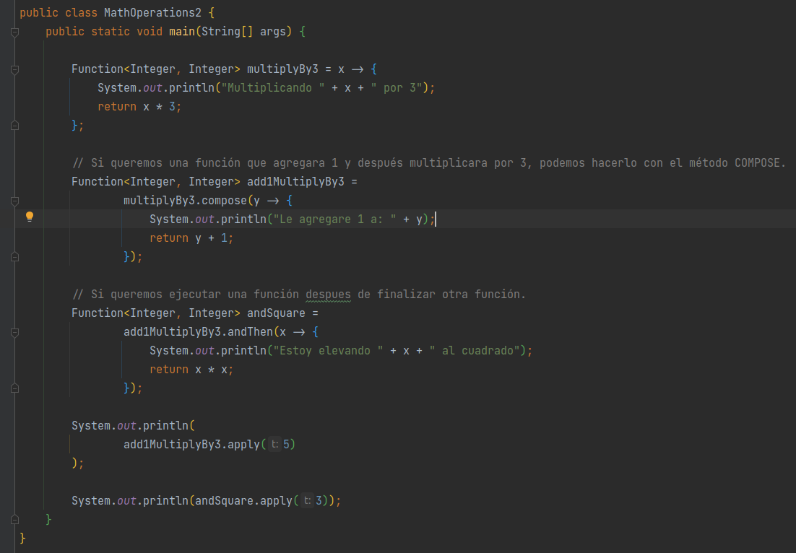

Con esto vemos que al recibir una función podemos generar nuevas funciones que tengan un orden de precedencia o que puedan ejecutar otros pasos adicionales antes de ejecutarse a si mismas. Es una manera en la que podemos crear funciones más complejas a partir de lógica o comportamiento de alguien más.

Con esto podemos asegurarnos de crear un archivo, o que un equipo tenga internet, o revisar que haya una conexión, o generar incluso la conexión antes de hacer una consulta de nuestro lado.

---

**Resumen**  
Ejecutar una función antes de una función -> **compose**  
Ejecutar una función despues de una función -> **andThen**

---

## Módulo 4 - Optional y Streams: Datos mas interesantes
### Clase 22 - La clase Optional
Lo que hace la clase Optional es evitar problemas con valores inexistentes, NullPointerExceptions, y la intención de Optional es que a partir de los Predicate, funciones, diferentes tipos de instancias que podamos crear de funciones, no tengas que preocuparte por el valor de retorno directamente.

En el código generalemente podemos escribir accesos a archivos, a una base de datos, un servicio web, o incluso podemos procesar un conjunto de datos y transformarlos solamente en nombres completos de usuarios, de personas, de archivos o algo parecido.  
La cuestion está en qué vamos a retornar, lo ideal es que si vamos a devolver una lista, en el código la creariamos, la iriamos llenando y lo retornamos, de esta manera evitamos el null.  
Pero en muchas ocaciones no tiene elementos y es preferible retornar un `Collections.emptyList();` por ejemplo (Una lista sin elementos), es una práctica común y valida.

Pero que pasa en casos donde se tenga que retornar un **String**, o **int**, es valido devolver un string vacio?, un cero? o un null?.  
Depende muchos de las reglas, que varian mucho, y condiciones en la que nos encontramos para resolver el problema. El verdadero problema empieza cuando por cada retorno de null, por cada ejecución, tenemos que hacer una validación de los datos que recibimos, es decir, corroborar que un dato este o no presente `if(getNames != null)`. Tal vez tengamos casos, como el de Strings que no se cumple, porque no es nulo si no vacio `("")`.

Tendriamos que empezar a agregar condiciones tras condiciones, no tenemos la manera concreta de decir cuando si y cuando no hay un dato. Acá es donde entra **Optional** y nos ayuda a meter un dato y operar sobre ese dato cuando esté presente o cuando no, con esto podemos generar valores por default según nuestras necesidades en cada iteración.  
Lo que haremos es tratar de obtener los nombres y en caso de no encontrarlos, buscaremos la manera de operar sobre ellos.

Tenemos el siguiente código en el que obtenemos una lista Optional de nombres:
~~~
static Optional<List<String>> getOptionalNames() {}
~~~

Y en el main obtendremos ese optional y podemos hacer lo siguiente:
~~~
Optional<List<String>> optionalNames = getOptionalNames();
if (optionalNames.isPresent()){}
~~~

Podemos mejorarlo, hacerlo un poco más funcional, podemos hacer `optionalNames.ifPresent()` e Intellij nos sugiere usar un Consumer.

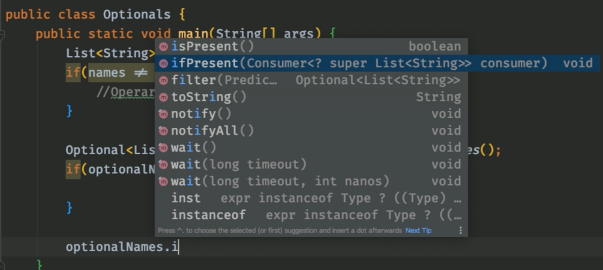

Este Consumer es un tipo de función que ya tenemos definido desde antes, es una función que va a tomar un dato y no devuelve ningún resultado, podemos usar una lamda en este caso.
~~~
optionalNames.ifPresent(namesValues -> namesValues.forEach(System.out::println));
~~~

Entonces vamos a iterar con *namesValue* toda la lista de optional y directamente sabemos que *namesValues* solo va a existir cuando el valor dentro del Optional este presente. Si no lo está, la lamda no se ejecuta.

Hay otras cosas que podemos hacer con Optional, por ejemplo, si sabemos que nos va a devolver una lista podemos generar un iterador a partir de los elementos de la lista.
~~~
optionalNames.flatMap();
~~~

`FlatMap()` consume una función y un Optional, en esa función vamos a recibir el elemento y vamos a generar un nuevo valor que se va a usar y el Optional es por si no llegamos a encontrar ese dato.

También podemos usar `map()`, que es una función a partir de la cual vamos a operar el dato cuando este presente para convertirlo en otro dato, nos va a generar un Optional de un nuevo tipo, es decir, podemos tomar un dato que este o no presente y generar un resultado que este o no presente, dependiendo del caso de cuando un Optional contenga un dato o no.

En programación funcional esto es lo equivalente a lo que se conoce como ***Mona***. No es más que esto, una caja que nos ayuda a prevenir encontrarnos con datos vacíos.

**¿Y como podemos hacer para devolver, en algunos casos, un dato cuando no está presente?**  
Podemos hacer que retorne un `Optional.of(new LinkedList<>());`, generamos una nueva lista y listo, va a haber un dato presente.

Pero cuando yo no tengo un dato y haya un null, tenemos la posibilidad de generar un `Optional.ofNullable()`, es decir le estamos diciendo a Optional que tenemos un dato del cual desconocemos si es null o no, Optional se va a encargar de hacer que esto este escondido dentro de un objeto de tipo Optional para no tener una *NullPointerException*.

Pero tal vez no querramos lidiar con nulls, y podriamos hacer un `try`, acceder a la BD o archivos, si algo sale mal lanzar una exception con `catch()` y por último retornar, si no encontramos nada, un `Optional.empty()`.  
Con esto evitamos lidiar con nulls, con estos datos y podemos generar una manera en la que podemos devolver un dato, que existe, y la podamos usar de alguna otra manera.

Por ejemplo, podemos tener:
~~~
Optional<String> valuablePlayer = optionalValuablePlayer();

valuablePlayer.orElseGet();
~~~

Recordando a **Supplier** que es una función que nos va a generar un nuevo dato, esto nos da la oportunidad de almacenar:
~~~
String valueblePlayerName = valuablePlayer.orElseGet(() -> "No Player");
~~~

Y aqui definimos una función a través de la cual, si no encontramos un *mustValuablePlayer*, podamos darle un valor por default, de esta manera o tenemos un dato o tenemos un dato, no tenemos que lidiar con nulls o vacíos y tenemos la lógica reservada en la parte en la que necesitamos, sin tener que preocuparnos por lo que el método va a hacer para los 80 casos que podríamos tener en nuestro proyecto.

De esta manera podemos usar el Optional para muchas cosas, es una forma sencilla de generar datos sin tener que preocuparnos por la presencia real de datos o sin tener que preocuparnos por como hacer accesos o generar diferentes "tipos de defaults" para cubrir todos los casos posibles, en la mayoria solo terminariamos usando un `Optional.empty()` cuando no encontremos casos, y si desconocemos el valor de una variable podemos usar `Optional.ofNullable()`.

En conclusión la clase Optional es una manera de almacenar un dato del cual no tenemos certeza cual es el valor, si está o no presente, y poder acceder a ese dato mediante operadores (Funciones, Consumers, Suppliers), que cuando esté presente el dato, Optional va a invocar esas funciones pasandoles el dato, en el caso de que Optional no tenga el dato, caso null, Optional no va a invocar dichas funciones y nos protege de tener que lidiar con la presencia o ausencia de un dato. Optional se encargará de hacer internamente la lógica para cuando sí y cuando no ejecutar un fragmento de código.

---

[Link con mas info](https://www.baeldung.com/java-optional)

Opcional se debe usar para información que se retorna, en lugar de información que se recibe (a través de parámetros, por ejemplo). Tu codigo debería usar unicamente Optional como resultado de una función, nunca como entrada.

Diferencia entre `map()` y `flatMap()`

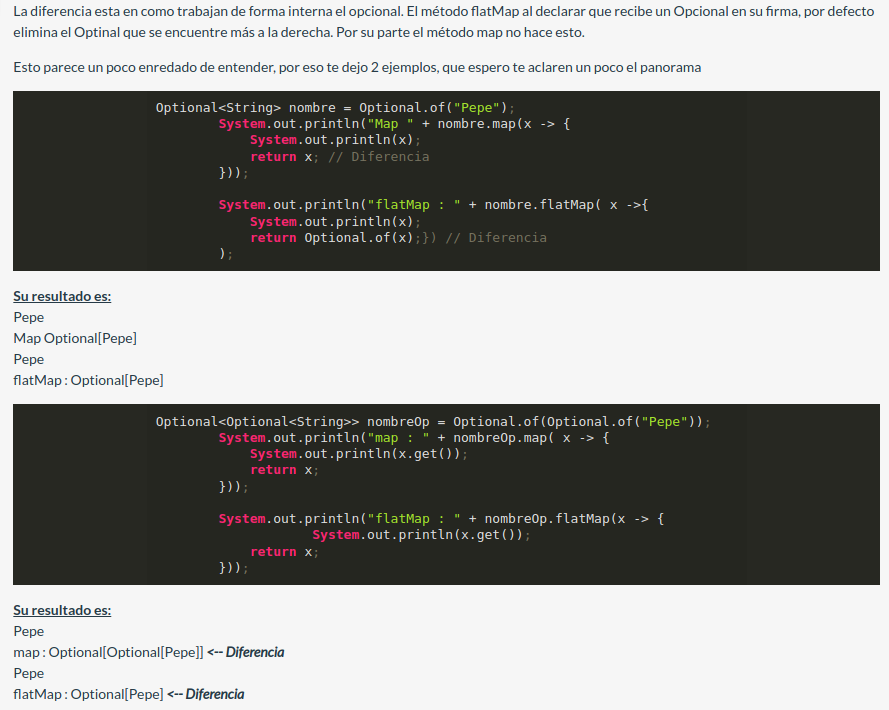

---

### Clase 23 - Entendiendo los Streams
Entendiendo que la clase Optional es una manera en la cual podemos generar datos y cuidar un poco que los datos, cuando empecemos a procesarlos, sean seguros.

**¿Pero que pasa cuando queremos operar sobre multiples datos?**  
Java 8 agregó la clase **Streams** y tal vez cuando escuches esto se te venga a la cabeza la transmisión de un vídeo, que es un stream de datos, es un flujo de datos a través del cual van apareciendo datos y se van consumiendo. **Lo mismo es la clase Stream.**

Es una especie de lista, que tiene elementos y se pueden iterar. La diferencia escencial entre Listas, Collections y Streams es que un Stream es **autoiterable**, es decir, cuando creamos una Lista, tenemos que decidir como hacer las operaciónes con cada uno de los elementos, como por ejemplo:

Este tipo de operaciones es la manera en que generalmente trabajamos sobre Collections, Lista, Set o Arreglo.

Los Streams son ligeramente diferentes.  
Nosotros vamos a generar un Stream de cierto tipo y le decimos `Stream.of();` que es la manera más sencilla de hacer un Stream a partír de datos que ya conocemos. Y para poder decirle que empiece a consumir estos datos o decirle al Stream que se itere, vamos a agregar operaciones dentro del Stream, por ejemplo convertir un Stream a otro.
~~~
Stream<String> coursesStream = Stream.of("Java", "FrontEnd", "BackEnd", "FullStack");
~~~

Usaremos `map()` que recibe una función que trabaja sobre un String y genera un nuevo dato, las funciones sabemos que empiezan con **T** (Tipo) y generan un **R** (Resultado).  
Este caso es interesante porque si vemos como funciona *map()*, nos va a devolver un nuevo Stream del resultado de ejecutar la función. Eso quiere decir que yo puedo generar un Stream de la longitud de caracteres en el curso. Podriamos guardarlo en nuevo Stream de tipo Integer.
~~~
Stream<Integer> courseLengthStream = coursesStream.map(course -> course.length());
~~~

Y si nos interesa saber cual es el nombre más largo que tenemos en Stream.
~~~
int longest = courseLengthStream.max((x, y) -> y - x);
~~~

Usaremos `max()` que recibe un Comparator, que es una función que toma dos elementos y decide cual es el más grande.  
En este caso, como son números, cabe la posibilidad de que el Stream esté vacío (nos marca un error) y como vimos antes, si el Stream está vacío, ¿Cual es el máximo? Puede que no lo haya, si vemos la firma de max(), este nos devuelve un Optional de Integer.
Entonces cambiamos el tipo y obtendremos el máximo de los elementos de los nombres de los cursos.
~~~
Optional<Integer> longest = courseLengthStream.max((x, y) -> y - x);
~~~

Otro ejemplo de uso es si queremos agregar más enfasis a cada elemento. Para agregarlo vamos a generar nuevos Strings, como sabemos los Strings son inmutables, entonces lo que haremos es utilizar la operación *map()*, que lo que hace es darnos cada elemento dentro del Stream y generar un nuevo elemento, este elemento no tiene que ser del mismo tipo del elemento entrante, es por eso que recibe una Function, una Function recibe un tipo T y genera un tipo R, en este caso simplemente un nuevo String.
~~~
Stream<String> emphasisCourses = coursesStream.map(course -> course + "!");
~~~

Después si queremos consumir este Stream para imprimirlos.
~~~
emphasisCourses.forEach(System.out::println);
~~~

Es importante mencionar que muchas de las operaciones de los Streams hacen una transformación a un nuevo tipo de Stream. Por ejemplo:
~~~
Stream<String> justJavaCourses = coursesStream.filter(course -> course.contains("Java"));
~~~
En *justJavaCourses* vamos a tener solamente los cursos que contengan la palabra "Java", entonces usamos el `filter()` y le pasamos un Predicate que nos sirve como la lógica para poder determinar cuando si y cuando no seleccionar un curso.

Ahora si ejecutamos este código no va a funcionar y la razón principal es por el tipo de operaciones que se pueden hacer sobre un Stream, va a generar una pequeña Exception (IllegalStateException) y esto hay que tenerlo mucho en mente.

**Cuando generamos un Stream, el Stream solo puede ser consumido una vez.**

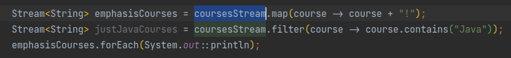

La Exception quiere decir que estoy tratando de consumir **emphasisStream** despues de haber consumido a **coursesStream**, coursesStream se consume en la linea con `map()` y se vuelve inutil, después de haber sido consumido, ya no podemos agregar más operaciones, porque ya se están trabajando los elementos dentro del Stream, entonces cuando yo trato de hacer el filtrado ya no lo puedo hacer.

**Entonces vamos a tratar de mantener la secuencia de los consumos dentro del Stream.**  
**Entonces cuando un Stream recibe una operación, genera un nuevo Stream y este debe ser el Stream que debe consumirse.**

Solución al Exception anterior

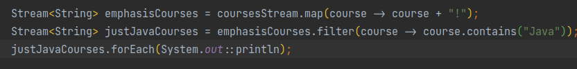

---

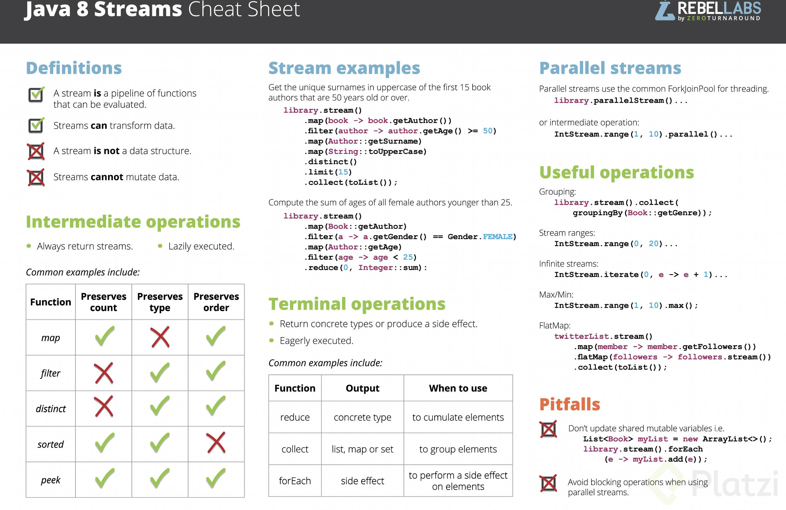

---

**¿Cuales son los contras y los pros de usar For o Stream?**
Algunos **pros** de usar `for`:
- Muy probablemente ya lo conoces, entiendes y dominas
- Es una estructura de control que en muchas ocasiones el compilador puede optimizar
- Cuando tienes una clase que implementa la interfaz `Iterable<E>` puedes escribir tu `for` en la forma `for-each` (`for(E e: iterableInstance){…}`) que es bastante mas comoda que un `for` regular (`for( inicializacion; condicion ; avance){…}`)
- Manejar arreglos y colecciones es relativamente facil con un `for`

Algunos posibles contras (no necesarimente son malos o problematicos en todos los casos):

- Es relativamente facil cometer errores que alteren el orden del `for`, por ejemplo, :
~~~
for(int i = 0; i < limite; i++){
// Algo de codigo
i = i % 2
// Mas codigo
}
~~~

- Otro ejemplo de un posible error:
~~~
for(int index = 0; index < list.size(); i++) {
   //Algunas operaciones
   list.add(…); // Este es un error, creando un loop infinito
}
~~~

- La sintaxis podria no ser tan clara en un principo cuando se usan indices no tan obvios:
~~~
for(int i = …; … ; …) {
    for(int j = …; … : …) {
        //Error no tan obvio, deberia usarse la j pero se confunde con la i
        E myElement = myArray[i][i];
    }
}
~~~

Todos estos son casos hipoteticos, pero pueden llegar a pasar por descuidos pequeños.

La clase `Stream` esta pensada para que las iteraciones o el procesamiento de los elementos sea un poco mas “dinamicos”.

En un `for` pones todas las operaciones dentro del `for` o escribes multiples `for`. En `Stream` cada operacion modifica el `Stream` y genera un nuevo `Stream`. Idealmente un `Stream` tiene nuevos elementos constantemente, por ello no puedes tener un metodo `size()` o un atributo/metodo `length`, pues no sabes cuantos elementos apareceran en el `Stream`. En teoria no puedes determinar cuando un `Stream` dejara de publicar elementos (idealmente). Sin embargo tienes la posibilidad de operara cada nuevo elemento que aparezca en el `Stream`.

**Algunos pros de tener un `Stream`:**

- Es mucho mas facil hacer operaciones en paralelo
- Es mas legible porque las operaciones son un poco mas explicitas (aunque depende del estilo de cada quien)
- Tienes operaciones ya predefinidas
- Hay muchas operaciones que son optimizadas en tiempo de compilacion
- Puedes convertir facilmente un `Stream<A>` en un `Stream<B>` usando los metodos ya existentes en `Stream`
- Puedes convertir facilmente muchas clases a `Stream` (por ejemplo, `Collection#stream()`)
- Al ser un tipo de dato puedes recibir o retornar `Stream` parcialmente operado:
~~~
public Stream<User> getUserNamesStream(){
    //Obtener los nombres de usuario
    return userNamesStream;
}

public Stream<String> getUserNamesByActiveStatus(Stream<String> users){
        return users.filter(User::isActive)
                .map(User::getUserName);
}
~~~

**Algunos contras:**
- Cuando necesitas un dato final para mostrar o retornar algun dato final, tienes que convertir tu `Stream`
- No tienes forma directa de frenar o saltarte pasos de una iteracion de un `Stream` a diferencia de un `for` donde puedes usar `break` y `continue`
- Debes aprender la API de `Stream`
- Buscar errores puede ser un poco mas complicado

Siendo realistas, habra ocasiones que sera mas simple usar un `for` para iterar una coleccion (`List`, `Set`, `Map`, `Vector`, etc.) y habra ocasiones que operar un `Stream` o generar un `Stream` demostrara un mejor performance o agregara mucha legbilidad.

**Asi que la respuesta corta es: Depende de cada caso**

---

Imaginemos cuando trabajemos con la clase stream o un stream que es un flujo de datos. SÍ un flujo como si estos vinieran de una tubería o una corriente de la cual nosotros tenemos el control de esta (abrir y cerrarla a nuestro antojo). Este flujo tiene un recorrido que nosotros decidimos cómo trabajar con este.

Como en este ejemplo, de un flujo de datos filtramos los valores que **son peces** , los empacamos (Convertimos en un Objeto pez) y están listos para distribución. (Tenemos de retorno un listado de Objeto Pez).

---

### Clase 24 - ¿Qué son los Stream listeners?
Entonces los Streams no son tan útiles si en cada nueva operación tenemos que almacenar un nuevo tipo de variable, hace que el código sea feo, pero con **chaining** podemos solucionarlo!.

Teniendo esta lista
~~~
List<String> courseLsit = NombresUtils.getList("Java", "FrontEnd", "BackEnd", "FullStack");
~~~

Podemos generar un Stream a partir de ella.
~~~
Stream<String> coursesStream2 = courseLsit.stream();
~~~

En Java agregaron la posibilidad directamente de tomar Colecciones y poder generar un Stream sin necesidad de hacer nada adicional. Entonces toda aquella clase que implemente la interfaz `Collection` puede generar un Stream de sus elementos, y con esto agregar operaciones dentro de él.

Entonces con un Stream de los cursos, agregaremos las mismas operaciones que la clase anterior, solo que ahora seran hechas con chaining.
~~~
coursesStream2.map(course -> course + "!!").filter(course -> course.contains("Java")).forEach(System.out::println);
~~~

Escencialmente es la misma forma de programar que almacenar en variables pero le agrega un nivel de legibilidad, hace que el código sea más fluido. Esto permite que podamos hacer todo el conjunto de operaciones que necesitemos sobre un Stream e ir leyendo unicamente sobre los elementos los que tengamos que hacer.

En este punto nos preguntamos si forEach nos devuelve algún dato, y es relevante. Los Streams tiene dos tipos de operaciones (Operaciones Intermedias y Operaciones Terminales).  
La diferencia entre estas está en que la operación intermedia genera un nuevo Stream, el tipo de Stream depende de la operación, una operación final genera un dato final despues de operar todo, es decir, cuando la iteras una Lista generalmente lo haces para generar una nueva Lista o concatenar los elementos o buscar un elemento especifico dentro de la Lista, en los Streams es relativamente lo mismo, estás permitiendo que el Stream haga operaciones para tratar de encontrar un elemento o tratar de obtener un resultado final.  
**¿Como identificar una operación final de una intermedia?**  
Simple, si devuelve un Stream es intermedia, si devuelvo cualquier otro tipo de dato, o incluso no te devuelve uno, es una operación final.

En nuestro ejemplo `forEach()` es una operación final, porque la estructura de forEach dice que va a devolver void, void es un dato final, no va a generar un nuevo Stream.

Los Streams son ventajosos con respecto a las Listas  
Algunas de las operaciones de los Streams nos devuelven Optionals, tenemos el ejemplo de cuando buscamos el máximo en el código, con esto podemos generar código un poco más funcional, que solo se ejecute cuando datos estén presentes.  
Cabe mencionar que muchas veces vamos a terminar escribiendo funciones del tipo Static o Method, no importa realmente, que van a devolver un nuevo Stream de algún tipo y que lo que hace internamente es agregar operadores a un Stream que reciben como parámetro.
~~~
static <T> Stream<T> addOperator(Stream<T> stream){}
~~~

Esto es muy común porque lo que realizamos es algo similar al **High Order Function**, que toma un Stream, agrega sus funciones y devuelve un Stream que ya tiene esas funciones.  
Esto lo podemos ver, por ejemplo, en un Stream que va a estar generado a partir de una BD, vas a agregar operaciones con respecto a los datos para transformarlos de un query a un resultado, después filtrar esos datos y finalmente pasarselos a alguien más para que transforme de esos datos tal vez a JSON para poder responder una peticion web.  
El hacer este tipo de operaciones permite que el código sea más funcional y sea más seguro, porque ya no vamos a tener que lidiar con la presencia o ausencia de datos, internamente Stream va a encargarse de hacer la iteración y Optional nos va ayudar para poder hacer operaciones cuando no existan algunos datos.

Agregaremos un operador para poder ver que tipo de elementos están pasando a través de nuestro Stream, algo simple, pero nos va a ayudar para hacer un debug más práctico de como está funcionando un Stream.

Lo que haremos es retornar el Stream que recibamos usando `peek()`, que es una función que toma un Consumer pero que no modifica los datos, es muy similar a `map()` pero recibe un dato y devuelve el mismo dato, entonces en realidad nos permite hacer una iteración sobre los datos y verlos, una especia de microscopio dentro del Stream, sin modificarlo.

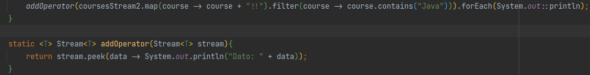

Entonces en nuestra vieja *coursesStream2* podemos agregarlo a nuestra función. Tomamos el Stream resultante del filtro, mandarlo a nuestra nueva función y como sabemos que nosotros estamos mandando un Stream y vamos a recibir otro de vuelta, podemos agregar nuestro `forEach()`.  
Esto nos confirma que tenemos la versatilidad de que podemos usar funciones que reciban Streams y generen Streams, con esto podemos ir cambiando los datos.

---

### Clase 25 - Operaciones y Collectors

---

### Clase 26 - Stream de tipo específico y Paralelismo

---

### Clase 27 - Operaciones Terminales

---

### Clase 28 - Operaciones Intermedias

---

### Clase 29 - Collectors

---

## Módulo 5 - Todo junto: Proyecto Job-search
### Clase 30 - job-search: Un proyecto para encontrar trabajo

---

### Clase 31 - Vista rápida a un proyecto de Gradle

---

### Clase 32 - Revisando las opciones para nuestro CLI

---

### Clase 33 - Librerías adicionales para nuestro proyecto

---

### Clase 34 - Entendiendo la API de jobs

---

### Clase 35 - Diseñando las Funciones Constructoras de nuestro Proyecto

---

### Clase 36 - Agregando validaciones de datos

---

### Clase 37 - Diseñando las funciones de transformación de datos

---

### Clase 38 - Creando flujos extras de transformación de datos

---

## Módulo 6 - Conclusiones
### Clase 39 - Un repaso a lo aprendido

---