# Curso profesional de Git y GitHub
Índice
-
- [Curso profesional de Git y GitHub](#curso-profesional-de-git-y-github)
    - [Módulo 1 - Introducción a Git](#módulo-1---introducción-a-git)
        - [Clase 1 - ¿Por qué usar un sistema de control de versiones como Git?](#clase-1---¿por-qué-usar-un-sistema-de-control-de-versiones-como-git)

---

## Módulo 1 - Introducción a Git
[PDF primeras clases del curso](https://static.platzi.com/media/public/uploads/git-github-1-16_a229ee25-b2b6-4c1d-969a-c791eabace83.pdf)  
[mismo PDF](src/Curso_profesional_de_Git_y_GitHub/01_Que_es_Git_01.pdf)
### Clase 1 - ¿Por qué usar un sistema de control de versiones como Git?
Un sistema de control de versiones como Git nos ayuda a guardar el historial de cambios y crecimiento de los archivos de nuestro proyecto.

En realidad, los cambios y diferencias entre las versiones de nuestros proyectos pueden tener similitudes, algunas veces los cambios pueden ser solo una palabra o una parte específica de
un archivo específico. Git está optimizado para guardar todos estos cambios de forma atómica e incremental, o sea, aplicando cambios sobre los últimos cambios, estos sobre los cambios
anteriores y así hasta el inicio de nuestro proyecto.

- El comando para iniciar nuestro repositorio, o sea, indicarle a Git que queremos usar su sistema de control de versiones en nuestro proyecto, es `git init`.
- El comando para que nuestro repositorio sepa de la existencia de un archivo o sus últimos cambios es `git add`. Este comando no almacena las actualizaciones de forma definitiva,
únicamente las guarda en algo que conocemos como “Staging Area” (área de montaje o ensayo).
- El comando para almacenar definitivamente todos los cambios que por ahora viven en el staging area es `git commit`. También podemos guardar un mensaje para recordar muy bien qué cambios
hicimos en este commit con el argumento `-m "Mensaje del commit"`.
- Por último, si queremos mandar nuestros commits a un servidor remoto, un lugar donde todos podamos conectar nuestros proyectos, usamos el comando `git push`.

**Comandos básicos de git**
- git init: inicializa un repositorio de GIT en la carpeta donde se ejecute el comando.
- git add: añade los archivos especificados al área de preparación (staging).
- git commit -m “commit description”: confirma los archivos que se encuentran en el área de preparación y los agrega al repositorio.
- git commit -am “commit description”: añade al staging area y hace un commit mediante un solo comando. (No funciona con archivos nuevos)
- git status: ofrece una descripción del estado de los archivos (untracked, ready to commit, nothing to commit).
- git rm (. -r, filename) (–cached): remueve los archivos del index.
- git config --global user.email tu@email.com: configura un email.
- git config --global user.name <Nombre como se verá en los commits>: configura un nombre.
- git config --list: lista las configuraciones.

**Analizar cambios en los archivos de un proyecto Git**
- git log: lista de manera descendente los commits realizados.
- git log --stat: además de listar los commits, muestra la cantidad de bytes añadidos y eliminados en cada uno de los archivos modificados.
- git log --all --graph --decorate --oneline: muestra de manera comprimida toda la historia del repositorio de manera gráfica y embellecida.
- git show filename: permite ver la historia de los cambios en un archivo.
- git diff <commit1> <commit2>: compara diferencias entre en cambios confirmados.

**Volver en el tiempo con branches y checkout**
- git reset <commit> --soft/hard: regresa al commit especificado, eliminando todos los cambios que se hicieron después de ese commit.
- git checkout <commit/branch> <filename>: permite regresar al estado en el cual se realizó un commit o branch especificado, pero no elimina lo que está en el staging area.
- git checkout – <filePath>: deshacer cambios en un archivo en estado modified (que ni fue agregado a staging)

**git rm y git reset**
git rm:  
Este comando nos ayuda a eliminar archivos de Git sin eliminar su historial del sistema de versiones. Esto quiere decir que si necesitamos recuperar el archivo solo debemos “viajar en el
tiempo” y recuperar el último commit antes de borrar el archivo en cuestión.

git rm no puede usarse por sí solo, así nomás. Se debe utilizar uno de los flags para indicar a Git cómo eliminar los archivos que ya no se necesitan en la última versión del proyecto:
- git rm --cached <archivo/s>: elimina los archivos del área de Staging y del próximo commit, pero los mantiene en nuestro disco duro.
- git rm --force <archivo/s>: elimina los archivos de Git y del disco duro. Git siempre guarda todo, por lo que podemos acceder al registro de la existencia de los archivos, de modo que
podremos recuperarlos si es necesario (pero debemos aplicar comandos más avanzados).

git reset  
Con git reset volvemos al pasado sin la posibilidad de volver al futuro. Borramos la historia y la debemos sobreescribir.
- git reset --soft: Vuelve el branch al estado del commit especificado, manteniendo los archivos en el directorio de trabajo y lo que haya en staging considerando todo como nuevos cambios.
Así podemos aplicar las últimas actualizaciones a un nuevo commit.
- git reset --hard: Borra absolutamente todo. Toda la información de los commits y del área de staging se borra del historial.
- git reset HEAD: No borra los archivos ni sus modificaciones, solo los saca del área de staging, de forma que los últimos cambios de estos archivos no se envíen al último commit. Si se
cambia de opinión se los puede incluir nuevamente con git add.

**Ramas o Branches en git**
Al crear una nueva rama se copia el último commit en esta nueva rama. Todos los cambios hechos en esta rama no se reflejarán en la rama main hasta que hagamos un merge.
- git branch <new branch>: crea una nueva rama.
- git checkout <branch name>: se mueve a la rama especificada.
- git merge <branch name>: fusiona la rama actual con la rama especificada y produce un nuevo commit de esta fusión.
- git branch: lista las ramas generadas.

**Algunos comandos que pueden ayudar cuando colaboren con proyectos muy grandes de GitHub:**
git log --oneline - Te muestra el id commit y el título del commit.
git log --decorate- Te muestra donde se encuentra el head point en el log.
git log --stat - Explica el número de líneas que se cambiaron brevemente.
git log -p- Explica el número de líneas que se cambiaron y te muestra que se cambió en el contenido.
git shortlog - Indica que commits ha realizado un usuario, mostrando el usuario y el titulo de sus commits.
git log --graph --oneline --decorate y
git log --pretty=format:"%cn hizo un commit %h el dia %cd" - Muestra mensajes personalizados de los commits.
git log -3 - Limitamos el número de commits.
git log --after=“2018-1-2” ,
git log --after=“today” y
git log --after=“2018-1-2” --before=“today” - Commits para localizar por fechas.
git log --author=“Name Author” - Commits realizados por autor que cumplan exactamente con el nombre.
git log --grep=“INVIE” - Busca los commits que cumplan tal cual está escrito entre las comillas.
git log --grep=“INVIE” –i- Busca los commits que cumplan sin importar mayúsculas o minúsculas.
git log – index.html- Busca los commits en un archivo en específico.
git log -S “Por contenido”- Buscar los commits con el contenido dentro del archivo.
git log > log.txt - guardar los logs en un archivo txt

[Otro PDF](src/Curso_profesional_de_Git_y_GitHub/01_Que_es_Git_03.pdf)

---

### Clase 2 - ¿Qué es Git?
Git es un sistema de control de versiones distribuido, diseñado por Linus Torvalds. Está pensando en la eficiencia y la confiabilidad del mantenimiento de versiones de aplicaciones cuando
estas tienen un gran número de archivos de código fuente. Git está optimizado para guardar todos estos cambios de forma atómica e incremental.

Se obtiene su mayor eficiencia con archivos de texto plano, ya que con archivos binarios no puede guardar solo los cambios, sino que debe volver a grabar el archivo completo ante cada
modificación, por mínima que sea, lo que hace que incremente demasiado el tamaño del repositorio.

“Guardar archivos binarios en el repositorio de git es una mala práctica, únicamente deberían guardarse archivos pequeños (como logos) que no sufran casi modificaciones durante la vida del
proyecto. Los binarios deben guardarse en un CDN”.

¿Qué es un sistema de control de versiones?
El SCV o VCS (por sus siglas en inglés) es un sistema que registra los cambios realizados sobre un archivo o conjunto de archivos a lo largo del tiempo, de modo que puedas llevar el
historial del ciclo de vida de un proyecto, comparar cambios a lo largo del tiempo, ver quién los realizó o revertir el proyecto entero a un estado anterior.

Cualquier tipo de archivo que se encuentre en un ordenador puede ponerse bajo control de versiones.

¿Qué es Github?
Es una plataforma de desarrollo colaborativo para alojar proyectos utilizando el sistema de control de versiones Git. Se emplea principalmente para la creación de código fuente de
programas de computadora.

Github puede considerarse como la red social de código para los programadores y en muchos casos es visto como tu curriculum vitae, pues aquí guardas tu portafolio de proyectos de
programación.

---

### Clase 3 - Instalando Git y GitBash en Windows

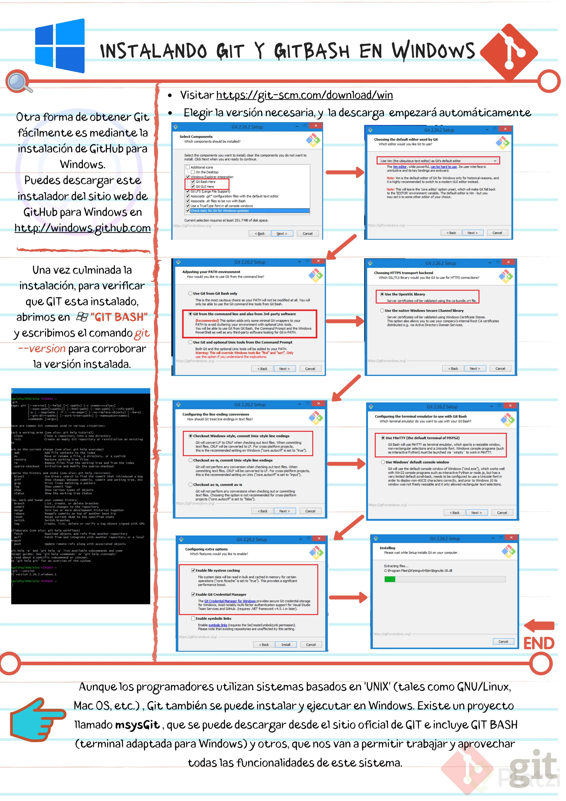

---

### Clase 4 - Instalando Git en OSX

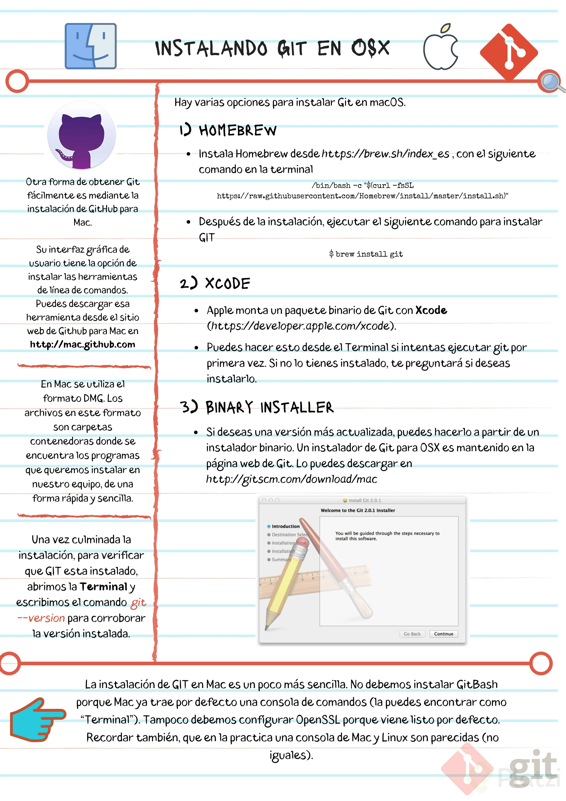

---

### Clase 5 - Instalando Git en Linux

Cada distribución de Linux tiene un comando especial para instalar herramientas y actualizar el sistema. Aquí veremos un ejemplo de los comandos para instalar Git en Linux
~~~
sudo apt-get update
sudo apt install git
git --version
~~~
Sudo significa Super User DO. Se utiliza para correr comandos con credenciales de super usuario (sin restricciones).

En las distribuciones derivadas de Debian (como Ubuntu) el comando especial es `apt-get`, en Red Hat es `yum` y en ArchLinux es `pacman`. Cada distribución tiene su comando especial y debes
averiguar cómo funciona para poder instalar Git.

Antes de hacer la instalación, debemos hacer una actualización del sistema. En nuestro caso, los comandos para hacerlo son `sudo apt-get update` y `sudo apt-get upgrade`.

Con el sistema actualizado, ahora sí podemos instalar Git y, en este caso, el comando para hacerlo es `sudo apt-get install git`. También puedes verificar que Git fue instalado
correctamente con el comando `git --version`.

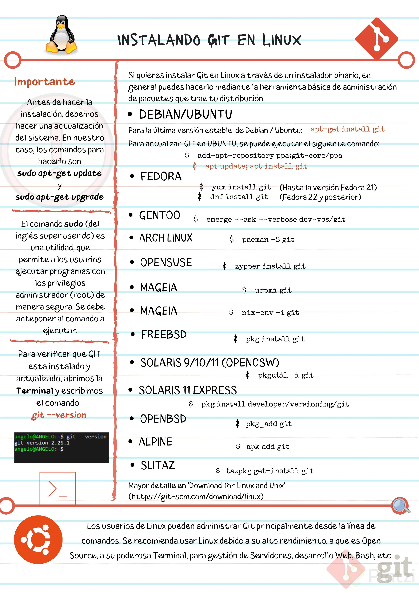

---

### Clase 6 - Editores de código, archivos binarios y de texto plano
Un editor de código o IDE es una herramienta que nos brinda muchas ayudas para escribir código, algo así como un bloc de notas muy avanzado. Los editores más populares son VSCode, Sublime
Text y Atom, pero no es obligatorio usar alguno de estos para programar.

**Tipos de archivos y sus diferencias:**
- Archivos de Texto (.txt): Texto plano normal y sin nada especial. Lo vemos igual sin importar dónde lo abramos, ya sea con el bloc de notas o con editores de texto avanzados.
- Archivos RTF (.rtf): Podemos guardar texto con diferentes tamaños, estilos y colores. Pero si lo abrimos desde un editor de código, vamos a ver que es mucho más complejo que solo el texto
plano. Esto es porque debe guardar todos los estilos del texto y, para esto, usa un código especial un poco difícil de entender y muy diferente a los textos con estilos especiales al que
estamos acostumbrados.
- Archivos de Word (.docx): Podemos guardar imágenes y texto con diferentes tamaños, estilos o colores. Al abrirlo desde un editor de código podemos ver que es código binario, muy difícil
de entender y muy diferente al texto al que estamos acostumbrados. Esto es porque Word está optimizado para entender este código especial y representarlo gráficamente.
Recuerda que debes habilitar la opción de ver la extensión de los archivos, de lo contrario, solo podrás ver su nombre. La forma de hacerlo en Windows es Vista > Mostrar u ocultar >
Extensiones de nombre de archivo.

**Conceptos importantes de Git**
- Bug: Error en el código
- Repository: Donde se almacena todo el proyecto, el cual puede vivir tanto en local como en remoto. El repositorio guarda un historial de versiones y, más importante, de la relación de
cada versión con la anterior para que pueda hacerse el árbol de versiones con las diferentes ramas.
- Fork: Si en algún momento queremos contribuir al proyecto de otra persona, o si queremos utilizar el proyecto de otro como el punto de partida del nuestro. Esto se conoce como “fork”.
- Clone: Una vez se decide hacer un fork , hasta ese momento sólo existe en GitHub. Para poder trabajar en el proyecto, toca clonar el repositorio elegido al computador personal.
- Branch: Es una bifurcación del proyecto que se está realizando para anexar una nueva funcionalidad o corregir un bug.
- Main: Rama donde se almacena la última versión estable del proyecto que se está realizando. La rama main es la que está en producción en cada momento (o casi) y debería estar libre de
bugs. Así, si esta rama está en producción, sirve como referente para hacer nuevas funcionalidades y/o arreglar bugs de última hora.
- Commit: consiste en subir cosas a la versión local del repositorio. De esta manera se puede trabajar en la rama de forma local sin tener que modificar ninguna versión en remoto ni tener
que tener la última versión remota, cosa muy útil en grandes desarrollos trabajados por varias personas.
- Push: Consiste en enviar todo lo que se ha confirmado con un commit al repositorio remoto. Aquí es donde se une nuestro trabajo con el de los demás.
- Checkout: Acción de descargarse una rama del repositorio GIT local (sí, GIT tiene su propio repositorio en local para poder ir haciendo commits) o remoto.
- Fetch: Actualiza el repositorio local bajando datos del repositorio remoto al repositorio local sin actualizarlo, es decir, se guarda una copia del repositorio remoto en el local.
- Merge: La acción de merge es la continuación natural del fetch. El merge permite unir la copia del repositorio remoto con tu repositorio local, mezclando los diferentes códigos.
- Pull: Consiste en la unión del fetch y del merge, esto es, recoge la información del repositorio remoto y luego mezcla el trabajo en local con esta.
- Diff: Se utiliza para mostrar los cambios entre dos versiones del mismo archivo.

**Notas mias anteriores de Git**  
Ciclo de vida o estados de los archivos en Git:

Cuando trabajamos con Git nuestros archivos pueden vivir y moverse entre 4 diferentes estados (cuando trabajamos con repositorios remotos pueden ser más estados, pero lo estudiaremos más
adelante):

Archivos Tracked: son los archivos que viven dentro de Git, no tienen cambios pendientes y sus últimas actualizaciones han sido guardadas en el repositorio gracias a los comandos git add y
git commit.
Archivos Staged: son archivos en Staging. Viven dentro de Git y hay registro de ellos porque han sido afectados por el comando git add, aunque no sus últimos cambios. Git ya sabe de la
existencia de estos últimos cambios, pero todavía no han sido guardados definitivamente en el repositorio porque falta ejecutar el comando git commit.
Archivos Unstaged: entiéndelos como archivos “Tracked pero Unstaged”. Son archivos que viven dentro de Git pero no han sido afectados por el comando git add ni mucho menos por git commit.
Git tiene un registro de estos archivos, pero está desactualizado, sus últimas versiones solo están guardadas en el disco duro.
Archivos Untracked: son archivos que NO viven dentro de Git, solo en el disco duro. Nunca han sido afectados por git add, así que Git no tiene registros de su existencia.
Recuerda que hay un caso muy raro donde los archivos tienen dos estados al mismo tiempo: staged y untracked. Esto pasa cuando guardas los cambios de un archivo en el área de Staging (con
el comando git add), pero antes de hacer commit para guardar los cambios en el repositorio haces nuevos cambios que todavía no han sido guardados en el área de Staging (en realidad, todo
sigue funcionando igual pero es un poco divertido).
Comandos para mover archivos entre los estados de Git:

git add: nos ayuda a mover archivos del Untracked o Unstaged al estado Staged. Podemos usar git nombre-del-archivo-o-carpeta para añadir archivos y carpetas individuales o git add -A para
mover todos los archivos de nuestro proyecto (tanto Untrackeds como unstageds).

git commit: nos ayuda a mover archivos de Unstaged a Tracked. Esta es una ocasión especial, los archivos han sido guardados o actualizados en el repositorio. Git nos pedirá que dejemos un
mensaje para recordar los cambios que hicimos y podemos usar el argumento -m para escribirlo (git commit -m "mensaje").

ERROR AL HACER Commit
Hasta los mejores cometen errores, pero todo tiene solución.

Freddy se olvidó de guardar el archivo .html, y lo malo es que commiteó ese archivo todavia con el merge conflict.
Con los:

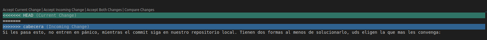

Si les pasa esto, no entren en pánico, mientras el commit siga en nuestro repositorio local. Tienen dos formas al menos de solucionarlo, uds eligen la que mas les convenga:

Reemplazar el commit fallido
Pueden corregir el archivo (en este caso hubiera bastado con guardarlo) y luego usar
git add .
git commit --amend
El --amend “suma” al commit anterior el nuevo contenido en el staging area. Asi que no se está creando un nuevo commit, si no reemplazando el último.

Borrar el commit, sin perder los cambios, arreglar y commitear de nuevo.
Bastaria con devolver el commit a la staging area, usando:
git reset HEAD~1 --soft
y luego guardar el archivo y volver a hacer el commit (ya que esta vez con el reset si borraron el commit con el fallo).

Practiquenlo!, creanme que commit --amend resulta bastante útil, más de una vez habré commiteado algo, y luego me doy cuenta que me faltó algo, o algo está mal, y en vez de armar otro
commit arreglando el error, podemos reemplazarlo con amend.

Los tags o etiquetas nos permiten asignar versiones a los commits con cambios más importantes o significativos de nuestro proyecto.

Comandos para trabajar con etiquetas:

Crear un nuevo tag y asignarlo a un commit: git tag -a nombre-del-tag id-del-commit.
Borrar un tag en el repositorio local: git tag -d nombre-del-tag.
Listar los tags de nuestro repositorio local: git tag o git show-ref --tags.
Publicar un tag en el repositorio remoto: git push origin --tags.
Borrar un tag del repositorio remoto: git tag -d nombre-del-tag y git push origin :refs/tags/nombre-del-tag.

Crear una rama en el repositorio local: git branch nombre-de-la-rama o git checkout -b nombre-de-la-rama.
Publicar una rama local al repositorio remoto: git push origin nombre-de-la-rama.
Recuerda que podemos ver gráficamente nuestro entorno y flujo de trabajo local con Git usando el comando gitk

Me muestra mas graficamente los cambios en los branch.
alias arbolito="git log --all --graph --decorate --oneline"
con unalias se borra el alias

git stash : Guarda el trabajo actual de manera temporal. (Archivos modificados o eliminados)
git stash -u : Crea un stash con todos los archivos. (Añadiendo los creados Untracked)
git stash save “mensaje” : Crea un stash con el mensaje especificado.
git stash list : Permite visualizar todos los stash existentes.
git stash clear : Elimina todos los stash existentes.
git stash drop : Elimina el stash más reciente. El que tiene num_stash=0.
git stash drop stash@{num_stash} : Elimina un stash específico.
git stash apply : Aplica el stash más reciente. El que tiene num_stash=0.
git stash apply stash@{num_stash} : Aplica los cambios de un stash específico.
git stash pop : Aplica el stash más reciente y lo elimina. El que tiene num_stash=0.
git stash pop stash@{num_stash} : Aplica los cambios de un stash específico y elimina lo stash.
git stash branch nombre_de_rama : Crea una rama y aplica el stash mas reciente.
git stash branch nombre_de_rama stash@{num_stash} : Crea una rama y aplica el stash especificado.

Consideraciones:

El cambio más reciente (al crear un stash) SIEMPRE recibe el valor 0 y los que estaban antes aumentan su valor.
Al crear un stash tomará los archivos que han sido modificados y eliminados. Para que tome un archivo creado es necesario agregarlo al Staging Area con git add [nombre_archivo] con la
intención de que git tenga un seguimiento de ese archivo, o también utilizando el comando git stash -u.
Al aplicar un stash este no se elimina, es buena práctica eliminarlo.

Algunas extensiones recomendadas por Platzi
-gitlens
-settings sync
-themes
-icons
-wakatime
-prettier
-live server
-markdown all in one
-code spell checker
-github copilot
-intellisense
-snippets

`git config remote.origin.push HEAD` -> Soluciona a "fatal: The current branch main has multiple upstream branches, refusing to push."

### Clase 7 - Introducción a la terminal y línea de comandos
La línea de comandos nos permite interactuar con nuestro computador sin necesidad de utilizar una interfaz gráfica. Sin embargo, los computadores emplean distintos sistemas de archivos y
manejan diferentes comandos, dependiendo del sistema operativo que utilicen.

**Diferencias entre la estructura de archivos de Windows, Mac o Linux.**
- La ruta principal en Windows es `C:\`, en UNIX es solo `/`.
- Windows no hace diferencia entre mayúsculas y minúsculas pero UNIX sí.
Recuerda que GitBash usa la ruta `/c` para dirigirse a `C:\` (o `/d` para dirigirse a `D:\`) en Windows. Por lo tanto, la ruta del usuario con el que estás trabajando es
`/c/Users/Nombre_de_tu_usuario`

**Comandos básicos en la terminal:**
- pwd: Nos muestra la ruta de carpetas en la que te encuentras ahora mismo.
- mkdir: Nos permite crear carpetas (por ejemplo, `mkdir Carpeta-Importante`).
- touch: Nos permite crear archivos (por ejemplo, `touch archivo.txt`).
- rm: Nos permite borrar un archivo o carpeta (por ejemplo, `rm archivo.txt`). Mucho cuidado con este comando, puedes borrar todo tu disco duro.
- cat: Ver el contenido de un archivo (por ejemplo, `cat nombre-archivo.txt`).
- ls: Nos permite cambiar ver los archivos de la carpeta donde estamos ahora mismo. Podemos usar uno o más argumentos para ver más información sobre estos archivos (los argumentos pueden
ser `--` + el nombre del argumento o `-` + una sola letra o shortcut por cada argumento).
    - `ls -a`: Mostrar todos los archivos, incluso los ocultos.
    - `ls -l`: Ver todos los archivos como una lista.
- cd: Nos permite navegar entre carpetas.
    - `cd /`: Ir a la ruta principal:
    - `cd` o `cd ~`: Ir a la ruta de tu usuario
    - `cd carpeta/subcarpeta`: Navegar a una ruta dentro de la carpeta donde estamos ahora mismo.
    - `cd ..` (`cd` + dos puntos): Regresar una carpeta hacia atrás.
    - Si quieres referirte al directorio en el que te encuentras ahora mismo puedes usar `cd .` (`cd` + un punto).
- history: Ver los últimos comandos que ejecutamos y un número especial con el que podemos repetir su ejecución.
- ! + número: Ejecutar algún comando con el número que nos muestra el comando `history` (por ejemplo, `!72`).
- clear: Para limpiar la terminal. También podemos usar los atajos de teclado `Ctrl + L` o `Command + L`.
Todos estos comandos tiene una función de autocompletado, o sea, puedes escribir la primera parte y presionar la tecla `Tab` para que la terminal nos muestre todas las posibles carpetas o
comandos que podemos ejecutar. Si presionas la tecla `Arriba` puedes ver el último comando que ejecutamos.

Recuerda que podemos descubrir todos los argumentos de un comando con el argumento `--help` (por ejemplo, `cat --help`).

**Más comandos**

---

### Clase 8 - Crea un repositorio de Git y haz tu primer commit
Le indicaremos a Git que queremos crear un nuevo repositorio para utilizar su sistema de control de versiones. Solo debemos posicionarnos en la carpeta raíz de nuestro proyecto y ejecutar
el comando: `git init

Recuerda que al ejecutar este comando (y de aquí en adelante) vamos a tener una nueva carpeta oculta llamada `.git` con toda la base de datos con cambios atómicos en nuestro proyecto.

Recuerda que Git está optimizado para trabajar en equipo, por lo tanto, debemos darle un poco de información sobre nosotros. No debemos hacerlo todas las veces que ejecutamos un comando,
basta con ejecutar solo una sola vez los siguientes comandos con tu información:

~~~
git config --global user.email "tu@email.com"
git config --global user.name "Tu Nombre"
~~~

Existen muchas otras configuraciones de Git que puedes encontrar ejecutando el comando `git config --list` (o solo `git config` para ver una explicación más detallada).

Si quieres ver los archivos ocultos de una carpeta puedes habilitar la opción de Vista > Mostrar u ocultar > Elementos ocultos (en Windows) o ejecutar el comando `ls -a`.

**Comandos para iniciar tu repositorio con Git**
- git init: para inicializar el repositorio git y el staged
- git add nombre_del_archivo.txt: enviar el archivo al staged
- git status: ver el estado, si se requiere agregar al starget o si se requiere commit
- git conf: para ver las posibles configuraciones
- git conf --list: para ver la lista de configuraciones hechas
- git conf --list --show-origin: para mostrar las configuraciones y sus rutas
- git rm --cached nombre_del_archivo.txt: para eliminar el archivo del staged(ram)
- git rm nombre_del_archivo.txt: para eliminar del repositorio

Si por algún motivo te equivocaste en el nombre o email que configuraste al principio, lo puedes modificar de la siguiente manera:  
`git config --global --replace-all user.name “Aquí va tu nombre modificado”`  
O si lo deseas eliminar y añadir uno nuevo  
`git config --global --unset-all user.name :Elimina el nombre del usuario`  
`git config --global --add user.name “Aquí va tu nombre”`

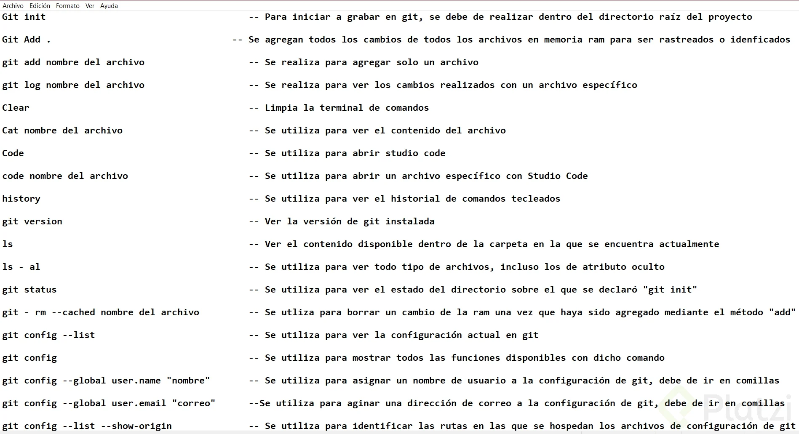

---

### Clase 9 - Analizar cambios en los archivos de tu proyecto con Git
El comando `git show` nos muestra los cambios que han existido sobre un archivo y es muy útil para detectar cuándo se produjeron ciertos cambios, qué se rompió y cómo lo podemos
solucionar. Pero podemos ser más detallados.

Si queremos ver la diferencia entre una versión y otra, no necesariamente todos los cambios desde la creación del archivo, podemos usar el comando `git diff commitA commitB`.

Recuerda que puedes obtener el ID de tus commits con el comando `git log`.

**Comandos para analizar cambios en GIT**
- git init: inicializar el repositorio
- git add nombre_de_archivo.extensión: agregar el archivo al repositorio
- git commit -m “Mensaje”: Agregamos los cambios para el repositorio
- git add: Agregar los cambios de la carpeta en la que nos encontramos agregar todo
- git status: visualizar cambios
- git log nombre_de_archivos.extensión: histórico de cambios con detalles
- git push: envía a otro repositorio remoto lo que estamos haciendo
- git pull: traer repositorio remoto
- ls: listado de carpetas en donde me encuentro. Es decir, como emplear dir en windows.
- pwd: ubicación actual
- mkdir: make directory nueva carpeta
- touch archivo.extensión: crear archivo vacío
- cat archivo.extensión: muestra el contenido del archivo
- history: historial de comandos utilizados durante esa sesión
- rm archivo.extensión: Eliminación de archivo
- comando --help: ayuda sobre el comando
- git checkout: traer cambios realizados
- git rm --cached archivo.extensión: se utiliza para devolver el archivo que se tiene en ram. Cuando escribimos `git add`, lo devuelve a estado natural mientras está en *staging*.
- git config --list: muestra la lista de configuración de git
- git config --list --show-origin: rutas de acceso a la configuración de git
- git log archivo.extensión: muestra la historia del archivo

---

### Clase 10 - ¿Qué es el staging y los repositorios? Ciclo básico de trabajo en Git
Para iniciar un repositorio, o sea, activar el sistema de control de versiones de Git en tu proyecto, solo debes ejecutar el comando `git init`.

Este comando se encargará de dos cosas: primero, crear una carpeta `.git`, donde se guardará toda la base de datos con cambios atómicos de nuestro proyecto; y segundo, crear un área que
conocemos como Staging, que guardará temporalmente nuestros archivos (cuando ejecutemos un comando especial para eso) y nos permitirá, más adelante, guardar estos cambios en el repositorio
(también con un comando especial).

**Ciclo de vida o estados de los archivos en Git:**  
Cuando trabajamos con Git nuestros archivos pueden vivir y moverse entre 4 diferentes estados (cuando trabajamos con repositorios remotos pueden ser más estados, pero lo estudiaremos más
adelante):
- Archivos Tracked: son los archivos que viven dentro de Git, no tienen cambios pendientes y sus últimas actualizaciones han sido guardadas en el repositorio gracias a los comandos `git
add` y `git commit`.
- Archivos Staged: son archivos en Staging. Viven dentro de Git y hay registro de ellos porque han sido afectados por el comando `git add`, aunque no sus últimos cambios. Git ya sabe de la
existencia de estos últimos cambios, pero todavía no han sido guardados definitivamente en el repositorio porque falta ejecutar el comando `git commit`.
- Archivos Unstaged: entiéndelos como archivos *“Tracked pero Unstaged”*. Son archivos que viven dentro de Git pero no han sido afectados por el comando `git add` ni mucho menos por `git
commit`. Git tiene un registro de estos archivos, pero está desactualizado, sus últimas versiones solo están guardadas en el disco duro.
- Archivos Untracked: son archivos que NO viven dentro de Git, solo en el disco duro. Nunca han sido afectados por `git add`, así que Git no tiene registros de su existencia.  
Recuerda que hay un caso muy raro donde los archivos tienen dos estados al mismo tiempo: staged y untracked. Esto pasa cuando guardas los cambios de un archivo en el área de Staging (con
el comando `git add`), pero antes de hacer commit para guardar los cambios en el repositorio haces nuevos cambios que todavía no han sido guardados en el área de Staging (en realidad, todo
sigue funcionando igual pero es un poco divertido).

**Comandos para mover archivos entre los estados de Git:**
- `git status`: nos permite ver el estado de todos nuestros archivos y carpetas.
- `git add`: nos ayuda a mover archivos del Untracked o Unstaged al estado Staged. Podemos usar `git nombre-del-archivo-o-carpeta` para añadir archivos y carpetas individuales o `git add
-A` para mover todos los archivos de nuestro proyecto (tanto Untrackeds como unstageds).
- `git reset HEAD`: nos ayuda a sacar archivos del estado Staged para devolverlos a su estado anterior. Si los archivos venían de Unstaged, vuelven allí. Y lo mismo se venían de Untracked.
- `git commit`: nos ayuda a mover archivos de Unstaged a Tracked. Esta es una ocasión especial, los archivos han sido guardados o actualizados en el repositorio. Git nos pedirá que dejemos
un mensaje para recordar los cambios que hicimos y podemos usar el argumento `-m` para escribirlo (`git commit -m "mensaje"`).
- git rm: este comando necesita alguno de los siguientes argumentos para poder ejecutarse correctamente:
    - `git rm --cached`: Mueve los archivos que le indiquemos al estado Untracked.
    - `git rm --force`: Elimina los archivos de Git y del disco duro. Git guarda el registro de la existencia de los archivos, por lo que podremos recuperarlos si es necesario (pero
    debemos usar comandos más avanzados).

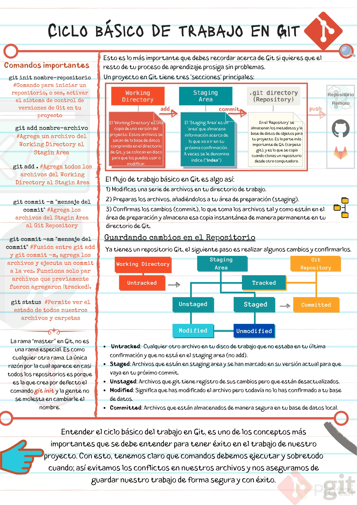

---

### Clase 11 - ¿Qué es un Branch (rama) y cómo funciona un Merge en Git?
En GIT, una rama o branch es una versión del código del proyecto sobre el que estás trabajando. Estas ramas ayudan a mantener el orden en el control de versiones y manipular el código de
forma segura.
Por defecto, el proyecto se crea en una rama llamada Main (anteriormente conocida como Master). Cada vez que añades código y guardas los cambios, estás haciendo un commit, que es añadir el
nuevo código a una rama. Esto genera nuevas versiones de esta rama o branch, hasta llegar a la versión actual de la rama Main.

Cuando decides hacer experimentos, puedes generar ramas experimentales (usualmente llamadas development), que están basadas en alguna rama main, pero sobre las cuales puedes hacer cambios
a tu gusto sin necesidad de afectar directamente al código principal.

En otros casos, si encuentras un bug o error de código en la rama Main (que afecta al proyecto en producción), tendrás que crear una nueva rama (que usualmente se llaman bug fixing o hot
fix) para hacer los arreglos necesarios. Cuando los cambios estén listos, los tendrás que fusionar con la rama Main para que los cambios sean aplicados. Para esto, se usa un comando
llamado Merge, que mezcla los cambios de la rama que originaste a la rama Main.

Todos los commits se aplican sobre una rama. Por defecto, siempre empezamos en la rama Main (pero puedes cambiarle el nombre si no te gusta) y generamos nuevas ramas, a partir de esta,
para crear flujos de trabajo independientes.

**Checkout y merge**
Producir una nueva rama se conoce como Checkout. Unir dos ramas lo conocemos como Merge.

Cuando haces merge de estas ramas con el código principal, su código se fusiona, originando una nueva versión de la rama Master (o main) que ya tiene todos los cambios que aplicaste en tus
experimentos o arreglos de errores.

Podemos generar todas las ramas y commits que queramos. De hecho, podemos aprovechar el registro de cambios de Git para producir ramas, traer versiones viejas del código, arreglarlas y
combinarlas de nuevo para mejorar el proyecto.

Solo ten en cuenta que combinar estas ramas (hacer “merge”) puede generar conflictos. Algunos archivos pueden ser diferentes en ambas ramas. Git es muy inteligente y puede intentar unir
estos cambios automáticamente, pero no siempre funciona. En algunos casos, somos nosotros los que debemos resolver estos conflictos a mano.

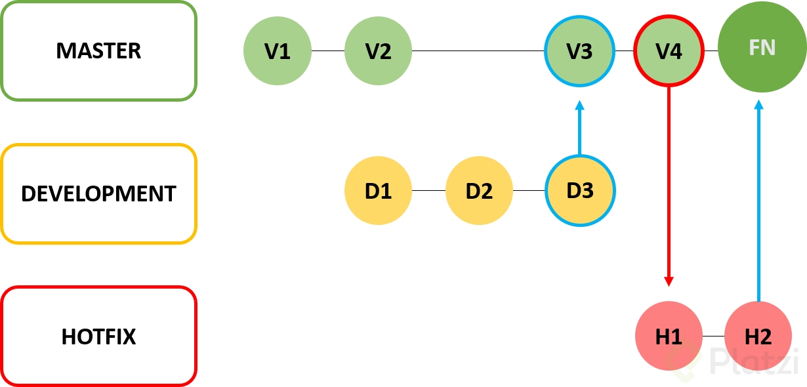

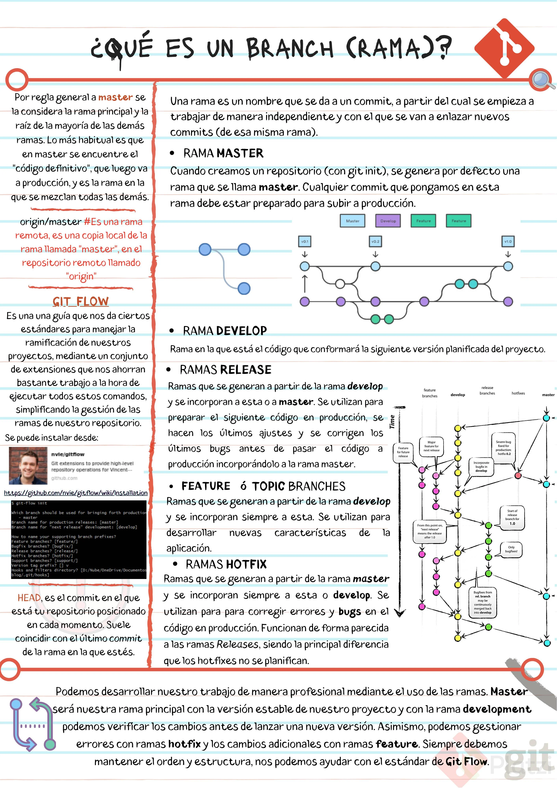

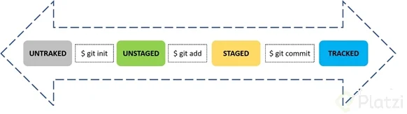

---

### CLase 12 - Volver en el tiempo en nuestro repositorio utilizando reset y checkout
El comando `git checkout` + `ID del commit` nos permite viajar en el tiempo. Podemos volver a cualquier versión anterior de un archivo específico o incluso del proyecto entero. Esta
también es la forma de crear ramas y movernos entre ellas.

También hay una forma de hacerlo un poco más “ruda”: usando el comando `git reset`. En este caso, no solo “volvemos en el tiempo”, sino que borramos los cambios que hicimos después de este
commit.

Hay dos formas de usar `git reset`: con el argumento `--hard`, borrando toda la información que tengamos en el área de staging (y perdiendo todo para siempre). O, un poco más seguro, con el
argumento `--soft`, que mantiene allí los archivos del área de staging para que podamos aplicar nuestros últimos cambios pero desde un commit anterior.

**Cómo usar Git Reset**  
Para volver a commits previos, borrando los cambios realizados desde ese commit, podemos utilizar:
- git reset --soft [SHA 1]: elimina los cambios hasta el staging area
- git reset --mixed [SHA 1]: elimina los cambios hasta el working area
- git reset --hard [SHA 1]: regresa hasta el commit del [SHA-1]  
Donde el SHA-1 es el identificador del commit

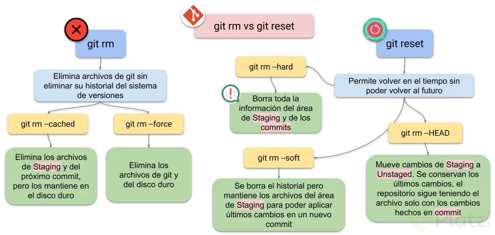

---

### Clase 13 - Git reset vs. Git rm
Git reset y git rm son comandos con utilidades muy diferentes, pero se pueden confundir muy fácilmente.

**git rm**  
Este comando nos ayuda a eliminar archivos de Git sin eliminar su historial del sistema de versiones. Esto quiere decir que si necesitamos recuperar el archivo solo debemos “viajar en el
tiempo” y recuperar el último commit antes de borrar el archivo en cuestión.

Recuerda que `git rm` no puede usarse así nomás. Debemos usar uno de los flags para indicarle a Git cómo eliminar los archivos que ya no necesitamos en la última versión del proyecto:
- `git rm --cached`: Elimina los archivos de nuestro repositorio local y del área de staging, pero los mantiene en nuestro disco duro. Básicamente le dice a Git que deje de trackear el
historial de cambios de estos archivos, por lo que pasaran a un estado untracked.
- `git rm --force`: Elimina los archivos de Git y del disco duro. Git siempre guarda todo, por lo que podemos acceder al registro de la existencia de los archivos, de modo que podremos
recuperarlos si es necesario (pero debemos usar comandos más avanzados).

**git reset**  
Este comando nos ayuda a volver en el tiempo. Pero no como git checkout que nos deja ir, mirar, pasear y volver. Con git reset volvemos al pasado sin la posibilidad de volver al futuro.
Borramos la historia y la debemos sobreescribir. No hay vuelta atrás.

Este comando es muy peligroso y debemos emplearlo solo en caso de emergencia. Recuerda que debemos usar alguna de estas dos opciones:

Hay dos formas de utilizar `git reset`: con el argumento `--hard`, borrando toda la información que tengamos en el área de staging (y perdiendo todo para siempre). O, un poco más seguro,
con el argumento `--soft`, que mantiene allí los archivos del área de staging para que podamos aplicar nuestros últimos cambios pero desde un commit anterior.

- `git reset --soft`: Borramos todo el historial y los registros de Git pero guardamos los cambios que tengamos en Staging, así podemos aplicar las últimas actualizaciones a un nuevo
commit.
- `git reset --hard`: Borra todo. Todo todito, absolutamente todo. Toda la información de los commits y del área de staging se borra del historial.

**¡Pero todavía falta algo!**

`git reset HEAD`: Este es el comando para sacar archivos del área de staging. No para borrarlos ni nada de eso, solo para que los últimos cambios de estos archivos no se envíen al último
commit, a menos que cambiemos de opinión y los incluyamos de nuevo en staging con `git add`, por supuesto.

**¿Por qué esto es importante?**  
Imagina el siguiente caso:  
Hacemos cambios en los archivos de un proyecto para una nueva actualización. Todos los archivos con cambios se mueven al área de staging con el comando `git add`. Pero te das cuenta de que
uno de esos archivos no está listo todavía. Actualizaste el archivo, pero ese cambio no debe ir en el próximo commit por ahora.

¿Qué podemos hacer?  
Bueno, todos los cambios están en el área de Staging, incluido el archivo con los cambios que no están listos. Esto significa que debemos sacar ese archivo de Staging para poder hacer
commit de todos los demás.

¡Al usar `git rm` lo que haremos será eliminar este archivo completamente de git! Todavía tendremos el historial de cambios de este archivo, con la eliminación del archivo como su última
actualización. Recuerda que en este caso no buscábamos eliminar un archivo, solo dejarlo como estaba y actualizarlo después, no en este commit.

En cambio, si usamos `git reset HEAD`, lo único que haremos será mover estos cambios de Staging a Unstaged. Seguiremos teniendo los últimos cambios del archivo, el repositorio mantendrá el
archivo (no con sus últimos cambios, pero sí con los últimos en los que hicimos commit) y no habremos perdido nada.

Conclusión: Lo mejor que puedes hacer para salvar tu puesto y evitar un incendio en tu trabajo es conocer muy bien la diferencia y los riesgos de todos los comandos de Git.

---

### Clase 14 - Flujo de trabajo básico con un repositorio remoto
Cuando empiezas a trabajar en un entorno local, el proyecto vive únicamente en tu computadora. Esto significa que no hay forma de que otros miembros del equipo trabajen en él.

Para solucionar esto, utilizamos los **servidores remotos**: un nuevo estado que deben seguir nuestros archivos para conectarse y trabajar con equipos de cualquier parte del mundo.

Estos servidores remotos pueden estar alojados en GitHub, GitLab, BitBucket, entre otros. Lo que van a hacer es guardar el mismo repositorio que tienes en tu computadora y darnos una URL
con la que todos podremos acceder a los archivos del proyecto. Así, el equipo podrá descargarlos, hacer cambios y volverlos a enviar al servidor remoto para que otras personas vean los
cambios, comparen sus versiones y creen nuevas propuestas para el proyecto.

Esto significa que debes aprender algunos nuevos comandos

**Comandos para trabajo remoto con GIT**  
- `git clone url_del_servidor_remoto`: Nos permite descargar los archivos de la última versión de la rama principal y todo el historial de cambios en la carpeta `.git`.
- `git push`: Luego de hacer `git add` y `git commit` debemos ejecutar este comando para mandar los cambios al servidor remoto.
- `git fetch`: Lo usamos para traer actualizaciones del servidor remoto y guardarlas en nuestro repositorio local (en caso de que hayan, por supuesto).
- `git merge`: También usamos el comando `git merge` con servidores remotos. Lo necesitamos para combinar los últimos cambios del servidor remoto y nuestro directorio de trabajo.
- `git pull`: Básicamente, `git fetch` y `git merge` al mismo tiempo.

Adicionalmente, tenemos otros comandos que nos sirven para trabajar en proyectos muy grandes:

- `git log --oneline`:Te muestra el id commit y el título del commit.
- `git log --decorate`: Te muestra donde se encuentra el head point en el log.
- `git log --stat`: Explica el número de líneas que se cambiaron brevemente.
- `git log -p`: Explica el número de líneas que se cambiaron y te muestra que se cambió en el contenido.
- `git shortlog`: Indica que commits ha realizado un usuario, mostrando el usuario y el título de sus commits.
- `git log --graph` `--oneline` `--decorate` y
- `git log --pretty=format:"%cn hizo un commit %h el dia %cd"`: Muestra mensajes personalizados de los commits.
- `git log -3`: Limitamos el número de commits.
- `git log --after=“2018-1-2”`
- `git log --after=“today”` y
- `git log --after=“2018-1-2” --before“today”`: Commits para localizar por fechas.
- `git log --author=“Name Author”`: Commits hechos por autor que cumplan exactamente con el nombre.
- `git log --grep=“INVIE”`: Busca los commits que cumplan tal cual está escrito entre las comillas.
- `git log --grep=“INVIE” –i`: Busca los commits que cumplan sin importar mayúsculas o minúsculas.
- `git log – index.html`: Busca los commits en un archivo en específico.
- `git log -S “Por contenido”`: Buscar los commits con el contenido dentro del archivo.
- `git log > log.txt`: guardar los logs en un archivo txt

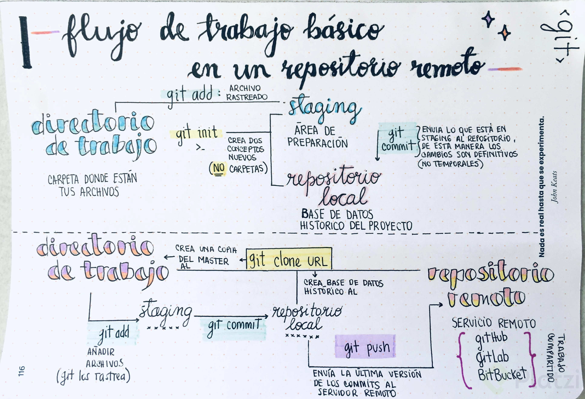

[PDF de la Clase](src/Curso_profesional_de_Git_y_GitHub/14_Flujo_de_trabajo_basico_con_un_repositorio_remoto_05.pdf)

---

### Clase 15 - Introducción a las ramas o branches de Git
**Cómo funcionan las ramas en GIT**  
Las ramas son la manera de hacer cambios en nuestro proyecto sin afectar el flujo de trabajo de la rama principal. Esto porque queremos trabajar una parte muy específica de la aplicación o simplemente experimentar.

- `git branch -nombre de la rama-`: Con este comando se genera una nueva rama.
- `git checkout -nombre de la rama-`: Con este comando puedes saltar de una rama a otra.
- `git checkout -b rama`: Genera una rama y nos mueve a ella automáticamente, Es decir, es la combinación de git brach y git checkout al mismo tiempo.
- `git reset id-commit`: Nos lleva a cualquier commit no importa la rama, ya que identificamos el id del tag., eliminando el historial de los commit posteriores al tag seleccionado.
- `git checkout rama-o-id-commit`: Nos lleva a cualquier commit sin borrar los commit posteriores al tag seleccionado.

---

### Clase 16 - Fusión de ramas con Git merge
El comando `git merge` nos permite crear un nuevo *commit* con la combinación de dos ramas (la rama donde nos encontramos cuando ejecutamos el comando y la rama que indiquemos después del
comando).

**Cómo usar Git merge**  
En este ejemplo, vamos a crear un nuevo *commit* en la rama *main* combinando los cambios de una rama llamada *cabecera*:
~~~
git checkout main
git merge cabecera
~~~

Otra opción es crear un nuevo *commit* en la rama *cabecera* combinando los cambios de cualquier otra rama:
~~~
git checkout cabecera
git merge cualquier-otra-rama
~~~

Asombroso, ¿verdad? Es como si Git tuviera superpoderes para saber qué cambios queremos conservar de una rama y qué otros de la otra. El problema es que no siempre puede adivinar, sobre todo en algunos casos donde dos ramas tienen actualizaciones diferentes en ciertas líneas en los archivos. Esto lo conocemos como un **conflicto**.

Recuerda que al ejecutar el comando `git checkout` para cambiar de rama o commit puedes perder el trabajo que no hayas guardado. Guarda siempre tus cambios antes de hacer `git checkout`.

**Comandos básicos de GitHub**
- `git init`: crear un repositorio.
- `git add`: agregar un archivo a staging.
- `git commit -m “mensaje”`: guardar el archivo en git con un mensaje.
- `git branch`: crear una nueva rama.
- `git checkout`: moverse entre ramas.
- `git push`: mandar cambios a un servidor remoto.
- `git fetch`: traer actualizaciones del servidor remoto y guardarlas en nuestro repositorio local.
- `git merge`: tiene dos usos. Uno es la fusión de ramas, funcionando como un commit en la rama actual, trayendo la rama indicada. Su otro uso es guardar los cambios de un servidor remoto en nuestro directorio.
- `git pull`: fetch y merge al mismo tiempo.

**Comandos para corrección en GitHub**
- `git checkout “codigo de version” “nombre del archivo”`: volver a la última versión de la que se ha hecho commit.
- `git reset`: vuelve al pasado sin posibilidad de volver al futuro, se debe usar con especificaciones.
- `git reset --soft`: vuelve a la versión en el repositorio, pero guarda los cambios en staging. Así, podemos aplicar actualizaciones a un nuevo commit.
- `git reset --hard`: todo vuelve a su versión anterior
- `git reset HEAD`: saca los cambios de staging, pero no los borra. Es lo opuesto a git add.
- `git rm`: elimina los archivos, pero no su historial. Si queremos recuperar algo, solo hay que regresar. se utiliza así:
    - `git rm --cached` elimina los archivos en staging pero los mantiene en el disco duro.
    - `git rm --force` elimina los archivos de git y del disco duro.

**Comandos para revisión y comparación en GitHub**
- `git status`: estado de archivos en el repositorio.
- `git log`: historia entera del archivo.
- `git log --stat`: cambios específicos en el archivo a partir de un commit.
- `git show`: cambios históricos y específicos hechos en un archivo.
- `git diff “codigo de version 1” “codigo de version 2”`: comparar cambios entre versiones.
- `git diff`: comparar directorio con staging.

---

### Clase 17 - Resolución de conflictos al hacer un merge
Git nunca borra nada, a menos que nosotros se lo indiquemos. Cuando usamos los comandos `git merge` o `git checkout` estamos cambiando de rama o creando un nuevo commit, no borrando ramas ni commits (recuerda que puedes borrar commits con `git reset` y ramas con `git branch -d`).

Git es muy inteligente y puede resolver algunos conflictos automáticamente: cambios, nuevas líneas, entre otros. Pero algunas veces no sabe cómo resolver estas diferencias, por ejemplo, cuando dos ramas diferentes hacen cambios distintos a una misma línea.

Esto lo conocemos como conflicto y lo podemos resolver manualmente. Solo debemos hacer el merge, ir a nuestro editor de código y elegir si queremos quedarnos con alguna de estas dos versiones o algo diferente. Algunos editores de código como Visual Studio Code nos ayudan a resolver estos conflictos sin necesidad de borrar o escribir líneas de texto, basta con hacer clic en un botón y guardar el archivo.

Recuerda que siempre debemos crear un nuevo commit para aplicar los cambios del merge. Si Git puede resolver el conflicto, hará commit automáticamente. Pero, en caso de no pueda resolverlo, debemos solucionarlo y hacer el commit.

Los archivos con conflictos por el comando `git merge` entran en un nuevo estado que conocemos como *Unmerged*. Funcionan muy parecido a los archivos en estado *Unstaged*, algo así como un estado intermedio entre *Untracked* y *Unstaged*. Solo debemos ejecutar `git add` para pasarlos al área de staging y `git commit` para aplicar los cambios en el repositorio.

**Cómo revertir un merge**  
Si nos hemos equivocado y queremos cancelar el merge, debemos usar el siguiente comando:`git merge --abort`

**Conflictos en repositorios remotos**  
Al trabajar con otras personas, es necesario utilizar un repositorio remoto.
­
- Para copiar el repositorio remoto al directorio de trabajo local, se utiliza el comando `git clone <url>`, y para enviar cambios al repositorio remoto se utiliza `git push`.
- Para actualizar el repositorio local se hace uso del comando `git fetch`, luego se debe fusionar los datos traídos con los locales usando `git merge`.
    - Para traer los datos y fusionarlos a la vez, en un solo comando, se usa `git pull`.
        - Para crear commits rápidamente, fusionando `git add` y `git commit -m ""`, usamos `git commit -am ""`.
        - Para generar nuevas ramas, hay que posicionarse sobre la rama que se desea copiar y utilizar el comando `git branch <nombre>`.
    - Para saltar entre ramas, se usa el comando `git checkout <branch>`
        - Una vez realizado los cambios en la rama, estas deben fusionarse con `git merge`.
    - El merge ocurre en la rama en la que se está posicionado. Por lo tanto, la rama a fusionar se transforma en la principal.
    - Los merges también son commits.
    - Los merges pueden generar conflictos, esto aborta la acción y pide que soluciones el problema manualmente, aceptando o rechazando los cambios que vienen.

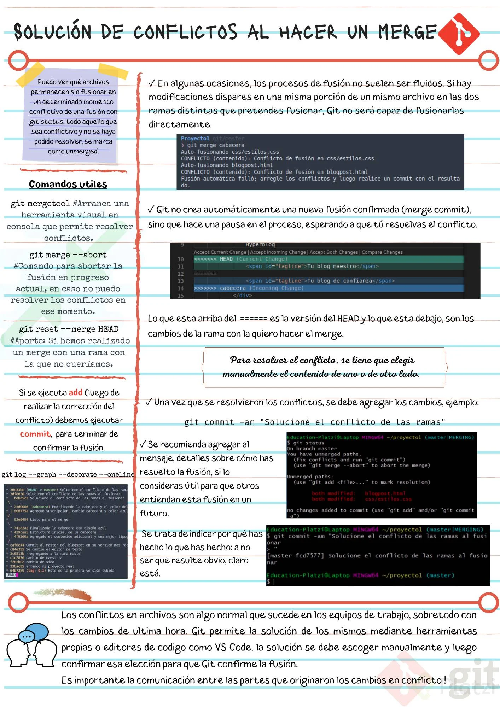

---

### Clase 18 - Cambios en GitHub: de master a main
El escritor Argentino **Julio Cortázar** afirma que las palabras tienen color y peso. Por otro lado, los sinónimos existen por definición, pero no expresan lo mismo. Feo no es lo mismo que desagradable, ni aromático es lo mismo que oloroso.

Por lo anterior podemos afirmar que los sinónimos no expresan lo mismo, no tienen el mismo “color” ni el mismo “peso”.

Sí, esta lectura es parte del curso profesional de Git & GitHub. Quédate conmigo.

Desde el 1 de octubre de 2020 GitHub cambió el nombre de la rama principal: ya no es “master” -como aprenderás en el curso- sino main.

Este derivado de una profunda reflexión ocasionada por el movimiento #BlackLivesMatter.

La industria de la tecnología lleva muchos años usando términos como master, slave, blacklist o whitelist y esperamos pronto puedan ir desapareciendo.

Y sí, las palabras importan.

Por lo que de aquí en adelante cada vez que escuches a Freddy mencionar “master” debes saber que hace referencia a “main”

Puedes leer un poco más aquí: [Cambios en GitHub: de master a main](https://platzi.com/blog/cambios-en-github-master-main/)

Para que todos los nuevos repositorios sean por default llamadas "main" es con el siguiente comando: `git config --global init.defaultBranch main` y para cambiar el nombre de la rama en si: `git branch -M main`

---

### Clase 19 - Uso de GitHub
GitHub es una plataforma que nos permite guardar repositorios de Git que podemos usar como servidores remotos y ejecutar algunos comandos de forma visual e interactiva (sin necesidad de la consola de comandos).

Luego de crear nuestra cuenta, podemos crear o importar repositorios, crear organizaciones y proyectos de trabajo, descubrir repositorios de otras personas, contribuir a esos proyectos, dar estrellas y muchas otras cosas.

El `README.md` es el archivo que veremos por defecto al entrar a un repositorio. Es una muy buena práctica configurarlo para describir el proyecto, los requerimientos y las instrucciones que debemos seguir para contribuir correctamente.

Para clonar un repositorio desde GitHub (o cualquier otro servidor remoto) debemos copiar la URL (por ahora, usando `HTTPS`) y ejecutar el comando `git clone` + la URL que acabamos de copiar. Esto descargará la versión de nuestro proyecto que se encuentra en GitHub.

Sin embargo, esto solo funciona para las personas que quieren empezar a contribuir en el proyecto.

**Cómo conectar un repositorio de Github a nuestro documento local**  
Si queremos conectar el repositorio de GitHub con nuestro repositorio local, que creamos usando el comando `git init`, debemos ejecutar las siguientes instrucciones:

- 1. Guardar la URL del repositorio de GitHub con el nombre de origin:
~~~
git remote add origin URL
~~~

- 2. Verificar que la URL se haya guardado correctamente:
~~~
git remote
git remote -v
~~~

- 3. Traer la versión del repositorio remoto y hacer merge para crear un *commit* con los archivos de ambas partes. Podemos usar `git fetch` y `git merge` o solo `git pull` con el *flag* `--allow-unrelated-histories`:
~~~
git pull origin main --allow-unrelated-histories
~~~

- 4. Por último, ahora sí podemos hacer `git push` para guardar los cambios de nuestro repositorio local en GitHub:
~~~
git push origin main
~~~

---

### Clase 20 - Cómo funcionan las llaves públicas y privadas
Las llaves públicas y privadas, conocidas también como cifrado asimétrico de un solo camino, sirven para mandar mensajes privados entre varios nodos con la lógica de que firmas tu mensaje con una llave pública vinculada con una llave privada que puede leer el mensaje.

Las llaves públicas y privadas nos ayudan a cifrar y descifrar nuestros archivos de forma que los podamos compartir sin correr el riesgo de que sean interceptados por personas con malas intenciones.

**Cómo funciona un mensaje cifrado con llaves públicas y privadas**
- 1. Ambas personas deben crear su llave pública y privada.
- 2. Ambas personas pueden compartir su llave pública a las otras partes (recuerda que esta llave es pública, no hay problema si la “interceptan”).
- 3. La persona que quiere compartir un mensaje puede usar la llave pública de la otra persona para cifrar los archivos y asegurarse que solo puedan ser descifrados con la llave privada de la persona con la que queremos compartir el mensaje.
- 4. El mensaje está cifrado y puede ser enviado a la otra persona sin problemas en caso de que los archivos sean interceptados.
- 5. La persona a la que enviamos el mensaje cifrado puede emplear su llave privada para descifrar el mensaje y ver los archivos.
Nota: puedes compartir tu llave pública, pero nunca tu llave privada.

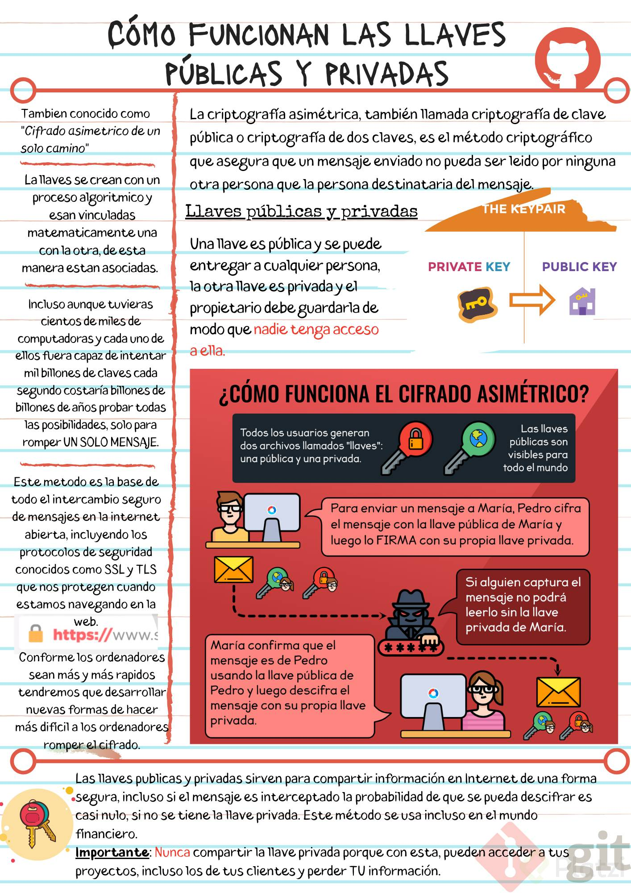

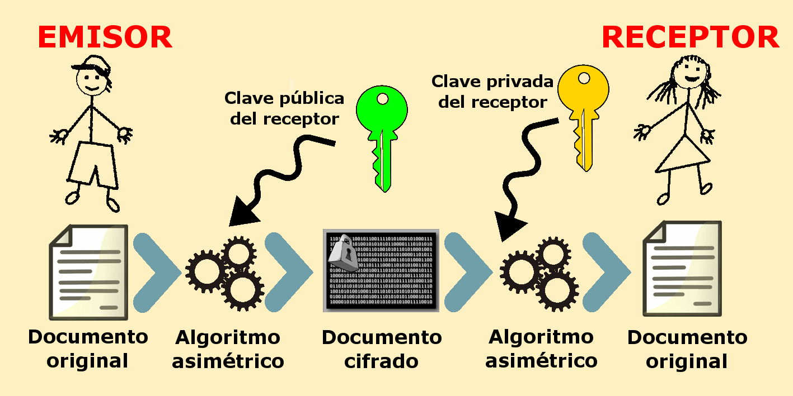

---

### Clase 21 - Configura tus llaves SSH en local
En este ejemplo, aprenderemos cómo configurar nuestras llaves SSH en local.

**Cómo generar tus llaves SSH**  
1. Generar tus llaves SSH**  
Recuerda que es muy buena idea proteger tu llave privada con una contraseña.
~~~
ssh-keygen -t rsa -b 4096 -C "tu@email.com"
~~~

2. Terminar de configurar nuestro sistema.  
**En Windows y Linux:**
- Encender el “servidor” de llaves SSH de tu computadora:
~~~
eval $(ssh-agent -s)
~~~

- Añadir tu llave SSH a este “servidor”:
~~~
ssh-add ruta-donde-guardaste-tu-llave-privada
~~~

**En Mac:**
- Encender el “servidor” de llaves SSH de tu computadora:
~~~
eval "$(ssh-agent -s)"
~~~

Si usas una versión de OSX superior a Mac Sierra (v10.12), debes crear o modificar un archivo “config” en la carpeta de tu usuario con el siguiente contenido (ten cuidado con las mayúsculas):
Host *
~~~
AddKeysToAgent yes
UseKeychain yes
IdentityFile ruta-donde-guardaste-tu-llave-privada
~~~

- Añadir tu llave SSH al “servidor” de llaves SSH de tu computadora (en caso de error puedes ejecutar este mismo comando pero sin el argumento -K):
~~~
ssh-add -K ruta-donde-guardaste-tu-llave-privada
~~~

[PDF](src/Curso_profesional_de_Git_y_GitHub/21_Configura_tus_llaves_SSH_en_local_01.pdf)

---

### Clase 22 - Conexión a GitHub con SSH
La creación de las SSH es necesario solo una vez por cada computadora. Aquí conocerás cómo conectar a GitHub usando SSH.

Luego de crear nuestras llaves SSH podemos entregarle la llave pública a GitHub para comunicarnos de forma segura y sin necesidad de escribir nuestro usuario y contraseña todo el tiempo.

Para esto debes entrar a la [Configuración de Llaves SSH en GitHub](https://github.com/settings/keys), crear una nueva llave con el nombre que le quieras dar y el contenido de la llave pública de tu computadora.

Ahora podemos actualizar la URL que guardamos en nuestro repositorio remoto, solo que, en vez de guardar la URL con HTTPS, vamos a usar la URL con SSH:
~~~
git remote set-url origin url-ssh-del-repositorio-en-github
~~~

**Comandos para copiar la llave SSH:**  
- Mac:
~~~
pbcopy < ~/.ssh/id_rsa.pub
~~~

- Windows (Git Bash):
~~~
clip < ~/.ssh/id_rsa.pub
~~~

- Linux (Ubuntu):
~~~
cat ~/.ssh/id_rsa.pub
~~~

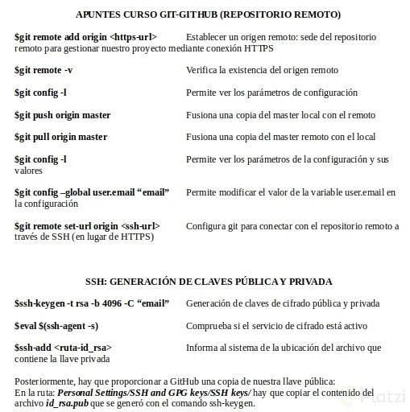

---

### Clase 23 - Tags y versiones en Git y GitHub
Los tags o etiquetas nos permiten asignar versiones a los commits con cambios más importantes o significativos de nuestro proyecto.

**Comandos para trabajar con etiquetas:**
- Crear un nuevo tag y asignarlo a un commit: `git tag -a nombre-del-tag id-del-commit`.
- Borrar un tag en el repositorio local: `git tag -d nombre-del-tag`.
- Listar los tags de nuestro repositorio local: `git tag` o `git show-ref --tags`.
- Publicar un tag en el repositorio remoto: `git push origin --tags`.
- Borrar un tag del repositorio remoto: `git tag -d nombre-del-tag` y `git push origin :refs/tags/nombre-del-tag`.

Para generar un comando complejo con varios comandos de una forma optimizada, utilizamos conjuntos de sentencias conocidas como alias.

**Cómo aregar un alias solo para git**
- Para un proyecto:
~~~
git config alias.arbolito "log --all --graph --decorate --oneline"
~~~

- Global:
~~~
git config --global alias.arbolito "log --all --graph --decorate --oneline"
~~~

- Para correrlo:
~~~
git arbolito
~~~

**Guardar alias**  
Ejecutan este comando en la terminal y queda guardado en la computadora en los alias pero de git. con esto se puede ejecutar cada que se escribe git
superlog
~~~
git config --global alias.superlog "log --graph --abbrev-commit --decorate --date=relative --format=format:'%C(bold blue)%h%C(reset) - %C(bold green)(%ar)%C(reset) %C(white)%s%C(reset) %C(dim white)- %an%C(reset)%C(bold yellow)%d%C(reset)' --all"
~~~

---

### Clase 24 - Manejo de ramas en GitHub
Las ramas nos permiten hacer cambios a nuestros archivos sin modificar la versión principal (main). Puedes trabajar con ramas que nunca envías a GitHub, así como pueden haber ramas importantes en GitHub que nunca usas en el repositorio local. Lo crucial es que aprendas a manejarlas para trabajar profesionalmente.

Si, estando en otra rama, modificamos los archivos y hacemos commit, tanto el historial(`git log`) como los archivos serán afectados. La ventaja que tiene usar ramas es que las modificaciones solo afectarán a esa rama en particular. Si luego de “guardar” los archivos(usando `commit`) nos movemos a otra rama (`git checkout otraRama`) veremos como las modificaciones de la rama pasada no aparecen en la `otraRama`.

**Comandos para manejo de ramas en GitHub**
- Crear una rama:
`git branch branchName`
- Movernos a otra rama:
`git checkout branchName`
- Crear una rama en el repositorio local:
`git branch nombre-de-la-rama` o `git checkout -b nombre-de-la-rama`.
- Publicar una rama local al repositorio remoto:
`git push origin nombre-de-la-rama`.

Recuerda que podemos ver gráficamente nuestro entorno y flujo de trabajo local con Git utilizando el comando `gitk`. Gitk fue el primer visor gráfico que se desarrolló para ver de manera gráfica el historial de un repositorio de Git.

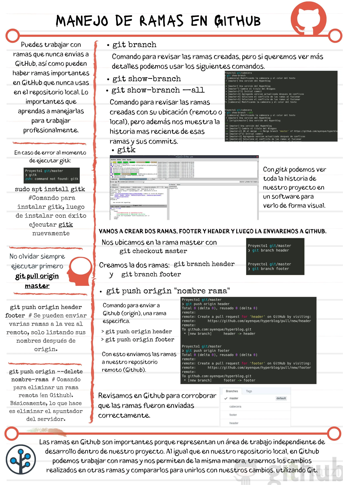

Enviar al repositorio varias ramas a la vez en el push `git push origin header footer`  
Comando para crear una rama y moverse a la vez `git checkout-b <nombre de la rama>`

Grafico de la historia de los branches  
instalar gitk en ubuntu `sudo apt-get install gitk`  
y si te sale error `sudo dpkg --configure -a`  
y luego `sudo apt-get install gitk`

---

### Clase 25 - Configurar múltiples colaboradores en un repositorio de GitHub
Por defecto, cualquier persona puede clonar o descargar tu proyecto desde GitHub, pero no pueden crear commits, ni ramas. Esto quiere decir que pueden copiar tu proyecto pero no colaborar con él. Existen varias formas de solucionar esto para poder aceptar contribuciones. Una de ellas es añadir a cada persona de nuestro equipo como colaborador de nuestro repositorio.

**Cómo agregar colaboradores en Github**
- Solo debemos entrar a la configuración de colaboradores de nuestro proyecto. Se encuentra en:  
`Repositorio > Settings > Collaborators`  
Ahí, debemos añadir el email o username de los nuevos colaboradores.

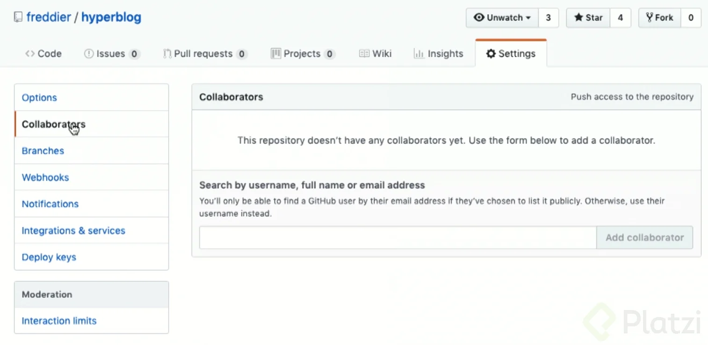

Si, como colaborador, agregaste erróneamente el mensaje del *commit*, lo puedes cambiar de la siguiente manera:
- Hacer un commit con el nuevo mensaje que queremos, esto nos abre el editor de texto de la terminal:
`git commit —amend`
- Corregimos el mensaje
- Traer el repositorio remoto
`git pull origin master`
- Ejecutar el cambio
`git push --set-upstream origin master`

Ahora en GitHub no se muestra Collaborators, se cambio a `Manage acces`

---

### Clase 26 - Flujo de trabajo profesional: Haciendo merge de ramas de desarrollo a master
Para poder desarrollar software de manera óptima y ordenada, necesitamos tener un flujo de trabajo profesional, que nos permita trabajar en conjunto sin interrumpir el trabajo de otros desarrolladores. Una buena práctica de flujo de trabajo sería la siguiente:

1. Crear ramas
2. Asignar una rama a cada programador
3. El programador baja el repositorio con `git pull origin master`
4. El programador cambia de rama
5. El programador trabaja en esa rama y hace *commits*
6. El programador sube su trabajo con `git push origin #nombre_rama`
7. El encargado de organizar el proyecto baja, revisa y unifica todos los cambios

---

### Clase 27 - Flujo de trabajo profesional con Pull requests
En un entorno profesional normalmente se bloquea la rama master, y para enviar código a dicha rama pasa por un code review y luego de su aprobación se unen códigos con los llamados *merge request*.

Para realizar pruebas enviamos el código a servidores que normalmente los llamamos *staging develop* (servidores de pruebas) luego de que se realizan las pruebas pertinentes tanto de código como de la aplicación estos pasan al servidor de producción con el ya antes mencionado *merge request*.

Los PR (pull requests) son la base de la colaboración a proyectos Open Source, si tienen pensando colaborar en alguno es muy importante entender esto y ver cómo se hace en las próximas clases. Por lo general es forkear el proyecto, implementar el cambio en una nueva rama, hacer el PR y esperar que los administradores del proyecto hagan el merge o pidan algún cambio en el código o commits que hiciste.

**Proceso de un pull request para trabajo en producción:**
- Un pull request es un estado intermedio antes de enviar el merge.
- El pull request permite que otros miembros del equipo revisen el código y así aprobar el merge a la rama.
- Permite a las personas que no forman el equipo, trabajar y colaborar con una rama.
- La persona que tiene la responsabilidad de aceptar los pull request y hacer los merge tienen un perfil especial y son llamados DevOps

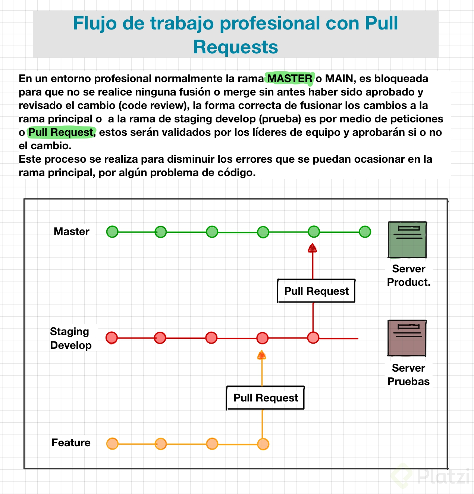

---

### Clase 28 - Utilizando Pull Requests en GitHub
**Pull request** es una funcionalidad de Github (en Gitlab llamada *merge request* y en Bitbucket *push request*), en la que un colaborador pide que revisen sus cambios antes de hacer *merge* a una rama, normalmente *master* (ahora conocida como *main*).

Al hacer un pull request, se genera una conversación que pueden seguir los demás usuarios del repositorio, así como autorizar y rechazar los cambios.

**Cómo se realiza un pull request**
- Se trabaja en una rama paralela los cambios que se desean `git checkout -b <rama>`.
- Se hace un commit a la rama `git commit -am '<Comentario>'`.
- Se suben al remoto los cambios `git push origin <rama>`.
- En GitHub se hace el pull request comparando la rama master con la rama del fix.
- Uno, o varios colaboradores revisan que el código sea correcto y dan feedback (en el chat del pull request).
- El colaborador hace los cambios que desea en la rama y lo vuelve a subir al remoto (automáticamente jala la historia de los cambios que se hagan en la rama, en remoto).
- Se aceptan los cambios en GitHub.
- Se hace merge a master desde GitHub.
**Importante:** Cuando se modifica una rama, también se modifica el pull request.

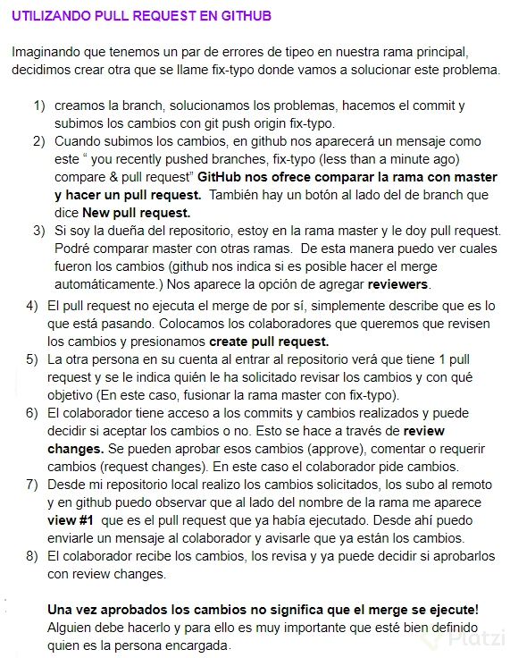

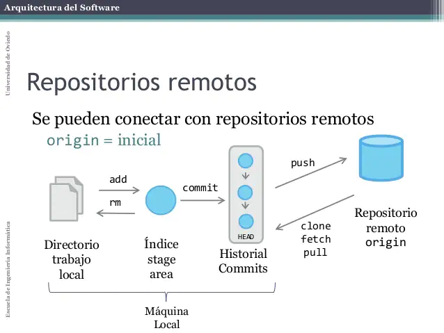

---

### Clase 29 - Creando un Fork, contribuyendo a un repositorio
Los *forks* o **bifurcaciones** son una característica única de GitHub en la que se crea una copia exacta del estado actual de un repositorio directamente en GitHub. Este repositorio podrá servir como otro origen y se podrá clonar (como cualquier otro repositorio). En pocas palabras, lo podremos utilizar como un nuevo repositorio git cualquiera

Un fork es como una bifurcación del repositorio completo. Comparte una historia en común con el original, pero de repente se bifurca y pueden aparecer varios cambios, ya que ambos proyectos podrán ser modificados en paralelo y para estar al día un colaborador tendrá que estar actualizando su *fork* con la información del original.

Al hacer un fork de un poryecto en GitHub, te conviertes en dueñ@ del repositorio fork, puedes trabajar en este con todos los permisos, pero es un repositorio completamente diferente que el original, teniendo solamente alguna historia en común (como crédito al creado o creadora original).

Los forks son importantes porque es la manera en la que funciona el open source, ya que, una persona puede no ser colaborador de un proyecto, pero puede contribuír al mismo, haciendo mejor software que pueda ser utilizado por cualquiera.

**Cómo se hace un fork remoto desde consola en GitHub**  
Al hacer un fork, GitHub sabe que se hizo el fork del proyecto, por lo que se le permite al colaborador hacer pull request desde su repositorio propio.

Cuando trabajas en un proyecto que existe en diferentes repositorios remotos (normalmente a causa de un fork), es muy probable que desees poder trabajar con ambos repositorios. Para esto, puedes generar un remoto adicional desde consola.
~~~
git remote add <nombre_del_remoto> <url_del_remoto>
git remote upstream https://github.com/freddier/hyperblog
~~~

Al crear un remoto adicional, podremos hacer pull desde el nuevo origen. En caso de tener permisos, podremos hacer fetch y push.
~~~
git pull <remoto> <rama>
git pull upstream master
~~~

Este pull nos traerá los cambios del remoto, por lo que se estará al día en el proyecto. El flujo de trabajo cambia, en adelante se estará trabajando haciendo pull desde el upstream y push al origin para pasar a hacer pull request.
~~~
git pull upstream master
git push origin master
~~~

---

### Clase 30 - Haciendo deployment a un servidor
Deploy es el proceso que permite enviar al servidor uno o varios archivos. Este servidor puede ser de prueba, desarrollo o producción.

En el siguiente ejemplo veremos cómo se realiza el deployment de un documento en un servidor web básico.

**Pasos para hacer deployment en un servidor web:**
- Entrar a la capeta de los archivos del servidor.
- Copiar link en clone, elegir entre HTTPS o SSH del repositorio a contribuir.
    - En la carpeta deseada se clona el repositorio:
~~~
git clone url
~~~

**Deploy:**
- Realizar cambios y *commit* en GitHub.
- Traer al Repositorio local las actualizacion para el servidor en la capeta de los archivos del servidor.
~~~
git pull ramaRemota main
~~~

Nota: Siempre se debe proteger el archivo .git. Dependiendo del software para el servidor web, existen diferentes maneras. La conexión entre GitHub y el servidor se puede realizar mediante: Travis (pago) o Jenkis (Open source).

---

### Clase 31 - Hazme un pull request
Aviso importante del Team Platzi

¡Muchas gracias por tu participación en este reto! Hasta agosto de 2020 hemos procesado 1.269 pull requests en el repositorio del curso. Ahora hemos decidido cerrar este experimento, por lo que no seguiremos aprobando nuevos PRs. ¡Pero no te desanimes! Aún así te animamos a completar y enviar tu solución a este desafío para poner en práctica todo lo que has aprendido.

Queremos que uses las habilidades ya aprendidas para aplicarlas en esta clase. Haz un fork de el repositorio de GitHub y realiza las tareas que te indicaremos en esta clase. Ojo, debes seguir las reglas e instrucciones que se dieron en el video.

Regla a seguir:

Dentro del ID “post” luego de “suscribete y dale like” agrega otra línea o párrafo con tu nombre o tu nombre de usuario en Platzi.
¡Suerte! Y #NuncaParesDeAprender

---

### Clase 32 - Ignorar archivos en el repositorio con .gitignore
No todos los archivos que agregas a un proyecto deberían ir a un repositorio. Por ejemplo, cuando tienes un archivo donde están tus contraseñas que comúnmente tienen la extensión `.env` o cuando te estás conectando a una base de datos; son archivos que nadie debe ver.

Por diversas razones, no todos los archivos que agregas a un proyecto deberían guardarse en un repositorio. Esto es porque hay archivos que no todo el mundo debería de ver, y hay archivos que al estar en el repositorio ralentizan el proceso de desarrollo (por ejemplo: los binary large objects, blob, que tardan en descargarse).

Para que no se suban estos archivos no deseados se puede crear un archivo con el nombre .gitignore en la raíz del repositorio con las reglas para los archivos que no se deberían subir: Aquí puedes ver la [sintaxis de los .gitignore.](https://git-scm.com/docs/gitignore)

Las razones principales para tomar la decisión de no agregar un archivo a un repositorio son:
- Es un archivo con contraseñas (normalmente con la extensión .env)
- Es un blob (binary large object, objeto binario grande), mismos que son difíciles de gestionar en git.
- Son archivos que se generan corriendo comandos, por ejemplo la carpeta node_modules, que genera npm al correr el comando npm install

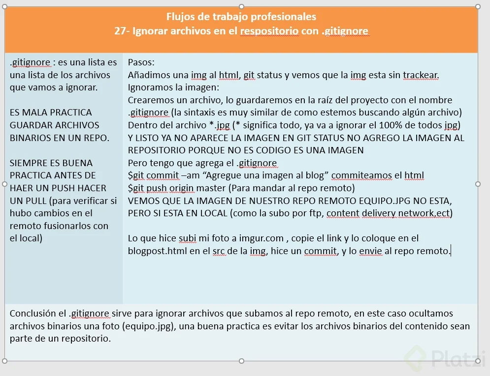

Utilice google Drive como repositorio de imagen de esta manera , cuando de di para compartir me dejo un link como este:
`https://drive.google.com/file/d/1TzRsYiyHNo-bSxrzf2ZCLJC1jaK1Qe05/view?usp=sharing`

Bien investigue y llegue a que esta parte del link es un id `1TzRsYiyHNo-bSxrzf2ZCLJC1jaK1Qe05` y que si esta compartido en publico le puedes pedir de otra manera al drive la imagen agregándole el prefijo `https://drive.google.com/uc?id=AQUI_VA_TU_ID` quedaría así
`https://drive.google.com/uc?id=1TzRsYiyHNo-bSxrzf2ZCLJC1jaK1Qe05`
y de esta forma si pues utilizarlo en el scr de tu pagina web

---

### Clase 33 - 