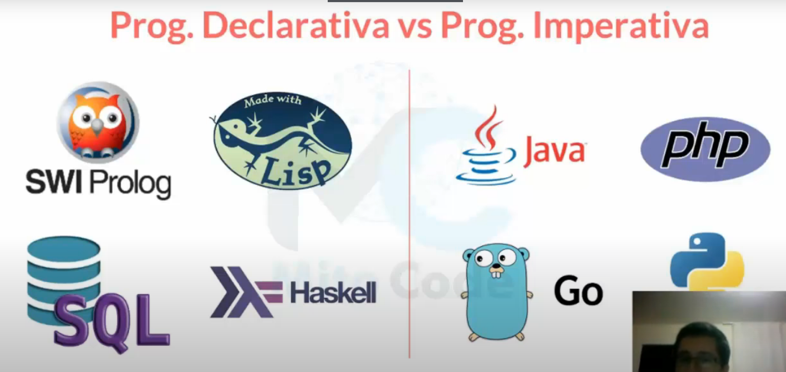
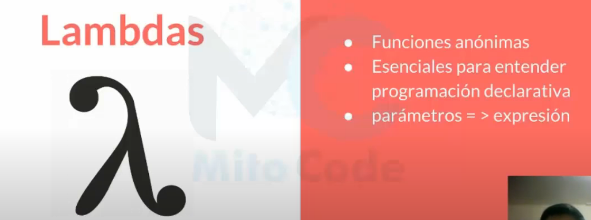

# Java Tutorial MitoCode
Índice
-
- [1. Colecciones + iterador](#1-colecciones--iterador)

- [1. Paradigma Funcional](#paradigma-funcional)
- [2. Lambda](#lambda)

---

## 1. Colecciones + iterador
Una coleccion de objetos es un objeto que se puede almacenar un número variable de elementos, siendo cada elemento otro objeto. Podriamos verlo como una caja que contiene mas cajas dentro.
Puede haber distintos tipos de colecciones de tamaño flexible, es decir que se pueden encoger o agrandar según las nececidades.

Entonces teniendo esta imagen podemos decir que nosotros vamos a utilizar una Clase en particular que implementa una interfaz para poder empezar la agrupación de elementos.
`List<String> lista = new ArrayList();`  
En esta linea de código podemos decir que declaramos el objeto llamado ***lista*** pertenece a la interfaz Lista de tipo String, y que a su vez estamos generando una instancia de la
clase ArrayList.

Iterator instanciado es un objeto que nos permite recorrer una lista.  
`Iterator<String> iterator = lista.iterator();`  
y con este objeto podemos hacer lo siguiente:  
~~~
while(iterador.hasNext()){
    System.out.println(iterador.next());
}
~~~
Ambas hacen lo mismo, pero es mas práctico con un for para recorrer la lista, esto fue a modo de demostración.
~~~
for(String s : lista){
    System.out.println(s);
}
~~~
Esto es importante porque cuando trabajemos con BD, en muchas ocaciones vamos a requerir traer una lista, lo mas recomendable es traer esa lista en base a una coleccion de objetos y la
mejor manera de trabajar esta coleccion es por medio de listas.

---

## 1. Paradigma Funcional
El paradigma funcional es un subtipo del paradigma de programación Declarativa, basada en el uso de funciones matemáticas en contraste con la programación Imperativa.

Es decir, el principal fin de la programación Declarativa es tener una sintaxis de decirle al programa **que** es lo que necesitamos, sin embargo en contraste a la programación
Imperativa es decirle al lenguaje de programación **como** lo necesitamos.

Por ejemplo, para un lenguaje de programación Declarativa, nosotros le indicamos todas las sentencias a un determinado problema, por ejemplo el lenguaje **SQL**, si quiero todos los
usuarios que empiecen con la letra 'A', puedo decirlo asi:
~~~
SELECT * FROM users WHERE nombre like 'A%';
~~~
Decimos que es lo que queremos pero no como traerlo internamente al objetivo.

En contraparte, la Imperativa, si quiero lograr el mismo resultado, tendria que darle instrucción paso a paso para poder obtener el resultado.  
Por ejemplo, si me pidieran el promedio tendria que colocar un número, otro, otro y otro, sumarlos todos y dividirlos entre la cantidad de números.  
Es Imperativa porque le estoy indicando todos los pasos para lograr el objetivo.

Entonces, volviendo al paradigma funcional, nos permite tener una semantica más limpia, acá entran las lambdas, y también se apoya en la recursión, porque básicamente para poder
abstraer muchas funcionalidades es necesario apoyarse en la reutilización de los mismos métodos.

Lenguajes de programación Declarativa (QUE) e Imperativa (COMO)  

Java 8 se basa en un fuerte simbolo conocido como ***Lambdas***  
Las Lambdas basicamente son funciones anónimas, muy escenciales para entender la programación declarativa y presente la siguiente estructura `parámetros =>(operador) expresión`

---

## 2. Lambda
Una expresión Lambda es un método anónimo que no necesita de un identificador para ser invocado.
