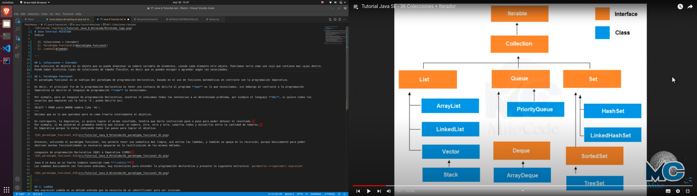
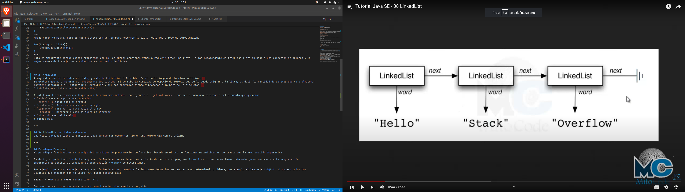
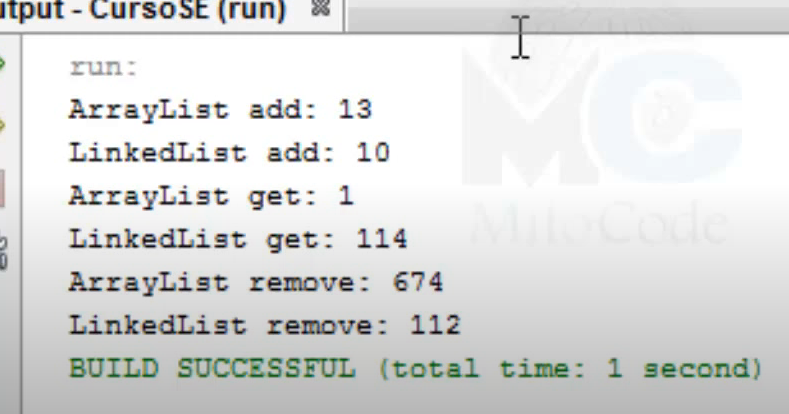
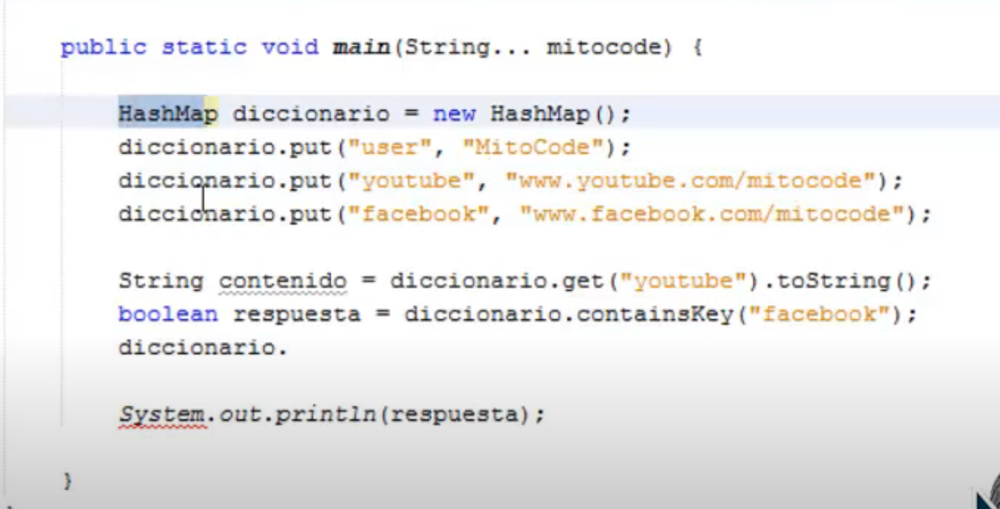

# Java Tutorial MitoCode
Índice
-
- [1- Colecciones + iterador](#1-colecciones--iterador)
- [2- ArrayList]

- [- Paradigma Funcional](#paradigma-funcional)
- [- Lambda](#lambda)

---

## 1- Colecciones + iterador
Una coleccion de objetos es un objeto que se puede almacenar un número variable de elementos, siendo cada elemento otro objeto. Podriamos verlo como una caja que contiene mas cajas dentro.
Puede haber distintos tipos de colecciones de tamaño flexible, es decir que se pueden encoger o agrandar según las nececidades.

Entonces teniendo esta imagen podemos decir que nosotros vamos a utilizar una Clase en particular que implementa una interfaz para poder empezar la agrupación de elementos.  
`List<String> lista = new ArrayList();`  
En esta linea de código podemos decir que declaramos el objeto llamado ***lista*** pertenece a la interfaz Lista de tipo String, y que a su vez estamos generando una instancia de la
clase ArrayList.

El Iterator instanciado es un objeto que nos permite recorrer una lista.  
`Iterator<String> iterator = lista.iterator();`  
y con este objeto podemos hacer lo siguiente:  
~~~
while(iterador.hasNext()){
    System.out.println(iterador.next());
}
~~~
Ambas hacen lo mismo, pero es mas práctico con un for para recorrer la lista, esto fue a modo de demostración.
~~~
for(String s : lista){
    System.out.println(s);
}
~~~
Esto es importante porque cuando trabajemos con BD, en muchas ocaciones vamos a requerir traer una lista, lo mas recomendable es traer esa lista en base a una coleccion de objetos y la
mejor manera de trabajar esta coleccion es por medio de listas.

---

## 2- ArrayList
ArrayList viene de la interfaz Lista, y ésta de Collection e Iterable (Se ve en la imagen de la clase anterior).  
Se explica que para mejorar el rendimiento del sistema, si se sabe la cantidad de espacio de memoria que se le puede asignar a la lista, es decir la cantidad de objetos que va a almacenar
conviene declararlo al instanciar el ArrayList y asi nos ahorramos tiempo y procesos a la hora de la ejecución.  
`List<Integer> lista = new ArrayList(10);`

Al utilizar listas tenemos a disposicion determinados métodos, por ejemplo el `get(int index)` que se le pasa una referencia del elemento que queremos.
- `add()` Para agregar a una coleccion
- `clear()` Limpiar todo el arreglo
- `contains()` Si se encuentra en el arreglo
- `isEmpty()` Para ver si esta vacio el array
- `iterator()` Recorrerlo como si fuera un iterador
- `size` Obtener el tamaño  
Y muchos más.

---

## 3- LinkedList o Listas enlazadas
Una lista enlazada tiene la particularidad de que sus elementos tienen una referencia con su próximo.  

Y lo podemos declarar asi:  
`List lista = new LinkedList();`  
Tambien podriamos poner de que tipo es esa lista, pero al no declararlo podemos agregar objetos de varios tipos.  
`List<Integer> lista = new LinkedList();`  
Ó apoyandonos en la clase directamente:  
`LinkedList lista = new LinkedList();`

Veamos en que situaciónes es conveniente usar el LinkedList antes que un ArrayList  
Tiempos que tardan en ejecutar el agregado, lectura y eliminación de la lista.  
  
La diferencia sustancial es la obtencion del elemento de parte del ArrayList, porque? porque en LinkedList tenemos referencias uno con el otro, entonces cuando quiero obtener un elemento
en el ArrayList simplemente voy directo a él, mientras que el LinkedList tiene que recorrer toda la lista.  
Y en el agregado y eliminación es más rapida el LinkedList. Ahí sus diferencias y cuando conviene usar cada uno.

---

## 4- HashMap
Hashmap (Diccionario)
Básicamente este tipo de dato nos va a permitir tener varios elementos pero a cada elemento le vamos a poder asociar una KEY.
Declaración:  
`Map diccionario = new HashMap();`  
Ó mediante la Clase  
`HashMap diccionario = new HashMap();`  

Para agregar valores a nuestro diccionario en vez de utilizar como en el ArrayList el método `add()` lo hacemos con el método `put()` al cual le pasamos 2 argumentos, el KEY y el VALOR.  
Se pueden acceder a estos elementos usando la función `diccionario.get()` pasandole la KEY y nos devuelve el valor.  
Tambien podemos ver si existe una KEY o un VALOR en nuestro diccionario usando el método `containsKey()` ó `containsValue()`, devuelve un booleano.  
Y demas funciones que se pueden investigar.

Se usan mucho cuando se necesita pasar parametros a librerias para reportes, se usan el objeto que tenga la relación key-value.

---

## Paradigma Funcional
El paradigma funcional es un subtipo del paradigma de programación Declarativa, basada en el uso de funciones matemáticas en contraste con la programación Imperativa.

Es decir, el principal fin de la programación Declarativa es tener una sintaxis de decirle al programa **que** es lo que necesitamos, sin embargo en contraste a la programación
Imperativa es decirle al lenguaje de programación **como** lo necesitamos.

Por ejemplo, para un lenguaje de programación Declarativa, nosotros le indicamos todas las sentencias a un determinado problema, por ejemplo el lenguaje **SQL**, si quiero todos los
usuarios que empiecen con la letra 'A', puedo decirlo asi:
~~~
SELECT * FROM users WHERE nombre like 'A%';
~~~
Decimos que es lo que queremos pero no como traerlo internamente al objetivo.

En contraparte, la Imperativa, si quiero lograr el mismo resultado, tendria que darle instrucción paso a paso para poder obtener el resultado.  
Por ejemplo, si me pidieran el promedio tendria que colocar un número, otro, otro y otro, sumarlos todos y dividirlos entre la cantidad de números.  
Es Imperativa porque le estoy indicando todos los pasos para lograr el objetivo.

Entonces, volviendo al paradigma funcional, nos permite tener una semantica más limpia, acá entran las lambdas, y también se apoya en la recursión, porque básicamente para poder
abstraer muchas funcionalidades es necesario apoyarse en la reutilización de los mismos métodos.

Lenguajes de programación Declarativa (QUE) e Imperativa (COMO)  

Java 8 se basa en un fuerte simbolo conocido como ***Lambdas***  
Las Lambdas basicamente son funciones anónimas, muy escenciales para entender la programación declarativa y presente la siguiente estructura `parámetros =>(operador) expresión`

---

## Lambda
Una expresión Lambda es un método anónimo que no necesita de un identificador para ser invocado.
